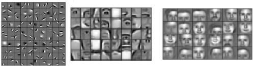
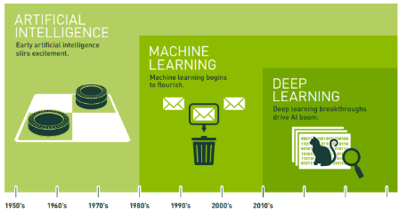

# AI, ML and DL.

## AI 란

John McCarthy (AI 용어 창안자. 미국의 인지심리학자.1927-2011) 에 따르면  Artificial Intelligence (AI)의 정의는 다음과 같음.

> ref. : [Basic Questions](http://www-formal.stanford.edu/jmc/whatisai/node1.html)

**Q. What is `artificial intelligence`?**
: A. It is the science and engineering of ^^making intelligent machines^^, especially intelligent computer programs. It is related to the similar task of using computers to understand human intelligence, but ***AI does not have to confine itself to methods that are biologically observable.***  
이는 지능적인 기계, 특히 지능적인 컴퓨터 프로그램을 만드는 과학과 공학입니다. 인간 지능을 이해하기 위해 컴퓨터를 사용하는 유사한 작업과 관련이 있지만, AI는 생물학적으로 관찰 가능한 방법에만 국한될 필요는 없습니다.

AI라는 용어는 1956년 [다트머스대학 컨퍼런스](./ch00_01_dartmouth_ai.md)에서 최초로 등장했으며, `기계 혹은 시스템으로부터 만들어진 지능` 또는 
`이와 같은 지능을 만들 수 있는 방법론 등을 연구하는 분야` 를 가르킨다.

---

### AI 의 정의 ***

인간의 지능을 모사하는 모든 기술과 연구 분야를 가르킴.

* 기계 혹은 시스템으로부터 만들어진 지능.
* 위와 같은 지능을 만들 수 있는 방법론 등을 연구하는 분야.

> 참고로, Machine Learning 이라는 용어를 1959년 만들어낸 Arthur Samuel도 다트머스대학 컨퍼런스에 참석함.

---

AI는 매우 다양한 분야의 학문과 연계됨.

* 철학 : 지능이란? 인간의 인지, 학습, 기억, 추론이 어떻게 이루어지는지 
* 인지심리학 : 인간(혹은 동물)이 정보를 인지,저장,분석,처리 하는 메커니즘을 연구
* 수학 : 대수학, 논리학, 확률 …
* 컴퓨터 과학(공학 포함), 로봇공학 : 다른 분야의 연구 결과를 통해 실제 동작하는 구현물을 만들어냄.

---

---

## AI 에 대한 구분.

Stuart Russell 및 Peter Norvig가 기재한 AI 연구의 선도적인 교과서 [Artificial Intelligence: A Modern Approach, 4th US ed.](http://aima.cs.berkeley.edu/)에서 제시한 
AI가 ***기존의 컴퓨터 시스템과 구분되는  4가지 잠재적 목표*** (or 정의)는 다음과 같다(`합리성` 과 `사고 대 행동`의 기준으로 분류).

* 인간처럼(human-like) 사고(생각, thinking)하는 시스템
* ***인간처럼(human-like) 행동(acting)하는 시스템*** : Turing-test가 추구!
* 합리적(rationally)으로 사고(생각, thinking)하는 시스템
* ***합리적(rationally)으로 행동하는(acting) 시스템*** : 이상적 목표!

현재 어떤 AI기술도 General AI(인간처럼 사고/행동)는 구현치 못했음. 하지만, Deep Learning을 통해 Computer Vision분야 등에서는 인간 이상의 성과를 보이는 Narrow AI (특정 작업에서 인간처럼 혹은 인간 이상으로 사고/행동)가 구현되기 시작했다. Narrow AI의 대표적인 분야는 다음과 같음.

* 체스, 바둑
* 이미지 인식(일부)

---

### Turing Test

Alan Turing은 "인간처럼 행동하는 시스템"의 범주에 속하는 정의를 제시했다. 

> Turing Test는 기계가 인간과 얼마나 비슷하게 대화할 수 있는지를 기준으로 기계에 지능이 있는지를 판별하는 것으로 ***"행동"을 "대화"로*** 생각하면 된다.  
> 하지만, 인간처럼 대화하는 것이 지능이 있다는 기준인지에 대해서 논란이 있다.

Turing Test에서는 사람인 조사관이 블라인드 상태에서 컴퓨터와 5분간 채팅하여 상대가 컴퓨터인지 사람인지 판단한다.  여러 조사관들 중 상대가 사람일 것이라고 판단하는 조사관이 ***30% 이상*** 이면 해당 컴퓨터는 튜링 시험을 통과한다.

[Turing, A.M., Computing machinery and intelligence, Mind, 59(236):433-460, 1950)](https://phil415.pbworks.com/f/TuringComputing.pdf)

위의 경우는 좀 더 간소한된 것이며 ^^작은 연결 통로로 물건을 주고받는 동작 시험 등이 포함된 `전체 튜링 시험(total Turing test)`도 있다^^ :  즉, "인간처럼 ***행동*** 하는 시스템" 이 Turing 이 생각한 AI였다. 

Total Turing Test 통과를 위해서 AI에게 필요한 능력

* Natural Language Processing : 
    * 자연어를 통한 성공적 의사소통 위해
* Knowledge Representation : 
    * 알고있는 것과 들은 것을 저장하기 위해
* Automated Reasoning : 
    * 저장된 정보를 통해 질문에 답하고 새로운 결론을 도출하기 위해
* ***Machine Learning*** : 
    * 새로운 상황에 적응하고, 기존 알고 있는 패턴을 이용하여 extrapolation하기 위해.
    * ***`Data`로부터 스스로 Task를 해결하기 위한 방법을 학습***.
* ***Computer Vision*** : 
    * 물체의 인식을 위해
* Robotics Engineering : 
    * 물체를 조작하고 이동하기 위해 

**Ref.**

1. ref. Wikipedia's [Turing Test](https://ko.wikipedia.org/wiki/%ED%8A%9C%EB%A7%81_%ED%85%8C%EC%8A%A4%ED%8A%B8)
2. Pearson Series in Artificial Intelligence : [Artificial Intelligence : A Modern Approach](https://www.amazon.com/Artificial-Intelligence-A-Modern-Approach/dp/0134610997)
3. AI의 모든 것"이란? : [Turing Test](https://atozofai.withgoogle.com/intl/ko/about/)

---

---

## Machine Learning 이란. ***

ML은 "AI를 구현하기 위한 구체적 접근 방식"에 해당한다.  

> ML 외에 AI를 구현하기 위한 기술들로 다음이 대표적임.
>
> * Rule based Approach (Expert System이 대표적 예)
> * Logic based Approach (Prolog 등을 통한 구현, 시맨틱웹, 온톨로지 기반 시스템 등)
> * Agent based Approach (각 agent는 rule based approach나 logic based approach를 이용하는 방식.)

---

### ML 의 정의 ***

ML은 

* 대량의 `Data`와 
* 알고리즘(and `optimization`)등을 통해, 
* 컴퓨터가 ***작업수행방법*** 을 ^^스스로 학습^^ 하도록 하는 것!

을 가르킨다.

> 참고로 `Rule-based Algorithm`의 경우, 개발자가 `data`를 분석하여 명시적으로 작업수행방법을 rule로서 제공해주기 때문에 ML에 속하지 않음.

---

### ML을 위한 다양한 알고리즘 (or 기법)

ML을 위해 제안된 다양한 기법들이 있으며 대략적으로 나누어 보면 다음과 같다.

* Tree계열 : Decision Tree, Random Forest등
* Support Vector Machine (SVM)
* Linear Regression
* [Clustering](../ch07/clustering.md)
* ANN ( → Deep Learning)
* Reinforcement Learning

`Artificial Neural Network (ANN)`에 현재 가장 높은 성능을 보이는 ML기법의 하나인 ***Deep Learning*** 이 속함:

* 매우 많은 layer로 구성된 구조의 ANN이 특별히 Deep Learning 이라고 부름. 
* 입력 layer와 출력 layer를 제외한 hidden layer 의 수가 1개 이상인 경우에는 multi-layer perceptron (MLP)이라고 부름.
* 입력 layer와 출력 layer로만 구성되어 hidden layer가 없는 경우, single-layer perceptron (SLP)임.

[참고: perceptron](../ch08/dev_hist_ann.md#perceptron-의-등장)

---

---

##  Representation Learning **

* 정의
    * 입력 데이터를 **특징 공간(feature space)**으로 변환하는 함수(=representation function)를 학습하는 과정.
    * 목표는 원래의 raw data를 **작업(task)에 유용한 표현(embedding, feature vector)**으로 변환하는 것.
* 핵심 포인트
    * 단순히 "입력"과 "출력(expectation)"을 매핑하는 게 아니라,
    * 출력을 잘 예측할 수 있는 형태의 중간 표현(representation)을 학습하는 데 중점.
  
> Generally speaking,  
> a good representation is one that  
> makes a subsequent learning task easier.  
> 좋은 representation은 이후의 학습(분류, 회귀, 군집화 등)을 더 쉽게 해 줌.

representation은 자동 학습(auto-learned) 되는 경우가 많으며, 사람이 직접 feature engineering을 하지 않아도 됨.

**관련 기술:**

* Manifold Learning : [manifold에 대한 참고자료](../ch07/manifold.md)
    * 고차원 데이터가 저차원 매니폴드(manifold) 위에 놓여 있다고 가정하고, 
    * 이를 저차원 표현으로 추출하는 기법. 
* Auto-encoder
    * 입력을 낮은 차원의 latent vector로 압축했다가 복원하는 구조를 통해 유용한 latent representation을 학습 
* Deep Learning.
    * Deep Neural Network을 통해 적절한 다단계 비선형 변환을 학습 및 수행.
    * 저차원 feature에서 점점 추상적이고 task-specific한 representation을 자동 추출.

---

---

## Deep Learning (DL) 이란. ***

엄격하게 애기하면 `Deep Learning`은 `ML`의 한 종류이며, `Representative Learning`에 속한다.  

> 보다 엄밀하게 애기하면, `ML`의 한 분야인 `ANN`에서 hidden layer를 여러 개 사용하는 방법을 Deep Learning이라고 한다.  
>  
> * 여러 layer를 쌓는 효과를 위해선 hidden layer의 activation이 non-linear를 만족해야함.
> * 만약 linear하다면 여러 layer를 쌓아도 single layer와 동일.

우수하고 효율적인 Machine Learning을 실현할 수 있는 기법이 Deep Learning이며, 이는 ***학습데이터로부터 최적의 hierarchy representation을 알아서 추출할 수 있다*** 는 장점에 기인한다.

다음의 Deep Learning의 정의를 살펴보라.

> Deep learning is a ^^particular kind of machine learning^^ that achieves great power and flexibility by ***learning to represent the world*** as **a nested hierarchy of concepts,** with each concept defined in relation to simpler concepts, and more abstract representations computed in terms of less abstract ones.  
> 
> 딥러닝은 세계를 중첩된 개념의 계층 구조로 표현하는 방법을 학습하여 각 개념을 더 단순한 개념과 관련하여 정의하고 더 추상적인 표현은 덜 추상적인 개념의 관점에서 계산함으로써 뛰어난 성능과 유연성을 달성하는 특별한 종류의 머신 러닝입니다.

{style="display: block; margin:0 auto; width=400"}

* `DL`은 데이터로부터, 스스로 계층적인 representation을 추출해내는 능력을 가짐.
    * 이를 달리 말하면, DL은 non-linear dataset의 input vector들을 task에 맞추어진 linear separability를 가진 feature vector들로 transform해주는 일종의 function을 만들어 낸다. (+ dataset으로부터 알아서...)
    * `DL`은 기존의 feature engineering이 하던 일을 dataset으로부터 알아서 해준다.
    * `DL`은 kernel SVM에서 kernel trick으로 우회해서 처리하던 것을 dataset으로부터 lower level layer에서 학습하여 직접 처리한다. 
* ANN에서 layer를 여러 개 쌓을 경우, 이를 단일 layer로 처리하는 경우에 비해 적은 수의 neuron으로 같은 표현력을 가질 수 있으며, 보다 빨리 학습이 되고, noise에 영향을 덜 받는 것으로 알려져 있다. 

> 실제로 
> 
> * logistic regression과 동일한 동작을 ANN (정확히는 `SLP`+sigmoid activation)으로 구현 가능하고, 
> * SVM은 hinge loss function과 [Frobenius norm](https://bme808.blogspot.com/2022/10/norm.html) regularization을 사용하는 linear activation의 `SLP`라고 봐도 무방할 정도로 
> 
> 다른 ML 알고리즘들과 ANN은 많은 부분에서 공통점을 가지고 있다. 즉, DL도 ML의 한 분야에 불과하다.
>  
> 하지만, 위에서 말한 알아서 최적의 representation을 여러 층으로 쌓인 non-linear activation function을 가지는 low layers를 통해 dataset으로부터 직접 얻어낸다는 점이 `DL`이 다른 `ML` 알고리즘과 비교할 수 없는 유용성을 가지게 해준 가장 큰 특징이다.  

즉, 어떤 함수라도 근사할 수 있는 ANN ([UAT참고](https://ds31x.blogspot.com/2023/08/dl-universal-approximation-theorem-uat.html?view=classic))에 ***보다 효과적으로 학습되도록 hierarchical representative learning의 기능을 더한 것*** 이 바로 DL이라고 생각해도 크게 틀리지 않다.

---

---

## Summary : AI, Machine Learning, and Deep Learning

AI와, ML, 그리고 DL은 다음과 같은 관계를 보인다.

<figure markdown>
{width="500"}
</figure>

**AI**
: 인간의 지능을 모사하는 기술 또는 연구 분야.

**(Narrow) AI** 
: 특정 분야에서 인간처럼, 혹은 그 이상의 성능을 보이는 기술(or system) 

* Expert System (전문가 시스템)
* Rule-based algorithm

**ML**
: AI를 구현하기 위한 기술.  
명시적 프로그래밍이 아닌 `Data`로부터 동작을 학습하는 기술

* Decision Tree, SVM, Gradient Boosting and so on

**DL**
: 현재 가장 우수한 성능의 ML을 구현하는 기술로 ***많은 Layers로 구성된 ANN (Artificial Neural Network)*** 을 가르킴.

* MLP, CNN, RNN, Transformer, GAN

