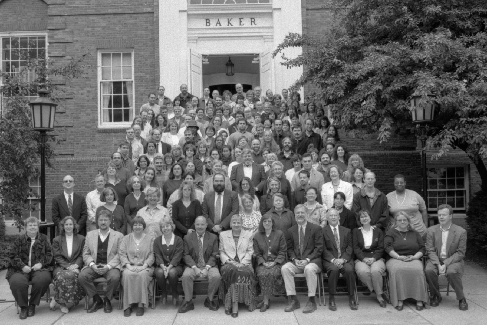

# 참고자료 : AI의 시작 ...

AI라는 용어는 1956년 다트머스대학 컨퍼런스에서 최초로 등장했다. 다음은 J. McCarthy가 제안한 PROPOSAL인데 AI에 대한 개념을 보여준다.

 > We propose that a ***2 month, 10 man study*** of `artificial intelligence` be carried out during ^^the summer of 1956 at Dartmouth College in Hanover, New Hampshire.^^  
 The study is to proceed on the basis of the conjecture that ^^every aspect of **learning** or **any other feature of intelligence**^^ can in principle be so precisely described that ***a machine can be made to simulate it***. An attempt will be made to find how to make machines *use language*, *form abstractions and concepts*, *solve kinds of problems now reserved for humans*, and improve themselves.  
 We think that ***a significant advance can be made in one or more of these problems*** if a carefully selected group of scientists work on it together ***for a summer***.  
 >  
 > - J. McCarthy et al.; Aug. 31, 1955.

1956년 New Hampshire주 Hanover의 다트머스대학 8주 동안 열린 이 컨퍼런스는 컴퓨터 및 인지과학 분야의 선구자 20여명이 모여 미래를 추측했던 워크숍으로 John McCarthy(Dartmouth), Claude Shannon (MIT), Marvin Minsky, Nathaniel Rochester 등이 위의 제안서를 록펠러 재단에 제출하여 지원을 요청하였다.

> 우리는 1956년 여름 뉴햄프셔 하노버에 있는 다트머스 대학에서 2개월 동안 인공지능에 대해 10명이 연구를 수행할 것을 제안한다. 이 연구는 학습의 모든 측면이나 지성의 다른 특징들이 원칙적으로 정확하게 기술될 수 있기 때문에 기계가 그것을 시뮬레이션할 수 있다는 추측에 근거해 진행시키는 것이다. 기계가 *언어를 사용* 하고 *추상화와 개념을 형성* 하며, 현재 *인간에게 남겨진 여러 문제를 해결* 하고, 스스로를 향상시키는 방법을 찾기 위한 시도가 이루어질 것이다. 우리는 신중하게 선정된 과학자 집단이 여름 동안 함께 연구한다면 이 문제들 중 하나 또는 그 이상에서 상당한 진보가 이루어질 수 있다고 생각한다.

{style="display: block; margin: 0 auto; width:500"}

* ref. : [original](https://aiws.net/the-history-of-ai/this-week-in-the-history-of-ai-at-aiws-net-the-dartmouth-conference-began-on-18-june-1956-2/)
* 당시 컨퍼런스 참석자들이 모여 찍은 사진. 교과서에서 나오는 인물들이 이렇게 모여있기도 쉽지 않음.

AI (J. McCarthy)와 ML (Arthur Samuel) 등의 연구 분야 탄생에서 큰 의미를 지니는 컨퍼런스라고 할 수 있다.  
물론, 당시 예상했던 것보다 훨씬 어려운 분야로 판명되었고, 아직도 연구 중인 것들이 상당수이지만...

## References

* [A PROPOSAL FOR THE DARTMOUTH SUMMER RESEARCH PROJECT ON ARTIFICIAL INTELLIGENCE](http://www-formal.stanford.edu/jmc/history/dartmouth/dartmouth.html)
* AI Times's [AI 역사의 시작](https://www.aitimes.com/news/articleView.html?idxno=119328)
