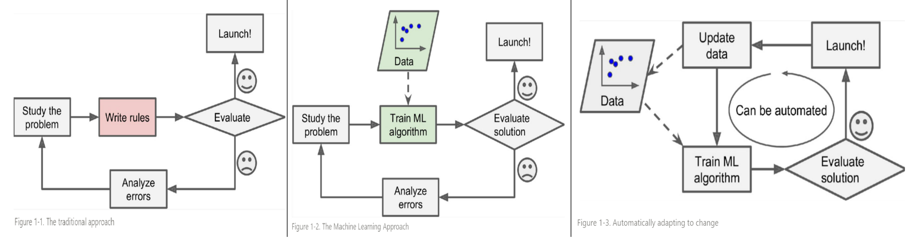

# ML이 유용한 경우.

ML이 기존의 explicit programming보다 유용한 경우는 다음과 같다.

1. Task가 매우 복잡하여 ***복잡하고 많은 조건들을 고려*** 해야 하는 경우
    * 기존 알고리즘으로 많은 수동 조정(hand-tuning)이나 규칙(long lists of rules)이 필요한 task를 가르킴.
    * ML이 아닌 Rule-based AI로는 이같은 task를 처리하기 어려움.
2. Task를 수행하기 위한 조건이나 환경이 ***빈번하게 변경*** 되는 경우 (Fluctuating Environment)
3. Task를 효과적으로 수행할 수 있는 ***기존의 방법이 없는 경우***
    * 단, ML이 항상 해결하는 건 아니라는 점을 명심할 것.
4. 관련 데이터가 분석하기에 너무 많고 문제 자체가 복잡한 경우.
    * ML기법을 통해, 겉으로 보이지 않던 패턴이나 특징을 찾아낼 수 있음

---

***1,2번 경우의 대표적인 예*** 는 spam filter라고 할 수 있다.  

* spam mail을 잘 표현할 수 있는 `representation`을 키워드 중심으로 만들 경우, 정말 많은 키워드가 필요하다.  
* 또한 spam mail을 발송하는 이들이 ^^해당 filter의 rule을 피하는 방식^^ 으로 메일을 만들기 때문에 점점 더 많은 키워드가 필요해지고 최근 spam 메일에 맞춰 ^^rule의 갱신이 지속적으로 필요^^ 하다. 

ML의 경우, data로부터 computer가 직접 rule을 만들어내기 때문에 구현물에서 개발자가 수정을 해줄 필요가 없다.  
^^즉, 한번 개발된 model로 충분^^ 하다.  
대신 최신 spam 메일에 대한 데이터를 학습 데이터로 해당 model에 공급해주어 model을 갱신해주면 된다. [Online Learning](./ch00_41_online_learning.md) 등의 기술을 적용하면 ^^학습 데이터의 변화에 대해 ***자동적으로 최적화*** 되는 모델^^ 을 얻을 수 있다.

<figure markdown>
{width="300" align="center"}
</figure>

* ref. : Hands-On Machine Learning with Scikit-Learn, Keras, and TensorFlow, 3rd Edition, Aurélien Géron

---

***3번 경우의 예*** 는 

* 음성 인식이나 
* 의료 영상을 이용한 진단, 
* 통역 등을 들 수 있다. 

^^기존의 explicit programming으로는 사람 수준으로 음석이나 영상을 인식이 매우 어렵다.^^ 기존의 feature engineering으로는 음성과 영상에 대한 적절할 representation이 쉽지 않았기 때문인데, 최근의 deep learning 과 같은 ML 기법들을 통해 일부 task에서는 인간보다 높은 정확도와 재현성을 보이는 것도 가능해주고 있다. 

---

***4번의 경우*** 는 사실 `ML` 보다는 `Data Mining`이 적절한 경우이다.  

* 하지만, `ML`의 많은 기법들(모두는 아님)이 특정 결과를 도출하는데 어떤 요소가 얼만큼의 영향을 끼쳤는지를 정량적으로 제시해줄 있으며, 
* 이를 통해 사람들에게 데이터의 분포나 해당 문제 해결에 필요한 insight를 제공해줄 수 있다.  

주의할 점은 Deep learning 은 이같이 모델의 결과가 왜 이렇게 나왔는지를 해석하기가 다른 ML algorithms과 달리 매우 어렵다. 때문에 Explainable AI (XAI) 나 Class Activation Map (CAM)과 같은 기술들이 꾸준히 연구 개발되고 있다. 이들 기술이 충분히 발전한다면 DL도 이같은 문제에서도 활용 가능성이 보다 높아질 것으로 기대된다.