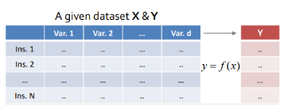
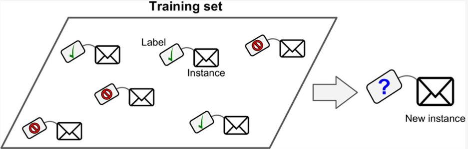
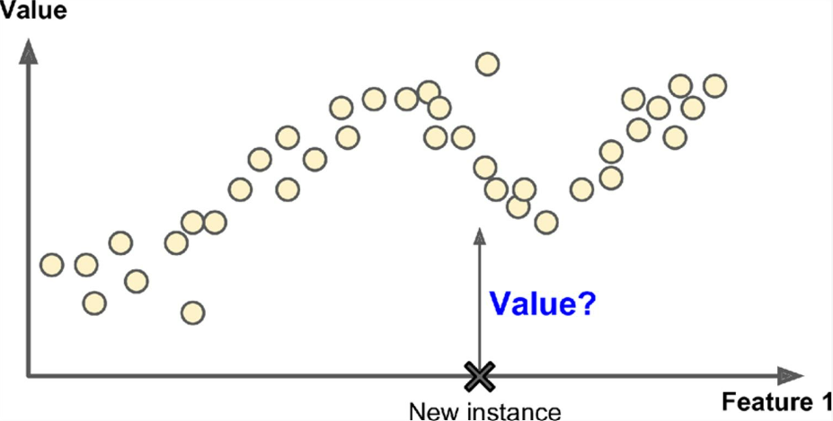
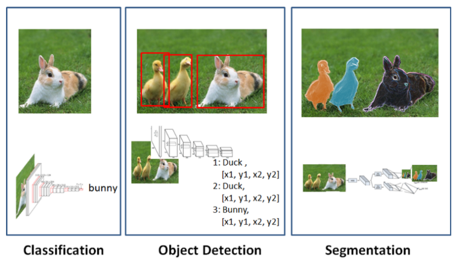
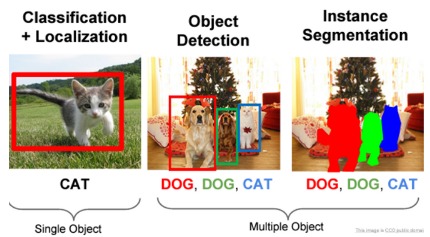
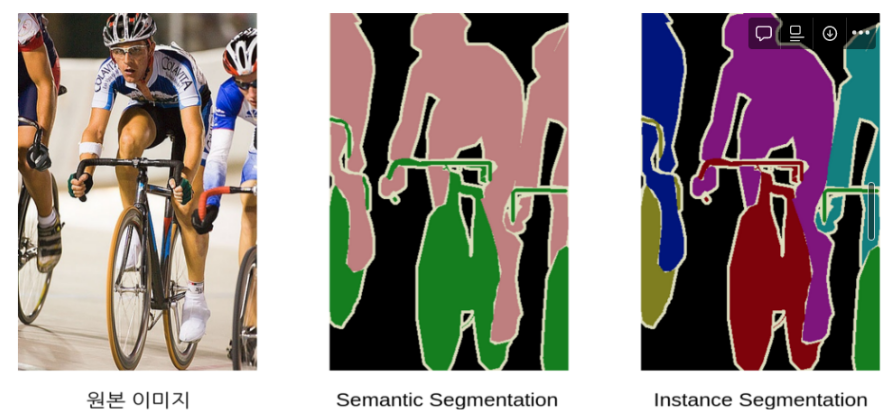

# Supervised Learning

가장 전형적인 ML을 가리킨다. 

^^input data^^ 와 ^^`label` (or target)이라고 불리는 원하는 output^^ 에 해당하는 데이터로 구성된 pair들을 가지는   
training set과 test set을 가지고 있고 이를 통해 학습이 이루어진다. 

* input-output의 pair들을 가지고 있기 때문에
* input과 output의 relation을 ML이 파악하여 
* 이를 mapping해주는 function을 approximation하는 것이라고 생각하면 된다.

{width="300" align="center"}

---

---

## 주요 Tasks **

Supervised Learning 으로 해결하고자 하는 ^^주요 task^^ 는 다음과 같다.

`Classification` (분류)
: Discrete한 category를 label로 가지면서, 특정 data sample에 대해 해당 category를 할당하는 task. exclusive하게 category가 할당될 수도 있지만, 여러 label이 하나의 data sample에 할당될 수도 있음.

<figure markdown>
{width="400" align="center"}
</figure>

---

`Regression` (회귀)
: Continuous한 숫자값을 label로 가지는 경우로, 특정 data sample에 대해 해당 숫자값을 할당하는 task임. Statistics에서 regression model 등에서 유래된 이름으로, input을 independent variable (or predictor)로, 그리고 output을 dependent variable (or target)으로 생각하면 된다.

<figure markdown>
{width="400" align="center}
</figure>

> Regression에서 가장 단순한 형태는 `Linear Regression` (선형회귀)이며,  
> input과 output 간의 linear relationship을 찾아 modeling 함.  
>
> 이는 training dataset에서 가장 적합한 (= loss function이 가장 적은) parameters를 가지는  
> model을 만들고 training에 사용하지 않은 새로운 input에서도 가장 적합한 output을 구하는 것을  
> 목표로 한다.  
>
> `Linear`를 떼면 `Regression`이 되며, `Linear`라는 제약조건이 없이 
> input과 output 간의 relation을 찾게 됨.

---

***`비교`***

| | Classification | Regression |
|:---:|:---|:---|
|차이점 | output이 될 수 있는 값이 discrete하고 갯수가 고정됨. | output이 주로 continuous하며, 갯수가 무한대임. (range가 고정되는 경우가 일반적이나 반드시 그렇지는 않음) |
|대표적 model| kNN, SVM, Decision Tree | Regression Model, SVM |
|Example| Class명(=label) : 01(개), 10(고양이) / 결과값 : 개 또는 고양이(label 중 하나) | 성적 예측: range $[0,100]$ 내에서 어떤 값도 성적이 될 수 있음 |

참고로, novelty detection, dimensionality reduction 등의 Unsupervised Learning의 대표적 task들도 supervised learning으로 수행가능하다.

> classification과 regression이  
> supervised learning의 대표적인 task이나  supervised learning에 한정되진 않는다.

---

---

## 대표적인 알고리즘 (or Model)들.

* k-Nearest Neighbors
* Linear Regression
* Logistic Regression (← classification)
* Support Vector Machine
* Decision Tree
* Random Forest
* Artificial Neural Network ***
    * ^^Auto-encoder, Restricted Boltzmann Machine (RBM) 등은 `unsupervised`임^^ .
    * ^^Deep Belief Network (DBN) 등은 `semi-supervised`로 분류^^ 됨.

---

---

## Deep Learning에서의 Tasks.

Regression과 Classification 은 DL에서도 대표적인 task이지만,  
DL에선 Detection 및 Segmentation 등의 Task도 굉장히 많이 다루어짐. 

> DL의 성능이 워낙 좋다보니 Segmentation과 같이 어려운 task도 많이 다루어짐.  
> 일반적으로 난이도는 Segmentation이 가장 어렵고, 그다음이 Detection, 그 다음이 Classification 순이다. (Labeling에서 이 난이도 순서가 유지됨.)

<figure markdown>
{width="500" align="center"}
</figure>

### Classification ***

* 분류문제이며 출력이 다음과 같은 일종의 vector로 나옴.
* `[Cancer, Precancer, Inflammation, Normal]`
* `[0.7,0.15,0.1,0.05]` 가 출력일 경우, Cancer라고 모델이 판정한 경우이며 `0.7` 정도가 그 판정에 대한 confidence임.

> classification 도 세부적으로는 다음으로 나뉨.
>
> * binary classification
> * multi-class classification
> * multi-label classification
> * multi-output multi-class classification

**참고** : [Types of Classification](../ch02/ml_cls_types.md)

---

### Object Detection

* Classification을 겸하고 있으며, image 내에 해당 object(or region)에 bounding box를 그려 위치도 찾아냄.
* 각 bounding box마다 classification의 출력이 같이 나옴.

---

### Segmentation

* bounding box만 산출하는 Object Detection 달리 대상 object인지 여부를 pixel-level에서 정확히 분류함.
* 출력으로 분류하고자 하는 class의 수만큼의 input image와 같은 사이즈의 binary images가 산출됨.
    * 또는 가로세로비가 같은 축소(or 확대)된 이미지
    * 일반적으로는 aspect ratio(가로세로비)만이 유지된 축소된 binary images가 출력임.
* cancer에 해당하는 출력이미지는 image에서 cancer 영역의 pixel들이 1을 가지고, 나머진 0일 가짐.
    * 또는 하나의 출력이미지에서 cancer에 속하는 pixel들은 1을, pre-cancer는 2를, inflammation은 3을, Normal은 4를 할당하고 unknown등에 0을 할당하는 형태도 가능함. 

---

### 참고: Detection 과 Segmentation

#### Single Object vs. Multiple Object

Object Detection과 Segmentation의 경우, single object 혹은 multiple object이냐 에 따라 다음과 같은 구분도 가능함.

* 위의 Segmentation은 Instance segmentation으로 같은 type의 object라도 다른 instance이면 다르게 labeling을 함. 

즉, 엄격하게 분류하는 경우,

* Single Object만을 다루는 task는 `“Classification + Localization”`이라고도 부름.
* Multiple Object인 경우를 포함하여 `Object Detection`, `Segmentation` 이라고 지칭함. ( 이 경우를 보다 일반적으로 사용한다.)

---

#### Semantic Segmentation vs. Instance Segmentation

Segmentation은 다음과 같이 두가지로 나뉨.

* Semantic Segmentation : pixel단위로 물체를 구분한 뒤 각각의 물체가 어떤 class인지만 구분
* Instance Segmentation : 같은 class이더라도 다른 것이라면 구분

> `semantic` 은 "의미론적" 이라는 뜻의 용어로,  
> 객체의 ***의미*** 에 초점을 맞추어 각 pixel이 어떤 ***의미** (~종류, class)에 속하는지를 식별하는 task를 `semantic segmentation`라고 부름.
>
> 이는 image의 내용을 의미론적으로 이해하는 task라고 볼 수 있음.