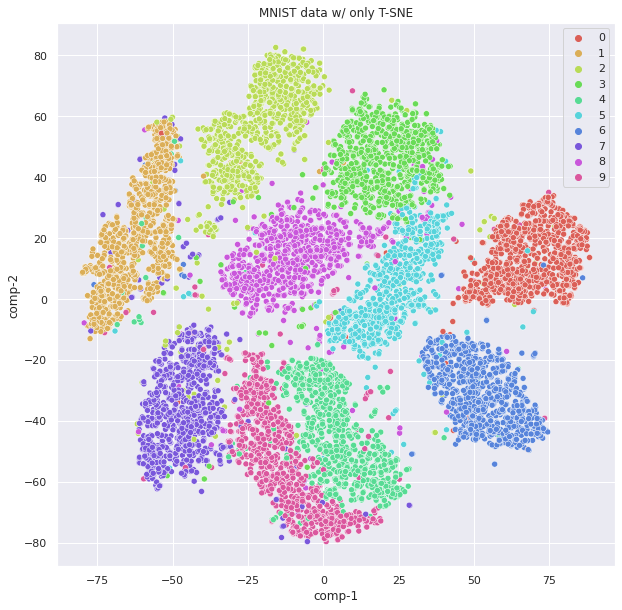
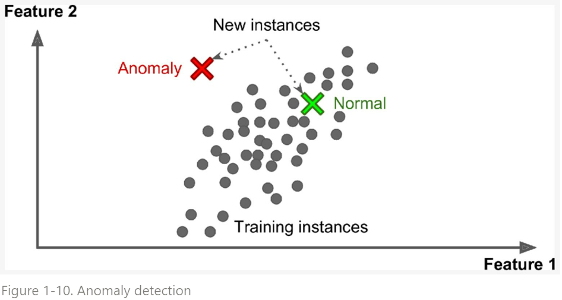

# Unsupervised Learning

Labeling이 필요없는 ML로서 최근들어 중요성이 더욱 커지고 있는 분야임.

사람이 추가해주는 ^^`label` 데이터가 없으며, 
ML이 데이터에서 알아서 내재된 특징(feature vector, representation)들을 추출^^ 하여 Task를 수행한다.

<figure markdown>
{width="400" align="center"}
</figure>

* MNIST 데이터에서 label없이 unsupervised learning으로 clustering을 수행한 결과임 (t-SNE).

---

## 주요 Tasks

Unsupervised Learning 으로 해결하고자 하는 ^^주요 task^^ 는 다음과 같다.

`Clustering`
: input date의 sample들의 내재적인 특징(feature)를 추출하여, 비슷한 sample들끼리 하나의 cluster로 묶는 task.  

: * [Clustering (군집)](../ch07/clustering.md)
    * [Applications of Clustering](https://ds31x.blogspot.com/2023/08/ml-clustering.html) 

`Dimensionality Reduction`
: ML에서 사용되는 data들은 일종의 vector로 표현되는데, 이때 해당 vector들이 놓여지는 vector space의 공간의 차원수를 dimension이라고 부른다(쉽게 말하면 숫자 4개로 구성된 vector는 4차원의 공간에서의 한점을 나타내므로 차원수가 4차원이라고 할 수 있다.).  
다차원의 데이터들은 `curse of dimension`과 같은 문제점이 있기 때문에 가지고 있는 ^^information의 소실을 최대한 막고 dimension을 축소^^ (=compression)해야하는 경우가 많으며 이를 수행하는 task를 `Dimensionality reduction`이라고 부른다.

: * `(Data) Visualization` : `Dimensionality reduction`에서 ^^target dimension을 2 또는 3 차원으로 한 경우^^ 로, data들의 분포의 특징등을 시각적으로 잘 나타내는 task 또는 application을 지칭.  
ML 또는 Data Mining으로 찾아낸 데이터들의 특성 또는 분포를 2차원의 chart (보통 scattergram, scatter plot)로 표현하여 ^^데이터에 대한 insight를 제공^^ 하는데 사용됨.

`Anomaly detection` (or `novelty detection`, `odd detection`)
: Training data에 있는 sample과 다른 특성을 가지는 sample (outlier, odd)들을 탐지하는 task.  
일반적으로 ^^training data에는 outlier가 없다고 생각하고 학습^^ 하고, 새로 주어진 data sample이 기존의 training data와 같은지 아니면 outlier인지를 구분한다.

<figure markdown>
{width="400" align="center"}
</figure>

`Manifold Learning`
: 학습 데이터들에 내재된 ^^manifold를 모델링(or extraction)^^ 하는 task를 가르킴.  
Dimensionality Reduction과 Representation Learning들과 매우 밀접하게 연관되어 있다. 관점에 따라서는 `Dimensionality Reduction` 에 속하는 세부 분야라고도 볼 수 있다. 

## 대표적인 알고리즘들

* [k-Means, k-Medoids](https://dsaint31.me/mkdocs_site/ML/ch07/clustering/#k-means)
* [Affinity Propagation Clustering](https://dsaint31.me/mkdocs_site/ML/ch07/clustering/#affinity-propagation-clustering)
* [Density-Based Spatial Clustering of Applications with Noise (DBSCAN)](https://dsaint31.me/mkdocs_site/ML/ch07/clustering/#density-based-spatial-clustering-of-applications-with-noise-dbscan)
* Hierarchical Cluster Analysis (HCA)
* One-class SVM
* Isolation Forest
* [Principal Component Analysis (PCA)](../ch06/ml_pca.md)
* Kernel PCA
* Locally Linear Embedding (LLE)
* t-Distributed Stochastic Neighbor Embedding (t-SNE)
* Apriori (A Priori, Association Rule Learning)
* ECLAT (Equivalence Class Clustering and Bottom-Up, Association Rule Learning)

> Generative Adversary Networks (GAN)은 unsupervised learning에 속할까?

---

## Self-supervised Learning (of DL).

`Unsupervised learning`의 경우, **dataset에 내재되어있는 feature를 추출하는 데 초점** 이 보다 쏠려있는 것과 비교하여  
`Self-supervised learning`은 **자체적으로 labeling을 수행하고 난 다음에 일반적인 supervised learning으로 해결하는 task (= downstream task)를 수행** 하는 차이가 있다.

> Self-supervised Learning은 ***Supervised Learning을 위한 Technique*** 이라고 볼 수 있음.

대부분의 self-supervised learning의 경우, 

* unsupervised learning 나 semi-supervised learning을 수행하고 얻은 knowledge를 (=pre-training)
* final goal을 위한 supervised learning에 transfer하는 방식을 취한다. (=downstream에 맞는 topper layer를 교체하는 등의 방식)

즉, label이 전혀 없거나 일부 있는 데이터를 이용하는 부분(=pre-training)은 unsupervised learning(or semi-supervised learning)과 같으나, 최종 task는 사실상 supervised learning의 task인 경우가 대부분이다.

### Example

Pretext task로 context prediction을 unsupervised learning으로 수행하고, 이를 knowledge transfer시켜 원래 task를 수행.

* Doersch, Carl, Abhinav Gupta, and Alexei A. Efros. "Unsupervised visual representation learning by context prediction." Proceedings of the IEEE international conference on computer vision. 2015.
