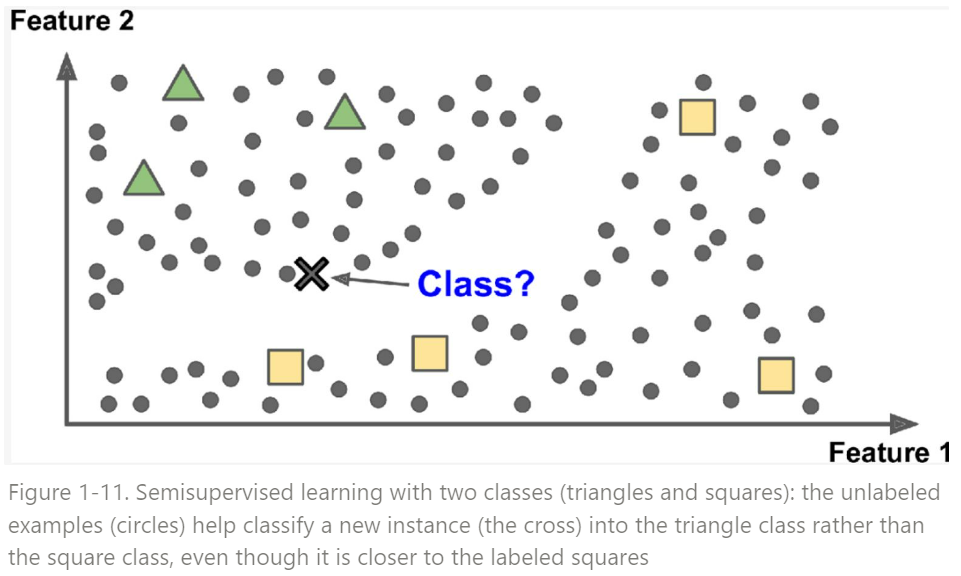

# Semisupervised Learning

전체 학습에 사용되는 dataset에서 Label을 가진 data sample들이 일부인 경우를 가르킴.

Google의 Photo 서비스가 예로 들 수 있는데, 해당 서비스의 모델은 자신의 사진이라고 일부 알려준 것을 바탕으로 학습을 하여 classification등을 수행한다. 실제로는 사진을 unsupervised learning등을 통해 clustering을 해놓은 상태에서 사용자가 일부 알려준 label을 바탕으로 개별 class가 누구인지를 지정하는 방식으로 학습이 이루어졌다.

semisupervised learning은 결국, unsupervised learning과 supervised learning의 조합으로 어디까지를 무엇으로 할지 등등에 따라 다양한 variation을 가질 수 있다.

역사적으로 가장 유명한 Semisupervised Learning은 Hiton교수님의 Deep Belief Network (DBN)이다. 
Hinton 교수님은 
각 계층의 Restricted Boltzmann Machine (RBM)을 unsupervised learning을 시키고 
이들을 쌓아서 DBN을 만들고 이를 labeled data를 이용한 supervised learning을 통해 fine-tunning한 방식이다.
Deep Network가 학습 가능함을 보인 최초의 ANN으로 가치를 가진다 (이같은 방식을 Greedy Layerwise Learning이라 부르며, 오늘날 end-to-end learning이 주류로 자리잡으면서 많이 사용되진 않음.)