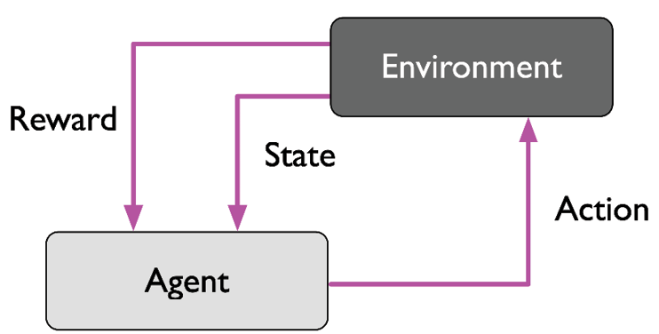

# Reinforcement Learning (강화학습)

`Agent` (학습하는 시스템)가   

* Environment를 관찰하고  
* Action을 취한 후  
* Reward를 받으면서  

최상의 accumulated reward를 얻도록 action을 결정짓는 ***`Policy`을*** 학습하는 것 을 가리킴.

`Policy` 

* `Agent`는 `policy`를 통해 어떤 enviroment(환경)에서 취할 ***연속적인 actions*** 를 결정함. 
* 결국 강화학습은 최상의 연속적인 actions를 얻어내는 `policy`를 얻는 것을 목표로 한다고 볼 수 있음.

`Reinforcement Learning` 에서는 

* learning system을 `agent`라고 부르며, 
* 이 agent 가 `environment` 와 상호 작용을 하면서 취한 ^^`action`에 따라 reward signal (or penalty signal)를 얻는데^^, 
* 여기서 ***최종적인 accumulated reward 를 maximize*** 하도록 ^^어떤 일련의 action들을 수행할지를 결정하는 `policy`를 학습^^ 한다.

> ^^A `policy` determines the action^^ an agent should take in a particular situation ^^to maximize `final accumulated reward`^^.

---

## The three most important distinguishing properties of Reinforcement Learning Problem.

아래와 같은 특징을 가지는 문제를 agent가 효과적으로 해결하도록 해주는 algorithm들을 우리는 Reinforcement Learning method라고 한다.

1. `Closed-loop Problem` : agent가 취한 action(행동)이 이후의 agent의 input (environment의 state 등)에 영향을 준다. 
2. `not providing explicitly direct instructions` which actions to take : 명시적으로 어떤 action을 취해야 하는지를 직접적으로 알려주지 않거나 알려줄 수 없음 (supervised learning과의 가장 큰 차이점).
3. 연속된 action들과 이들로 인한 `reward signal에 의한 결과는 장기간에 걸쳐 누적` 되어 나타난다. : 특정 action은 즉각적으로는 이득이 될 수 있으나 장기적으로는 오히려 손해가 될 수 있음.

---

## Agent 와 Reinforcement Learning Process

`Agent`는 ^^강화학습에서 학습자 에 해당^^ 됨.

Reinforcement Learning Process는 다음의 요소들을 반드시 가지고 있어야 함.

1. `Agent`는 environment와 interaction(상호작용)을 함. (action + sensation)
    - `Action`으로 ^^Environment의 상태를 변화^^ 시킴.
    - ^^`Environment의 State` 일부를 sensing^^ 할 수 있으며 이를 통해 다음 `action`을 결정함.
2. `Agent`는 ***명시적인 `goal`*** 을 가짐. 
    - 해당 ^^`goal`은 Environment의 상태와 연관^^ 되어 있음.
    - ^^goal의 달성 여부에 관련된 reward가 정의^^ 되며, 
    - `Agent의 현재 state`에서 수행된 `action`에 의해 변경된 `environment의 state`와 `goal`과의 연관성 에 의해 계산된 ^^`Reward`가 agent에 주어진다.^^

<figure markdown>
{width="400" align="center"}
</figure>

> 일반적으로 agent가 효과적으로 reinforcement learning을 하려면, `exploration` (탐험) 과 `exploitation` (이용) 사이의 균형을 잘 잡아야 한다.  
>  
> * $^{(1)}$exploration : 다양한 situation에 대해 적절한 action을 찾기 위해서 새로운 시도를 하는 것을 의미함.  
> * $^{(2)}$exploitation : 현재까지의 경험을 토대로 가장 높은 reward를 보이는 action을 수행하는 것을 의미함.

---

## Supervised Learning과 Unsupervised Learning과의 차이점.

`Reinforcement Learning`은 

* interaction으로부터 학습이 이루어져야 하는데, 
* 이 경우 ^^모든 situation에 대한 correct action을 지정하기가 불가능함^^ 
* 즉, whole label제공이 불가능하며 이 것이   `supervised learning과의 차이점`임.  

때문에 `reward function` 등이 label 대신 주어짐. 

* `Reward` signal은 ^^agent가 취한 action에 대한 environment의 feedback^^ 으로 supervised learning의 ground truth에 해당하는 label과는 차이가 있음.  
*  Reinforcement Learning의 경우, ^^어떤 이상적인 action을 명시적으로 모든 상황에 맞게 할당할 수 없기 때문에 해당 action이 얼마나 goal을 달성하는데 유용한지를 측정하는 reward function^^ 을 사용헤 학습한다.

해당 `reward function`으로부터 주어지는 ^^reward signal을 maximization하는 learning이라는 점에서 `unsupervised learning`하고도 차이^^ 가 있다.

* `unsupervised learning`은 아예 정답에 해당하는 정보가 없으나
* Reinforcement learning의 경우 정답에 해당하는 정보를 주는 `reward function`이 존재한다.

> Reinforcement Learning에서는 `exploratory trial-and-error approach` 나 `deliberative planning` 등을 통해 agent는 final accumulated reward를 최대화하는 것을 목표로 한다.

Reinforcement Learning은 

* `Unsupervised learning`와 비슷하게, 
* agent가 얻는 ***experience의 내부적인 특성 구조*** 를 학습을 통해 추출하기도 하지만 
* 이는 reinforcement learning의 최종 목표는 아님. e
* xperience의 내부적인 특성 구조 추출 과정을 통해 최종 목표인 reward signal을 maximization을 효과적으로 달성한다는 점에서 representative learning 들과도 차이를 보임.  

---

## Reward function의 특징.

* Environment의 모든 state에 대해 reward와 penalty가 주어져있다고 생각하고 acton을 통해 agent는 environment의 state를 변경해 나갈 수 있다고 하자. 
* 이때 agent가 acton을 결정하는 기준이 바로 policy이고 이 policy가 final accumulated reward를 최대화하는 방향으로 학습이 되게 하면 된다. 
* 이는 매우 간단한 경우이고, 많은 경우 reward는 즉각적으로 주어지기 어려운 경우도 많다 (체스 등에서 당장은 상대편 말을 잡아서 이득이지만, 장기적으로는 킹을 잃게 되는 수가 있을 수 있고, 당장은 내 퀸을 잃지만 장기적으로는 상대 킹을 잡는 수가 있을 수 있다).
* 더욱이 상대편이 있는 경우엔 상대방의 action에 의해서도 reward가 영향을 받게 된다는 점이 reward function에서 어려운 점이다. 

^^즉, reward는 action에 대해 즉각적일 수도 있으나 대부분 delayed feedback으로 주어질 수 있다.^^

---

## 결론

요약하면, Reinforcement Learning은 기존의 supervised learning이나 unsupervised learning과 구별되는 종류의 ML이다.  
interaction이 일어나는 경우에서 사용되므로, 로보틱스등에서 많이 이용된다. 

> ML에서의 hyper-parameter tunning에서도 적용되는 경우도 많다.

