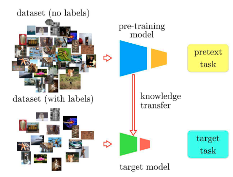

# Self-supervised Learning

Self-supervised Learning은 

- label이 없는 대량의 data에서
- data 자체적에서 labeling이 가능한 학습과제(pretext task) 생성
- pretext task 학습(supervised learning)을 통해 의미 있는 representation을 획득.
- representation 을 생성하는 모델을 pre-training 모델이라고 부름.
- 획득한 representation을 직접 feature vector로 사용하는 downstream model을 main task 로 훈련: main task를 훈련시키기 위한 labeled data 필요.
- 최근엔 pre-training model 에서 [knowledge transfer](../ch11_training/knowledge_transfer.md)를 수행하고, main task 에 대한 labeled data로 model을 tweak 및 fine-tuning을 수행하는 방법이 선호됨: 이 때 tweak(조정)에는 모델의 구조 및 하이퍼 파라미터 수정도 포함됨. 

Self-supervised Learning은 일종의 transfer learning이라고도 볼 수 있으며, **main task에서 활용 가능한 labeled data가 매우 적은 상황에서도** 효과적으로 main task를 해결하는 기계학습 방법임.

{style="display: block; margin: 0 auto; width:400px"}

* ref. [source](https://openaccess.thecvf.com/content_cvpr_2018/papers/Noroozi_Boosting_Self-Supervised_Learning_CVPR_2018_paper.pdf)

## 사용되는 경우

Self-supervised Learning은 다음과 같은 상황에서 주로 사용됨.

* label이 없는 데이터가 label이 있는 데이터보다 훨씬 많을 때
* 원래 풀고자 하는 task(main task)를 위한 labeled dataset의 샘플 수가 모델을 훈련시키기에 부족할 때

## 구성 단계

Self-supervised Learning은 다음의 단계로 모델을 훈련시킴.

1. Pretext task 설정 및 학습
    * 수가 많은 Unlabeled dataset을 Labeled dataset으로 변경시킬 수 있는 사전 과제(pretext task, 보조과제라고도 불림)를 설정.
    * 데이터 자체에서 labeling하고 이 labeled data로 모델을 훈련
    * 일종의 pre-training 으로 볼 수 있음.
    * 원래 main task 관점에서는 label 이 없는 dataset이지만, pretext task 덕에 labeled dataset 이 되며
    * 결국 자동으로 생성된 labeled data를 이용한 supervised learning 으로 representation learning이 가능해짐: pretext task 로 학습된 것이라 main task를 직접 수행하진 못함.
    * 하지만, pretext task가 main task와 유사하거나 이를 수행하기 위한 representation을 얻을 수 있는 관련성을 가진 경우라면 해당 모델로 얻은 representation을 main task에 적용가능함.
2. Main task에 맞춘 knowledge transfer
    * 해당 모델을 **main task에 맞게 [knowledge transfer](../ch11_training/knowledge_transfer.md]를 수행** : tweak 및 fine-tuning 포함. 
    * 대부분 모델의 출력단의 구조가 변경됨: downstream model (layer) 이 main task의 출력에 맞게 변경됨.
    * 이 과정에서는 main task에 맞게 label이 주어진 소수의 dataset을 사용하여 훈련이 이루어짐.
    * 이는 knowledge transfer의 tweak 및 fine-tuning과 비슷함.

## Pretext Task    

Pretext task는 데이터 자체에서 매우 쉽게 label을 만들어낼 수 있어야 하며, 동시에 main task에 도움이 되는 representation을 학습할 수 있어야 함.

* 문장의 일부를 가리고 그 부분을 예측하게 하는 BERT모델의 사전훈련 단계에서 pretext task인 Masked Language Modeling을 대표적 예로 들 수 있음. 
* pretext task를 잘 수행하도록 훈련되는 모델은 해당 dataset의 중요한 특징들을 학습하게 됨: 해당 특징들은 main task를 수행하는데에 관련이 있도록 pretext task가 설정되어야 함.
* 반드시 pretext task로 학습된 내용은 main task를 수행하는 데에 도움이 되어야 함.

## 장점

Self-supervised Learning의 장점:

* label 없는 대량의 데이터를 활용 가능
* 데이터의 일반적인 특징(representative feature)을 잘 학습할 수 있음
* 주요 과제에 적용 시 적은 양의 레이블된 데이터로도 좋은 성능 달성 가능

## 결론1

Self-supervised Learning은 

* dataset의 관점에서 pretext task에 대한 훈련은 레이블 없는 데이터를 사용하므로, **일종의 unsupervised learning** 이라고도 볼 수 있음.
* 하지만 해당 학습 과정은 supervised learning임.
    * pretext task: 자체적으로 label을 생성하고 나서 수행되므로 **지도 학습(supervised learning) 기법으로 진행됨**.  
    * main task: 최종 모델을 훈련시킬 때에도 (소량의) labeled dataset을 사용하는 supervised learning 이 수행됨.
* 일종의 **전이 학습(transfer learning)의 한 형태** 로 볼 수 있음.​​​​​​​​​​​​​​​​

즉, self-supervised learning이 적용되는 task 는 사실상 supervised learning과 같음.

> Unsupervised Learning의 task 가 주로 clustering, dimensionality reduction, novelty (or outlier) detection 인 점을 주의할 것.  
> Self supervised Learning 은 task의 관점에서 unsupervised learning과 차이를 보이고, 주어진 dataset 의 측면에서 supervised learning과 차이를 가짐.  

## Example

Pretext task로 context prediction을 unsupervised learning으로 수행하고, 이를 knowledge transfer시켜 원래 task를 수행.

* [Doersch, Carl, Abhinav Gupta, and Alexei A. Efros. "Unsupervised visual representation learning by context prediction." Proceedings of the IEEE international conference on computer vision. 2015.](https://arxiv.org/abs/1505.05192)
* [Mehdi Noroozi, Ananth Vinjimoor, Paolo Favaro, Hamed Pirsiavash. "Boosting Self-Supervised Learning via Knowledge Transfer". 2018](https://arxiv.org/abs/1805.00385)
