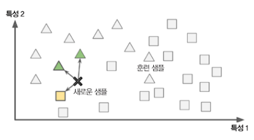

# Instance based Learning

ML의 learning system에서 generalization을 training dataset 그 자체로 구현하는 경우를 instance based learning이라고 한다.

* 어떤 일반화된 model 이나 function을 구하는 대신에, 
* similarity 혹은 distance를 측정하는 metric function에 기반한 
* ***기존의 data point 와의 유사도*** 를 이용하여 ^^prediction을 수행한다.^^

즉, ML system이 train dataset의 instances를 기억하고, 새로운 sample과의 train dataset의 instance들 각각의 similarity를 이용하여 prediction을 수행한다.

> 물론, 모든 data sample이 아닌 대표적인 일부만을 기억하는 경우도 많다.

예를 들자면, `k-NN`이 대표적인 instance based learning에 해당한다.

{width="400"}

* 삼각형과 네모로 label이 붙은 training dataset을 기억함.
* 이후 x 표시의 새로운 data point가 주어졌을 때, `k=3`으로 3개의 가까운 이웃을 구하고, 이들의 다수에 해당하는 label로 prediction을 수행.

---

## Similarity 와 distance

distance의 경우 수학적으로 몇가지 조건을 만족해야 한다. 그 중 가장 중요한 특성 중 하나가 symmetry를 가져야 한다는 점이다. 만일 $d(x,y)$ 라는 binary operation이 distance를 구하는 function이 되려면,  $d(x,y) = d(y,x)$ 가 성립(symmetry)해야 한다.

* **distance** function의 조건 : [읽기](../../DIP/cv2/etc/dip_metrics.md#distance-function-or-metric)

Euclidean distance를 포함한 difference vector의 L-p norm 등은 distance의 조건을 만족한다. 하지만, 이후 소개될, probability distribution 등을 비교하는 Kullbeck-Leibler Divergence, Cross entropy 등의 metric들은 symmetry를 만족하지 못한다. 

이같은 경우 `similarity`라는 용어로 `distance`를 대신하여 사용한다. 실제로 instance based learning에서 사용하는 metric의 상당수는 similarity를 측정한다.

---

## Measure of Similarity 의 중요성.

비슷하다거나 동일하다는 개념은 우리에게 ^^어떤 차이를 측정하는 measure가 필요함^^ 을 의미!!
 
- ML에서 input과 output은 주로 vector임. (vector = ordered list of numbers)
- 이는 vector간의 difference 혹은 similarity를 측정하는 metric이 바로 similarity를 정량화한다는 것을 의미함. ←선형대수 (subtraction b/w vectors)
- 동시에 대상을 vector로 만들 때, subtraction이 가능한 scale이 되도록 해야함 ← word embedding등. 
    - [nominal scale](https://dsaint31.tistory.com/469#Nominal%--scale%---%EB%AA%--%EB%AA%--%EC%B-%--%EB%-F%---)을 적용한 입력 vector에선 similarity의 정도를 구하기 어려움. 
    - 이는 [nominal scale](https://dsaint31.tistory.com/469#Nominal%--scale%---%EB%AA%--%EB%AA%--%EC%B-%--%EB%-F%---)에서는 L-p norm 기반의 distance를 사용하기 적절치 않다는 뜻임.
    
- vector가 아닌 일종의 ***probability distribution으로 보는 경우** 라면, distribution의 difference를 구하는 cross-entropy, Kullbeck-Leibler Divergence등이 사용될 수도 있다.

참고 : 영상처리 등에서 similarity를 정량화하기 위한 metrics를 설명한 다음 URL을 읽어볼 것 : [distance function이란](https://dsaint31.me/mkdocs_site/DIP/cv2/etc/dip_metrics/#distance-function-or-metric)

