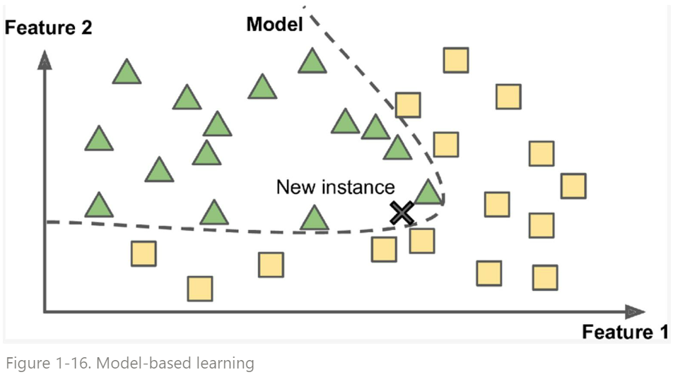

# Model based Learning

Training data sample들로부터 일반화된 Model을 만들어 prediction에 이용한다.

{width="400"}

* 위 그림에서 학습의 결과로 만들어진 model은 바로 검은색 dash line이 된다.
* 새로 주어진 data point x는 dash line에 의해 삼각형으로 prediction된다.
* 만일 model이 만들어지지 않는 instance based learning이라면, 사각형으로 prediction될 것이다. (k=3인 k-NN이라면)

> `Model`이라는 용어는 ML에서 일종의 input이 들어가면 output이 나오는 function을 가리키는데 많이 사용된다. 실제로는 특정 dataset에서 data와 label간의 관계를 approximation하고 있는 것을 model이라고 많이 지칭한다. 이같은 관계는 일종의 mapping, transformation이라고 생각할 수 있고 이는 function의 형태로 나타낼 수 있기 때문에 model을 function이라고 생각해도 supervised learning에선 큰 무리가 없다.  
> 또한 ML에서 model은 해당 approximation을 만들어내는 algorithm (or method)를 가르키기도 한다. Artificial Neural Network에서는 layer들이 구성된 architecture를 model이라고도 부르기 때문에 context에 맞춰서 그 의미를 파악하는게 중요하다.

보통 다음과 같은 순서로 진행됨.

1. Data 분석
2. 해당 Training data에 적절할 model을 선택.
3. 해당 model을 training dataset으로 학습 (cost func.최소화시키는 optimization)
4. 이후 inference 수행 (새로운 data point들에 대한 prediction)

ML에서 대부분의 경우는 model based learning이다.