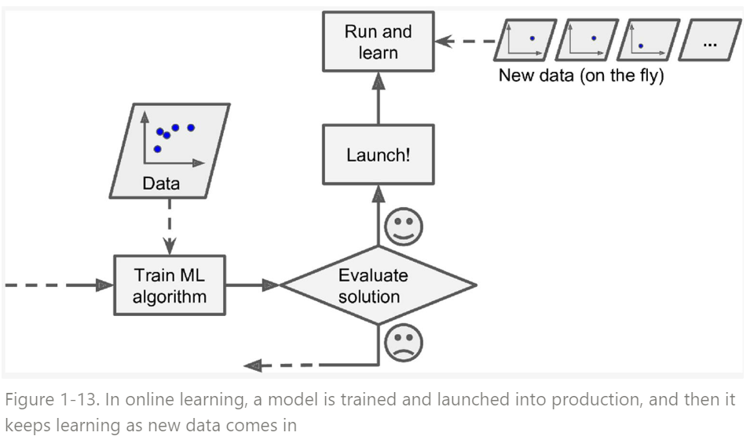

# Online Learning

Input data stream으로부터 점진적 학습(incremental learning) 가능한 경우를 `online learning`이라고 하는데,
개인적으로 `Incremental Learning`이라는 용어가 더 적절하다고 생각된다.

일반적으로 ^^지속적으로 새 데이터를 공급^^ 받고 (launching 이후에도 지속적으로 training에 사용가능한 새 데이터가 공급됨), 해당 데이터들이 시기에 따라 ^^변화가 심한 경우^^ 에 사용되는 Learning이다.

다량의 Data를 한번에 학습(batch learning)하기 보다는 mini-batch등의 작은 묶음으로 나누어서 model을 학습하여 mini-batch와 같은 일부 데이터들에 의해 점진적으로 model이 업데이트된다.

> batch learning에서도 mini-batch를 사용하지만, online learning에서는 mini-batch만으로 학습된 model이 실제 서비스에 이용되고 있다. online learning에서는 학습과 서비스가 같이 이루어지고 있는 경우를 고려해야 한다.

Input data stream으로부터 점진적 학습(incremental learning) 가능하기 때문에, 전체 데이터 크기가 너무 커서 한번에 학습시킬 수 없을 때 (memory나 storage등에 한번에 적재가 불가능한 경우)에 사용되기도 한다. 이 경우는 out-of-core learning이라고도 불린다. 

> 일반적으로 out-of-core learning의 경우엔 대부분 lauching 전에 이루어지는 offline training이다. 때문에 online learning이라는 용어는 그리 좋은 용어같지 않다. incremental learning이라는 용어의 동의어로 기억하는게 보다 나은 선택으로 보인다. 