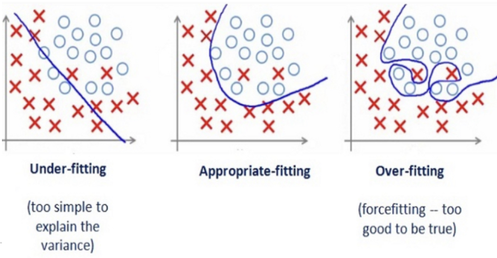

# ML의 주요 단계와 성공을 위해 고려해야하는 요소

1. 문제 및 Data 분석 (Exploratory Data Analysis)
2. model (ML Algorithm) 고르기
3. Training
4. Fine tuning
5. Evaluation
6. Inferences (making prediction on the new data)

위의 단계에서 1, 6번 외에는 각 단계마다 evaluation이 있을 수 있으며, 각 단계에서 중간 평가 등에 따라, 앞단계로 돌아가거나 반복하는 경우들이 잦음.

> 여러 ML Algorithm이 동시에 진행되는 경우도 많음 (model selection 을 위해 2-3개 정도는 동시에 학습되는 경우도 흔함.)

그리고 ML의 성공을 가르는 핵심은 크게 2가지로,

* ML Algorithm (or model) : 적절한 Model의 선택.
* Data임. : 좋은 데이터로 학습.

---

## 적절한 Model 선택

model 의 경우, 우리가 해결해야하는 ^^task의 복잡도에 걸맞는 ***capacitance*** (=complexity)를 가진 model^^ 을 골라야 함.  
(사람으로는 가능성과 적성이 맞는 학생에게 공부를 시키는 것과 유사)

일반적으로 너무 단순한 model은 아무리 데이터를 많이 주고, 오래 학습을 시켜도 복잡한 문제를 해결할 수 없음(다차 함수의 approximation이 필요한 문제를 linear model로 해결할 수 없는 것을 기억할 것).

이 경우 발생하는 문제를 `under-fitting`이라고 부르며, training data에서도 원하는 performance를 얻지 못한다.

* Under-fitting은 model의 capacitance가 요구되는 수준에 못 미치는 경우 발생. 
* Training data에서도 높은 bias를 보임.
* 또는 input data에 task를 $^{(1)}$해결하는데 요구되는 feature가 없거나 $^{(2)}$지나치게 관계없는 feature들이 많은 경우 등에도 underfit은 발생.

> 참고: [Under-Fitting](https://dsaint31.tistory.com/610)

반대로 ***task에 비해 너무 높은 capacitance를 가진 model을 사용*** 하는 경우에는 `over-fitting`이 발생함.

이는 training data에서 내재하고 있는 실제 feature를 중심으로 학습해야하는 model이 이를 넘어서서 ^^data에 있는 Noise들의 패턴마저 기억^^ 을 해서 Training data에서의 성능은 매우 높으나 General Performance는 오히려 낮아지는 경우임. (Training data의 Noise pattern은 실제 inference단계에 주어지는 data들에는 없기 때문)

* Over-fitting은 model의 capacitance가 지나치게 높을 경우 발생.
    * 주로 주어진 data의 amount(양)과 noisiness(Noise정도) 에 비해 
    * model이 매우 많은 parameter들을 가질 때 발생.
* Training data가 많이 주어질 경우, 특정 noise패턴이 있을 확률이 줄어들어 over-fitting의 위험도를 낮춰준다.
    * 또는 Noise를 감소시키는 전처리 등도 over-fitting을 줄여줌.
    * 역발상으로 다양한 noise를 억지로 추가해주어 noise로 인한 패턴이 없어지도록 하는 방법도 효과적임.
* `regularization` 등을 통해 model의 parameter들의 자유도를 낮춰 적절한 capacitance가 되도록 조절함으로서 해결할 수 있다.
* 또는 `model의 parameters의 숫자를 줄이거나`, `data의 features를 다 사용하지 않고 일부만 사용`하는 등의 처리를 통해 보다 단순한 model이 되도록 한다.

참고로 ***Deep Learning 모델들은 over-fitting이 되기 쉬운 매우 복잡한 (=높은 capacitance) 모델들*** 이므로, 

* 학습데이터를 늘리거나 *** (항상 사용가능한 방법은 아님)
* 사용하는 feature의 종류를 줄이거나 *
* `regularization`을 ** 

통해 general performance를 올린다(= over-fitting을 회피).

> 모델이 단순할수록 data로부터 핵심적인 패턴에 보다 집중하고 사소한 패턴은 고려하지 않는다. 때문에 학습데이터에서는 사소한 패턴의 무시로 인한 오류가 커지게 되나, generalization은 오히려 향상되는 경우가 많다.  
> generalization을 잘 시키면서도 사소한 패턴 중에서 task와 관련된 것은 잘 찾고 동시에 noise에 관련된 것은 학습하지 않도록 균형을 잡는 게 ML에서 가장 중요한 핵심요소이다.

**Hyper-parameter Tuning**

Hyper-parameter는 ml에서 기계가 데이터로부터 스스로 값을 찾아내지 못하는 parameters를 가르킴.(때문에 training 중에 값이 갱신되지 않고 고정되는 경우가 일반적임. 사람이 선택.)
(meta-parameter 또는 free parameter 등으로 불리기도 함.)

* 주로 hyper-parameter (learning ratio, number of layers, weight of regularization terms of cost function, and so on)들을 통해 모델의 복잡도(=capacitance)를 조절.
* early stopping, drop out, batch normalization 등도 over-fitting을 해결하는 좋은 방법임.

> batch normalization은 사실 vanishing gradient를 해결하는 방안이나, regularization 효과도 있음.

---

### 읽어보면 좋은 자료.

* [What is underfitting and overfitting in machine learning and how to deal with it.](https://medium.com/greyatom/what-is-underfitting-and-overfitting-in-machine-learning-and-how-to-deal-with-it-6803a989c76)

---

## 적절한 Data 확보.

다음과 같은 Data들은 ML에서 피해야 한다.

* 부족한 양의 Training dataset
    * ML은 어느 정도의 데이터 없이는 제대로 학습하기 어려움. (DL은 훨씬 많은 데이터가 필요한 경우가 많음)
    * 여러 연구에서 충분한 많은 데이터만 있다면 model이 조금 성능이 낮아도 좋은 결과가 가능함이 확인됨 (데이터의 가치가 모델의 가치보다 높아지는 추세) 
* `Non-representative` training dataset
    * 어떤 경우에도, population을 대표할 수 있어야 한다.
    * 이는 데이터의 양(샘플 수)과도 연관되며, 지나치게 적은 데이터는 sampling noise 문제 발생 (우연히 미국에 살다 온 고교생과 인터뷰 하고나서 모든 고교생의 영어 실력을 착각하게 되는 경우등을 sampling noise라고 할 수 있음).
    * 양이 많다해도 sampling bias가 있는 경우에는 적절한 데이터가 아님 (탈모 증상에 시달리는 사람의 비율을 유치원에서 조사한다면?).
* **나쁜 품질** 의 Training dataset
    * 지나치게 노이즈가 많거나, 
    * outlier로 너무 많은 경우
    * missing data 가 너무 많거나
    * 잘못 측정 또는 기재된 feature가 많은 경우.
* task와 관련성이 없는 feature들이 너무 많은 training dataset
    * curse of dimensionality.
        * 충분한 수의 관련있는 feature들을 가져야함.
        * 동시에 상관없는 feature들은 수가 적을수록 좋음.
    * feature들 간의 correlation이 매우 높고, 실제 tasks와 관련이 없는 irrelevant feature들이 많은 경우.
        * feature engineering을 통해 feature를 전처리하는게 반드시 필요하다. (feature selection and/or feature extraction)

***데이터의 중요성*** 은 모델의 중요성 이상으로 강조되고 있는 게 현실임. 
아무리 주의를 기울여도 부족할 정도로 중요하다.

> garbage in, garbage out

---

### 읽어볼 자료

* [Scaling to very very large corpora for natural language disambiguation](https://dl.acm.org/doi/10.3115/1073012.1073017)
* [The Unreasonable Effectiveness of Data](https://static.googleusercontent.com/media/research.google.com/ko//pubs/archive/35179.pdf)

---

## 그외 중요한 요소

### Validation의 중요성

validation dataset은 크게 보면 Training dataset이다. 

Test-set은 모델의 최종 generalization error를 평가하는데 사용되므로, 
validation dataset을 통해, 

* hyper-parameter turning 및 
* model selection

등을 수행한다.

> 주의할 점은 evaluation을 반복할수록 data leakage가 발생하기 때문에 학습에서 직접적으로 validation dataset을 사용하지않는다해도 test set 보다 model이 validation set에서 나은 성적을 거두기 싶다. 

* ML에서 `parameter`는 ML algorithm이 data로부터 적절한 값을 설정하는 weight와 bias등을 가르킨다.
* `Hyper-parameter` (or free parameter)는 훈련을 진행하는 사람이 설정하는 변수를 가르키며 validation dataset을 통한 evaluation 결과에 의해 정해진다.

중요한 건, validation dataset, test dataset 모두 

* population을 잘 반영하고 있어야만 하고 
* 통계적으로 유의미한 검증이 되려면 이들도 ***적절한 양이 되어야 한다***.

> 데이터가 적은 경우, `k-fold cross validation`을 통해 validation의 신뢰도를 높일 수 있다. 분야에 따라 다르지만, 극단적 cross validation인 `Leave one out cross validation` (`LOOCV`)도 생각보다 많이 접하게 될 것이다. 

주의할 건, validation dataset도 최종 Test를 하기 전에 training에 사용해야한다 (최적의 hyper-parameter로 지정하고서...).

> data나 너무 적어서 test 및 validation 의 data를 다른 방식으로 얻는 경우 data mismatch가 발생한다. 이 경우에는 반드시 `test-dev set` 을 통해 모델의 성능저하가 over-fitting인지 아니면 data mismatch 때문인지를 확인해야 한다.

---

### Test의 중요성 

ML의 궁극적인 목표는 ^^`generalization error` (or `out-of-sample error`)를 줄이는 것^^ 임.

이를 가늠해볼 수 있는 데이터가 바로 Test-set임 (over-fitting 여부 확인도 가능).

> 어떤 경우에도 Test dataset으로 validation이나 training을 해선 안된다. 

---

### Validation과 Test를 위한 Data 구성

* Total Training Dataset (80%)
    * Training Dataset ( 60%)
        * 학습에 이용됨.
    * Validation Dataset (or the holdout set, 20%)
        * Model 평가 (적합한 model을 고르는데 사용됨)
        * Hyperparameter tunning에 이용됨.

> Training Dataset의 숫자 확보를 위해, 일반적으로 Cross-validation 을 이용함.

적합한 model과 hyperparameter 설정하고 나서, 최종 Test에 들어가기 전 Total Training Dataset 80%를 다 사용하여 Model을 훈련시킨다.

* Test Dataset (25% : Scikit , 일반적 : 20%?)
    * Learning에 사용되지 않은 sample.
    * `generalization error`(일반화 오차, or out-of-sample error)에 대한 estimation을 얻는데 이용됨.

Test set의 크기는 `generalization error`를 통계적으로 잘 추정할 정도의 양이 필요함!!

* 너무 적을 경우, 구한 `generalization error`의 정도를 신뢰하기 어려움.

---

### Train-dev set

주로 data mismatch 인 경우에 사용되는 training dataset의 일종.

* validation set과 test set은 항상 실제 모델이 적용될 데이터와 같은 population에서 획득되어야 한다. (representative data여야함.)
* training set도 마찬가지여야 하는 게 원칙이나, 다른 두 집합보다는 강제성이 떨어진다. (일단 모델이 훈련을 하려면 숫자확보가 우선인지라 training data는 실제 데이터와 mismatch가 되는 데이터들을 사용하는 경우도 있음)

이때, training data에서 일부를 학습과정에서 사용하지 않도록 분리해두고, 모델이 학습된 이후 해당 데이터로 evaluation을 수행한다. 

* 이때 분리되어 evaluation에 사용되는 데이터 집합이 바로 `train-dev set`임.
* 만약 `train-dev set`에서 성능이 나쁘게 나온다면 over-fitting으로 간주할 수 있음.
* `train-dev set`에서 성능은 나쁘지 않으나, `validation set`에서 성능이 나쁘다면, ***data mismatch*** 로 인해 모델의 성능이 나쁜 것으로 간주할 수 있음.

즉, `train-dev set`은 over-fitting이 발생한 경우와 data mismatch로 인해 모델이 제대로 훈련되지 않았는지를 구분하기 위해 사용된다.