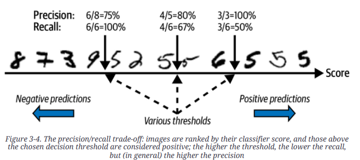

# Performance Measures for Classifiers

## Confusion matrix

Confusion matrix(오차행렬, 혼동행렬)은 

* row는 label의 `ideal class` 를 나타내며, 
* column은 `predicted class` 를 나타낸다.

Confusion matrix는 Classifier의 성능을 확실하게 파악할 수 있다는 장점이 있으나  
***하나의 값으로 표현되지 않는다는 단점*** 을 가짐.

`sklearn.metrics.confusion_matrix` 를 사용하여 쉽게 구할 수 있음.

binary classifier의 경우, confusion matrix는 다음과 같음.  
(통계의 가설 검증에서 사용되는 confusion matrix와 비슷하여 이를 기반으로 표기한다.)

|  | Negative | Positive |
| :---: | :---: | :---: |
| $H_1$: False  ($H_0$: True) | $TN$, True Negative | $FP$, False Positive (Type-I error)|
| $H_1$: True   ($H_0$: False)| $FN$, False Negative  (Type-II error) | $TP$, True Positive |

* $H_1$ : 
    * alternative hypothesis. 
    * 이진분류에선, ***label이 class에 속한 경우*** 임: label 값을 1로 표현.
* $H_0$ : 
    * null hypothesis. 
    * 이진분류에선, ***label이 class에 속하지 않은 경우*** 임: label 값이 0이 됨.
* False Positive 는 Type-I error(1종오류) 또는 $\alpha$ error라고도 불림.
    * model이 1이라고 판정했으나, 실제로는 0인 경우임.
* False Negative 는 Type-II error(2종오류) 또는 $\beta$ error라고도 불림.
    * model이 0이라고 판정했으나, 실제로는 1인 경우임.
* 가설검증 등에서 사용하는 $\alpha$ value (Critical value, significance level)가 작아질수록 Type-I error가 일어날 확률은 감소하지만 Type-II error가 일어날 확률은 커짐.

<figure markdown>
{width="500", align="center"}
</figure>

* 가설검증은 Type-1 error를 줄이는데 초점을 둠. 
* $\alpha=0.05$에서 $\alpha=0.01$을 쓰는 추세

---

---

## Accuracy (정확도)

Prediction에서 Ground True값인 label을 정확하게 맞춘 확률을 의미함.

$$\bf{Accuracy} = \frac{\bf{Correct\_Predictions}}{\bf{All\_Predictions}}$$

Binary classification으로 말한다면

$$\bf{Accuracy} = \frac{TP+TN}{TP+FP+TN+FN}$$

* $TP$ : True Positive (실제로 Label이 Positive인데 Positive라고 predict한 갯수)
* $TN$ : True Negative (실제로 Label이 Negative인데 Negative라고 predict한 갯수)
* $FP$ : False Positive (실제로 Label이 Positive인데 Negative라고 predict한 갯수)
* $FN$ : False Negative (실제로 Label이 Negative인데 Positive라고 predict한 갯수)

가장 일반적으로 사용되는 Performance measure이지만,  
***imbalanced classification의 경우엔 성능을 제대로 나타내지 못한다*** 는 단점이 있음.

예를 들어 유병률이 $0.1\%$ 희귀병을 판정하는 classifier의 경우,  

* 아무 로직 없이 무조건 희귀병이 아니라고 판정해도  
* $99.9\%$의 accuracy를 얻게된다.

이같은 단점 때문에 accuracy만을 사용하는 경우는 balanced class인 경우로 제한되며,  
흔히, precision과 recall 등과 함께 사용됨.

classification의 종류에 상관없이 항상 단일값으로 구해짐.

---

---

## Precision (정밀도)

특정 class의 precision이란,  
해당 class라고 predict한 sample들의 수가 분모이고  
해당 prediction에서 Label도 해당 class인 경우들의 수가 분자임.

* 즉, ***특정 class라고 예측한 경우에서 몇 퍼센트가 정답을 맞추었는지*** 를 나타냄.
* 특정 class라고 예측한 경우에서의 정답률에 해당함.

model에 대해 하나의 값만이 구해지는 Accuracy와 달리, **Precision은 각 class 별로 구해진다**.

* 때문에 이를 각 class에서의 precision들을 average 하여 대표값을 구해야 함.
* 이를 average하는 방식에 따라 3~4가지 종류가 존재함 (아래 참조). 

$$\bf{Precision}(\bf{cls_A}) = \frac{TP(\bf{cls_A})}{TP(\bf{cls_A})+FP(\bf{cls_A})}$$

* $TP(\bf{cls_A})$ : Label과 Predict 모두 class A인 sample들의 수.
* $FP(\bf{cls_A})$ : Predict는 class A였으나 Label이 class A가 아닌 sample들의 수.

Precision을 올리는 쉬운 방법은 "정말 확실하게 해당 class A인 경우에만 class A로 판정"하는 것임.  
즉, 판정시 사용하는 threshold를 매우 높게 잡으면 precision은 올라간다.

> imbalanced classes의 경우에도, precision은 다음에 다룰 recall과 함께 성능을 잘 반영해준다.  
> 각 class별로 precision이 나오며 특정 관심이 있는 class에서의 model의 성능을 따로 확인할 수 있다.

문제는 threshold를 올려서 precision을 올리는 경우, 

* Label이 class A이지만 prediction에서 낮은 score를 기록할 경우, 
* class A라고 판정하지 않을 확률이 올라간다. 
* 이는 recall or sensitivity가 낮아지는 문제로 이어짐 : ***Precision-Recall Trade-off***

---

---

## Recall (재현율)

Sensitivity 또는 ***True Positive Rate*** 라고도 불린다.  
Precision과 분자는 같지만 분모가 달라진다. 분모가 "Label이 특정 class인 샘플의 수"가 된다. 

* 즉, 특정 class를 label로 가지는 sample들에 대해 몇 퍼센트를 해당 class로 맞추었는지를 의미함.
* 역시 class 별로 구해지므로 average를 해야하는 점이 precision과 같음.

Recall도 precision과 마찬가지로 class별로 다음과 같이 구해진다.

$$
\bf{Recall}(\bf{cls_A}) = \frac{TP(\bf{cls_A})}{TP(\bf{cls_A})+FN(\bf{cls_A})}
$$

앞서 말한대로, ***Recall과 Precision은 trade-off 관계*** 이다. 

* threshold를 올리면 precision은 향상되지만, 
* 이는 동시에 recall을 떨어뜨리게 된다.

극단적으로  
항상 class A 라고 판정할 경우, class A에 대한 recall은 1.0 (=100%)를 달성할 수 있다.  
당연하지만 이 경우 class A의 precision은 매우 나뻐지게 된다.

--- 

---

## Precision and Recall for Multi-class classification

Accuracy와 달리, Precision과 Recall은 class별로 구해지기 때문에,  
모델 전체의 성능을 보려면 각 class에서의 precision과 recall의 대표값을 구해야 한다.

이때 사용되는 average 의 종류는 아래와 같이 3가지가 있다.

### ***Macro Average***

각 class별로 precision과 recall을 구하고 이들의 평균.  

* 각 클래스별로 동일한 weight를 주어 평균을 구함.
* imbalanced dataset에 주로 애용되는 방법임.

아래의 식을 보면, 각 클래스의 값에 동일한 weight을 준다.

$$
\bf{Precision}(\bf{macro}) = \frac{\bf{Precision}(\bf{cls_A})+\bf{Precision}(\bf{cls_B})+ \dots +\bf{Precision}(\bf{cls_N})}{N}
$$

$$
\bf{Recall}(\bf{macro}) = \frac{\bf{Recall}(\bf{cls_A})+\bf{Recall}(\bf{cls_B})+ \dots +\bf{Recall}(\bf{cls_N})}{N}
$$

* $N$ : number of classes

> Imbalanced classes 인 Dataset 으로 훈련한 모델의 경우, Macro Average 가 나쁘게 나오기 쉬움.  
> 모든 클래스 별 가중치가 동일하기 때문에, 샘플수가 적은 클래스에서의 샘플 하나가 미치는 영향력이 큰 특성을 보임.

---

### ***Micro Average***

각 class별로 TP, FP, TN, FN 를 구하고,  
각 class의 TP, FP, TN, FN 를 더해서  
최종 TP와 FP, TN, FN 를 구하고  
이로부터 Precision과 Recall을 구한다.

> 주의할 점은,  
> Multi-class classification의 경우,  
> Micro-Average에서의 Precision과 Recall은 항상 Accuracy와 동일한 값이 나오게 된다.  
>
> * 한 클래스에서 어떤 데이터 샘플이 FP 이면, 다른 클래스에서 FN 이 된다: `FP의 합 = FN의 합`
> * TN을 사용하지 않는다: Multi-class classification의 경우 TN의 정의가 모호하여 TN=0 인 것처럼 간주됨.
> * `전체 샘플의 수 = TP의 합 + FP의 합 + FN의 합` 이 성립.

식은 다음과 같음.

$$
\bf{Precision} = \frac{TP(\bf{cls_A})+ \dots +TP(\bf{cls_N})}{TP(\bf{cls_A})+ \dots +TP(\bf{cls_N})+ FP(\bf{cls_A})+ \dots +FP(\bf{cls_N})}
$$

$$
\bf{Recall} = \frac{TP(\bf{cls_A})+ \dots +TP(\bf{cls_N})}{TP(\bf{cls_A})+ \dots +TP(\bf{cls_N})+ FN(\bf{cls_A})+ \dots +FN(\bf{cls_N})}
$$

> Multi-class classification 의 경우  
> Imbalanced classes의 경우에 대해 Micro Average와 Macro Average가 큰 차이를 보이며,  
> Weighted Average는 그 사이에 존재 (경우에 따라 차이는 있으나 Micro와 weighted가 좀더 비슷함).
>   
> Macro average는 Accuracy와 동일하기 때문에  
> scikit-learn 등에서 제공하는 함수들에서  
> Macro Average와 Weighted Average만을 기본으로 제공하고 Micro avg.는 제공하지 않음.  

---

### ***Weighted Average***

각 class별로 precision과 recall을 구하고 label에서 각 class의 샘플수를 weight로 삼아 average를 계산함.

* 특별한 언급이 없는 경우, weighted average 라고 해석하면 거의 맞음.
* 단 imbalanced dataset 의 경우엔, ***minor class에 대한 성능 하락을 무시*** 하게 되므로 주의해야 함.

식은 다음과 같음.

$$
\bf{Precision}(\bf{weighted}) = \frac{M(\bf{cls_A})\bf{Precision}(\bf{cls_A})+ \dots +M(\bf{cls_N})\bf{Precision}(\bf{cls_N})}{M(\bf{total})}
$$

$$
\bf{Recall}(\bf{weighted}) = \frac{M(\bf{cls_A})\bf{Recall}(\bf{cls_A})+ \dots +M(\bf{cls_N})\bf{Recall}(\bf{cls_N})}{M(\bf{total})}
$$

* $M(\bf{total})$ : number of total samples
* $M(\bf{cls_A})$ : number of samples of class A

> sample (or support) 수가 많은 클래스를 잘 맞히는 모델에게 가장 유리한 metric.  
> Imbalanced classes 의 경우 모델의 성능을 과대평가하는 경향이 있음.

---

---

## Precision and Recall for Multi-label Classification

Macro, Micro, Weighted 가 구해지는 것은 앞서 살펴본 Multi-class Classification과 같음.

### Sample Average for Multi-label Classification

추가적인 것은 Sample Average인데, 

* 이는 각 sample 별로, 
* 여러 label에 대해 precision과 recall를 구하고,
* 이들의 average를 구하는 것임.

예를 들어, 하나의 샘플이 5개의 라벨을 가질 수 있다고 가정할 때, 이 샘플에 대해 모델이 예측한 라벨 중 실제로 올바른 경우의 ratio를 구할 수 있음.

구체적인 예시를 통해 sample-wise precision을 살퍠보겠음.

1. **예시 데이터**:
    - 실제 라벨: `[1, 0, 1, 0, 1]` (즉, 1번째, 3번째, 5번째 라벨이 True)
    - 예측 라벨: `[1, 1, 0, 0, 1]` (즉, 1번째, 2번째, 5번째 라벨이 True라고 예측)

2. **Precision 계산**:
    - Precision = (올바르게 예측한 라벨의 수) / (예측한 True 라벨의 수)

위 예시에서, 올바르게 예측한 True 라벨의 수는 2개 (1번째와 5번째 라벨)이며 예측한 True 라벨의 수는 3개 (1번째, 2번째, 5번째 라벨)임.

따라서, 이 샘플에 대한 Precision은

$$\text{Precision} = \frac{2}{3} \approx 0.67$$

3. **여러 샘플의 Precision 계산**:
    - 각 샘플에 대해 위와 같은 방식으로 Precision을 계산한 후, 
    - 모든 샘플에 대해 평균을 내면 sample-wise precision이 됨.

예를 들어, 세 개의 샘플에 대한 실제 라벨과 예측 라벨이 다음과 같다고 가정해 보자:

| 샘플 | 실제 라벨       | 예측 라벨       | Precision 계산                    |
|------|------------------|------------------|-----------------------------------|
| 1    | `[1, 0, 1, 0, 1]`  | `[1, 1, 0, 0, 0]`  | Precision = 1/3 = 0.33            |
| 2    | `[0, 1, 1, 0, 0]`  | `[0, 1, 1, 1, 0]`  | Precision = 2/3 = 0.67            |
| 3    | `[1, 1, 1, 0, 0]`  | `[1, 0, 1, 0, 1]`  | Precision = 2/3 = 0.67            |

이렇게 각 샘플별로 Precision을 계산한 후, sample-wise precision을 얻기 위해 각 샘플의 Precision 값을 평균내면:

$$\text{Sample-wise Precision} = \frac{0.33 + 0.67 + 0.67}{3} = 0.56$$

즉, sample-wise precision은 각 샘플의 예측 결과를 개별적으로 평가하여 평균을 내는 방식으로,  
전체적으로 모델이 각 샘플에 대해 얼마나 정확하게 예측했는지를 평가함.

---

---

## Precision-Recall Curve (PR Curve) and Precision-Recall Trade-off

PR-Curve는 Binary classification에서 주로 얻어지는 Curve 이지만,  
Multiclass classification에서도 계산 가능함.

> Multi-class 의 경우는 다음 URL을 참고할 것 ( 앞서 살펴본 micro-average 를 이용.).  
> 
> * [scikit-learn's plot_precision_recall](https://scikit-learn.org/0.15/auto_examples/plot_precision_recall.html)

해당 class로 판정하는 threshold를 조절하여 각각의 경우의 precision과 recall에 점을 찍는 방식으로 그려진다.

* recall이 x축, precision이 y축에 그려지는게 일반적임.
* 오른쪽 상단은 recall과 precision이 둘다 높은 경우이기 때문에 curve가 오른쪽 상단에 가깝게 그려질수록 우수한 performance의 모델임.

<figure markdown>
{width="600" align="center"}
</figure>

위의 PR Curve에서 보이듯이 precision이 높아지면 recall이 낮아지고, recall이 높아지면 precision이 떨어진다.

이를 threshold를 x축으로 하여 precision과 recall을 각각 그리면 다음과 같음.

<figure markdown>
{width="600" align="center"}
</figure>

* 위의 graph에서 threshold가 극도로 높아지면 precision이 출렁거리는 것을 확인할 수 있음.
* 이는 해당 threshold를 넘는 sample의 수가 매우 적어지다보니 적은 수의 FP의 영향력이 커져서 발생하는 현상임. 

MNIST 데이터 (0-9까지의 숫자 데이터)에서 class 5에 대한 분류기에 대해 12개 샘플로 테스트한 결과가 다음과 같다고 가정하자.

<figure markdown>

</figure>

* Threshold에 따라 precision과 recall이 어떻게 변하는지를 간략하게 보여줌.
* recall의 경우 threshold가 낮아짐에 따라 항상 증가하지만,
* precision은 경우 오답인 sample이 추가됨에 따라 출렁거림이 있을 수 있다. 

---

### Average Precision (for Detection)

* PR-Curve 에서 curve 아래의 area를 ***Average Precision*** 이라고도 부름 
* y-axis가 Precision 인 경우.

> 참고로, Multi-class Classification 또는 Detection과 같은 Task 에서  
> Mean Average Precision (mAP)을 metric으로 많이 사용하는데,  
> <u>mAP는 각 클래스별로 Average Precision을 구하고, 이들의 평균을 구한 것</u> 을 가리킴.   

---

---

## Receiver operating characteristics (ROC) and AUC

ROC는 `False Positive Rate` (=`FPR` or `fall-out`) 에 대해 `Recall` (=`True Positive Rate`)를 그린 graph임.

* x축 : FPR (=1-TNR = 1-specificity)
* y축 : TPR (=recall, sensitivity)

> 의료분야에서는 ROC가 PR-Curve 보다 자주 사용되는 편임.
>
> ROC는 balanced class dataset 에서 많이 사용됨.

OvR 또는 OvO 를 이용하여 Multi-class classification에서도 그릴 수는 있으나  
***주로 binary classification에서 사용*** 됨.

Multi-class의 경우의 ROC Curve는 다음 URL을 참고할 것.
[Multi-class Receiver Operating Characteristic (ROC)](https://scikit-learn.org/stable/auto_examples/model_selection/plot_roc.html)

PR-Curve와 유사한 형태이나  
Left-top이 ideal model의 performance에 해당하기 때문에  
graph가 Left-top (High recall and Low FPR)에 가까울수록 높은 성능의 모델임.

---

### False Positive Rate (=FPR)

실제 negative 인 sample을 얼마나 잘못 positive로 판정했는지를 나타내는 비율.
`fall out` 이라고도 불리며, 모델의 negative label에 대한 성능을 나타냄.

$$
\bf{FPR}=\frac{FP}{FP+TN}= 1-\frac{TN}{FP+TN} = 1-\bf{specificity}
$$

* Label이 Negative인 sample의 수가 분모이며 
* 분자는 Label이 negative인데 positive로 predict한 sample의 수임.
* 즉, FPR이 작을수록 좋은 모델(negative label에 대한 성능이 우수)임.

Recall (=True Positive Rate)과 달리, 분모는 실제 negative인 모든 sample 수이며, 분자는 positive 잘못 판정한 sample 수임.

> FPR은 1-TNR (=1-specificity)에 해당한다.  
> 
> * specificity는 negative인 sample을 negative로 predict할 확률로 
> * True Negative Rate라고도 불림.

---

### Area under the Curve (AUC)

ROC Curve에서 curve 아래의 area(면적)을 가리키며, 1에 가까울수록 ideal한 model임.

---

---

## **PR-Curve vs. ROC-Curve**

다음과 같은 경우, PR-Curve가 ROC-Curve 보다 선호된다.

* Label이 Positive인 sample이 적은 경우 (데이터 불균형이 심한 경우) 또는  
* false positive 를 false negative 보다 중요하게 생각할 때

> 위의 경우, ROC-Curve의 경우보다 PR-Curve는 ***보다 AP(개념상 AUC)가 낮게 나와서 성능의 차이를 보다 잘 보여준다*** .

다음 그림은 MNIST에서 5와 5가 아닌 경우를 분류하는 binary classification을 수행하는 동일 모델에 대해 ROC-Curve와 PR-Curve를 그린 것임.

<figure markdown>

</figure>

> PR Curve는 Positive Label에 더 집중하여, Positive Label을 정확히 에측하는지의 성능을 잘 보여줌.  
> ROC Curve는 FPR(False Positive Rate)를 고려하기 때문에 Negative Label을 정확히 예측하는지도 중시하기 때문에 모델의 균형잡힌 성능을 보여주게 된다.  
> 문제는 Positive Label이 상대적으로 매우 적을 경우, FPR이 낮게 유지되기 때문에 이 경우 ROC Curve는 모델의 성능을 PR curve보다 지나치게 좋게 보여주는 경향이 심하다는 문제점을 가짐. 

---

---

## **F Score ( f measure or f-beta score)**

Precision과 Recall을 동시에 반영하는 measure로 많이 사용됨.

Precision과 Recall의 Harmonic mean으로 수식은 다음과 같음.

$$
\begin{aligned}F_{\beta}=F&=\frac{1}{\alpha\frac{1}{\bf{precision}}+(1-\alpha)\frac{1}{\bf{recall}}}\\ &=\frac{(\beta^2+1)\bf{precision}\times\bf{recall}}{\beta^2\bf{precision}+\bf{recall}}\end{aligned}
$$

* Precision과 Recall이 모두 중요할 경우 $\beta=1$
* Recall이 보다 중요할 경우 보통  $\beta=2$ : 의료분야 등에서 많이 이용됨.
    * $\beta=2$인 경우, recall이 precision에 비해 4배 더 반영됨.  
* Precision이 보다 중요할 경우 $\beta=0.5$

$$\beta = \sqrt{\frac{\alpha}{1-\alpha}}, \alpha = \frac{\beta^2}{1+\beta^2}$$

---

---

## **참고자료**

* [Accuracy, precision, and recall in multi-class classification](https://www.evidentlyai.com/classification-metrics/multi-class-metrics)
* [[Math] Mean : Measures of Central Tendency](https://dsaint31.tistory.com/483)