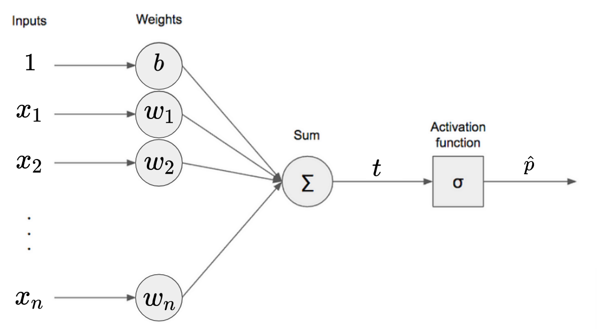
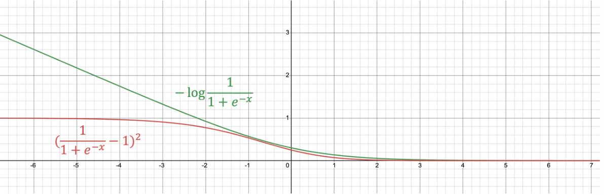

# Logistic Regression

Logistic Regression은 이름과 달리, binary classification task를 위한 모델로서 특정 class에 속할 확률을 출력해준다 (output이 하나의 확률값임).

다음의 순서를 따름.

1. Regression으로 어떤 score $t$ (=logit score)를 구함 
2. 해당 score를 logistic function의 입력값으로 넣으면 0~1사이의 확률값 $\hat{p}$이 나옴.
3. 해당 확률로 classification (binary classification)

참고 : [Logit을 통한 Logistic Regression 유도](https://dsaint31.tistory.com/320)

> 이 문서는 Logistic Regression을  
> Bernoulli Distribution에 기반한 Maximum Likelihood Estimation의 관점으로 해석하여  
> DL에서의 binary classification model에 대한 이해로 확장해나가는 것을 목표로 함.

* [ori](https://docs.google.com/presentation/d/1EG6nPMYbYjS4CcCVHSpMDOg7iwlzZLxahb0E9S2LkQg/edit#slide=id.g23bf78dd669_0_0)

## Binary Classification

input $\textbf{x}$가 주어질 경우, 출력이 binary class를 나타내는 task를 binary classification임.

ANN등으로 만들 경우, output이 숫자 하나로 나오며 특정 class에 속할 확률 $\hat{p}$로 나오게 된다. 이는 다른 class에 속할 확률이 $\hat{q}=1-\hat{p}$임을 의미하기도 한다.

해당 task에 대해 label은 $y \in \{0,1\}$로 주어져서 $i$번째 input $\textbf{x}^{(i)}$에 대응하는 label $y^{(i)}$는 0 또는 1 중의 하나가 된다.

## Posterior probability로 살펴본 Binary classification.

binary classification model의 output이   
**$\hat{y}$가 1일 확률 $\hat{p}$** 는  
logistic regression의 경우 다음과 같이 주어진다.

$$\hat{p}=h_{\boldsymbol{\theta}}(\textbf{x})=\sigma(\textbf{x}^T\theta)$$

* $h_{\boldsymbol{\theta}}( \cdot )$ : hypothesis. model을 나타내는 function으로 model의 parameters가 $\boldsymbol{\theta}$임을 의미.
* $\hat{p}$ : 1에 속할 확률. model이 예측한 결과이므로 hat이 씌어짐.
    * logistic regression의 output임.
* $\sigma( \cdot )$ : logistic function.

이 $\hat{p}$는 $\textbf{x}$와 $\boldsymbol{\theta}$가 주어졌을 때, $\hat{y}=1$일 일종의 사후확률(posterior probability)이며 해당 확률이 0.5 이상이며 $\hat{y}=1$이라고 판정하고 아니면 $\hat{y}=0$이라고 판정한다고 볼 수 있음.

이를 다음과 같이 표기할 수 있다.

$$p(y=1 | \textbf{x}) \approx \hat{p}(y=1 | \textbf{x}; \boldsymbol{\theta}) = h_{\boldsymbol{\theta}}(\textbf{x})$$

이는 model의 (trainable) parameters $\boldsymbol{\theta}$는 

* training dataset $\left\{(x^{(i)},y^{(i)})| i=1, \dots, M \right\}$에서 model로부터 얻는 posterior probability distribution $\hat{p}(\hat{y}=1| \textbf{x}; \boldsymbol{\theta})$가 
* 실제 training dataset의 확률분포 $p(y=1 | \textbf{x})$에 가장 비슷하도록 조정됨을 의미한다.

## 모델이 정답을 맞출 확률 : Bernoulli Distribution

모델이 답을 맞출 확률 $p$는 다음과 같이 정의할 수 있다.

$$p(y^{(i)}|\textbf{x}^{(i)};\boldsymbol{\theta})=(\hat{p}^{(i)})^{y^{(i)}}(1-\hat{p}^{(i)})^{1-y^{(i)}}$$

* $p(y^{(i)}|\textbf{x}^{(i)};\boldsymbol{\theta})$는 주어진 $i$번째 input $\textbf{x}$와 현재 model parameters $\boldsymbol{\theta}$ 하에서 모델이 정답(label) $y^{(i)}$를 출력할 확률을 의미함.
* $\hat{p}=\sigma(\textbf{x}^T\boldsymbol{\theta})$ 는 logistic regression의 출력으로 $\hat{y}=1$이 될 확률임.

이는 $p$가 ***Bernoulli random variable의 distribution*** 을 따름을 보여줌 (위의 식은 Bernoulli distribution의 PMF임).

* ref. : [Berolli distribution에 대해서](https://dsaint31.tistory.com/582)

**label $y^{(i)}=0$인 경우**
: output $\hat{p}$가 0에 가까울수록 정답에 가까운 것이므로 likelihood가 1에 가까워지고, 반대인 경우엔 likelihood가 0에 가까워지므로 model의 결과가 얼마나 정확한지를 의미함.

**label $y^{(i)}=1$인 경우**
: output $\hat{p}$가 1에 가까울수록 정답에 가까운 것이므로 likelihood가 1에 가까워지고, 반대인 경우엔 likelihood가 0에 가까워지므로 model의 결과가 얼마나 정확한지를 의미함.

> bernoulli random variable은 0 또는 1을 값으로 가지는 discrete random variable. Binary classification가 Bernoulli trial의 정의와 일치하기 때문임.

달리 말하면 model의 output (=종속변수)가 Bernolli probability distribution을 따른다고 볼 수 있음.

위의 $p(\hat{y}|\textbf{x};\boldsymbol{\theta})$를 likelihood로 삼아 이를 최대화하는 maximum likelihood expectation (MLE)는 다음과 같으며 아 MLE를 통해 likelihood를 최대화 하는 parameters를 구할 수 있게 된다.

> 각 likelihood들의 joint probability를 통해 training dataset의 모든 $M$개의 sample들에 기반한 최적의 parameters $\boldsymbol{\theta}$를 구한다.  
(모델에서 각 sample들이 서로의 class를 결정할 때 각각이 독립이라는 가정에 기반.)  

$$\begin{aligned}\boldsymbol{\theta}&=\underset{\boldsymbol{\theta}}{\text{argmax }} \prod _{i=1}^M p(y^{(i)}|\textbf{x}^{(i)};\boldsymbol{\theta})\\&=\underset{\boldsymbol{\theta}}{\text{argmax }} \prod _{i=1}^M \mathcal{L}(\boldsymbol{\theta}|\textbf{x}^{(i)},y^{(i)})\\&=\underset{\boldsymbol{\theta}}{\text{argmax }} \prod _{i=1}^M (\hat{p}^{(i)})^{y^{(i)}}(1-\hat{p}^{(i)})^{1-y^{(i)}}\end{aligned}$$

* $\displaystyle \prod _{i=1}^M p(y^{(i)}|\textbf{x}^{(i)};\boldsymbol{\theta})$가 최대화된다는 것은 model이 정답을 맞출 확률이 커진다는 것을 의미함.
* $\boldsymbol{\theta}$를 조절하면 해당 확률은 변하며, 각각의 $\boldsymbol{\theta}$에 따른 해당 확률값들을 모두 더할 경우 1이 되진 않음 (물론 값이 클수록 가능성은 커짐) : 때문에 likelihood라고 부르며 $\mathcal{L}$로 표기하기도 함.
* 이는 $\hat{p}=\sigma(\textbf{x}^T\boldsymbol{\theta})$ 는 logistic regression의 출력으로 $\hat{y}=1$이 될 확률임에 기반.

ref. : [likelihood (우도)](https://dsaint31.tistory.com/317)

## Negative Log-Likelihood

MLE는 utility function을 사용하므로 최대화가 목표이나, loss function으로 이를 바꾸면 최소화의 문제로 바뀜.

위의 likelihood를 loss function으로 바꾸면 `-` 기호를 붙여주면 된다. (-1을 곱하면 utility function을 loss function으로 변경하게 됨)

그리고 likelihood를 training dataset의 모든 샘플에 대해 처리를 하면 각 likelihood를 곱해야 하는데, 이보다는 더해나가는게 편하므로 log를 취해주는 경우가 일반적임.

이같은 방식을 가르켜 Negative Log Likelihood 라고 부름.

* Negative : loss function으로 삼아 최소화 문제로 변경.
* Log : $\prod$ 대신 $\sum$을 사용하기 위해.

이를 통해 얻은 Objective function (=loss function) $J$는 다음과 같음.

$$J(\boldsymbol{\theta}) = -\frac{1}{m} \sum_{i=1}^m \left[ y^{(i)}\log \left(\hat{p}^{(i)}\right)+ (1-y^{(i)})\log\left(1-\hat{p}^{(i)}\right)\right]$$

* $J(\boldsymbol{\theta})$는 loss function이 parameter를 독립변수로 삼는 함수임을 의미함.

 

지금까지 살펴본 내용은 다음을 의미함.

* binary classification인 logistic regression은 일종의 MLE라고 볼 수 있다.
* 해당 MLE는 확률분포가 Bernoulli Distribution이라는 것을 기반으로 한다.
* Likelihood objective function을 Negative Log Likelihood로 바꾸어서 사용한다.

> DL에서 binary classification에서 이용하는 cross-entropy 와 위의 Negative Log Likelihood 를 살펴보면 매우 유사함을 알 수 있음. 

참고로 위의 loss function은 linear regression (=logistic activation이 없는 경우)과 달리 closed form solution이 알려져 있지 않음. 

* Normal equation과 같은 analytic method로 최적의 parameter를 한번에 구할 수 없음.
* non-linear는 거의 대부분 쉽게 풀리지 않는다. ==;;

하지만, 위의 loss function은 convex function임.

* Gradient Decent를 사용할 경우 global minimum에 해당하는 parameters를 구할 수 있음을 의미함. 

## Logistic cost function partial derivatives

loss function $J(\boldsymbol{\theta})$를 $j$번째 parameter $\theta_j$에 대한 partial derivatives는 다음과 같음.

$$\dfrac{\partial}{\partial \theta_j}J(\boldsymbol{\theta})=\frac{1}{M}\sum_{i=1}^M \left( \color{red}{\sigma \left( \boldsymbol{\theta}^\text{T}\textbf{x}^{(i)}\right) - y^{(i)}}\color{black}\right)\color{blue}{x_j^{(i)}}$$

* $M$ : training set에서의 instance 수.
* 각 instance에 대해,
    * prediction error (red)를 구하고
    * 여기에 해당하는 input vector의 $j$ feature (blue)를 곱하고
* 이를 training set의 모든 instance에 대해 averaging.

이처럼 gradient $\nabla_{\boldsymbol{\theta}}J(\boldsymbol{\theta})$를 구하고, Gradient Decent를 통해 parameter를 구해나가면 logistic regression의 training이 이루어짐. 

## Logistic Regression 과 ANN.

Logistic Regression은 ANN의 관점에서 보면 logistic activation의 single layer fully connected layer임 (loss function은 cross-entropy). 

* 앞서 살펴본 negative log likelihood object function은 convex하기 때문에  global minimum을 구하는게 보장된다. (single layer인 경우에는)
* 단, 여러 layer를 쌓는 경우 convexity는 유지되지 않는다.
    * DL에서 convexity가 유지되는 경우는 거의 없다고 봐도 된다. ㅠㅠ
    * 하지만 DL로 구해진 solution들은 global minimum이라는 보장은 없으나 실제로 task를 수행하는데 충분한 성능을 보임.

> 달리 말하면, 이 single layer FCN도 negative log likelihood를 object function으로 삼은 Bernoulli Distribution에 기반한 MLE의 일종으로 해석가능함을 의미함.  

$\boldsymbol{\theta}$는 실제로 여러 개의 parameter로 구성된 vector이나 이를 scalar로 단순화하고 logistic regression의 objective function을 parameter에 대해 그리면 convex임을 확인 가능함 (input 도 scalar로 단순화하고 이는 고정시킴).

single fully connected layer 로 구현할 경우, loss function을 regression의 경우처럼 Mean squared loss로 삼을 수도 있다.

$$\text{MSE}=\left(\frac{1}{1+e^{-\sum_{i=1}^{N}\theta_i x_i}}-1\right)^2$$

하지만 이경우 아래 그림에서 보이듯이 MSE는 convexity도 성립하지 못하며, loss function의 최대값 (기껏해야 1)도 제한되는 단점이 있음을 확인할 수 있다. (negative log의 경우 loss function은 최대값이 무한대까지의 범위를 보임)

* 이는 매우 틀린 오답을 현재 parameters의 모델이 보일 경우, loss 가 얼마나 커질 수 있는지를 보여줌.
* 큰 오차에서는 가급적 큰 loss를 가져야 함.
* 때문에 MSE의 경우, 오차가 큰 초반 epoch 초반에 weight들이 최적의 값으로 빠르게 변화하지 못하는 단점을 가짐.

때문에 binary classification task를 수행하는 ANN에서 MSE보다는 cross-entropy를 선호한다.

수학적으로 비교할 경우, weight와 bias에 대한 loss function의 partial derivative를 확인해보면 왜 MSE가 적절치 않은지를 확인할 수 있음.

아래는 MSE의 partial derivative임.  
앞서 보였던 logistic regression loss의 경우(=Cross entropy cost)와 달리 $\color{red}{\sigma^\prime \left(\boldsymbol{\theta}^\text{T}\textbf{x}^{(i)}\right)}$ term이 중간에 추가되어 있는데, 이 sigmoid의 미분으로 인해 partial derivative가 감소하게 되고 이는 back-propagation에서 효과적인 training에 방해가 됨.

$$\dfrac{\partial}{\partial \theta_j}J(\boldsymbol{\theta})=\frac{1}{M}\sum_{i=1}^M \left( {\sigma \left( \boldsymbol{\theta}^\text{T}\textbf{x}^{(i)}\right) - y^{(i)}}\right)\color{red}{\sigma^\prime \left(\boldsymbol{\theta}^\text{T}\textbf{x}^{(i)}\right)}\color{black}{x_j^{(i)}}$$

* logistic의 derivative는 0.25를 max로 가지는 normal distribution의 모양임.
* tanh의 경우, logistic보다 큰 derivative를 가지고 있어서 학습에 보다 유리한 것으로 알려짐.