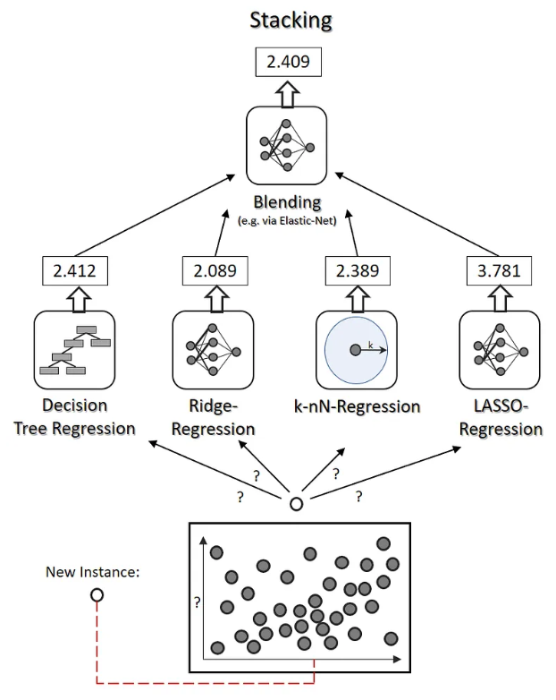

# Stacking

Ensemble의 한 종류이며, Stacked Generalization의 abbreviation.

meta-learner의 개념을 도입하였기 때문에 mata-learning이라고도 불림.

기본 아이디어는 

* 각 model의 예측 결과(predictino)들의 aggregation을 
* 간단한 voting 과 같은 function이 아닌 
* **trainable한 model을 통해 수행** 하는 것임.

여기서 aggregation을 담당하는 model을 가르켜 ***blender*** 혹은 ***meta-learner*** 라고 부른다.

* blender의 경우, aggregation의 대상이 되는 model들의 prediction(예측결과)들을 training data로 이용한다.
* 때문에 hold-out set (aggregatation 대상이 되는 model들의 훈련에 사용되지 않은 별도의 set)을 이용하여 학습하거나, (이 경우만을 stacking이라고 제한하기도 함)
* CV로 aggregation 대상이 되는 model들이 훈련시키고, evaluation set들의 예측결과를 모아서 훈련하는 방식(hold-out)으로 학습한다. (이같은 방법을 blending이라고도 부름)

bagging이나 boosting이 일반적으로 같은 type의 models를 weaker learner로 사용하는 것과 대조적으로 **완전히 다른 type의 model들을 combine하는 경우가 Stacking에선 일반적** 이다. 

> attractive approach이나, 실제 사용이 매우 번거롭다. 
> 때문에 bagging이나 boosting에 비해 많이 사용되지 않는 편이다.

## 읽어보며 좋은 자료들.

* [Stacked Generalization 관련 URL](http://machine-learning.martinsewell.com/ensembles/stacking/)
* [Stacking -Ensemble meta Algorithms for improve predictions](https://medium.com/ml-research-lab/stacking-ensemble-meta-algorithms-for-improve-predictions-f4b4cf3b9237)

