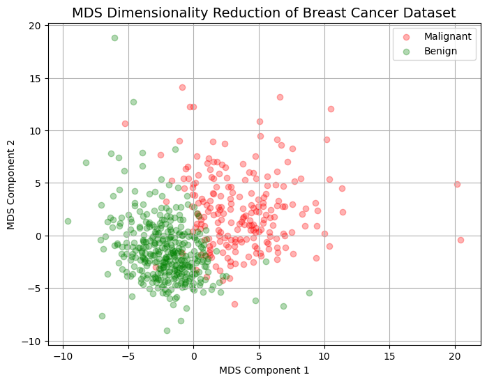

# Multi-Dimensional Scaling (MDS) 

**Reduces dimensionality** while trying to preserve *the **distances** between the instances*.

- Unsupervised Learning
- Dimensionality Reduction (and Transductive Algorithm)
- Projection based algorithm but non-linear

> Inductive model의 앞단에서 dimensionality reduction을 위해 사용되는 PCA(데이터의 variance를 유지)와 달리, **MDS** 는 주로 **데이터 간의 distance (~similarity)** 을 보존하면서 차원 축소를 하기 때문에 데이터의 시각화나 탐색적 분석에 사용됨.  
> 즉, MDS는 inductive model을 학습시키는 데 있어 PCA처럼 직접적인 전처리 방식으로 사용되기보다는, 데이터의 구조를 이해하고 시각화할 때 더 적합한 transductive model로 일반적으로 받아들여짐.
> 

1964년에 제안된 방법: `LLE`등을 이해하기 위한 stepping stone으로 사용됨.

---

## 정성적 설명

모든 data points (= nodes)가 원래의 공간에서 이루고 있는  pairwise distance를 유지하는 manifold를 구함. 

- 모든 pairwise distance를 matrix $D$로 만들고
- 변환된 공간에서도 최대한 pairwise distance가 $D$와 유사하도록 하는 mapping function을 구함.
    - Classical MDS의 경우, $D$에 대해 eigenvalue decomposition을 통해 matrix factorization을 수행하여, 저차원 공간으로의 embedding을 얻음.
    - 이같은 Matrix Factorization을 통한 저차원으로의 projection을 수행하는 방식들은 inherently transductive임.
    - 이는 새로운 node가 추가도리 경우, 이를 추가하여 다시 training하지 않을 경우 generalization을 보장하지 않음을 의미함.
- 구해진 mapping function을 `embedding` 이라고도 부름.

$$
\underset{Y}\argmin \sum_{i<j}(\|\textbf{y}_i-\textbf{y}_j\|
_2-\sigma_{ij})^2
$$

where

- $\sigma_{ij}$ : $\textbf{x}_i$와 $\textbf{x}_j$간의 거리.

Multidimensional Scaling은 다음의 가정에 기반을 둠.

- **거리가 가깝다는 것**은 **유사** 하다는 뜻
- **거리가 멀다는 것**은 **유사도가 낮다** 는 뜻

즉, MDS는 

- $n$개의 Data sample간의 distance (or proximity, 근접도)를 나타내는 $n \times n$ matrix 를 계산하고,
- 이를 가장 잘 보존하는 lower dimension에서의 coordinate를 찾아냄.

---

## 단점

MDS는 모든 pairwise distance 를 유지하려고 하기 때문에 
loss function에서도 알 수 있듯이 
**가까운 거리에서의 차이보다 먼 거리에서의 차이에 보다 큰 영향**을 받게 됨.

> 원래 pairwise distance가 10이었는데 변환된 공간에서 5로 변경된 경우와,
원래 pairwise distance가 1000 이었는데 변환된 공간에서 995로 변경된 경우가 있다고 하자. 
일반적으로 전자의 5 차이는 매우 큰 error 이고 후자의 5는 작은 error라고 봐야하지만 
MDS에서는 이 둘을 같다고 처리.
> 

더욱이, **원본 데이터가 *high dimensional space*에 존재**할 경우, 

- 가까운 이웃간의 거리는 low dimensional space의 경우와 마찬가지로 의미상 으로 중요하지만
- 지나치게 큰 거리를 가지고 있는 data sample pair 는 큰 의미가 없는 경우가 많음(high dimensional space 로 갈수록 이런 경향이 커짐).
- 문제는 이처럼 큰 의미가 없는 두 data sample pair 의 거리에 대한 값 자체가 매우 크며 MDS는 이를 distance가 원래 작은 경우와 구분하여 처리를 못한다는 점임.
- MDS의 loss function에서는 거리의 차가 작아지는 것만을 고려하므로 이처럼 ***“실제로 중요치 않고 값만 큰 거리값들”*** 이 loss function에 지나치게 큰 영향력을 가짐.
    - ***“실제로 중요치 않고 값만 큰 거리값들”  = 큰 의미를 거의 가지고 있지 않는 data sample pair에 해당.***
- 즉, 그 거리의 절대적 크기 자체가 가지고 있는 값의 크기 만큼의 큰 의미를 지니지 못하는 high dimensional space의 경우, MDS는 높은 성능을 보이기 어려움.

> High dimensional space의 경우, 데이터의 의미있는 구조가 데이터 간의 상대적 유사성, 순위 등에 의해 결정되고, 단순한 Euclidean distance로 설명되기 어려울 수 있음.  
> “데이터의 구조”라는 개념은 데이터 간의 **내재적인 관계** 나 **패턴** 을 의미함.  
> 이 관계나 패턴은 데이터 포인트들이 어떤 방식으로 서로 연결되고 영향을 주는지에 대한 정보를 가지고 있음. 즉, 데이터의 “구조”는 단순히 **유클리드 거리** 와 같은 물리적 거리뿐만 아니라, 데이터 간의 **상대적 유사성**, **순위**, 또는 **관계** 에 대한 다양한 방식으로 정의됨.
> 

큰 의미를 전혀 가지지 않고 있는 data sample pair 간의 거리가 의미가 없음에도 무의미하게 큰 값을 가져 loss function에 큰 영향을 주게 됨.

- 일반적으로 **dimensionality reduction에서 중요한 것은 locality 정보** 임.
- **MDS는 오히려 locality 정보에 큰 가중치를 부여하지 못하는 한계** 를 가짐.
    - MDS는 구조에 대한 정보를 전혀 가지지 않는 무의미한 큰 값을 가지는 pairwise distance에 집중하다보니
    - 실제로 구조에 대한 정보를 가지고 있는 더 중요한 가까운 이웃간의 거리를 무시하게 되는 문제점을 가짐.

다른 단점은 MDS는 원래의 데이터 공간이 **metric space일 것이라는 기반** 을 두고 있는데,  high dimensional의 경우 이 가정이 성립하지 않는 경우가 많음:

- high dimensional space의 경우,  $\sigma(a,b),\sigma(a,c)$가 가깝더라도 $\sigma(b,c)$가 매우 먼 경우가 많음.
    - 이 같은 경우, metric space가 아니게 됨.
    - 즉, high dimensional feature의 경우 metric space 가 아닐 확률이 매우 크며,
- metric space가 아니라면, MDS는 적절한 방법이 아니다.

> 참고자료: [[위상수학] 2. 거리공간(Metric Spaces)](https://blog.naver.com/dongmin9313/221795352664)

---

## Non-metric MDS

(원 데이터의)거리를 유지하면서 낮은 차원으로의 projection을 찾는것이 Metric MDS의 목적이라면, 

**Non-metric MDS** 에서는 **거리의 랭킹** 을 유지하면서 낮은 차원으로의 projection을 찾는 것이 목표임.

Non-metric MDS의 장점으로는 결과들이 feature scaling에 상관없이 유지된다는 점임. 

- Non-metric MDS의 경우 어떠한 단조적인(monotonic) 변환을 주더라도 결과가 바뀌지 않음.

Metric MDS는 원본 데이터 공간의 모든 거리 관계를 저차원 공간에서 완벽하게 보존하지 못한다는 한계가 있고 Euclidean distance 외의 distance function에서의 사용이 어려움. 

- 이에 비해 Non-metric MDS는 거리의 정확한 값보다는 순서(랭킹)를 유지하는 데 초점을 맞추어 더욱 유연하게 적용이 가능하며, 오직 거리의 순서 정보만 필요하므로 데이터의 상대적 관계를 유지하는 데에 목적을 둔다.

또한 Metric MDS는 상대적으로 빠르며, Non-metric MDS는 다소 느리다는 차이가 있다.

> 하지만, 원본 데이터 공간이 metric space라면 Metric MDS가 훨씬 좋은 결과를 보인다.
> 

---

## S-stress: embedding의 성능 비교.

S-stress를 통해 변환된 좌표의 적합성을 측정함.

$$
S=\sqrt{\frac{\sum^n_{i=1}\sum^n_{j=i+1}(d_{ij}-\hat{d}_{ij})^2}{\sum^n_{i=1}\sum^n_{j=i+1}(d_{ij})^2}}
$$

- $\hat{d}_{ij}$ : MDS로 구한 좌표에서의 거리
- $n$ : # of samples.

낮을수록 우수하며 다음과 같이 표현됨.

- `Stress => 20%` ⇒ Goodness of fit = poor
- `Stress => 10%` ⇒ Goodness of fit = fair
- `Stress => 5%` ⇒ Goodness of fit = good
- `Stress => 2.5%` ⇒ Goodness of fit = excellent
- `Stress => 0%` ⇒ Goodness of fit = perfect

---

# Scikit-Learn 을 이용한 예제

[관련 ipynb파일](https://gist.github.com/dsaint31x/c43fc1b0be4a325515734063a4bd0109)

```python
from sklearn.manifold import MDS
from sklearn.datasets import load_breast_cancer
from sklearn.preprocessing import StandardScaler

# 유방암 데이터셋 로드
data = load_breast_cancer()
X = data.data    # 특성 데이터 (30개의 특성)
y = data.target  # 라벨 데이터 (0 = malignant, 1 = benign)

# 데이터 표준화 (MDS는 거리 기반이므로, 스케일링이 중요함)
scaler   = StandardScaler()
X_scaled = scaler.fit_transform(X)

mds = MDS(
    n_components=2,
    n_init=10, 
    metric = True,              # metric space에서 동작시 True 
    dissimilarity='euclidean',  # distance를 재는 방식 지정. (사전 계산된 distance matrix를 넣어줄 수도 있음.)
    max_iter=300,               # 최대반복횟수 
    eps=1e-6,                   # epsilon. 수렴기준.
    random_state=42,
)
embedding_mds = mds.fit_transform(X_scaled)

```

다음의 코드로 결과 확인 가능함

```Python
# 필요한 라이브러리 불러오기
import numpy as np
import matplotlib.pyplot as plt

def ds_show(embedding):
  # 양성/음성 구분에 따라 다른 색으로 표시
  fig, ax = plt.subplots(figsize=(8, 6))
  ax.scatter(embedding[y == 0, 0], embedding[y == 0, 1], color='red',   label='Malignant', alpha=0.3)
  ax.scatter(embedding[y == 1, 0], embedding[y == 1, 1], color='green', label='Benign'   , alpha=0.3)

  # 그래프 꾸미기
  ax.set_title('MDS Dimensionality Reduction of Breast Cancer Dataset', fontsize=14)
  ax.set_xlabel('MDS Component 1')
  ax.set_ylabel('MDS Component 2')
  ax.legend()
  ax.grid(True)
  plt.show()

ds_show(embedding_mds)
```

<figure markdown>
{width="500"}
</figure>

S-stress를 구하는 코드는 다음과 같음.

```Python
# S-stress 계산 함수
def calculate_s_stress(original_data, embedded_data):
    """S-stress를 계산하는 함수"""
    original_distances = np.linalg.norm(original_data[:, np.newaxis] - original_data, axis=2)
    embedded_distances = np.linalg.norm(embedded_data[:, np.newaxis] - embedded_data, axis=2)
    
    stress = np.sum((original_distances - embedded_distances) ** 2)/(np.sum(original_distances ** 2))
    s_stress = np.sqrt(stress)
    return s_stress

# S-stress 계산
s_stress_metric = calculate_s_stress(X_scaled, embedding_mds)
```

18% 정도로 fair 수준을 보여준다.

---

# References

[머신러닝 - MDS (Multi Dimensional Scaling)](https://velog.io/@swan9405/MDS-Multidimensional-Scaling)

https://lovit.github.io/nlp/representation/2018/09/28/mds_isomap_lle/

https://peanut159357.tistory.com/51

https://blog.naver.com/PostView.nhn?blogId=sw4r&logNo=221034787271&parentCategoryNo=&categoryNo=157&viewDate=&isShowPopularPosts=false&from=postView