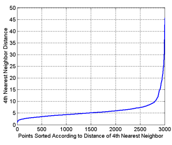
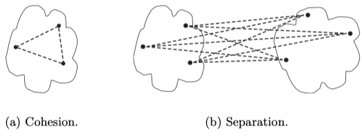
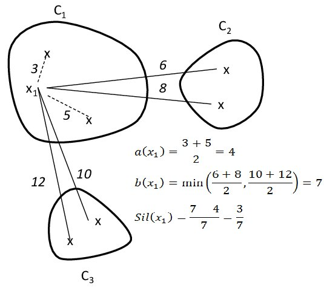

# Clustering

feature space에서 가까운 sample들을 모아 하나의 cluster로 묶는 task.

* input : label이 되어있지 않은 training data
* output : 유사한 sample들이 묶여있는 cluster
* hyper-parameter : cluster 를 몇개 지정할지 (명시적으로 cluster의 수를 입력받는 경우도 있으나 간접적으로 이를 결정하는 값( self simialrity등)을 요구하기도 함)를 보통 hyper-parameter로 요구.

Unspervised Learning의 대표적인 Task임.

> 일부 문헌에서는 unsupervised learning의 task중에서 특정 application에 상관없이 unsupervised learning algorithm이 해결해야하는 ***general task*** 로서 clustering과  density estimation, dimension transformation을 언급한다.

---

## k-Means

https://scikit-learn-extra.readthedocs.io/en/stable/modules/cluster.html#k-medoids

k-means는 클러스터에 속한 멤버의 평균값을 cluster center로 사용함. k-Means의 변형인 k-medoids는 cluster에 속한 data point들 중에서 median에 해당하는 data point를 cluster center로 지정하는 차이가 있음.

### 고려할 점.

* k-Means는 적절한 `k`의 값을 골라야 함.
* 초기 cluster center 지정에 따라 최종 결과가 매우 크게 영향을 받음. 
* 각, 그룹의 size나 density가 다를 경우 부정확한 결과가 나오기 쉬움.
    *  size차이나 density가 많이 나는 경우, `k`값을 크게 하여 여러 cluster로 나누고 이들을 다시 합치는 접근법이 효과적. 단, 여러 cluster를 합치는 방법은 Hierachical Clustering 등의 여러가지가 있을 수 있음.


---

## Affinity Propagation Clustering

Ref.: [Brendan J. Frey et al., “Clustering by Passing Messages Between Data Points”, Science Feb. 2007](https://utstat.toronto.edu/reid/sta414/frey-affinity.pdf)

각 데이터 샘플들이 서로에게 메시지를 보내면서 일종의 투표를 수행하여 자신의 대표가 될 수 있는 데이터 샘플을 선택하여, 선택된 데이터 샘플을 중심으로 하여 다양한 크기의 cluster 가 생성되는 기법.

단점은 계산 복잡도로 $O(N^2T)$를 가짐. 여기서 $N$은 샘플 수, $T$는 알고리즘 반복 횟수이다. 공간복잡도는 $O(N^2)$​​​​이다. 매우 복잡도가 높기 때문에 작은 데이터에 적합하다.

모든 데이터 샘플 간에 similarity를 계산하고 이를 기반으로 각 샘플  pair 에서 responsibility $r_{ik}$와 availability $a_{ik}$를 계산 (이들을 메시지를 보내는 것으로 표현)하고 이들로 구성된 2개의 matrix를 반복적으로 업데이트하여 clustering을 수행함.

> k-Means와 마찬가지로 클러스터 형태가 둥글어야 하는(globular) 가정에 기반하고,  k-medoids와 동일하게 cluster center를 data point 자체(exemplar)를 사용한다. 

> k-Means는 Not-flat geometry ( 데이터가 존재하는 부분 공간이 선형이 아닌 굽어져 있는 경우) 공간처럼 euclidean distance를 쓰기 어려운 경우에는 성능이 그리 좋지 않음 반면, AP는 nearest-neighbor graph여서 보다 나은 것처럼 scikit-learning에선 언급되고 있으나, 역시 높은 성능은 아닌 듯 하다.

### similarity 계산

sample $i$와 $j$의 similarity는 다음과 같은 Euclidean distance의 제곱에 음수를 취한 것임.

$$
s_{ik}= \|\textbf{x}_{i}-\textbf{x}_{j}\|^2_2
$$

여기서 $s_{kk}$는 위의 식으로는 0이지만, hyper-parameter로 주어진다. 0보다 작은 음수값으로 주어지면 이 값이 작을수록 결과로 나오는 cluster의 수가 적어지게 된다.

> \# of cluster를 명시적으로 설정하지 않고, $s_{kk}$를 통해 결과에서 나오는 cluster 수를 제어한다.  

보통 similarity matrix의 최소값으로 설정되지만, median, 또는 maximum으로 설정될 수 있음 (커질수로 cluster수가 증가)

### responsibility 계산

>  sample $\textbf{x}_k$
​​​​​가 sample $\textbf{x}_i$
​​​​​에 대해 얼마나 exemplar로 적합한지를 나타냄.

responsibility $r_{ik}$는 sample $\textbf{x}_i$를 기준으로 하여 sample $\textbf{x}_k$ 가 sample $\textbf{x}_i$의 대표가 되어야 하는 ^^정량적 근거(sklearn 에선 the accumulated evidence라고 기술)^^ 를 구한 것으로 sample $\textbf{x}_i$를 기준으로 target sample $\textbf{x}_k$ 와의 simialarity와  target sample $\textbf{x}_k$를 제외한 나머지 sample들간의 affinity를 고려한다.

식은 다음과 같다.

$$r_{ik}=s_{ik}-\underset{k^\prime \ne k}{\max}(a_{ik^\prime}+s_{ik^\prime})$$

responsibility $r_{ik}$는 

* sample $\textbf{x}_i$와 sample $\textbf{x}_k$간의 similarity가 높을수록 커지고,
* sample $\textbf{x}_i$가 다른 sample $\textbf{x}_{k^\prime}$과 affinitiy, $(a_{ik^\prime}+s_{ik^\prime})$가 클수록 작아진다.
* 즉 sample $\textbf{x}_i$ 주변에 exemplar로 적합한 sample $\textbf{x}_k^\prime$ 이 있다면, sample $\textbf{x}_k$ 는 $\textbf{x}_i$에 대해 낮은 responsibility를 가진다. 
* responsibility $r_{ik}$가 양수이면서 커지면, sample $\textbf{x}_k$ 가 대표가 될 가능성이 커짐.

responsibility $r_{ik}$는 responsibility matrix를 생성한다.

### availability 계산

availability $a_{ik}$는 sample $\textbf{x}_k$를 기준으로 하여 sample $\textbf{x}_i$ 에게 본인이 대표가 되어야 하는 정량적 근거를 구한 것이다. 이는 sample $\textbf{x}_k$과 자신을 제외한 다른 sample들로부터 responsibility를 다 더한 값과 0중에서 작은 값에 해당한다 (대부분 음수).

$$a_{ik}=\min \left(0, r_{kk}+\sum_{i^\prime \notin \{i,k\}}\max(0,r_{i^\prime k}) \right) $$

$r_{kk}$ 는 자기자신의 대표성에 해당한다.

$$a_{kk}=\sum_{i^\prime = i,k}\max(0,r_{i^\prime k})$$

### 순서

0. responsibility matrix 와 availability matrix 를 모두 0으로 초기화
1. similarity matrix계산
2. responsibility matrix 계산
3. availability matrix 계산
4. responsitibility matrix 와 availability matrix가 수렴할 때까지 2,3번 반복.
5. responsitibility matrix 와 availability matrix를 더해 criterion matrix를 계산하고 주대각성분 $r_{kk}+a_{kk}$ 가 0 이상이 sample $\textbf{x}_k$가 cluster의 대표가 된다.

### sklearn.cluster.AffinityPropagation

* Gist's [ipnb파일](https://colab.research.google.com/gist/dsaint31x/9aba90db977631aa1d2776623b16a1ec/ml_affinity-propagation-clustering-algorithm.ipynb)

#### Hyper-parameters

`Preference`
: 각 data point들이 얼마다 exemplar로 선택될 가능성이 높은지를 지정하는 것으로, 높은 값을 부여할수록 더 많은 data point들이 exemplar가 되어서 그 결과 작은 클러스터가 더 많이 생기게 됩니다. 반대로 preference가 작을수록, 적은 수의 사이즈가 큰 클러스터가 만들어지는 경향이 있습니다.

> Preference는 위의 수식에서 Similarity Matrix의 main diagonal $s_{kk}$을 가르키고 있음.

**Damping factor** $\lambda$
: 반복되는 Responsiblity Matrix와 Availability Matrix를 업데이트에서 Damping factor는 Exponential weighted average를 적용할 때 필요한 hyper parameter임. Exponential weighted average를 적용하여 noise에 좀 더 robust하게 해주며, 동시에 값들이 numerical oscillations (진자현상)을 보이지 않도록 막아줄 수 있다. 적절한 damping factor를 지정할 경우 보다 빨리 그리고 안정적으로 수렴하게 됨.

$$
\begin{aligned}r_{t+1}(i, k) = \lambda\cdot r_{t}(i, k) + (1-\lambda)\cdot r_{t+1}(i, k) \\
a_{t+1}(i, k) = \lambda\cdot a_{t}(i, k) + (1-\lambda)\cdot a_{t+1}(i, k)\end{aligned}
$$

### Summary of Affinity Propagation Clustering

* k-Means와는 다르게 `k`를 지정하지 않아도 된다는 장점이 있음.
* 하지만, `preference`의 조정이 명시적인 `k` 지정보다 어려울 수 있음.
    * 그리고 k-Means에서 `k`를 결정하는 문제는 효과적인 heuristic 한 방법이 있어서 실제로 k-Means보다 쉽다고 하기 어려움.
* 클러스터의 경계를 나눌 때는 k-Means처럼 centroid 사이의 가운데 지점을 기준으로 나누는 것이 아닌, 각 클러스터의 크기와 주변 점들과의 affinity를 고려해서 클러스터 경계를 나눔. : 실제 사용이 더 어려움. 

요약하면, 직관적인 k-Means 에 비해, 사용이 까다롭다. 때문에 간단한 경우에는 k-Means가 아직도 사용되지만, 실제로 Affinity propagation은 많이 사용되질 않는 편이다.

---

## Density-Based Spatial Clustering of Applications with Noise (DBSCAN)

density base clustering의 대표적 알고리즘.  
Noise에 강하고 (noise point로 지정되면 아예 cluster에서 빼버림) 다양한 모양과 크기의 cluster들을 처리할 수 있는 장점을 가짐.

* Density : 지정된 반경(Eps) 내의 데이터 포인트의 갯수
* Core point : 해당 점을 중심으로 Eps 내에 존재하는 데이터 포인트의 갯수가 지정된 Density (=`MinPts`)를 초과하는 경우 Core point라고 부름.
* Direct Density Reachable (DDR) : $\textbf{x}$ 가 core point $\textbf{c}와의 거리가 Eps 이내라면 DDR이라고 칭함.
* Density Reachable (DR) : DDR point들로 구성된 chain으로 연결된 경우 DR이라고 칭함.
* Border point : 해당 점을 중심으로 Eps 내에 존재하는 데이터 포인트의 갯수가 지정된 Density (=`MinPts`)보다 적지만, Core point와의 거리가 Esp 이내인 경우.
* Noise point : Core point도 아니고, Border point도 아닌 데이터 포인트.


### Algorithm

```c
current_cluster_label <- 1
     for all core points do
            if the core point has no cluster label then
                current_cluster_label <- current_cluster_label+1
                Label the current core point with cluster label current_cluster_label
           end if
           for all points in the Eps-neighborhood, except i-th point itself do
                  if the point does not have a cluster label then
                      Label the point with cluster label current_cluster_label
                  end if
           end for
       end for
```

1. hyper parameter로 `Eps`와 `MinPts`가 주어짐.
2. Training set에서 seed 로 Core point의 조건을 만족하는 임의의 점을 선택.
3. seed 로부터 density를 계산하고, 이로부터 core point들과 border point들을 구분해내고, border point를 다 구한 후에 나머지 데이터 포인트를 noise point로 설정.
4. Eps내의 core point들을 모두 연결.
5. 연결된 core point들은 하나의 cluster를 이룸.
6. 모든 border point들은 하나의 cluster에 속해야 함. (여러 cluster에 걸쳐있을 경우, 반복과정 중 먼저 할당된 cluster에 속하도록 처리.)

### DBSCAN: Eps 및 MinPts 결정

* cluser 내의 각 포인트에 대해 $k$ nearest neighbor와의 거리가 대략 동일하다는 것을 이용한다.
* noise point의 경우, $k$ nearest neighbors 가 매우 큰 값을 가짐.

위의 성질을 이용하여 모든 데이터 포인트에 대해 $k$ nearest neighbor (k번째 가장 가까운 이웃)에 대한 거리를 구하고, 해당 거리로 sorting을 한 이후, x,y 축에는 데이터 포인트의 갯수와 해당 $k$nearest nedibor distance를 각각 표시하면 아래와 같은 형태의 chart 를 얻게 된다.



이 경우, 적절한 `Eps`가 4에서 10 사이임을 알 수 있다. 

### Weakness

하지만, density가 다양한 data에서는 잘 동작하지 않는다.


* 오른쪽 하단의 경우, DBSCAN이 density가 낮은 곳의 data point들을 모두 noise로 처리한 것을 확인할 수 있다.
* density가 높은 영역에만 집중을 한 결과임.

또한 DBSCAN도 Euclidean distance에 기반을 두고 있으며, 이 때문에 high dimensional dataset에서는 좋은 결과가 나오기 어렵다.


---
## Cluster Validation

`Cluster Cohesion` (군집 응집도)  
: cluster 내에서 속한 sample들이 서로 얼마나 밀접한 관련이 있는지를 within sum of square error (WSSE, WSS)로 측정.  
  
$$\text{WSSE}=\sum_{i}\sum_{\textbf{x} \in C_i} (\textbf{x}-\textbf{c}^\text{center}_i)^2$$

`Cluster Separation` (군집 분리도)  
: 한 cluster 가 다른 cluster 들과 얼마나 잘 구별되는지를 between sum of square error (BSSE, BSS)로 측정.  
  
$$\text{BSSE}=\sum_{i}\sum_{j\ne i} \text{Size}(C_i) (\textbf{c}^\text{center}_i-\textbf{c}^\text{center}_j)^2$$  

where $\text{Size}(C_i)$는 cluster $C_i$의 크기로 보통 속한 샘플의 수를 사용함.



* original : ZZFJILL's [Notes of Cluster Analysis](https://zzfjill.wordpress.com/2020/02/09/notes-of-cluster-analysis/)

`Silhouette Coefficient` (실루엣 계수)  
: cohesion과 seperation을 조합한 silhouette function을 모든 data point에서 개별로 구하고 이들의 평균을 구하여 하나의 숫자로 cluster가 잘되었는지를 나타냄.  
  
$$\text{SC}=\frac{1}{M}\sum^M_{i=1}s(\textbf{x}_i)$$

* Cohension $a(\textbf{x})$ : $\textbf{x}$와, 해당 $\textbf{x}$와 같은 cluster에 속한 데이터 포인트들간의 거리에 대한 평균.
* Separation $b(\textbf{x})$ : $\textbf{x}$와, 해당 $\textbf{x}$와 다른 cluster에 속한 데이터 포인트들간의 거리에 대한 평균.
* Silhouette function, $s(\textbf{x})$ : $s(\textbf{x})=\frac{b(\textbf{x})-a(\textbf{x})}{\max\left\{a(\textbf{x}),b(\textbf{x})\right\}}$
    * $s(x)$는 $[-1,1]$의 range를 가지는데, `-1`은 가장 나쁜 clustering을 의미하고, `1`은 가장 좋은 clustering을 의미함. (`0`은 indifferent에 해당.)
    * `0`은 어느정도 넘어야 clustering이 어느정도 된 것을 의미한다.



* origin : Santhana et al., [Best Clustering Configuration Metrics: Towards Multiagent Based Clustering](https://www.researchgate.net/figure/Derivation-of-the-Overall-Silhouette-Coefficient-OverallSil_fig1_221570710)

`Davis-Bouldin Index`(DBI)  
: 같은 cluseter내에서 평균거리(cohension)와 다른 cluster간의 중심거리(separation)에 대한 일종의 ratio로 계산이 빠르면서도 일관성이 있는 지표로 알려져 있음.  
  
$$
DBI = \frac{1}{k}\sum^k_{i=1} D_i
$$  
    
* $D_i =\displaystyle \max_{j\ne i}\left\{D_{ij}\right\}$
    * $D_{ij}$ : $i$th cluster와 $j$th cluster에 대한 "cluster내 거리(within distance)"와 "cluster간 중심거리(between distance)"의 ratio(비율)
    * $D_i$ : $i$th cluster와 관련된 $D_{ij}$중 최대값.
* $D_{ij} = \frac{\bar{d}_i+\bar{d}_j}{d_{ij}}$
    * $\bar{d}_i$ : $i$th cluster에 대한 중심과 해당 cluster 에 속한 데이터 포인트 간의 평균 거리 = cohension
    * $d_{ij}$ : $i$th cluster와 $j$th cluster의 중심거리 = separation

* 예 : 3개의 cluster 인 경우,
    * $D_{ij}$ 는 $D_{12},D_{13},D_{23}$ 과 같이 3개가 구해짐.
    * $D_i$는 $D_1=\max\left\{D_{12},D_{13}\right\}$, $D_2=\max\left\{D_{23}\right\}$ 과 같이 2개가 구해짐.
    * $k=2$ 이며, $DBI=\text{mean}[D_1, D_2]$임.


## References

* scikit-learn [2.3. Clustering](https://scikit-learn.org/stable/modules/clustering.html)
* Cory Maklin's [Affinity Propagation Algorithm Explained](https://towardsdatascience.com/unsupervised-machine-learning-affinity-propagation-algorithm-explained-d1fef85f22c8)
* 아이리스's [7.55 R에서 Affinity Propagation 군집분석 실시하기
(https://blog.naver.com/PostView.naver?blogId=pmw9440&logNo=222297976432&parentCategoryNo=&categoryNo=7&viewDate=&isShowPopularPosts=true&from=search)
* [Affinity Propagation 살펴보기](https://jaehc.github.io/ml/affinity-propagation/)
* Garrett Poppe's [DBSCAN](https://csc.csudh.edu/btang/seminar/slides/DBSCAN.pdf)
* 이수한 교수님's [데이터전처리: 10장 군집분석(Cluster Analysis)](http://suanlab.com/assets/lectures/dp/10.pdf)