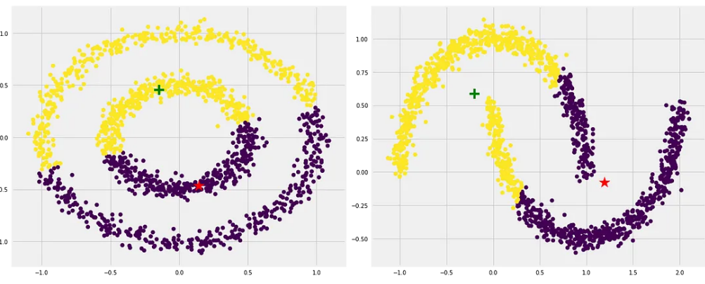

# Clustering (군집)

feature space에서 가까운(=유사한) sample들을 모아 하나의 cluster로 묶는 task.

* input : label이 되어있지 않은 training data
* output : 유사한 sample들이 묶여있는 cluster
* hyper-parameter : cluster 를 몇개 지정할지 (명시적으로 cluster의 수를 입력받는 경우도 있으나 간접적으로 이를 결정하는 값( self similarity등)을 요구하기도 함)를 보통 hyper-parameter로 요구.

> 쉽게 애기하면,  
> 비슷한 data points(sample)를 묶어서 하나의 cluster (군집, group)에 할당하여 분류하는 task임.  
> classification과의 차이는 label의 유무임.

Unsupervised Learning의 대표적인 Task임.

> 일부 문헌에서는  
> unsupervised learning의 tasks에서  
> 특정 application에 상관없이 unsupervised learning algorithm이 해결해야하는 ***general task*** 로서   
> clustering과  density estimation, dimension transformation을 언급한다.

Clustering은 크게 두가지 종류로 나뉨 (cluster를 무엇으로 정의하고 있느냐에 따라 구별된다).

* Hierarchical Clustering
    * 계층적으로 cluster를 나타냄 (cluster와 cluster가 묶여서 상위 cluster를 생성하는 방식) : `agglomerative clustering`
* Non-hierarchical Clustering
    * 특정 centroid(중심점)의 주변에 가까이 모여있는 것을 cluster라고 정의 : `k-means`
    * continuous regions of high density (data points가 밀집되어 있는 연속된 영역)을 cluster라고 정의 : `DBSCAN`

---

## k-Means

ref.: https://scikit-learn-extra.readthedocs.io/en/stable/modules/cluster.html#k-medoids

가장 간단한 clustering algorithm이며, non-hierarchical clustering의 대표임.

* k-means는 클러스터에 속한 멤버의 평균값을 cluster center로 사용함.
* 구현 및 적용이 간단하고 매우 빠른 속도를 보이는 장점을 가짐.

> k-Means의 변형인 k-medoids는  
> cluster에 속한 data point들 중에서 median에 해당하는 data point를 cluster center로 지정하는 차이가 있음.  
> k-medoids가 조금 더 연산량이 많음.

* [medoid란?](https://ds31x.blogspot.com/2023/08/ml-medoid.html)

### 동작방식 ( k=2, 2개의 cluster로 나누는 경우)

1. 랜덤한 2점을 고르고 이를 각 cluster의 centroid(중앙)으로 선정.
2. 현재 선택된 centroids 로부터 나머지 모든 점들의 거리를 계산.
3. 계산된 거리를 바탕으로 가까운 순으로 cluster 를 나눔.
4. 각 cluster의 data point들의 평균치를 계산하여 새로운 centroid로 선정.
5. centroid의 위치가 바뀌지않고 고정될 때까지 2~4 과정을 반복.


### 고려할 점.

* k-Means는 ^^적절한 `k`의 값을 골라야 함.^^
* ***초기 cluster center 지정*** 에 따라 최종 결과가 매우 크게 영향을 받음 (k-medoids 에서 개선). 
* 매우 멀리 떨어져있는 data point나 noise에 취약 (k-medoids에서 개선)
* globular shape를 가정하고 있기 때문에 다른 ***지역적 패턴*** 이 있는 경우에 부정확한 결과가 나오기 쉬움.
* 각 그룹의 size나 density가 다를 경우 부정확한 결과가 나오기 쉬움.
    *  size나 density가 많이 차이나는 경우, `k`값을 크게 하여 여러 cluster로 나누고 이들을 다시 합치는 접근법이 효과적. 단, 여러 cluster를 합치는 방법은 Hierarchical Clustering 등의 여러가지가 있을 수 있음.
* high dimension data에서는 효과가 떨어짐. (사전에 PCA등으로 dimensionality reduction을 수행이 필요)

다음 그림은 각 cluster의 size가 다른 경우(붉은색 cluster의 size가 매우 큼)에 k-Means가 잘 동작하지 못하는 경우를 보여줌.


다음 그림은 density차이에 따른 결과를 보여줌.


다음 그림은 지역적인 패턴의 영향을 보여줌.


보다 자세한 내용은 다음 URL을 참고 : [K-means Clustering: Algorithm, Applications, Evaluation Methods, and Drawbacks](https://towardsdatascience.com/k-means-clustering-algorithm-applications-evaluation-methods-and-drawbacks-aa03e644b48a)

---

## Hierarchical Clustering

가장 가까운 data point끼리 묶어나가(linkage)는 방식 혹은 가장 멀리 떨어진 data point를 분리시켜나가는 방식으로 수행됨.

다음 2가지로 나뉨.

* agglomerative clustering (병합적 군집 or 상향식 군집)
* divisive clustering (분할적 군집 or 하향식 군집)

> agglomerative clustering이 보다 intrinsic and simple해서 일반적으로 많이 사용됨. 
  
참고자료 : [Dendrogram이란](https://ds31x.blogspot.com/2023/08/ml-dendrogram.html)

* 모든 data points를 묶어가면서 Dendrogram을 하단에서 상단으로 만들어나가게 됨. 
* 모든 data points가 한 cluster로 묶이면 (=Dendrogram의 root) 과정이 끝나고, Dendrogram의 vertical axis에서 적절한 수준에서 잘라서 cluster의 수를 조절함 (상단, 즉 root에 가까운 곳에서 cutting이 발생시 cluster의 수가 적고, leaf nodes에 가까운 곳에서 cutting이 발생시 cluster의 수가 많음).
* 일반적인 Non-hierarchical clustering과 달리, clusters의 수 $k$를 미리 정할 필요가 없음.

> 전체 데이터를 살필 필요가 없는 greedy algorithm.

### 특징.

* 다양한 shape의 clusters 를 가지는 dataset에서도 효과적
* cluster를 생성할 때 각각의 connection 등에 대한 많은 정보를 가지고 있는 cluster tree (binary tree로 dendrogram으로 시각화 가능)를 생성.
* 다양한 pair-wise distance function을 사용가능함. 

### Types of Linkages

Data point (or cluster)와 cluster 를 결합하는 방식의 구분으로 결합대상 간의 거리 (or 유사도)를 어떻게 계산하는지를 나타냄.  
(사용되는 distance는 보통 Euclidean distance를 사용하나 half Euclidean distance square 등 다양한 종류의 distance function이 있음)

1. Complete (최장연결법): 새로운 data point와 cluster 내 가장 ***먼*** data point간의 거리 를 유사도로 삼음.
2. Single (최단연결법): 새로운 data point와 cluster 내 가장 ***가까운*** data point간의 거리 를 유사도로 삼음.
3. Average (평균연결법): 새로운 data point와 cluster 내 모든 data point간의 ***평균*** 거리 를 유사도로 삼음.
4. Centroid (중심연결법): 새로운 data point와 cluster의 ***중심점*** 과의 거리를 유사도로 삼음. 
5. ***Ward’s method*** : 두 cluster가 merging이 될 경우 error sum of squares (ess)의 incremental이 최소인 경우를 결합시키는 방식. 

다음의 참고자료들을 읽어보길 바란다.

* [Hierarchical Clustering의 간단한 예제](https://ds31x.blogspot.com/2023/08/ml-example-of-hierarchical-clustering.html)
* [Distances between Clustering, Hierarchical Clustering : stat.cmu.edu](https://www.stat.cmu.edu/~cshalizi/350/lectures/08/lecture-08.pdf)
* [Ward's linkage method](https://dsaint31.tistory.com/576)

---

## Affinity Propagation Clustering

Ref.: [Brendan J. Frey et al., “Clustering by Passing Messages Between Data Points”, Science Feb. 2007](https://utstat.toronto.edu/reid/sta414/frey-affinity.pdf)

각 데이터 샘플들이 서로에게 메시지를 보내면서 일종의 투표를 수행하여 자신의 대표가 될 수 있는 데이터 샘플을 선택하여, 선택된 데이터 샘플을 중심으로 하여 다양한 크기의 cluster 가 생성되는 기법.

단점은 계산 복잡도로 $O(N^2T)$를 가짐. 여기서 $N$은 샘플 수, $T$는 알고리즘 반복 횟수이다. 공간복잡도는 $O(N^2)$​​​​이다. 매우 복잡도가 높기 때문에 작은 데이터에 적합하다.

모든 데이터 샘플 간에 similarity를 계산하고 이를 기반으로 각 샘플  pair 에서 responsibility $r_{ik}$와 availability $a_{ik}$를 계산 (이들을 메시지를 보내는 것으로 표현)하고 이들로 구성된 2개의 matrix를 반복적으로 업데이트하여 clustering을 수행함.

> k-Means와 마찬가지로 클러스터 형태가 둥글어야 하는(globular) 가정에 기반하고,  k-medoids와 동일하게 cluster center를 data point 자체(exemplar)를 사용한다. 

> k-Means는 Not-flat geometry ( 데이터가 존재하는 부분 공간이 선형이 아닌 굽어져 있는 경우) 공간처럼 euclidean distance를 쓰기 어려운 경우에는 성능이 그리 좋지 않음 반면, AP는 nearest-neighbor graph여서 보다 나은 것처럼 scikit-learning에선 언급되고 있으나, 역시 높은 성능은 아닌 듯 하다.

### similarity 계산

sample $i$와 $j$의 similarity는 다음과 같은 Euclidean distance의 제곱에 음수를 취한 것임.

$$
s_{ik}= -\|\textbf{x}_{i}-\textbf{x}_{j}\|^2_2
$$

여기서 $s_{kk}$는 위의 식으로 계산할 경우 0이지만, hyper-parameter로 지정한다. 0보다 작은 음수값으로 주어지며 ^^이 값이 작을수록 결과로 나오는 cluster의 수가 적어지게 된다.^^

> \# of cluster를 명시적으로 설정하지 않고, $s_{kk}$를 통해 결과에서 나오는 cluster 수를 제어한다.  

보통 similarity matrix의 최소값으로 설정됨 (커질수록 cluster수가 증가).

### responsibility 계산

> sample $\textbf{x}_k$ ​가  
> sample $\textbf{x}_i$ ​​​에 대해  
> 얼마나 exemplar로 적합한지를 나타냄.

responsibility $r_{ik}$는  
sample $\textbf{x}_i$를 기준으로 하여  
sample $\textbf{x}_k$ 가 sample $\textbf{x}_i$의 대표(exemplar)가 되어야 하는 ^^정량적 근거(sklearn 에선 the accumulated evidence라고 기술)^^ 를 구한 것으로  
sample $\textbf{x}_i$를 기준으로 target sample $\textbf{x}_k$ 와의 similarity와  
target sample $\textbf{x}_k$를 제외한 나머지 sample들간의 affinity를 고려한다.

식은 다음과 같다.

$$r_{ik}=s_{ik}-\underset{k^\prime \ne k}{\max}(a_{ik^\prime}+s_{ik^\prime})$$

responsibility $r_{ik}$는 

* sample $\textbf{x}_i$와 sample $\textbf{x}_k$간의 similarity가 높을수록 커지고,
* sample $\textbf{x}_i$가 다른 sample $\textbf{x}_{k^\prime}$과 affinitiy, $(a_{ik^\prime}+s_{ik^\prime})$가 클수록 작아진다.
* 즉 sample $\textbf{x}_i$ 주변에 exemplar로 적합한 sample $\textbf{x}_k^\prime$ 이 있다면, sample $\textbf{x}_k$ 는 $\textbf{x}_i$에 대해 낮은 responsibility를 가진다. 
* responsibility $r_{ik}$가 양수이면서 커지면, sample $\textbf{x}_k$ 가 대표가 될 가능성이 커짐.

responsibility $r_{ik}$는 responsibility matrix를 생성한다.

### availability 계산

availability $a_{ik}$는 sample $\textbf{x}_k$를 기준으로 하여 sample $\textbf{x}_i$ 에게 본인이 대표가 되어야 하는 정량적 근거를 구한 것이다. 이는 sample $\textbf{x}_k$와 자신을 제외한 다른 sample들로부터 responsibility를 다 더한 값과 0중에서 작은 값에 해당한다 (대부분 음수).
이때, responsibility가 양수인 경우만 고려하는 점을 주의할 것.

$$a_{ik}=\min \left(0, r_{kk}+\sum_{i^\prime \notin \{i,k\}}\max(0,r_{i^\prime k}) \right) $$

$a_{kk}$ 는 $\textbf{x}_k$가 cluster의 중심으로 사용가능한지를 정량적으로 나타냄.(클수록 중심이 되기 쉬움)

$$a_{kk}=\sum_{i^\prime ne k}\max(0,r_{i^\prime k})$$

### 순서

0. responsibility matrix 와 availability matrix 를 모두 0으로 초기화
1. similarity matrix계산
2. responsibility matrix 계산
3. availability matrix 계산
4. ^^responsibility matrix 와 availability matrix가 수렴할 때^^ 까지 2,3번 반복.
5. responsibility matrix 와 availability matrix를 더해 criterion matrix를 계산하고 주대각성분 $r_{kk}+a_{kk}$ 가 0 이상인 경우, sample $\textbf{x}_k$가 cluster의 대표가 된다.

### sklearn.cluster.AffinityPropagation

* Gist's [ipynb파일](https://colab.research.google.com/gist/dsaint31x/9aba90db977631aa1d2776623b16a1ec/ml_affinity-propagation-clustering-algorithm.ipynb)

#### Hyper-parameters

`Preference`
: 각 data point들이 얼마다 exemplar로 선택될 가능성이 높은지를 지정하는 것으로, 높은 값을 부여할수록 더 많은 data point들이 exemplar가 되어서 그 결과 작은 클러스터가 더 많이 생기게 됩니다. 반대로 preference가 작을수록, 적은 수의 사이즈가 큰 클러스터가 만들어지는 경향이 있습니다.

> Preference는 위의 수식에서 Similarity Matrix의 main diagonal $s_{kk}$을 가르키고 있음.

**Damping factor** $\lambda$
: 반복되는 Responsibility Matrix와 Availability Matrix의 업데이트에서  
Damping factor는 Exponential weighted average를 적용할 때 필요한 hyper-parameter임.  
Exponential weighted average를 적용하여 noise에 좀 더 robust하게 해주며, 동시에 값들이 numerical oscillations (진자현상)을 보이지 않도록 막아줄 수 있다. 적절한 damping factor를 지정할 경우 보다 빨리 그리고 안정적으로 수렴하게 됨.

$$
\begin{aligned}r_{t+1}(i, k) = \lambda\cdot r_{t}(i, k) + (1-\lambda)\cdot r_{t+1}(i, k) \\
a_{t+1}(i, k) = \lambda\cdot a_{t}(i, k) + (1-\lambda)\cdot a_{t+1}(i, k)\end{aligned}
$$

### Summary of Affinity Propagation Clustering

* k-Means와는 다르게 `k`를 지정하지 않아도 된다는 장점이 있음.
* 하지만, `preference`의 조정이 명시적인 `k` 지정보다 어려울 수 있음.
    * 그리고 k-Means에서 `k`를 결정하는 문제는 효과적인 heuristic 한 방법이 있어서 실제로 k-Means보다 쉽다고 하기 어려움.
* 클러스터의 경계를 나눌 때는 k-Means처럼 centroid 사이의 가운데 지점을 기준으로 나누는 것이 아닌, 각 클러스터의 크기와 주변 점들과의 affinity를 고려해서 클러스터 경계를 나눔. : 실제 사용이 더 어려움. 

요약하면, 직관적인 k-Means 에 비해, 사용이 까다롭다. 때문에 간단한 경우에는 k-Means가 아직도 사용되지만, 실제로 Affinity propagation은 많이 사용되질 않는 편이다.

---

## Density-Based Spatial Clustering of Applications with Noise (DBSCAN)

density based clustering의 대표적 알고리즘.  
(K-means와 함께 non-hierarchical clustering의 대표.)

일정한 수준의 밀도를 유지하는 data points의 무리가 chain처럼 연결되어 있으면 cluster로 판정 (cluster = continuous regions of high density)하기 때문에 noise나 outlier에 매우 robust한 성능을 보임.

> DBSCAN 은 cluster들이 density가 낮은 구역들로 분리되어 있다고 가정함.

즉, noise와 outlier에 강하고 (noise point로 지정되면 아예 cluster에서 빼버림) 다양한 shape(모양)과 size(크기)의 cluster들을 처리할 수 있는 장점을 가짐.

* Density : 지정된 반경($\epsilon$) 내의 데이터 포인트의 갯수
* `Core point` : 해당 점을 중심으로 $\epsilon$ 내에 존재하는 데이터 포인트의 갯수가 지정된 Density (=`MinPts`)를 초과하는 경우 Core point라고 부름.
* Direct Density Reachable (`DDR`) : $\textbf{x}$ 가 core point $\textbf{c}$와의 거리가 $\epsilon$ 이내라면 DDR이라고 칭함.
* Density Reachable (`DR`) : DDR point들로 구성된 chain으로 연결된 경우 DR이라고 칭함.
* Density Connected (`DC`) : $\textbf{x}$ 와 $\textbf{y}$ 가 DR이고 $\textbf{y}$ 와 $\textbf{q}$ 가 DR이면 $\textbf{x}$와 $\textbf{q}$ 는 DC라고 칭함.  
* `Border point` : 해당 점을 중심으로 $\epsilon$ 내에 존재하는 데이터 포인트의 갯수가 지정된 Density (=`MinPts`)보다 적지만, Core point와의 거리가 $\epsilon$ 이내인 경우.
* `Noise point` : Core point도 아니고, Border point도 아닌 데이터 포인트.


### Algorithm

```C
current_cluster_label <- 1
     for all core points do
            if the core point has no cluster label then
                current_cluster_label <- current_cluster_label+1
                Label the current core point with cluster label current_cluster_label
           end if
           for all points in the Eps-neighborhood, except i-th point itself do
                  if the point does not have a cluster label then
                      Label the point with cluster label current_cluster_label
                  end if
           end for
       end for
```

1. hyper-parameter로 `Eps`(=$\epsilon$)와 `MinPts`가 주어짐.
2. Training set에서 seed 로 `core point`의 조건을 만족하는 임의의 점을 선택.
3. seed 로부터 density를 계산하고, 이로부터 `core point`들과 `border point`들을 구분해내고, `border point`를 다 구한 후에 나머지 데이터 포인트를 `noise point`로 설정.
4. `Eps` (=$\epsilon$) 내의 `core point`들을 모두 연결.
5. 연결된 `core point`들은 하나의 cluster를 이룸.
6. 모든 `border point`들은 하나의 cluster에 속해야 함. (여러 cluster에 걸쳐있을 경우, 반복과정 중 먼저 할당된 cluster에 속하도록 처리.)

### DBSCAN: Eps 및 MinPts 결정

최적의 `MinPts`를 구하는 방법은 알려진 것이 없음. 때문에 CV등을 통해 최적의 값을 찾아야 함.

`Eps` $\epsilon$ 의 경우에는 다음의 $k$-dist Graph를 이용하여 급격히 증가하는 점에서의 distance로 정한다. (여기서 $k$는 `MinPts`임)

* cluster 내의 각 포인트에 대해 $k$ nearest neighbor와의 거리가 대략 동일하다는 것을 이용한다.
* noise point의 경우, $k$ nearest neighbor 와의 거리가 매우 큰 값을 가짐.

위의 성질을 이용하여 모든 데이터 포인트에 대해 $k$ nearest neighbor ($k$번째 가장 가까운 이웃)에 대한 거리를 구하고, 해당 거리로 sorting을 한 이후, 해당 $k$-nearest neighbor distance를 y축에 기재하고 이에 대응하는 data point의 수를 x축에 기재하면 아래와 같은 $k$-dist graph를 얻게됨.


이 경우, 적절한 `Eps`가 4에서 10 사이임을 알 수 있다. 

### Weakness

하지만, density가 다양한 dataset에서는 잘 동작하지 않는다.


* 오른쪽 하단의 경우, DBSCAN이 density가 낮은 곳의 data point들을 모두 noise로 처리한 것을 확인할 수 있다.
* density가 높은 영역에만 집중을 한 결과임.

또한 DBSCAN도 Euclidean distance에 기반(밀도를 구하기 위해서 사용)을 두고 있으며, 이 때문에 high dimensional dataset에서는 좋은 결과가 나오기 어렵다.

> DBSCAN의 computational complexity는 $O(n^2)$이나 clustering을 수행하기 전에 전처리로 indexed tree 형태로 만들고 수행하는 경우엔 $O(n \log n)$ 임.

또한 training에서 사용하지 않은 새로운 data point에 대한 inference가 직접적으로는 어렵다. DBSCAN으로 clustering이 된 training dataset과 label을 바탕으로 k-NN (k=1로 줘도 됨) algorithm으로 inference를 하는 방식 처럼 다른 기법의 도움이 필요하다.

---

---

## Cluster Validation

Cluster의 평가는 내부평가와 외부평가로 나눌 수 있음.

### 내부평가

clustering의 결과 자체를 가지고 평가함 (clustering에 사용된 학습 데이터를 이용).

### 외부평가

clustering에 사용하지 않은 Test set 데이터를 이용하여 평가하는 방식.

### 많이 사용되는 validation metrics

#### `Cluster Cohesion` (군집 응집도)  

: cluster 내에서 속한 sample들이 서로 얼마나 밀접한 관련이 있는지를 within sum of square error (WSSE, WSS)로 측정.  
  
$$\text{WSSE}=\sum_{i}\sum_{\textbf{x} \in C_i} (\textbf{x}-\textbf{c}^\text{center}_i)^2$$

#### `Cluster Separation` (군집 분리도)  

: 한 cluster 가 다른 cluster 들과 얼마나 잘 구별되는지를 between sum of square error (BSSE, BSS)로 측정.  
  
$$\text{BSSE}=\sum_{i}\sum_{j\ne i} \text{Size}(C_i) (\textbf{c}^\text{center}_i-\textbf{c}^\text{center}_j)^2$$  

: where $\text{Size}(C_i)$는 cluster $C_i$의 크기로 보통 속한 샘플의 수를 사용함.


: * original : ZZFJILL's [Notes of Cluster Analysis](https://zzfjill.wordpress.com/2020/02/09/notes-of-cluster-analysis/)

#### `Silhouette Coefficient` (실루엣 계수)  
: cohesion과 separation을 조합한 silhouette function을 모든 data point에서 개별로 구하고 이들의 평균을 구하여 하나의 숫자로 cluster가 잘되었는지를 나타냄.  
  
$$\text{SC}=\frac{1}{M}\sum^M_{i=1}s(\textbf{x}_i)$$

: * Cohesion $a(\textbf{x})$ : $\textbf{x}$와, 해당 $\textbf{x}$와 같은 cluster에 속한 data points의 거리에 대한 평균.
* Separation $b(\textbf{x})$ : $\textbf{x}$와, 해당 $\textbf{x}$와 다른 cluster 중 가장 가까운 cluster에 속한 data points의 거리에 대한 평균.
* Silhouette function, $s(\textbf{x})$ : $s(\textbf{x})=\frac{b(\textbf{x})-a(\textbf{x})}{\max\left\{a(\textbf{x}),b(\textbf{x})\right\}}$
    * $s(x)$는 $[-1,1]$의 range를 가지는데, `-1`은 가장 나쁜 clustering을 의미하고, `1`은 가장 좋은 clustering을 의미함. (`0`은 indifferent, 혹은 경계에 해당.)
    * `0`은 어느정도 넘어야 clustering이 어느정도 된 것을 의미한다.

{width="400", align="center"}

: * origin : Santhana et al., [Best Clustering Configuration Metrics: Towards Multiagent Based Clustering](https://www.researchgate.net/figure/Derivation-of-the-Overall-Silhouette-Coefficient-OverallSil_fig1_221570710)

#### `Davis-Bouldin Index`(DBI)  

: 같은 cluster내에서 평균거리(cohesion)와 다른 cluster간의 중심거리(separation)에 대한 일종의 ratio로 계산이 빠르면서도 일관성이 있는 지표로 알려져 있음.  
  
$$
DBI = \frac{1}{k}\sum^k_{i=1} D_i
$$  
    
: * $D_i =\displaystyle \max_{j\ne i}\left\{D_{ij}\right\}$.
        * $D_{ij}$ : $i$th cluster와 $j$th cluster에 대한 "cluster내 거리(within distance)"와 "cluster간 중심거리(between distance)"의 ratio(비율)
        * $D_i$ : $i$th cluster와 관련된 $D_{ij}$중 최대값

: * $D_{ij} = \frac{\bar{d}_i+\bar{d}_j}{d_{ij}}$
        * $\bar{d}_i$ : $i$th cluster에 대한 중심과 해당 cluster 에 속한 데이터 포인트 간의 평균 거리 = cohesion
        * $d_{ij}$ : $i$th cluster와 $j$th cluster의 중심거리 = separation

: 예) 3개의 cluster 인 경우,

: * $D_{ij}$ 는 $D_{12},D_{13},D_{23}$ 과 같이 3개가 구해짐.
* $D_i$는 $D_1=\max\left\{D_{12},D_{13}\right\}$, $D_2=\max\left\{D_{23}\right\}$ 과 같이 2개가 구해짐.
* $k=2$ 이며, $DBI=\text{mean}[D_1, D_2]$임.

#### `Dunn Index`

: cluster와 cluster 간의 거리가 클수록, 또는 같은 cluster 내의 data point간의 거리가 작을수록 큰 값을 가짐.  
Dunn Index가 클수록 clustering이 잘 이루어졌다고 평가할 수 있음.

$$
\text{Dunn_index} = \frac{\text{min_distance_bw_clusters}}{\text{max_distance_bw_data_samples_in_the_same_clusters}}
$$


## References

* scikit-learn [2.3. Clustering](https://scikit-learn.org/stable/modules/clustering.html)
* Cory Maklin's [Affinity Propagation Algorithm Explained](https://towardsdatascience.com/unsupervised-machine-learning-affinity-propagation-algorithm-explained-d1fef85f22c8)
* 아이리스's [7.55 R에서 Affinity Propagation 군집분석 실시하기
(https://blog.naver.com/PostView.naver?blogId=pmw9440&logNo=222297976432&parentCategoryNo=&categoryNo=7&viewDate=&isShowPopularPosts=true&from=search)
* [Affinity Propagation 살펴보기](https://jaehc.github.io/ml/affinity-propagation/)
* Garrett Poppe's [DBSCAN](https://csc.csudh.edu/btang/seminar/slides/DBSCAN.pdf)
* 이수한 교수님's [데이터전처리: 10장 군집분석(Cluster Analysis)](http://suanlab.com/assets/lectures/dp/10.pdf)