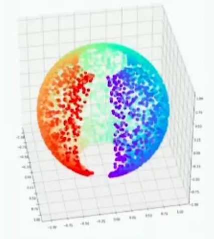
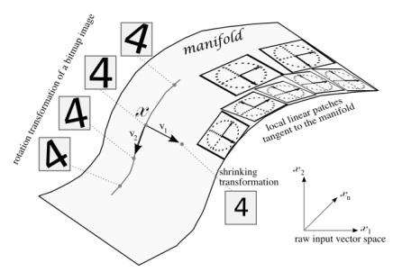
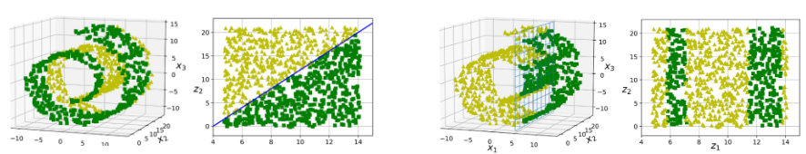

# Manifold and Manifold Learning

ML에서 manifold란,  

* ^^고차원 공간에 내재된 저차원 공간(subspace)^^ 으로 
* 실제 ^^dataset의 data points를 대부분 포함(아닌 경우도 해당 subspace근처에 data points가 존재)하고 있는 것^^ 을 가르킴. 

> (위상)수학적으로는 보다 엄격한 정의가 있으나...  
> DL이나 ML을 하는 입장에서는 이 정도면 충분할 듯.

A manifold is a ***topological space (위상공간)*** that ^^locally resembles Euclidean space^^ near each point.

<figure markdown>
{align=center}
<figcaption>3D 공간에 데이터들이 구 표면에 있으나 실제로 ^^2D에 해당하는 topological space^^ (=평면)에 속해있는 예</figcaption>
</figure>

---

**Topology**  
: topology(위상수학)은 ‘물체의 모양을 바꿔도 (구부리기, 늘리기, 줄이기 등등) 변하지 않는 기하학적 성질 (연결성 또는 연속성 등. open-set에 해당하는 N-Ball로 생각해도 됨) 등을 연구하는 분야’다.  

<figure markdown>
{align=center}
<figcaption>^^homeomorphic^^ 이면서 ^^연속적인 변화^^ 로 만들어지므로 `isotopic`임</figcaption>  
</figure>

> 엄밀하게 애기하면, ^^topology는 어떤 space에서 ***open-set이란 어떤 것인지 규정*** 하는 방법 (또는 element로 open set들을 가지고 있는 set을 topology라고 할 수 있음)을 의미^^ 하며, ^^topological space란 topology가 주어져 있는 집합을 의미함.^^  
> 
> * `open-set`은 일반적으로 ^^특정 data point의 neighbors^^ 를 의미 (open-set은 neighbor를 abstraction!)하며  
> * ***neighbor를 정의하는 방법*** (=`topology``)이 주어지고 topology가 같은 경우, 같은 manifold를 가진다고 생각할 수 있다.  

**Open set이란**
: empty set과 open set의 전체집합도 open set임.  
즉, open set 을 Union시켜도 open set 임.  
유한한 갯수의 open set을 intersection시켜도 open set임.

보다 자세한 건 다음 ULR을 참고: 
[Topological Space](topological_space.md)

---

**Manifold 의 특징.**

- 일반적으로 nonlinear structure를 가짐.
- entangled로 존재하므로 이를 lower dimensionality로 disentangle시켜야 함.
- 하지만, 특정 data sample 근처의 좁은 영역 만으로 볼 경우엔 linearity를 가짐 (또는 linear하다고 approximation할 수 있음.)

**ML 또는 DL 관점에서의 이해**

- Manifold는 feature extraction의 결과물 (Auto-encoder에서는 encoder의 결과물)이라고 볼 수 있음. 
- Manifold는 일반적으로 raw data space상에서 entangled 상태이므로 이를 disentangled로 바꾸는 transformer를 구하는 것이 바로 classifier 또는 data visualization이 하는 일임.

> A $d$-dimensional manifold is a part of an $n$-dimensional space (where $d \le n$) that locally resembles a $d$-dimensional hyperplane. 

---

## Manifold Learning

> ***Modeling the manifold on which the training instances lie*** ; this is called ***Manifold Learning***. 

Unsupervised learning에서 매우 큰 부분을 차지하며, Dimensional Reduction, Data Visualization, Representative Learning 등에 많이 사용됨.

Manifold Learning은 다음의 두 가설에 의존한다. 

* 사실 다음의 2가설은 모든 machine learning에서의 prior로 사용되는 가설이다.

---

### Manifold Hypothesis

High Dimensional (Raw) Dataset은 하나 이상의 Manifold로 구성되며, 각 data sample들은 manifold 상에 위치하거나 또는 manifold에 가깝게 위치하고 있다.

> Real-world data presented in high-dimensional spaces are expected to concentrate in the vicinity of a manifold $M$ of much lower dimensionality $d_M$, embedded in high-dimensional input space $R^d$. 
- Bengio et al. 2013

Data point 대부분이 Manifold 근처에 있다는 애기는 다음을 의미함.

> Probability density of data decreases very rapidly when getting away from the supporting manifold.

Manifold hypothesis 가 성립한다고 가정하면, High dimensional dataset을 compressed (=lower dimensional) meaningful representation (=latent vector, code) 로 바꾸어 표현할 수 있다.

* compressed : lower dimensional
* meaningful : 모든 데이터가 manifold 근처에 존재.
* representation : latent feature vector

---

### Smoothness Hypothesis

Dataset 에서의 data sample은 어떤 요인에 의해서 변화하는데, 해당 sample의 feature를 조금 변화가 이루어질 경우, 데이터의 feature space에서 매끄러운 곡면 (=manifold)상에서 transition이 발생하게 된다. 

> Manifold follows naturally from ***continuous underlying factors*** (~ intrinsic manifold coordinate or features). Such ***continuous factors*** are part of a meaningful representation

{align=center}

---

## Curse of High Dimensionality를 풀기위한 방법 : Manifold 찾기.

데이터의 space의 dimension 이 증가할 경우, 해당 space의 데이터 밀도를 유지하려면 훨씬 많은 data sample을 요구하는 것을 의미함.

Higher dimensional data 를 그대로 사용하면, 데이터 밀도가 낮아서 실제적인 data의 distribution을 찾는 probability distribution을 찾기 어려우나 meaningful manifold를 잘 찾아낸다면, 같은 데이터로도 충분히 probability distribution 을 찾아낼 수 있음.

대부분의 경우, lower dimensional representation이 ML등에서 task를 쉽게 풀 수 있도록 해준다 (이는 manifold hypothesis에 대한 implicit assumption이라고 불림.). ***하지만 아닌 경우도 있다.*** 

* 왼쪽의 swiss roll의 경우, lower dimensional representation이 classification을 보다 쉽게 만든다.
* 하지만 오른쪽의 경우는 오히려 더 어렵게 만들 수도 있음을 보여준다 (이 경우 projection base method가 더 잘 동작). 

> Dimensional Reduction 방법은 크게 projection기반의 algorithm들과 manifold learning기반의 algorithm들로 나뉨.