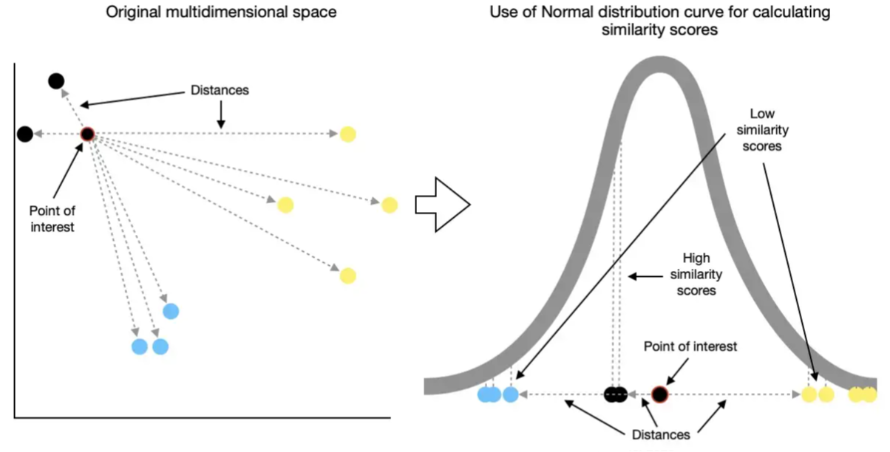
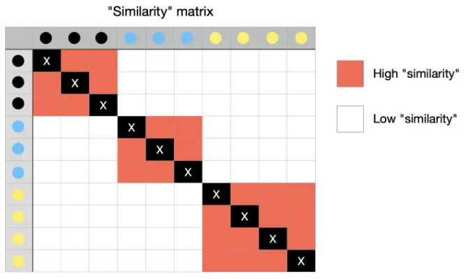
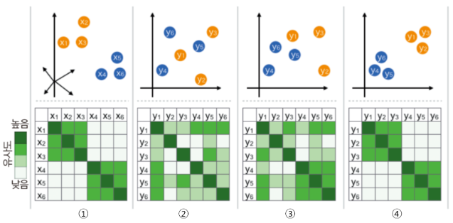
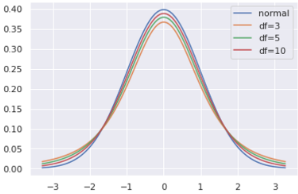
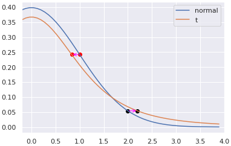

# t-distributed Stochastic Neighbor Embedding (t-SNE)

Matten 2008년에 제안된 t-distributed Stochastic Neighbor Embedding (t-SNE)는 manifold learning의 하나로 visualization 에서 매우 강력한 성능을 보이는 transductive learning algorithm 임.

Dimensionality reduction을 통해 high dimensional data를 2~3 dimensional data로 축소시키면서도 원래 데이터의 구조 및 특성을 최대한 보존함으로서 사용자가 데이터의 구조 및 특성을 시각적으로 잘 이해할 수 있도록 도와준다.

## tSNE 동작 원리 (summary)

### step 1

원래 Dataset 의 모든 sample 들의 pair 들에 대해 Gaussian distribution 기반의 conditional probability (식1)로 구하고, 이들 conidtional probability가 symmetric 해지도록 평균을 취하여 최종 similarity 를 구한다. 그리고 이를 통해 similarity matrix를 산출한다.

Gaussian distribution 기반의 conditional probability $p(i|j)$를 다음과 같이 정의한다.

$$p(i|j) = \frac{\exp \left(\frac{-\|\textbf{x}_i-\textbf{x}_j\|^2_2}{2\sigma_i^2}\right)}{\sum^m_{k\ne i} \exp \left( \frac{-\|\textbf{x}_i-\textbf{x}_k\|^2_2}{2\sigma_i^2}\right)} \tag{1}$$

* $m$은 Dataset의 샘플 갯수임.
* 실제 논문에 따르면 당초 $\sigma_i$는 각 sample마다 데이터 밀도가 달라서 neighbors로 뽑힐 확률이 왜곡되지 않도록 넣어준 값이나 고정을 시켜도 큰 성능차이가 없었서 고정을 시켰다고 함. 입력받은 `perplexity`에 따라 적절한 $\sigma$를 찾는 binary search 가 수행됨.

> **Perplexity**  
> $2^\text{entropy}$ 로 정의되는데, tSNE의 성능에 많은 영향을 주는 parameter임.

다음 그림은 Gaussian distribution(or Normal distribution)이 어떻게 유사도로 활용가능한지를 보여준다.

* 그림 ref. : 
[Saul Dobilas's article](https://towardsdatascience.com/t-sne-machine-learning-algorithm-a-great-tool-for-dimensionality-reduction-in-python-ec01552f1a1e)

위 그림에서 보이듯이 Gaussian probability distribution에 기반한 "확률밀도값"은 가까운 sample의 경우엔 높은 값이 할당되고 멀수록 낮은 값이 할당되므로 일종의 similarity로 충분히 활용가능하다.
하지만, 식 1의 conditional probability $p(i|j)$는 symmetric하지 않다. 즉, $p(i|j) \ne p(j|i)$이다. 이를 보완하기 위해 sample간의 similarity $p(i,j)$를 다음과 같이 정의한다.

$$p(i,j) = p(j,i) = \frac{p(i|j)+p(j|i)}{2} \tag{2}$$

이는 단순히 평균을 구한 것이지만 pair를 구성하는 샘플의 순서와 상관없이 같은 값이 되며, symmetric 임.

이를 이용하여 원래 Dataset 에서의 sample간의 simialarity를 나타내는 similarity matrix를 생성한다. 위 그림에 대한 similarity matrix는 다음 그림과 같다.

* 그림 ref. : 
[Saul Dobilas's article](https://towardsdatascience.com/t-sne-machine-learning-algorithm-a-great-tool-for-dimensionality-reduction-in-python-ec01552f1a1e)

위의 similarity matrix는 main diagonal이 모두 1인 symmetric matrix이다. 이 similarity matrix $P$가 원래 dataset의 특징과 구조를 나타내고 있는 일종의 representation이라고 생각할 수 있다. 즉, ***이 similarity matrix를 최대한 유지하면서 low dimensional space로 샘플포인트로 mapping시키는 것*** 이 t-SNE에서 수행하는 작업이다.

이를 그림으로 표현하면 다음과 같다.

* 그림ref. 김진솔님의 [t-SNE 개념과 사용법](https://gaussian37.github.io/ml-concept-t_sne/)

1번이 원래 dataset에서 구한 Gaussian Distribution 기반 similarity로 similarity matrix를 구한 것을 보여준다.

### step 2

training dataset 의 모든 sample $\textbf{x}$ 들에 대응하면서 보다 낮은 차원에 존재하는 $\textbf{y}$를 랜덤하게 생성시킨다. 원래 sample $\textbf{x}$ 들의 집합 $X$는 고차원의 벡터를 element로 가지며, 이에 대응되는 저차원의 벡터 $\textbf{y}$들의 집합 $Y$는 같은 수,$m$개의 샘플들을 가지게 된다.

이는 아래 그림에서 2번에서 위의 그림에 해당한다.

* 그림ref. 김진솔님의 [t-SNE 개념과 사용법](https://gaussian37.github.io/ml-concept-t_sne/)

변환된 $Y$에서의 각 sampel pair에 대한 similiarity는 normal distribution이 아닌 Student's t distribution을 이용한다. 이 similarity의 식은 다음과 같다.

$$q(i,j)=\frac{\left(1+\|\textbf{y}_i-\textbf{y}_j\|^2_2\right)^{-1}}{\sum^m_{k\ne l}\left(1+\|\textbf{y}_k-\textbf{y}_l\|^2_2\right)^{-1}}$$

이 similarity를 기반으로 $Y$의 similarity matrix $Q$를 구하면 된다. 이는 위 그림의 2번의 아래쪽에 해당한다. 현재 $\textbf{x},\textbf{y}$의 mapping이 무작위인 상태이므로 similarity matrix $Q$는 원래 데이터의 $P$와 차이가 많이 난다.

### Step 3

Step 1에서 구한 $X$의 similarity matrix $P$는 일종의 $p(i,j)$의 분포이며 원래 Dataset의 특징과 구조를 나타내는 것이므로,  Step 2에서 구한 $Y$의 similarity matrix $Q$는 $X$의 similarity matrix $P$와 최대한 유사해야 한다.

두 분포간의 다른 정도를 측정하는 가장 유용한 metric이 바로 KL Divergence이며 다음과 같다.

$$L(Y)=\text{KL}(P\|Q)=\sum^m_{i=1}\sum^m_{j=1} p(i,j) \log \left(\frac{p(i,j)}{q(i,j)}\right) \tag{3}$$

이를 loss function으로 삼아 이를 최소화시키는 $Y$를 찾는 optimization을 수행한다. 다음의 식 4와 같이 식 3의 gradient를 구하고 이를 이용한 Gradient Descent가 주로 사용된다.

$$\frac{\partial L}{\partial \textbf{y}_i}=4\sum^m_{j=1}(p(i,j)-q(i,j))(\textbf{y}_i-\textbf{y}_j)\left(1+\|\textbf{y}_i-\textbf{y}_j\|^2_2\right)^{-1} \tag{4}$$

아래 그림의 3번이 이 최적화 과정의 중간결과이고 4번이 최종 결과이다.

* 그림ref. 김진솔님의 [t-SNE 개념과 사용법](https://gaussian37.github.io/ml-concept-t_sne/)

## Student t-Distribution 의 역할

> Student t-distribution은 population의 variance를 모르는 상태에서 sample 집합(40개 미만)만으로 평균의 차이가 있는지 등을 살펴보는 t Test(t 검정)에서 사용되는 확률분포이다.  
> Student t-distribution은 sample을 사용하므로 sample 숫자에 기반한 degree of freedom (DoF, 자유도, $r$)이 parameter로 주어지고 이 DoF 값에 따라 분포가 변한다. 일반적으로 DoF가 매우 클 경우(120 이상) Gaussian Distribution과 같지만, 40 이하일 때는 heavy tailed 를 가지게 된다. DoF가 작을 수록 극단적인 경우를 나타내는 tail부분의 값이 증가하여 normal distribution에 비해 flat한 pdf를 가지는 특성을 가진다.

* 파란색이 정규분포곡선($N(0,1)$)을 나타낸 것이고 빨간색이 자유도가 3인 student $t$ distribution임.

$Y$에서의 similarity $P$를 구하는데 t-distribution 이 사용된 이유는 바로 ***t-distribution이 heavy tailed 이기 때문*** 이다.
다음 그림은 두 확률분포의 probaiblity density function (pdf)를 나타낸 것으로 t-distribution을 normal distribution과 쉽게 구분하기 위해 DoF=3인 경우의 t-distribution을 사용했다.

위의 그림에서 `1` 정도 거리에 떨어진 경우 high similarity라고 할 수 있는데, 이때 원본데이터에 적용된 similarity (=정규분포 기반) 값과 같은 값을 t-distribution에서 가지려면 `1`보다 적은 거리가 떨어져야 한다 (빨간 점이 왼쪽으로 이동).  
반대로 `2` 정도 거리는 low similarity에 해당하는데, 이때는 t-distribution에서 같은 probability density를 가지려면 멀어져야 함을 보여준다 (검은 점이 오른쪽으로 이동). 

이는 t-ditribution을 변환된 $Y$에서의 similarity에서 사용함으로서 low dimensional space로 Mapping되면서 high similiarity의 pair들은 서로 서로 가까워지고 low similiarity의 경우는 멀어지게 됨을 의미한다.

> **참고**  
> high similiarity인 경우와 low similiarity인 경우에서 Pair를 이루는 sample간의 거리의 차이가 많이날수록 좋다. 이 차이가 크지 않을 경우를 가르켜 crowding problem이라고 부름. 

## Example

작업필요: [https://gist.github.com/dsaint31x/610f9099229bf6cd372376d1199cadc3](https://gist.github.com/dsaint31x/610f9099229bf6cd372376d1199cadc3)

### Parameters

`sklearn.manifold.TSNE`의 주요 parameter는 다음과 같다.

* `n_components` : 변환 결과 $Y$의 element들의 dimension. 보통 2-3이 선택된다. (visualization에서 사용되니)
* `perplexity` : 일반적인 manifold learning에서 유사성 계산을 위해 사용되는 **nearest neighbors 의 수** 와 같은 용도로 사용됨. dataset이 클수록 커져야 하며, 여러 시도를 통해 최적값을 찾아봐야 한다. scikit-learn의 문서에서는 5~50 구간에서 변경하도록 기재되어 있고, 기본값은 30.0이다 (version 12.1기준).
    * Larger perplexities lead to more nearest neighbors and less sensitive to small structure.
    * Conversely a lower perplexity considers a smaller number of neighbors, and thus ignores more global information in favour of the local neighborhood.
    * Similarly noisier datasets will require larger perplexity values to encompass enough local neighbors to see beyond the background noise.
* `learning rate` : 10~1000 정도에서 적절한 값을 찾아야 한다. 너무 크면 학습이 제대로 안되고, 너무 작으면 iteration수가 커야 제대로된 결과를 얻을 수 있다. 기본값은 200.0 이다.
* `n_iter` : 최대 iteration 수로 `learning rate`에 따라 적절한 값이 바뀐다. 기본으로 1000이 주어져 있으며 250이 최소값이다.
* `n_iter_without_progress` : 학습이 converge했는지를 판단하는 기준. 기본값은 300으로, 이는 300 iteration 동안 loss 가 거의 변화가 없을 경우 학습을 중지한다는 애기임. 앞서 애기한 250 iteration이후 적용된다. scikit-learn의 tSNE는 50 단위로 체크를 하기 때문에 이 parameter에 할당하는 값은 50의 배수여야만 한다.
* `init` : 초기 상태를 구하는 방법을 가르킴. `PCA`가 사용되는게 기본임.

## References

* [Laurens van der Maaten's tsne blog](http://lvdmaaen.github.io/tsne)

* [Laurens van der Maaten and Geoffrey E. Hinton,“Visualizaing data using t-SNE,” JMLR.](https://www.jmlr.org/papers/volume9/vandermaaten08a/vandermaaten08a.pdf)

* Laurens van der Maaten, “Learnign a parametric embedding by preserving local structure,” AISTATS

* [`sklearn.manifold.TSNE`:  API](https://scikit-learn.org/stable/modules/generated/sklearn.manifold.TSNE.html)

* [`sklearn.manifold.TSNE`: User Guide](https://scikit-learn.org/stable/modules/manifold.html#t-sne)

* [ratgo's tSNE](https://ratsgo.github.io/machine%20learning/2017/04/28/tSNE/)

* [loveit's t-Stochastic Neighbor Embedding (t-SNE) 와 perplexity](https://lovit.github.io/nlp/representation/2018/09/28/tsne/)
