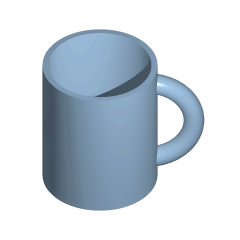

# Topological Space (위상공간)

## Topological Space 의 정의

Topology $\mathcal{T}$가 주어진 Set $X$가 바로 Topological Space임.

수학적인 정의로 보면, Set $X$에서 Topology $\mathcal{T}$가 주어져 있다는 것은 $\mathcal{T} \in P(X)$이며, $\mathcal{T}$ 가 다음을 만족한다.

1. $\emptyset, X \in \mathcal{T}$  
    empty set 과 전체 공간 X는 open-set (즉, $\mathcal{T}$에 포함됨) 임.
2. $U_\alpha \in \mathcal{T} \text{ for all }\alpha \in I \Rightarrow \cup_{\alpha \in I}U_\alpha \in \mathcal{T} $  
    ^^임의의 갯수^^ 의 open-set들의 union은 마찬가지로 open-set임.
3. $U_1, U_2 \in \mathcal{T} \Rightarrow U_1 \cap U_2 \in \mathcal{T}$  
    ^^유한한 갯수^^ 의 open-set 들의 interception은 마찬가지로 open-set 임.

이 경우의, $\mathcal{T}$의 element들을 open-set이라고 부른다. 이는 topology $\mathcal{T}$는 open-set들로 구성된 set이고, 어떤 space (~set)에서 open-set이 무엇인지를 규정함을 의미한다.

> `open-set`이란 정성적으로 애기하면, "neighbor"라는 개념을 추상화 한 것이다. 어떤 data point $p\in X$가 있다고 할 때, $p$를 포함하는 open-set을 $p$의 neighbor (=open-set)이라고 할 수 있다.

* topology가 같은 topolotical space들을 homeomorphic(위상동형) 이라 말함.  
{align=center}
* $\mathbb{R}^3$를 비롯해서 ambient space(어떤 주변공간)에 embedded(속한, 포함된)한 두 공간이 서로 (고무판을 늘이고 줄이듯이) 연속적으로 변환시킬 수 있다면 이 둘을 isotopic하다고 정의함.  
{align=center}

> isotopic이란, 한 공간 안에서 homeomorphic을 보존하면서 한 쪽에서 다른 한 쪽으로 변형을 할 수 있는 것을 가르킴. homeomorphic보다 엄격한 조건을 가짐. 

정리하자면, ^^topology는 기본적으로 topological space의 성질을 보는 것^^ 이므로 ambient space(주변 공간)에 어떻게 embedded되어져있는지와
 isotopy만을 보고 "topology가 같은 공간"을 다르다고 착각해서는 안됨. 

 ## References

 * 생각작가's [여러분을 위상수한(topology)의 세계로 초대합니다. -1](https://m.blog.naver.com/PostView.nhn?isHttpsRedirect=true&blogId=khsamuel&logNo=221395058280&categoryNo=85&proxyReferer=)
 * [위상공간(topological space](https://mathlyblog.wordpress.com/2015/11/03/%ec%9c%84%ec%83%81%ea%b3%b5%ea%b0%84topological-space/)