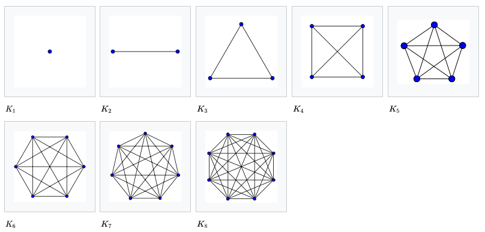

# Graph

Network (object들의 연결관계)를 나타내는 자료구조의 일종으로 `node`(or vertex, 정점)와 `edge`(or connection)로 구성된다.

* Object(`node`로 표현됨)들의 관계 등을 연결시켜서 Network로 표현해주는 모델.
* 여러 개의 분리된 subgraph (=isolated subgraph)들로 구성될 수도 있음 

> Tree 구조와 함께 Object간의 관계, 또는 network를 모델링하는데 많이 사용되는 자료구조임.  
> 엄격하게 애기해서 Tree는 `Directed Acyclic Graph`의 하나로 root node라는 graph 내의 모든 node와 path가 존재하는 node가 하나 있는 경우를 애기함.  
> Network를 모델링할 때는 Graph를, Hierarchy를 모델링할 때는 Tree가 사용됨.

## Terminology

### `node` 
: vertex라고도 불리며, network에서 특정 위치, object, 상태 등을 의미한다. circle로 표현되는 경우가 일반적.

### `edge`
: connection, branch, link 등으로 불리며, `node` 사이를 연결하는 line을 의미함. 

### `adjacent node`

: neighbors라고도 불리며, 특정 node에 edge로 직접 연결된 node들을 가르킴.

### `degree of node`

: 특정 node의 property 중 하나로, 인접한 node (adjacent node)의 수를 의미함. 주로 undirected graph에서 정의되며, directed graph에서는 in-degree, out-degree로 구분된다.

### `degree of graph`

: graph의 property 중 하나로, 포함된 모든 node의 degree 를 합친 수 (edge 의 갯수에 2배에 해당).

### `path`

: graph 내에서 특정 node 2개를 연결하는 edge들과 node들을 가르킴. 즉, a라는 node에서 출발하여 b라는 node에 도착하기까지 거쳐가는 node와 edge로 구성된다. terminal node들이 같더라도 여러 path가 있을 수 있다.

### `simple path`

: path 중에 반복되는 node가 없는 경우의 path를 가르킴.

### `Euler path`

: graph의 모든 edge를 한 번씩만 통과하여 처음 node로 되돌아오는 경로. 한붓그리기 문제라고도 불림.

### `cycle`

: terminal node가 일치하는 simple path.

### `path length` (=`geodesic distance`)

: 일반적으로 path를 구성하는 edge의 갯수로 표시된다.  
edge에 특정 weight들이 할당된 경우, 해당 weight들이 더해져서 path length가 되기도 함.  
geodesic distance라고도 불림.

---

## 종류

### Complete Graph

모든 node들의 사이에 edge가 존재하는 경우임.

* ref : wikipedia's [완전그래프](https://ko.wikipedia.org/wiki/%EC%99%84%EC%A0%84_%EA%B7%B8%EB%9E%98%ED%94%84)

### Undirected Graph

edge에 방향성이 없어서 양방향으로 이동이 가능함. A,B node를 연결하는 `(A,B)`와 `(B,A)` edge가 같음.

### Directed Graph
edge에 방향성이 있서 한방향으로 이동이 가능. 화살표로 그래짐.  A에서 B방향으로 연결된 edge `<A,B>`와 B에서 A방향으로 연결된 edge `<B,A>`가 구분된다. (undirected에서는 `()`를 directed에서는 `<>`를 사용하는 경우가 많음)

### Weighted Graph
edge에 길이 또는 가중치라고 불리는 숫자값이 할당된 graph. 대부분 network를 모델링하는 경우 weighted graph가 사용된다.

### Cycle
simple path 중 terminal node가 동일한 경우를 가르킴. 또는 해당 simple path가 존재하는 graph를 지칭.

### Acyclic
cycle이 없는 graph를 지칭.

---

## Implementation

### Adjacency List

가장 일반적인 구현 방식.

* row(행)에 대응하는 특정 node가 있고, 각 row에 해당 node의 adjacent nodes들이 list로 기재됨.
* node의 번호만 주어지면 해당 row에서 adjacent nodes들을 쉽게 가져올 수 있음.

### Adjacency Matrix

행과 열이 graph내의 node들에 해당함.

* 연결이 있으면 1이 할당되고 없으면 0이 할당되는 방식임.
* undirected graph는 항상 symmetric matrix가 됨.
* sparse matrix가 되는 경우 효율성이 떨어짐.

# 더 읽어보면 좋은 자료.

* [Tree vs. Graph](https://dsaint31.tistory.com/entry/CE-Tree-vs-Graph)