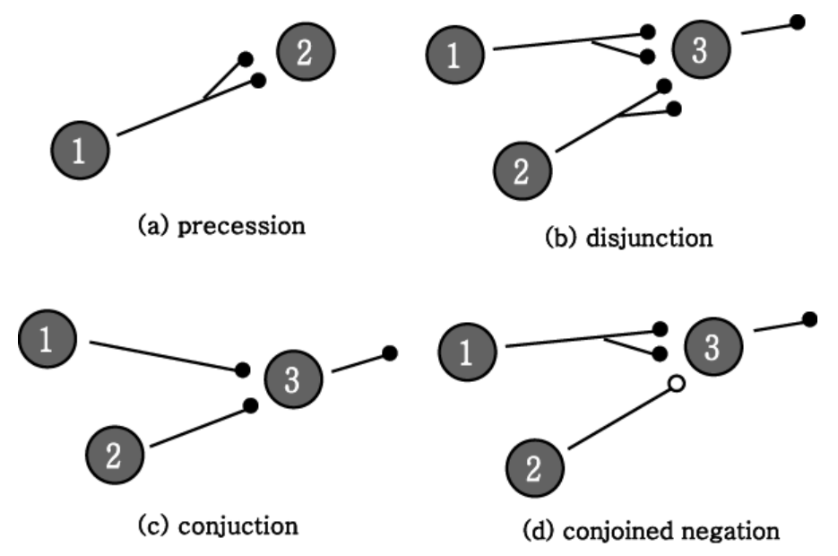
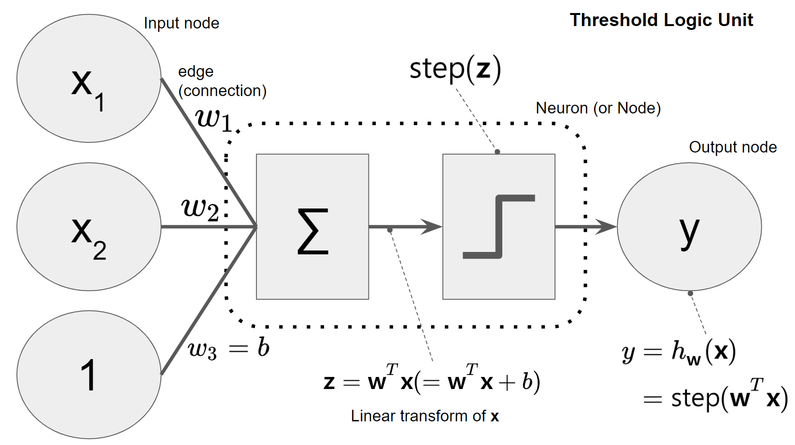
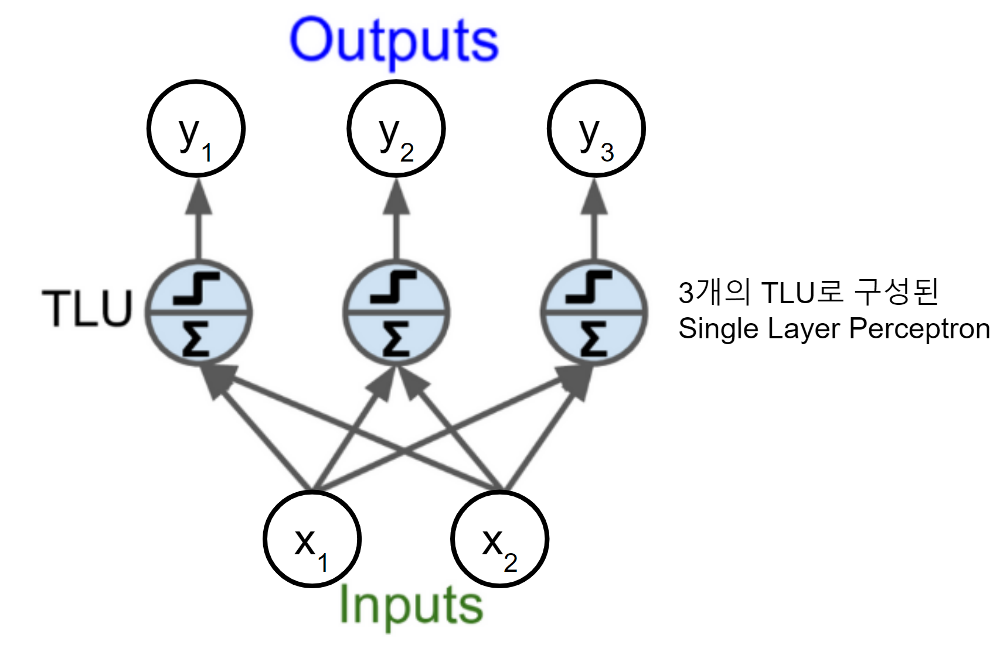
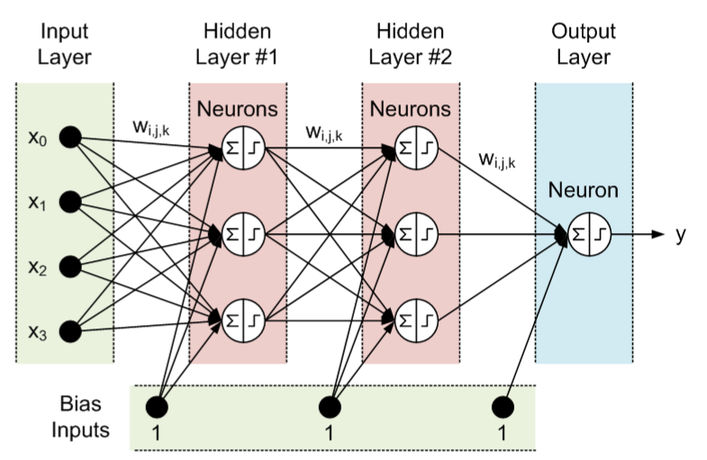
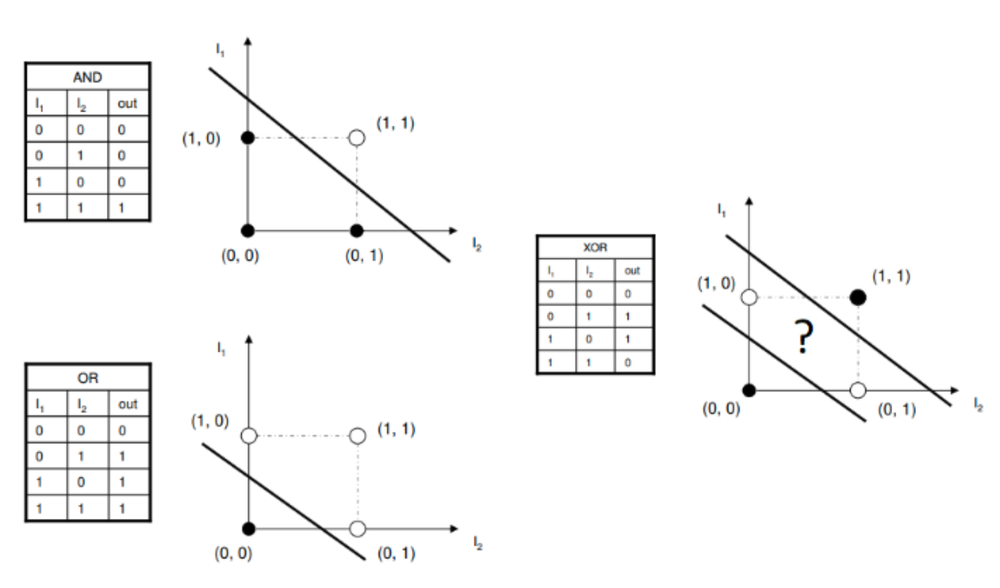

# 초창기 Artificial Neural Network

## ANN의 시작.

McCulloch (의사, 신경생리학자)와 Pitts (인지심리학자, 논리학자)가 쓴 다음의 논문이 최초의 Artificial Neuron을 제안한 것으로 인정되고 있음.

[A logical calculus of ideas immanent in nervous activity, 1943](https://link.springer.com/article/10.1007/BF02478259)

on-off로 동작(=switch)하는 기능을 가진 artificial neuron들을 그물망 형태로 연결(network)하면 사람의 뇌에서 이루어지는 논리적 연산을 흉내낼 수 있음을 제안.

### McCulloch and Pitts의 Simple Neurons

logical proposition (논리 명제)를 계산 (and, or, not 등의)함.

* closed circle (안이 채워진 원)은 excitatory edge를 의미.
* open circle (안이 비워진 원)은 inhibitory edge를 의미.
* `precession` : identity op.
* `disjunction` : $2=1 \lor 2$ (`or`).
* `conjunction` : $3=1 \land 2$ (`and`).
* `conjoined negation` $3 = 1 \land \neg 2$: 

### Physical Assumptions for McCulloch-Pitts Model

* Neuron : 1 or 0 (= all-or-none process) 
    * binary inputs (`1` or `0`)을 처리하여 binary output (`1` or `0`)을 내보냄.
* 특정 Neuron이 **activation** (= output이  `1`)이 되려면 ^^2개 이상의 고정된 갯수의 synapse가 activation^^ 되어야 함 (일정한 시간내에)
    * delay는 synaptic delay만 고려. (= Neural network에서 다른 시간 지연을 고려하지 않음.)
* absolute inhibitory input(=synapse)가 존재. 
    * inhibitory synapse (위 그림에서 open circle)가 activation 될 경우 그 때의 특정 neuron은 절대로 activation이 되지 못함.
* Neural network의 구조는 time-invariant (Weighting 및 학습에 대한 개념이 없었음).

---

## weight factor의 도입

Donald Olding Hebb (캐나다, 심리학자)이 [The Organization of Behavior: A Neuropsychological Theory(1949)](https://pure.mpg.de/rest/items/item_2346268_3/component/file_2346267/content)을 통해 Neural network (생물의)에서 반복적인 signal이 발생할 경우, 해당 signal과 관련된 neurons의 synapse 연결이 강화되는 일종의 학습효과가 있다는 "학습 및 기억과 관련된 가설"을 제안 (이를 Hebb's rule이라고 지칭).

* Long-term Memory의 경우, Short-term Memory와 달리 연결된 Neuron에 물리적 변화(연결된 synapse의 강화 등등)가 이뤄짐.

ANN에서는 이를 edge에 weight을 할당하여 강화가 될 수록 weight가 커지고 약화될 수록 weight을 줄이는 형태로 모델링.

---

## Perceptron 의 등장.

1957년 Frank Rosenblatt (심리학자)에 의해 가장 단순한 ANN architecture인 `Perceptron`이 제안됨.

[The PERCEPTRON: A Probabilistic Model for Information Storage and Organization in the Brain , 1958](https://citeseerx.ist.psu.edu/viewdoc/download?doi=10.1.1.335.3398&rep=rep1&type=pdf)

`Perceptron`은 다음의 `Threshold Logic Unit` (TLU, 또는 Linear Threshold Unit, LTU)라고 불리는 artificial neuron을 기본 구성단위로 삼음.

* McCulloch와 Pitts의 neuron에 
* Hebbs의 학습을 반영한 weight 개념을 추가함.

* activation function으로 TLU는 heaviside의 [step function](https://dsaint31.tistory.com/553)이나 [signum function (or sign function)](https://dsaint31.tistory.com/555)을 사용함.
* 이후 [sigmoid functions](https://dsaint31.tistory.com/430)들이 사용됨 (back-propagation이 도입되면서).
* 오늘날의 dense layer (fully connected layer)와 유사하며, 가장 많이 사용되는 activation function은 ReLU 임.

> `TLU`는 linear function에 의해 정의되는 hyper-plane을 decision boundary로 삼는 일종의 binary classifier임.  
> hyper-plane의 아래에 위치하는 경우엔 `off` 이 되고, 그 외의 경우는 `on` 이 되는 경우를 생각하면 쉽다.

이 TLU를 기반으로 input layer (input nodes로 구성됨)와 output layer (output nodes로 구성됨) 
로만 구성된 것을 `Single Layer Perceptron` or `Perceptron`이라고 부름.

> 일반적으로 `perceptron`이라고 하면 SLP를 가르킨다. Scikit-Learn에서 `sklearn.linear_model.Perceptron`으로 제공되고 있다.  
> package 명에서도 알 수 있듯이 Perceptron은 linear model에 불과하다.

---

## Multi-Layer Perceptron (MLP) 등장.

1962년 Rosenblatt는 perceptron 이론을 보완하여 다양한 형태의 ANN을 제안함.

[Principles of Neurodynamics: Perceptrons and the Theory of Brain Mechanisms, 1962](https://safari.ethz.ch/digitaltechnik/spring2018/lib/exe/fetch.php?media=neurodynamics1962rosenblatt.pdf)

그 중 하나가 아래에 보이는 Multi-Layer Perceptron으로 일종의 feed-forward ANN이며 2개 이상의 layers를 쌓아 만들어짐.  
(일반적으로 weight들이 있는 edge들이 몇 단계로 쌓였는지 또는 `TLU`로 구성된 layer의 갯수를 센다. 아래 그림의 3개층으로 구성된 MLP임)

* MLP는 perceptron (=SLP)가 못 푸는 non-linear classification (`XOR`이 가장 간단한 예)도 해결 가능함.
* 문제는 중간에 존재하는 여러 개의 hidden layer로 인해 증가된 weights (bias포함)를 어떻게 학습시킬지에 대한 해답을 Rosenblatt는 명확히 제시하지 못했고, ^^back-propagation이 등장하여 적용되는 1980년대까지^^ MLP에 대한 학습방법이 제시되지 못함.

---

## Perceptron의 한계

1969년 Marvin Minsky 와 Seymour Papert는 [Perceptrons: An Introduction to Computational Geometry](https://en.wikipedia.org/wiki/Perceptrons_(book))라는 책을 통해 SLP의 한계를 수학적으로 증명함.

* SLP는 linear classifier에 불과 → 비선형 분류(XOR) 문제를 풀 수 없음을 수학적으로 증명.
* MLP 사용할 경우엔 이를 해결할 수 있으나 weight과 bias의 값을 어떻게 구할지 (=학습알고리즘)가 제시되지 못함.
* 즉, 학습 방법이 제시되어 있지 못함.
* 결국, 당시 수준으론 실제 문제를 풀 수준의 ANN 구축이 불가함을 Minsky가 증명한 셈이 되었다.

> 안타깝게도 Rosenblatt은 perceptron의 한계를 극복하지 못했고 자살로 생을 마감했다. 아이러니한 건 Minsky와 Resenblatt이 고교 동창이라는 점이다. 최초의 ANN의 유행을 만든 사람과 그 유행을 끝장낸 사람이 한 고등학교에서 나온 셈.

* perceptron의 linear function을 통해 decision boundary로 사용할 hyperplane (초평면)이 정의됨.
* SLP는 결국 하나의 hyperplane만을 정의하게 되는데, 2차원에 놓인 data point에 대해 hyperplane은 결국 1차원 (1=2-1)이 되므로 결국 직선이 decision boundary가 된다.
* 위의 그림에서 보이듯이 XOR문제는 두 개의 직선이 필요하며 이는 2개의 layer로 구성된 MLP가 필요함을 알 수 있다.

---

## Back-propagation의 등장 (MLP의 학습알고리즘)

1960년대에 Gradient Descent를 통해 MLP를 학습시키기 위한 여러 시도가 있었으나 3층 수준의 MLP에서 모델의 error에 대한 gradients를 효과적으로 구하는 것이 쉽지 않았기 때문에 성공적인 결과를 이끌어내지 못함.

> MLP에서 필요한 parameters는 weights (bias 포함)의 값들이며, 주어진 학습데이터에 대해 최적의 weights를 찾는 것을 training라고 함.  
> 많은 machine learning에서 training (cost function을 최소화할 수 있는 weights를 찾는 과정)에 Gradient decent를 적용하기 때문에 MLP에도 이를 적용하고자 하는 시도는 매우 자연스런 현상이라고 볼 수 있음.

그러던 중 1970년 Seppo Linnainmaa가 석사 논문으로 gradients 를 컴퓨터에서 효과적으로 계산해낼 수 있는 `reverse-mode automatic differentiation` 기법 (computational graph를 이용)을 제안한다.

[The representation of the cumulative rounding error of an algorithm as a Taylor expansion of the local rounding errors](https://people.idsia.ch/~juergen/linnainmaa1970thesis.pdf) : 핀란드어로 쓰여져 있다. --;;

> 흔히 `reverse-mode autodiff`라고 불림.

뒤이어 1974년 Paul J. Werbos가 박사학위 논문에서 `reverse-mode autodiff`와 gradient descent를 결합한 `Back-propagation`` 를 MLP에 적용한다.

[Beyond regression: New tools for prediction and analysis in the behavioral sciences, 1974 (Paul J. Werbos, Ph.D. dissertation)](https://www.researchgate.net/publication/35055330_Beyond_regression_new_tools_for_prediction_and_analysis_in_the_behavior_sciences_microform)

* `Back-propagation`은 Error (목표값과 추정값과의 차이)를 이용하여 Hidden Layer의 weight들을 학습시킬 수 있음.
* 아쉽지만 Werbos의 제안은 큰 관심을 받지 못했고, 이후 Rumelhart와 Hinton에 의해 재발견되기까지 Back-propagation은 대중화되지 못함.

1986년 Rumelhart와 Hinton이 Back-propagation을 통해 MLP가 학습 가능함을 다시 한번 보이면서 ANN의 부활이 시작됨.

[Learning internal representations by error propagation (Rumelhart, Hinton)](https://www.semanticscholar.org/paper/Learning-internal-representations-by-error-Rumelhart-Hinton/111fd833a4ae576cfdbb27d87d2f8fc0640af355)

> David Rumelhart의 위 논문을 통해 매우 빠르게 MLP의 학습 기법으로 back-propagation이 채택되기 시작했고, 오늘날에도 Deep ANN에서의 학습 기법들이 대부분이 여기에 기반한다. 

Back-propagation을 통해 3층으로 구성된 MLP의 학습이 가능해졌고, 이에 대한 연구가 1980년대에 활발히 이루어지기 시작함. 

> 주의할 건 1990년대에 2개의 hidden layer를 가지는 MLP (output layer를 포함하여 3개층을 가짐)를 Deep하다고 지칭했다는 점임.

1980년대는 ANN의 부활기로 알려져 있다. 1982년 John Hopfield가 제안한 Hopfield Network 에서 알 수 있듯이 심리학자나 수학자들이 연구주제였던 ANN이 공학자들의 연구대상이 되어 ANN에 대한 HW구현, 문자인식 등의 응용분야로 연구가 활발히 시작됨. 이는 International Neural Network Society (국제신경망학회)가 1980년대 후반에 결성된 것을 봐도 알 수 있음.

다음 글은 1992년에 KAIST 뇌과학연구센터의 이수영 박사님이 쓰신 글로 ANN에 대한 1990년대의 상황을 알 수 있음.

[신경회로망의 역사적 고찰](http://www.aistudy.com/neural/history_lee.htm#_bookmark_389c9e0)

> 다음은 위의 url이 깨질 것을 대비한 pdf 인쇄본임. : [backup](./file/신경회로망%20의%20역사적%20고찰%20_%20이수영.pdf)

 
하지만, 당시의 주류 알고리즘은 Support Vector Machine이였고 ANN은 2010년 까지 SVM 등과 같은 기존의 다른 ML 기법에 비해 압도적인 성능을 보이는 분야는 아니었음.

> 2000년 당시 ANN은 농담으로 흑마법이라고 부르던 연구자들도 있었을 정도임.  
> 지금의 열풍을 생각하면 전혀 상상이 안되던 취급을 받던 시절.

---

## 2000년대 초반의 ANN의 문제점

MLP가 학습이 되기 시작했으나 다른 Machine Learning 기법에 비해 뛰어난 경쟁력을 당시에 보이지 못한 이유는 다음과 같음.

* 학습에 요구되는 시간이 너무나 컸음(계산량이 매우 높음)
    * 1989년 Yann LeCun 의 초기 CNN(3개의 Hidden Layer가짐)의 경우, 10개 숫자 구분을 위한 학습에 3일(days) 정도 필요.
    * Computation power의 획기적인 개선 (Nvidia's GPGPU!)으로 해결된 문제임.
* 엄청난 양의 Labeled data가 필요함. 
    * 1990년 10개 숫자 구분에 10,000 여개의 학습데이터 이용됨.
    * Internet과 검색엔진의 발전에 힘입어 Big Data시대가 되면서 이에 대한 개선이 이루어졌고, Generative model의 발전과 함께 Knowledge transfer 기법의 개발 등으로 이 문제도 상당부분 해결됨. 
* Vanishing gradient problem.
    * Layer가 깊어질 경우, training이 진행되면서 gradient가 0에 가까워져 학습이 제대로 이뤄지지 못하는 문제점.
    * 특정 깊이 이상의 layer를 사용하지 못하는 제한점이었음.
        * 2004년 Restricted Boltzmann Machine (RBM, Hinton)과 2006년 Deep belief net 등을 통해 unsupervised layer-wise pre-training을 이용하여 deep network의 학습이 가능함을 보임.
        * Xavier 등이 제안한 weight initialization 등의 여러 기법을 통해 해결됨.
    * Residual Network를 통해 50 layer이상의 network도 학습이 가능해졋음.
* Local minima, Overfitting problem
    * 초기 많은 연구자들이 ANN에 대해 공격했던 부분이나, Deep Learning의 연구결과가 실제 문제들에서 잘 동작함을 보이면서 해당 문제점의 심각성이 생각한 것보다 덜함을 인식하게 됨.
    * 하지만, over-fitting은 여전히 DL에서 극복해야하는 문제점이며, dropout이나 batch normalization, regularization 등의 기법이 계속해서 연구되고 있음.

---

## Key Change to the MLP from Back-propagation

Rumelhart가 Back-propagation을 MLP 학습에 효과적으로 사용하기 위해 MLP의 activation function을 기존의 heaviside step function을 `logistic function`으로 변경 (`logistic function`은 sigmoid functions의 대표)함.

Back-propagation은 Gradient decent와 Reverse-mode Autodiff의 조합이기 때문에 결국 differentiation에 기반함.

때문에 미분가능하면서 step function과 유사한 `logistic function`으로 activation function을 삼음.

Scikit-Learn에서 제공하는 `sklearn.neural_network.MLPRegressor` 와 `sklearn.neural_network.MLPClassifier` 의 hidden layer에서 사용되는 Activation functions은 다음과 같음.

* `'identity'` : 주로 linear bottleneck을 만들 때에만 이용됨.
* `'logistic'`: [the logistic sigmoid function](https://dsaint31.tistory.com/320) 
* `'tanh'` : the hyperbolic tan function
* `'relu'` : the rectified linear function

### SLP와 MLP의 차이점

* SLP를 보통 Perceptron이라고 부르며, activation function이 step function임.
* MLP는 학습이 되기 위해서 back-propagation으로 gradient를 구해야하면 때문에 미분 가능한 activation function인 sigmoid functions과 여러 다른 function (적어도 subgradient를 구할 수 있어야함)으로 변경이 이루어짐.

### Activation function의 중요성.

Activation function은 MLP에 non-linearity를 부여해주는 핵심 요소이다.

activation function이 identity function일 경우, perceptron은 단순한 linear function으로 Weight와 Input vector의 곱에 불과하다.  
이는 linear transform이므로 아무리 많은 layer로 쌓아도 단 하나의 layer로 대체가능함을 의미한다.

> 선형대수에서 linear transform은 matrix 와 vector의 곱으로 표현이 되는데 아무리 많은 matrix를 곱해준다(여러 층을 쌓음)고 해도 하나의 matrix로 대체 (그 많은 matrix들을 곱해서 얻어짐)되는 것이 잘 알려져 있음.

즉, activation function이 있기 때문에 MLP가 SLP와 차이를 가지게 되는 것이며, 달리 말하면 layers를 깊이 쌓는 구조가 single layer나 적은 수의 layers로 구성된 구조보다 높은 성능을 가지는 근본적인 이유가 activation function의 존재 때문임.

## References

* [Who Invented the Reverse Mode of Differentiation?](https://www.math.uni-bielefeld.de/documenta/vol-ismp/52_griewank-andreas-b.pdf)
* [Backpropagation Applied to Handwritten Zip Code Recognition, Y. LeCun el al. 1989](http://yann.lecun.com/exdb/publis/pdf/lecun-89e.pdf)
* [A fast learning algorithm for deep belief nets, G. E. Hinton et al.](http://www.cs.toronto.edu/~osindero/PUBLICATIONS/HOT_NC05_fast_deep_nets.pdf)

