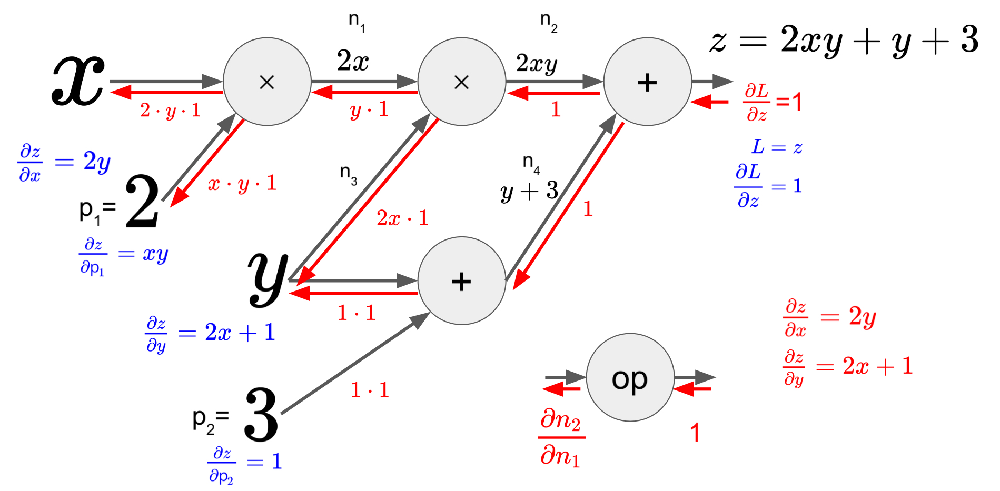

# Reverse-Mode Autodiff (Auto-Differentiation)

***Reverse-mode autodiff*** 는

TensorFlow, PyTorch 등에서 

* gradient를 구하는 back-propagation 수행에서 필요한
* 미분(differentiation)을 구하기 위해 사용되는 
* auto differentiation의 한 기법임.

> 컴퓨터를 사용하여 Differentiation(미분)을 수행하는 다음의 3가지 중 DL분야에서 주로 사용되는 기법
> 
> 1. Symbolic Differentiation
> 2. Numerical Differentiation
> 3. Forward-Mode or ***Reverse-Mode Auto Differentiation***

위의 1번과 3번의 경우는 Computation Graph 기법에 의존하고 있음.

- **Forward-mode Auto diff** 와 달리
    - output(출력단)에서 출발하여 각 input(입력단)으로(←reverse direction, backward pass or backward flow)
    - 한번만 수행(단, 1번의 forward pass가 이전에 수행되어야 함)하면 모든 partial differentiation들을 구할 수 있음.
- output에서 시작하는 특성상,
    - output이 적고
    - input이 많은 경우에 유리함.
        - 대부분의 딥러닝 모델에서 input이 압도적으로 output보다 많음.
    
- Reverse-mode Auto Diff는 ***chain rule*** 에 기반하고 있음.
    
$$
\dfrac{\partial f}{\partial x}=\dfrac{\partial f}{\partial n_i}\dfrac{\partial n_i}{\partial x}
$$
    
- 이를 위해서는 forward pass 과정에서 각 node에서의 ***연산 결과*** 및 ***입력값*** 들을 저장하고 있어야 함.  
    - 일반적인 prediction (or inference) 과정과의 차이점임.
- pytorch등에서는 옵션 등을 통해 autodiff에 사용할 각 노드의 결과를 저장할지 여부를 결정할 수 있음.
    - validation set를 대상으로 수행될 때는 이같은 저장을 하지 않고 수행함으로서 계산 효율을 향상시킴.
    

> Computation Graph를 사용하기 때문에 ***국소적 계산*** 이 이루어지며, 

>  각 노드의 국소적 계산 결과인 local gradient를 ***chain rule에 기반*** 해 곱해나가는 `back-propagation` (역전파) 를 수행하여  
> differentiation을 구하게 됨.
> 

---

---

## **Reverse mode auto differentiaion 특징**

- 수치해석 기반의 differentiation method (=Numerical Differentiation)보다 ***높은 정확도*** 를 가짐  
(Forward-mode autodiff 수준의 accuracy를 보임)
- 모든 partial differentiation을 구하기 위해서 단 한번의 forward pass 와 backward pass 가 요구되어 매우 효율적임.
    - 여러 차례의 반복이 필요한 Forward-mode autodiff와의 차이점.
- 일부 미분이 불가능한 연산(혹은 구간)이 포함된 함수도 미분할 수 있음. (해당 연산에서 partial derivative 결과를 대신하도록 처리하거나, 미분이 가능한 구간에서만 사용 등을 이용하여)

---

---

## **Example 1**

### **Computation Graph**

$z=2xy+y+3$에 대한 Computation Graph는 다음과 같음.

* 왼쪽부터 node를 거쳐서 computation이 수행됨.
* node는 operation이고, edge는 데이터의 흐름(flow)를 의미함.

***

### **Forward pass**

$z=2xy+y+3$에 대해, 입력 $x=40, y=4$를 대입하고, Forward pass 수행한 결과

* 각 node의 연산 결과를 저장해야만 reverse-mode autodiff가 가능함.
* 때문에 80, 320 등의 중간연산 결과들을 포함하는 각 node의 입출력이 모두 저장됨.

***

### **Backward pass (1)**

Backward mode autodiff의 핵심인 backward pass는 다음과 같음.

- manual differentiation의 결과(붉은색 좌하단)와 backward-mode autodiff의 결과(푸른색 우측)가 일치함.
- 각 노드별로 국소적인 미분을 수행하고, 이를 chain rule에 기반하여 곱하여 확장해나감.
- 각 노드의 연산에 대한 건 이후 자세히 다룸.

***

### **Backward pass (2)**

$z=2xy+y+3$에 대해, 입력 $x=40, y=4$ 인 경우의 Backward pass(or backward flow)수행은 다음과 같음. 해당 수행은 반드시 대응하는 입력에 대해 Forward pass를 수행하고 난 이후 이루어짐.

- 각 node의 중간 결과물 및 입력값이 있어야만 구할 수 있음.
- 때문에 Forward pass를 수행하면서 이들을 저장하고 있어야 함.
- $x$의 경우 1의 변화가 $L(=z)$에서 8의 변화로, $y$의 경우 81의 변화로 이어짐.
- weight (위의 식에서 $2$)와 bias (위의 식에서 $3$)의 변화에 따른 $L$의 변화도 구해짐.

실제 결과도 정확히 manual differentiation과 일치.

***

***

## **Node에 대한 reverse-mode differentiation (국소적 연산, Local gradient)**

노드(=연산)에 대한 입/출력 을 바탕으로 local gradient $\left(\dfrac{\partial n_2}{\partial n_1}\right)$를 구하고, chain rule에 기반하여 이전 결과$\left(\dfrac{\partial L}{\partial n_2} \right)$에 곱하여 gradient를 구해 나감.

> 입/출력 은 vector, matrix 로 확장 가능하며,  
> 입/출력 이 모두 vector인 경우 흔히 알려진 Jacobian matrix가 local gradient가 됨.

- 5개 component를 가진 vector가 입출력인 경우의 예.
- 이 경우, local gradient는 $5\times 5$ Jacobian matrix임.
- matrix와 vector의 곱 형태의 미분이 수행됨.
- partial differentiation의 특징상 Jacobian matrix는 매우 sparse한 matrix인 경우가 대부분임.

---

---

## **Reverse-mode auto differentiation 패턴**

### Add and Multiplication

- Add node (or add gate)의 경우, 이전 결과물이 그대로 해당 노드를 통과함. (1을 곱하기 때문)
- Multiplication node의 경우, forward pass에 기록된 입력값들을 바꾸어 곱해짐.
    - 입력값이 클수록 곱해지는 값이 커짐 → 지나치게 값이 커지게 됨을 알 수 있음.
    - forward pass에서 입력값들을 저장되어야 함.

***

### **Squared and Exponentiation**

- local gradient가 곱해짐.
- 각각의 local gradient 계산에 입력값이 필요함.

***

### **Rectified Linear Unit**

***

### **Logistic function**

대표적인 sigmoid function에 대한 reverse-mode autodiff.

* 참고: [Derivative of Logistic Function](https://dsaint31.tistory.com/613)

이를 간략히 표현한 결과는 아래 그림의 좌측과 같으며, 이는 우측의 manual differentiation과 같은 결과를 보임.

- 왼쪽 하단의 축약형에서 sigmoid로 표기한 이유는 일반적으로 (거의 대부분) sigmoid function이라고도 혼용해서 부르기 때문임. 
- 엄밀히 말하면 logistic function이며, logistic function은 sigmoid function의 대표적인 함수이나 그에 속하는 하나의 함수에 불과함.
- 우측에서 직접 local gradient를 구한 경우를 보여주고, 일반적 형식($y$를 이용한)도 보여줌.
- reverse-mode autodiff의 경우, forward pass 에서 노드의 출력($y$)을 backward pass에서 입력으로 사용하므로 이같은 형태(output $y$를 이용한 표현식)가 보다 이후 계산에서 편리함. ← forward pass당시의 출력값 저장 필요.

---

## **Example 2**

**[Stanford University - CS231n: Convolutional Neural Networks for Visual Recognition (2017) 강의](http://cs231n.stanford.edu/2017/syllabus.html) 에 나오는 예제.**

이전의 각 노드별 패턴에 따라 아래와 같이 나오는지 확인해 보는 연습을 해보면 이해하는데 도움이 됨.

- 푸른색 박스처럼 logistic function을 computation graph로 분해하여 처리하던지, 붉은 색 글씨로 한번에 처리하던지 결과는 같음.

---

## **References**

* [Syllabus | CS 231N](http://cs231n.stanford.edu/2017/syllabus.html)
* [Back-propagation for a Linear Layer](https://web.eecs.umich.edu/~justincj/teaching/eecs498/FA2020/linear-backprop.html)
* [오차역전파 - 응용수학 documentation](https://compmath.korea.ac.kr/appmath2021/BackPropagation.html)