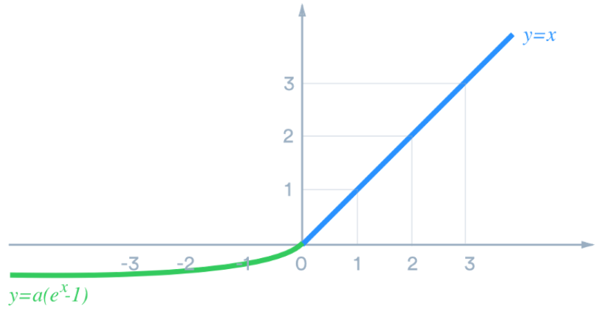
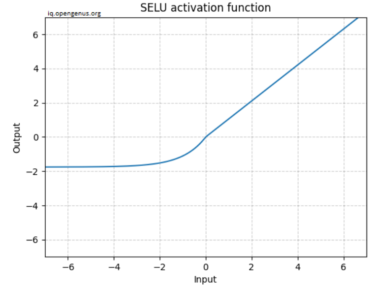

# Exponential Linear Unit (ELU)

The variants of ReLU 의 성공에도 불구하고, 이들의 discontinuity로 인한 

* slow converge나 
* gradient descent bounce 등의 단점이 해결되지 못함.

이를 해결하기위해 `softplus`, `ELU`(2015), and `SELU`(2017)가 제안됨.

---

## Softplus : Smooth ReLU 

ReLU와 매우 유사한 형태이지만 smooth function임.

$$ \text{softplus}(x)=\ln (e^x+1) $$

위의 수식 그대로 구현시 무한대로 발산하는 문제가 있어서 약간의 수치해석적 접근이 필요함.  
자세한 건 다음 URL을 참고.

* [softplus](https://dsaint31.tistory.com/250)

### softplus 미분 : logistic

`softplus`의 미분은 logistic function임.

---

## Exponential Linear Unit (ELU)

<figure markdown>
{width="400" align="center"}
</figure>

`ELU`는 다른 방식으로 ***`ReLU`의 장점에 smooth function의 장점을 조합*** 시켜 성능을 보다 향상시킴.
(`softplus`보다 `ReLU`와 비슷한 형태로 ***`leaky ReLU`의 장점을 가지면서 최소값을 한계치를 가지는 장점*** 을 가짐.)

$$\text{ELU}_{\alpha}(x)=\left\{ \begin{matrix} x & \text{ if } x \ge 0 \\ \alpha (e^x -1) & \text{ if } x < 0\end{matrix} \right.$$

* positive input에선 `ReLU`와 차이가 없으나 
* negative input에선 exponential을 이용하여 특정 한계치 $-\alpha$ 이상의 negative 출력을 하도록 제한하면서 smoothness를 유지하도록 함.
    * $\alpha=1$ 이 주로 사용되나 그 이상의 값을 사용할 수도 있음.
    * ***사실 `ELU`는 $\alpha$가 1이 아니면 smooth function이 아님.***
* ReLU 계열들과 마찬가지로 `He` weight initialization과 함께 쓰임.  

단점은 exponential function의 사용으로 연산량이 `ReLU` 계열보다 큰 편이라는 점임. 

* 훈련 시간이 더 증가함. 
* `ELU`의 경우 수렴속도가 향상되지만 연산량의 증가폭이 더 커서 훈련시간이 `ReLU`보다 긴 편임. 
* 동시에 Inference에서 걸리는 시간도 `ReLU`에 비해서  훨씬 길어짐 (수렴속도 향상의 장점이 inference엔 영향을 주지 못함.). 

> ^^`ELU` 까지는 monotonic하고 convex라는 공통점^^ 을 가졌으나, 최근의 activation은 보다 복잡한 shape를 가지기 시작함.  
> 기본적으로는 `ReLU` 정도면 속도나 성능에서 좋은 기본 선택이라고 볼 수 있음.  
> 좀더 복잡한 task에서의 성능 향상을 위해선 `Swish`와 같은 `SiLU` 계열도 좋은 선택임.  
>  
> 즉, `ELU`보다는 `Swish`나 `GELU`를 선택하는 경우가 많고 아니면 그냥 `ReLU`가 사용된다.

Ref. : [Djork-Arné Clevert et al., “Fast and Accurate Deep Network Learning by Exponential Linear Units (ELUs),” Proceedings of the International Conference on Learning Representations, arXiv preprint (2015).](https://arxiv.org/abs/1511.07289)

### ELU의 미분.

$$\dfrac{d}{dx}\text{ELU}_{\alpha}(x)=\left\{ \begin{matrix} 1 & \text{ if } x \ge 0 \\ \text{ELU}_\alpha + \alpha & \text{ if } x < 0\end{matrix} \right.$$

---
  
## Scaled ELU (SELU)

Günter Klambauer 가 2017년에 제안한 self normalize라는 특징의 network를 만들 수 있는 `ELU`의 variant.

<figure markdown>
{width="400" center="align"}
</figure>

$$\text{SELU}(x) = 1.05 \text{ELU}_{\alpha=1.67}(x)$$

`SELU`는 ***Yann LeCun의 weight initialization과 함께*** 사용되며,  

* `ELU`를 일정한 $\alpha$와 scaling로 제한한 경우 에 해당함.
* `RELU`와 달리 음수를 가지며, layer의 output이 zero mean을 가질 수 있도록 해줌.

`Scaled ELU`는 몇가지 제한조건과 함께 사용될 경우 layer에서 ***self-normalized input/output (=Self-Normalizing Neural Networks) 을 보장*** 한다.

이는 layer의 input과 output이 mean=0, std=1인 normal distribution을 유지한다는 것임.

하지만 제한 조건이 꽤나 까다롭다 (skip-connection, batch-norm, drop-out 등의 기법을 사용할 수 없고 MLP architecture만을 사용해야하는 등등).

때문에 `SELU`를 실제 사용하기가 쉽지않다.

관심이 있다면 다음 논문을 살펴보자.

[Ref. :  Günter Klambauer et al., “Self-Normalizing Neural Networks”, Proceedings of the 31st International Conference on Neural Information Processing Systems (2017): 972–981.](https://arxiv.org/abs/1706.02515)

* 참고자료 : [SELU (Scaled Exponential Linear Unit) Activation Function](https://iq.opengenus.org/scaled-exponential-linear-unit/)
