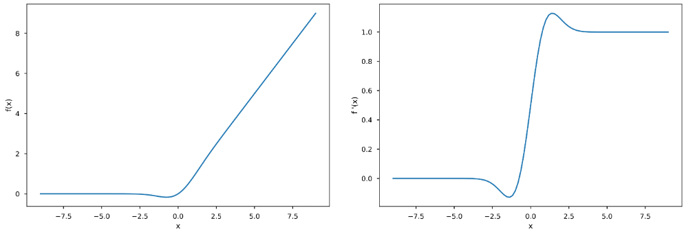
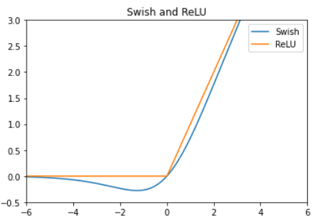
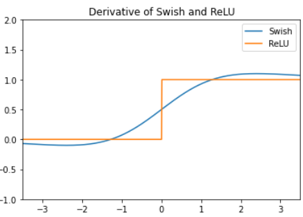

# Sigmoid Linear Unit (SiLU) : from GELU to MiSH

Smooth function과 ReLU의 장점을 조합한 `ELU`(2015)를 넘어서는 성능을 보이며 보다 복잡한 task의 ANN에 많이 사용되는 activation functions는 `Swish`라는 이름으로 더 유명한 Sigmoid Linear Unit (`SiLU`)임. 실제로 `GELU`(2016)를 통해 `smoothness`의 장점과 `monotonic`과 `non-convex`를 만족하는 activation function의 유용성이 증명되었고, `SiLU`(2016,2017)와 `MiSH`(2019) 등이 제안됨.

> 이 중 복잡도와 성능이 균형잡혔고 mobilenet등의 실적이 알려진 `SiLU`가 가장 널리 사용되고 있음.

`SiLU`는 이명으로 `Swish`라고도 불리며, 

* smooth, 
* non-convex and 
* non-monotonic 

variants of ReLU의 대표적 activation function임.

* `SiLU` was developed with influenced from `GELU`  

---

## Smooth, non-convex and non-monotonic variant of ReLU 의 시작 : GELU

`ELU` 까지는 activation functions 의 경우 

* `monotonic` 과 
* `convexity` 라는 

특성을 가지고 있었음. 

<figure markdown>
{width="400" align="center"}
</figure>

하지만 2016년 ***Gaussian Error Linear Unit*** (`GELU`)가 기존의 activation functions 이상의 성능을 보임에 따라, `monotonic` 하지 않고 `convexity` 도 만족하지 않는 smooth 한 activation function 이 많이 이용되기 시작함.

[Dan Hendrycks and Kevin Gimpel, “Gaussian Error Linear Units (GELUs)”, arXiv preprint arXiv:1606.08415 (2016)](https://arxiv.org/abs/1606.08415).

---

### Gaussian Error Linear Unit (GELU)

$$\text{GELU}(x) =x \Phi (x)$$

* standard ***Gaussian Cumulative Distribution Function*** $\Phi(x)$를 이용함.
* `ReLU`계열보다 훨씬 연산량이 많지만, 복잡한 task에서 `ELU`를 포함 기존의 activation function들보다 우수한 성능을 보임

`GELU`는 ^^좋은 성능을 보이지만 연산량이 많다는 단점^^ 을 가지고 있음. 
`GELU`를 제안한 논문에서 ***Sigmoid Linear Unit*** (`SiLU`)를 같이 제안하고 이를 `GELU`와 비교하였다는 점임.

해당 논문에서는 `SiLU`는 GELU보다 떨어지는 성능으로 보고되었으나, 이후 더 단순한 수식임에도 GELU를 거의 그대로 모사할 수 있는 ***Generalization*** 이 이루어지면서 보다 많이 사용이 되기 시작함.

---

## Sigmoid Linear Unit (SiLU or Swish)

> 대표적 CNN 중 하나인 `mobilenet`에서 사용됨.

<figure markdown>
{width="400" align="center"}
</figure>

`SiLU`는 다음과 같이 sigmoid function을 기반으로 ReLU 및 GELU와 매우 흡사한 shape의 activation function을 만들 수 있음.

$$\text{SiLU}(x)=x \sigma(x)$$

* $\sigma (x)=\frac{1}{1+e^{-x}}$ : sigmoid function

아래 논문이 `SiLU`를 재발견한 논문임.

[Prajit Ramachandran et al., “Searching for Activation Functions”, arXiv preprint arXiv:1710.05941 (2017).](https://arxiv.org/abs/1710.05941)

`SiLU`의 경우, sigmoid function의 input에 $\beta$로 scaling을 하는 generalization을 통해, GELU와 거의 동등한 동작 (연산의 측면에서는 `GELU`보다 우수함)보이도록 만들 수 있으며, 보다 나은 성능을 얻을 수 있는 것으로 알려짐.

$$ \text{SiLU}_{\beta} = x \sigma (\beta x) \\ \text{GELU}(x) \approx x \sigma (1.702 x) = \text{SiLU}_{\beta=1.702}(x)$$

`SiLU`는 `Swish`라는 이름으로 더 유명하며 Keras 등에서 `GELU`와 함께 제공됨 (단점은 generalized SiLU는 아님)

> `PReLU`와 같이 `SiLU`도 $\beta$를 trainable parameter로 삼는 parameterized Siwsh도 있음 (역시 적은 학습데이터에선 over-fit할 확률이 커짐)

---

### SiLU 미분

$$\dfrac{d}{dx}\text{SiLU}(x) = \text{SiLU}(x) + \sigma (x)(1-\text{SiLU}(x))$$

<figure markdown>
{width="400" align="center"}
</figure>

$$\begin{aligned} \dfrac{d}{dx}f(x) &= 1\sigma(x) + x\sigma(x)(1-\sigma(x)) \\ &= \sigma(x) + x\sigma(x)-x(\sigma(x))^2 \\ &= \sigma(x) + f(x)- f(x)\sigma(x) \\&=\sigma(x) +f(x)(1-\sigma(x))\end{aligned}$$

---

## 참고 : Mish

2019년에 Diganta Misra가 제안한 또다른 non-monotonic activation function `Mish`가 `Swish`나 `GELU` 보다 좀 더 나은 성능을 보이는 것으로 보고함.

[Mish: A Self Regularized Non-Monotonic Activation Function](https://arxiv.org/abs/1908.08681)

smooth function이면서 non-convex이고 non-monotonic하다는 특성을 가지며, `softplus`와 hyperbolic tangent를 조합한 activation function임.

$$\text{mish}(x)=x \text{tanh}(\text{softplus}(x)) = \text{tanh}(\log (1+e^x))$$

* negative input에 대해선 `Swish`와 비슷
* positive input에 대해선 `GELU`와 비슷.

## References

* [Hyperbolic Tangent Function (tanh)](https://dsaint31.tistory.com/577)
* [Softplus](https://dsaint31.tistory.com/250)
* [Hands-On Machine Learning with Scikit-Learn, Keras, and TensorFlow, 3rd Edition](https://learning.oreilly.com/library/view/hands-on-machine-learning/9781098125967/)