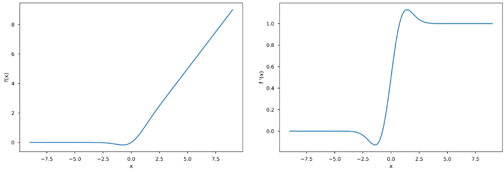
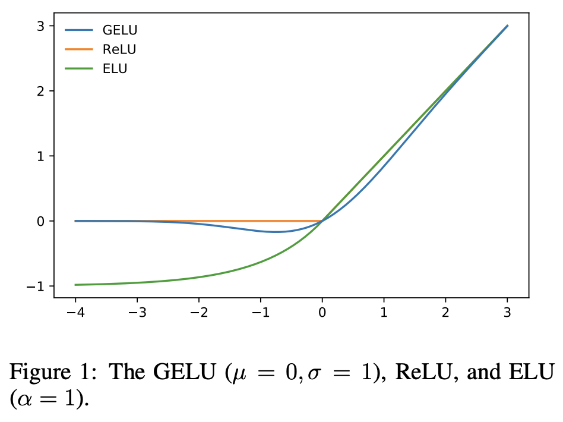
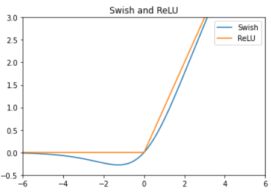
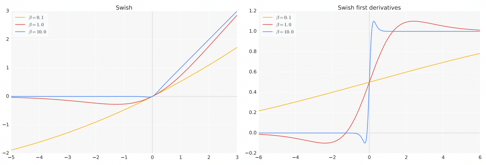
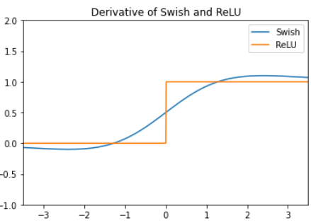
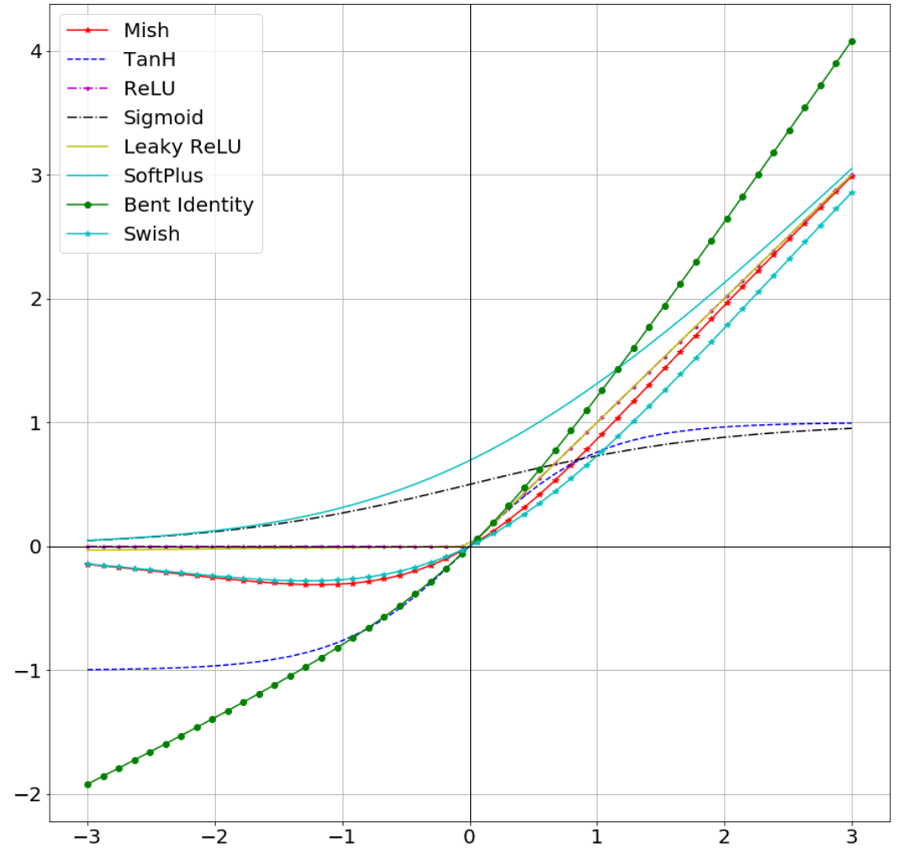

# Sigmoid Linear Unit (SiLU) : from GELU to MiSH

SiLU 는 Sigmoid Linear Unit 의 약자로

* `ELU` 이후 등장한 smooth activation function 계열 중 하나로,
* 여러 실험에서 ReLU 계열의 대안으로 좋은 성능을 보인 activation function
* 현재 deeper model이나 복잡한 dataset에서 ReLU의 대안으로 사용되는 추세임.
* Swish라는 이름으로도 잘 알려짐.

`SiLU`는 이명으로 `Swish`라고도 불리며, 
variants of ReLU 중 다음의 특성을 가지는 대표적 activation function 임:

* smooth, 
* non-convex and 
* non-monotonic

> 정확히 애기하면, 다음과 같음:
>
> $\text{SiLU}(x) = x \sigma(x) = \left. x \sigma(\beta x) \right|_{\beta=1} = \text{Swish}_{\beta=1}(x)$

역사적으로는 

* `GELU` 이후, 
* smooth하면서 non-monotonic한 ReLU 계열 activation function들이 더 주목받기 시작함.
* `Swish`는 이러한 흐름 속에서 제안된 activation function으로 볼 수 있음.

---

---

## Smooth, non-convex and non-monotonic variant of ReLU 의 시작 : GELU

`ELU` 까지의 activation functions 의 경우  
다음의 특성을 공유함:

* `monotonic` 과 
* `convexity` 

{style="display:block; margin:0 auto; width:400px"}

하지만 2016년 등장한 ***Gaussian Error Linear Unit*** (`GELU`)가  
기존의 activation functions 이상의 성능을 보임에 따라,  
`monotonic` 하지 않고 `convexity` 도 만족하지 않는 smooth 한 activation function 이 많이 이용되기 시작함.

[Dan Hendrycks and Kevin Gimpel, “Gaussian Error Linear Units (GELUs)”, arXiv preprint arXiv:1606.08415 (2016)](https://arxiv.org/abs/1606.08415).

---

### Gaussian Error Linear Unit (GELU)

{style="display:block; margin:0 auto; width:400px"}

$$\begin{aligned}\text{GELU}(x) &=x \Phi (x)\\&=xP(X\le x),\quad X \sim \mathcal{N}(0,1)\end{aligned}$$

* standard ***Gaussian Cumulative Distribution Function (CDF)*** $\Phi(x)$를 이용함.
    * $x$가 충분히 크면, $\Phi(x) \approx 1$ 이므로 거의 그대로 통과.
    * $x \approx 0$ 면, $\Phi(x) \approx 0.5$ 이므로 절반 정도만 반영됨.
    * $x$가 음의 무한대에 가까우면, $\Phi(x) \approx 0$이므로 거의 제거됨.
* $x$를 얼마나 통과시킬지를 Gaussian CDF 를 이용하여 부드럽게 조절! 
* `ReLU`계열보다 훨씬 연산량이 많지만, 복잡한 task에서 `ELU`를 포함 기존의 activation function들보다 우수한 성능을 보임

`GELU`는 ^^좋은 성능을 보이지만 연산량이 많다는 단점^^ 을 가지고 있음. 
`GELU`를 제안한 논문에서 ***Sigmoid Linear Unit*** (`SiLU`)를 같이 제안하고 이를 `GELU`와 비교하였다는 점임.

해당 논문에서는 `SiLU`는 GELU보다 떨어지는 성능으로 보고되었으나, 이후 더 단순한 수식임에도 GELU를 거의 그대로 모사할 수 있는 ***Generalization*** 이 이루어지면서 보다 많이 사용이 되기 시작함.

> 수식상으로는 error function을 이용하여 표현
>
> $\Phi(x)=\frac{1}{2}\left[ 1+\text{erf}\left( \frac{x}{\sqrt{2}} \right) \right]$
>
> 하지만, 실제 구현에선 다음의 근사식이 더 많이 이용됨:
>
> $\text{GELU}(x)\approx 0.5x \left[1+\tanh \left(\sqrt{\frac{2}{\pi}}(x+0.044715 x^3) \right)\right]$
>
> 파이토치의 경우, `nn.GELU(approximate='tanh')`를 통해 위 근사식을 사용 가능.

---

## Sigmoid Linear Unit (SiLU or Swish)

> MobileNetV3 계열에서 `Swish`를 계산량 측면에서 단순화한 `hard-swish`가 사용됨..

{style="display:block; margin:0 auto; width:400px"}

{style="display:block; margin:0 auto; width:400px"}
  
`SiLU`는 다음과 같이 sigmoid function을 기반으로 `ReLU` 및 `GELU`와 매우 흡사한 shape의 activation function을 만들 수 있음.

$$\text{SiLU}(x)=x \sigma(x)$$

* $\sigma (x)=\frac{1}{1+e^{-x}}$ : [sigmoid function](https://dsaint31.tistory.com/577)

아래 논문이 `SiLU`를 재발견한 논문임.

[Prajit Ramachandran et al., “Searching for Activation Functions”, arXiv preprint arXiv:1710.05941 (2017).](https://arxiv.org/abs/1710.05941)

`SiLU`의 경우, [sigmoid function](https://dsaint31.tistory.com/577)의 ***input에 $\beta$로 scaling을 하는 generalization*** 을 통해, GELU와 거의 동등한 동작 (연산의 측면에서는 `GELU`보다 우수함)보이도록 만들 수 있으며, 보다 나은 성능을 얻을 수 있는 것으로 알려짐.

$$\begin{aligned}\text{SiLU}_{\beta} &= x \sigma (\beta x) \\\\ \text{GELU}(x) &\approx x \sigma (1.702 x) \\ &= \text{SiLU}_{\beta=1.702}(x)\end{aligned}$$

TensorFlow/Keras에서는 `silu` 또는 `swish`라는 이름으로 제공되며,
기본 수식은 다음과 같음.

$$\text{SiLU}(x)=x\sigma(x)$$

> `PReLU`와 같이 `SiLU`도 $\beta$를 trainable parameter로 삼는 parameterized Siwsh도 있음 (역시 적은 학습데이터에선 over-fit할 확률이 커짐)

---

### SiLU 미분

$$\dfrac{d}{dx}\text{SiLU}(x) = \text{SiLU}(x) + \sigma (x)(1-\text{SiLU}(x))$$

{style="display:block; margin:0 auto; width:400px"}

$$\begin{aligned} \dfrac{d}{dx}f(x) &= 1\sigma(x) + x\sigma(x)(1-\sigma(x)) \\ &= \sigma(x) + x\sigma(x)-x(\sigma(x))^2 \\ &= \sigma(x) + f(x)- f(x)\sigma(x) \\&=\sigma(x) +f(x)(1-\sigma(x))\end{aligned}$$

---

## 참고 : Mish

2019년에 Diganta Misra가 제안한 또다른 non-monotonic activation function 이 `Mish`.

* 해당 논문에 따르면
* 여러 CNN benchmark에서 `Swish`나 `GELU` 와 비교하여
* 동등 또는 좀 더 나은 성능을 보임.

[Mish: A Self Regularized Non-Monotonic Activation Function](https://arxiv.org/abs/1908.08681)

smooth function이면서 non-convex이고 non-monotonic하다는 특성을 가지며, `softplus`와 hyperbolic tangent를 조합한 activation function임.

$$\text{mish}(x)=x \text{tanh}(\text{softplus}(x)) = x \text{tanh}(\log (1+e^x))$$

* negative input에 대해선 `Swish`와 비슷
* positive input에 대해선 `GELU`와 비슷.

`Swish`와 비교하여 `Mish`는 좀더 강한 regularization 효과를 가지면서 gradient가 보다 smooth하다고 알려짐.

{style="display:block; margin:0 auto; width:400px"}

---

## References

* [Hyperbolic Tangent Function (tanh)](https://dsaint31.tistory.com/577)
* [Softplus](https://dsaint31.tistory.com/250)
* [Hands-On Machine Learning with Scikit-Learn, Keras, and TensorFlow, 3rd Edition](https://learning.oreilly.com/library/view/hands-on-machine-learning/9781098125967/)
* [[논문읽기]Mish(2019), A Self Regularized Non-Monotonic Activation Function](https://deep-learning-study.tistory.com/636)
