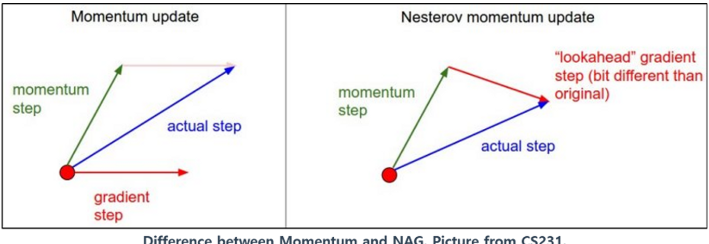

# Nesterov Accelerated Gradient

Yurii Nesterov가 1983년 momentum을 개선한 Nesterov Accelerated Gradient를 제안함.  
`NAG`로 많이 불림.

Momentum과 비교하면 다음의 차이를 보임.



* Gradient를 구할 때, 다음 step으로 우선 momentum에 따라 inertia의 방향으로 먼저 이동한 후 gradient를 구한다는 차이가 있음.
    * 기존의 momentum : $\nabla_{\boldsymbol{\theta}}J(\boldsymbol{\theta}_t)$
    * NAG : $\nabla_{\boldsymbol{\theta}}J(\boldsymbol{\theta}_t+\gamma \textbf{m}_{t})$
* 이 같은 gradient를 ***look-ahead gradient*** 라고 부름.
* 이경우 최적값에 해당하는 minimum에서 기존 Momentum 방법이 요동치는 단점이 줄어드는 효과를 가져옴.

수식으로 살며보면 다음과 같음.

우선 momentum이 다음과 같이 변경됨.

$$\begin{aligned} \textbf{m}_{t+1}&=\gamma \textbf{m}_t - \eta\nabla_{\boldsymbol{\theta}}J(\boldsymbol{\theta}_t+\gamma \textbf{m})\\ \textbf{m}_0 &= \textbf{0}\end{aligned}$$

model의 parameter vector의 업데이트는 다음과 같음.

$$
\boldsymbol{\theta}_{t+1} = \boldsymbol{\theta}_{t} + \textbf{m}_t 
$$

## Keras에서의 구현.

`tf.keras.optimizers.SGD` optimizer를 생성할 때, `momentum` parameter에 momentum coef.를 지정하고, `nesterov` parameter에 `True`를 넘겨주면 NAG optimizer를 생성함. (이를 모델의 `fit`에 넘겨주면 됨.)

```Python
optimizer = tf.keras.optimizers.SGD(learning_rate=0.001, 
                                    momentum=0.9,
                                    nesterov=True)
```