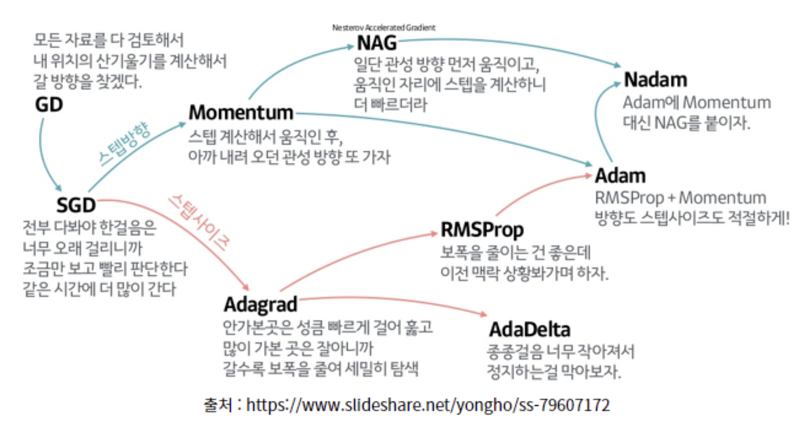

# Optimizers

Optimizer는 
* 주어진 손실 함수(loss function)를 최소화하기 위해
* 모델의 parameters를 어떤 규칙에 따라 업데이트할지를 정의하는 알고리즘

parameters의 수가 적은 단순한 모델들의 경우 
* 2차 미분 정보를 활용하는 Hessian 계열 (Newton's Method)이 사용(이론적으로는 보다 빠른 수렴을 제공)되기도 하나,
* ***Deep Neural Network에선 Gradient 계열 만이 사용됨.***
   * parameters의 수의 square에 비례하는 연산을 요구하는 Hessian 계열은
   * **메모리 문제** 와 함께 **너무 느린 학습 속도 (~계산량)** 로 인해 DNN 에 적합하지 않음.

> Adaptive learning rate 를 위해,  
> 이차미분의 Hessian matrix 대신,
> [Exponential Moving Average](https://dsaint31.tistory.com/860) of "gradient square (=2nd moment)" 등이 사용됨.

---

## Gradient 계열 Optimizers

<figure markdown>
{width="600" align="center"}
</figure>

### 대표적인 알고리즘의 요약.

* [Batch Gradient Decent](https://dsaint31.tistory.com/860) (or Vanilla Gradient Decent, Batch GD) : 1950s ~
    * Gradient 기반 최적화의 가장 기본적인 형태
    * 전체 데이터셋을 사용하여 한 번의 파라미터 업데이트를 수행함 (1epoch = 1step).
    * 수렴은 안정적이나 데이터 규모가 커질수록 계산 비용이 큼.
* [Stochastic Gradient Decent (SGD)](https://dsaint31.tistory.com/860) : 1951 (Robbins-Monro)
    * 하나의 데이터 샘플만을 사용하여 파라미터 업데이트 수행.
    * Batch GD의 느린 업데이트 문제를 해결함.
    * 업데이트 분산이 크고 noisy하나 빠른 탐색이 가능함.
* [Mini-batch GD](https://dsaint31.tistory.com/860) : 1980s
   * Batch GD와 SGD의 중간형.
   * 여러 샘플을 묶은 mini-batch 단위로 업데이트 수행.
   * 현재 DL 의 사실상 표준 방식.
* [Momentum](op_momentum.md) : 1986 (Rumelhart et al.) 
   * 이전 업데이트 방향을 누적하여 현재 gradient에 반영.
   * 업데이트 방향의 안정화
   * saddle point에서의 탈출 가속
   * ravine(협곡, 골짜기) 구조에서 fluctuation 감소.
* [Nesterov Accelerated Gradient(NAG)](./op_nesterov.md) : 1983 (Nesterov)
   * 수학적 최적화 이론(Convex Optimization)에서는 Momentum보다 먼저 등장했으나,
   * DL 에서는 Momentum이 먼저 도입됨(Rumelhart 라는 이름이...)
   * 이후 Momentum의 개선형으로 재해석되어 DL등에서 도입됨 배경을 가짐.
   * Momentum 방향으로 미리 이동한 미래 위치에서 gradient를 계산.
   * 해당 gradient와 기존 momentum을 결합하여 현재 위치에서 업데이트 수행.
   * [Momentum](op_momentum.md) 대비 수렴 근처에서의 요동이 줄어들며 안정성이 향상됨: Convex optimization 이론에서 보다 강한 수렴 보장을 가짐.
* [Adagrad](./op_adagrad.md) : 2011
   * 학습이 진행되면서 parameter들의 업데이트되는 크기가 각기 다른 점을 반영하여,
   * 각 parameter별로 과거 gradient 제곱합을 누적하여 업데이트가 크게 일어난 parameter일수록 learning rate를 감소시킴.
   * Adaptive learning rate를 최초로 본격 도입한 알고리즘.
   * Sparse feature 에는 강하나, **learning rate 가 지나치게 빠르게 감소** 하는 단점 존재.
* [RMSprop](./op_rmsprop.md) : 2012 (Hinton's Lecture note)
   * Adagrad의 learning rate가 지나치게 이른 학습 단계에서 소실되는 문제 (누적합 방식의 문제)를 해결하기 위해
   * "gradient의 square"(2nd moment)의 exponential moving average 으로 누접합 을 대체한 알고리즘.  
   * Parameter-wise step scaling (~adaptive learning rate) 를 통해 보다 안정적인 lr을 제공.
   * fine-tuning 등에서 많이 애용됨.  
* Adadelta : 2012
   * RMSProp과 함께, Adagrad의 지나치게 빠른 learning ratio 감소를 해결하기 위해 제안된 방법.
   * 가장 큰 특징은 global learning rate($\eta$) 하이퍼파라미터를 명시적으로 사용하지 않는다는 점임.
   * 즉, 전통적인 의미의 global learning rate를 대신하여
   * gradient의 변화량과 parameter 업데이트의 변화량 모두에 EMA를 적용하고,
   * 이 두 값을 비율로 사용하여 step size를 자동으로 조절함.
   * Learning rate를 제거했다기보다는 내부 메커니즘으로 대체한 방식.
* [Adam](./op_adam.md) : 2014
   * [Momentum](./op_momentum.md)(=gradient's 1st moment)과 [RMSProp](./op_rmsprop.md)(=gradient's 2nd moment)를 결합한 알고리즘.
      * 1차 moment: gradient의 방향 안정화
      * 2차 moment: gradient 크기(scale) 추정
   * 동시에 Bias correction을 도입하여 초기 학습 불안정성 완화.
   * Parameter-wise adaptive learning rate 제공.
   * 현대 딥러닝에서 가장 널리 사용되는 optimizer 중 하나 (사실 이의 variant인 [AdamW](./op_adamw.md) 가 가장 널리 사용되는 Optimizer) 
* AdaMax : 2014
   * **[Adam](./op_adam.md)에서 사용된 gradient의 square를 이용한 L2-norm** 대신
   * **L$\infty$-norm (=Max값)으로 대체** 하여 보다 안정적인 학습을 가능하게 함.
   * Extreme gradient 상황에서 수치적 안정성이 높음.
   * 일반적으로 [Adam](./op_adam.md)이 보다 많이 사용됨.
* [NAdam](./op_nadam.md) : 2016
   * [Adam](./op_adam.md) 에서 사용된 momentum 대신에
   * [NAG](./op_nesterov.md)를 적용.
   * 일부 문제에서 더 빠른 수렴속도와 향상된 성능을 보임.
* **[AdamW (Adam with Decoupled Weight Decay)](./op_adamw.md) - 2017 (Loshchilov & Hutter)** **
   * Adam의 구조적 결함을 수정한 매우 중요한 변형: 정규화 해석을 바로잡은 결정적 개선
   * 기존 Adam의 문제점:
      * L2 regularization이 gradient 기반 업데이트에 섞여 들어가
      * adaptive learning rate와 weight decay가 결합되어 의도한 정규화 효과가 왜곡됨
   * AdamW의 핵심 아이디어:
      * Weight decay를 gradient 업데이트와 완전히 분리(decoupled)
      * Parameter 업데이트 이후에 별도로 decay 적용
   * 정규화 효과가 이론적으로 명확해짐
      * 일반화 성능 향상
      * 현재 Transformer 계열 및 HuggingFace Trainer의 기본 optimizer  

---

다음 두 이미지는 Gradient Optimizers의 동작을 잘 보여줌.

* Images credit: [Alec Radford](https://twitter.com/alecrad).
* [참고 사이트: cs231n](https://cs231n.github.io/neural-networks-3)

<figure markdown>
{width="400" align="center"}
</figure>

* Contours of a loss surface and time evolution of different optimization algorithms. (별모양이 최적값임)
    * Momentum 기반의 알고리즘들(`Momentum`와 `NAG`)에서 ***overshooting*** 이 보임. (hill에서 공을 아래로 굴릴 때 보이는 왔다갔다하와 동작.)

<figure markdown>
{width="400" align="center"}
</figure>

* A visualization of a saddle point in the optimization landscape, where the curvature along different dimension has different signs (one dimension curves up and another down). 
    * `SGD`는 제대로 최소값으로 나가지 못하는 것을 확인할 수 있음.
        * ***고정된 learning rate를 사용하는 경우, local minima에 매우 취약함*** 을 알 수 있음.
    * ***Adaptive learning ratio계열*** 의 (`Adagrad`, `Adadelta`, `RMSprop`) 알고리즘들은 효과적으로 학습이 이루어짐을 확인 가능함.

---

---

## References

* Sebastian Ruder's [An overview of gradient descent optimization algorithms](https://arxiv.org/abs/1609.04747)
* [Unit Tests for Stochastic Optimization](https://arxiv.org/abs/1312.6055)
* [CS231n Convolutional Neural Networks for Visual Recognition](https://cs231n.github.io/neural-networks-3)
* HiddenBeginner's [딥러닝 최적화 알고리즘 알고 쓰자. 딥러닝 옵티마이저(optimizer) 총정리](https://hiddenbeginner.github.io/deeplearning/2019/09/22/optimization_algorithms_in_deep_learning.html)
