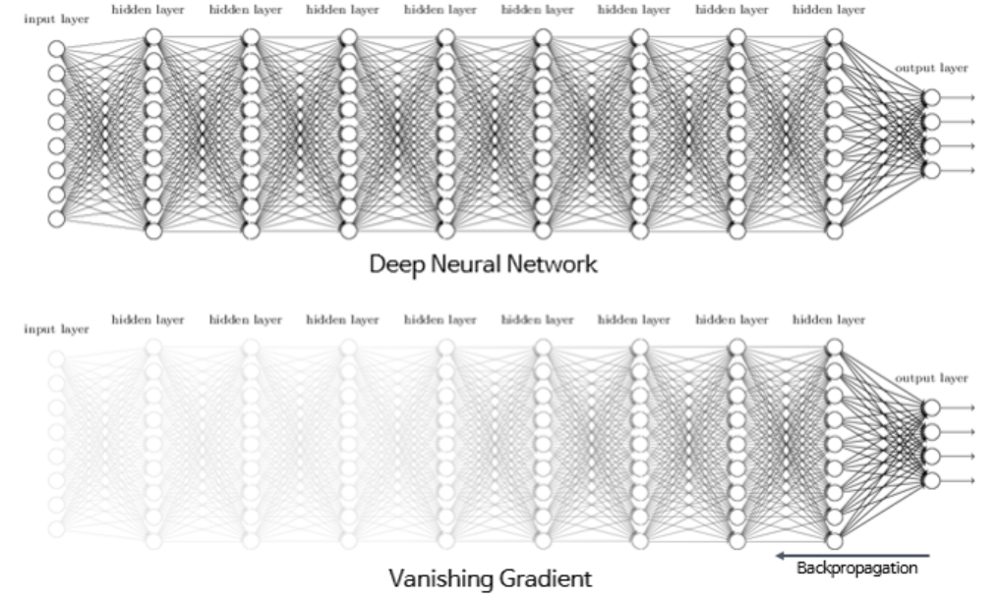

# Solutions for the Gradient Vanishing or Exploding Problem

ANN이 1990년대 부활의 싹을 틔우고 있을 때에 가장 큰 문제점은 바로 Gradient Vanishing (and Exploding) Problem이었다.

---

## Gradient Vanishing and Exploding Problems

Back-propagation의 경우, forward-flow와 backward-flow 두 단계로 수행되고, backward-flow에서는 loss function의 partial derivatives (=error gradient)가 output에서 input으로 전달되게 되는데,  
ANN이 깊을 경우 해당 gradient가 output에서 작은 값으로 시작되면 중간에 너무 작은 값이 되어 input에 가까울 layers의 weights를 제대로 update하지 못하고 소실되는 문제가 발생한다.

이를 Gradient Vanishing Problem이라고 부르며, 반대로 Gradient가 지나치게 증폭되어 model이 diverge하는 경우가 Gradient Exploding Problem임.

ANN의 경우 깊어져야 task에 대한 representative feature를 얻어낼 수 있는데, Gradient vanishing은 이를 막는 가장 큰 문제점이었다.

---

이를 막기 위한 방법들은 다음과 같음.

* [적절한 Weight Initialization과 Activation Function의 조합 사용하기](https://dsaint31.me/mkdocs_site/ML/ch09/weight_initializations/).
* [Batch Normalization](https://dsaint31.me/mkdocs_site/ML/ch09/batch_normalization/)
* Gradient Clipping