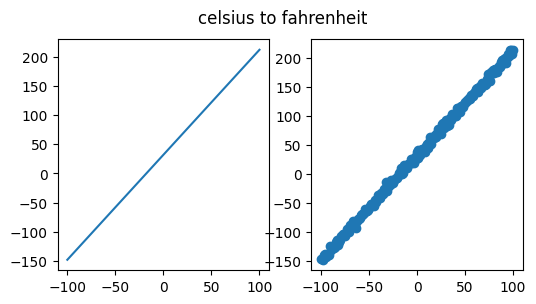
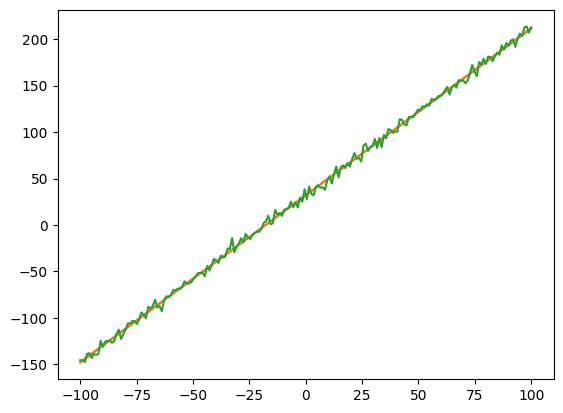
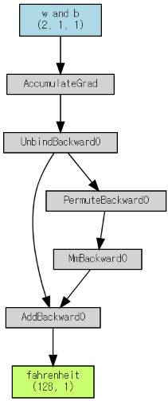
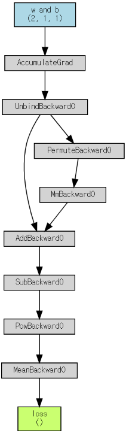
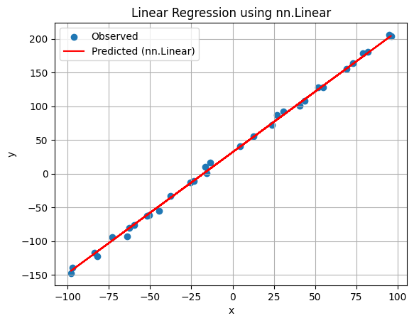

# PyTorch로 직접 구현해보는 Linear Regression

## 1. Linear Regression의 기본 개념

Linear Regression은

* 입력 $x$ 와 출력 $y$ 사이의 관계를
* linear transform 으로 
* 근사하는 regression model임.

일반적으로 다음과 같이 표현함.
$$
\hat{y} = \mathbf{w}^{\top}\mathbf{x} + b
$$

입력이 하나인 경우에는 다음처럼 쓸 수 있음.
$$
\hat{y} = wx + b
$$

| 기호        | 의미          |
| --------- | ----------- |
| $x$       | 입력값         |
| $y$       | 실제 정답값      |
| $\hat{y}$ | model의 예측값  |
| $w$       | weight, 기울기 |
| $b$       | bias, 절편    |

> 엄밀하게 말하면
> $wx + b$ 는 linear transform이 아니라 
> affine transform임.
> 
> * 순수한 linear transform은 원점을 지나야 하지만,
> * bias $b$ 가 있으면 직선이 위아래로 이동할 수 있기 때문임.
>
> affine transform은 homogeneous coordinate를 사용하면
> 한 차원 더 높은 공간에서 linear transform으로 표현할 수 있음.
> 

Machine learning에서는 관례적으로 이 형태의 model을 linear regression이라고 부름.


* 참고자료: [Affine vs. Linear](https://dsaint31.tistory.com/652)
* 참고자료: [Linear Regression](https://dsaint31.tistory.com/960)

---

---

## 2. 실습 예제: Celsius에서 Fahrenheit 예측하기

이번 예제에서는 Celsius를 입력으로 받아 Fahrenheit를 예측하는 문제를 다룸.

Celsius $x$ 를 Fahrenheit $y$ 로 변환하는 식은 다음과 같음: 
$$
y = 1.8x + 32
$$

* $x$: Celsius
* $y$: Fahrenheit

---

### 2.1 사용한 Libraries 

필요한 library를 import함.

```python
import torch
import numpy as np

from torchviz import make_dot
from IPython.display import display, Math, Latex

for c in [torch, np]:
    print(c.__version__)
```

실행 환경의 version은 다음과 같음.

```text
2.11.0+cpu
2.0.2
```

---

### 2.2 데이터 생성

실험 결과를 재현하기 위해 random seed를 고정함.

```python
torch.manual_seed(23)
np.random.seed(23)
```

데이터 생성 함수는 다음과 같음.

```python
def gen_xy(cnt, std=4.):
    x = np.linspace(-100, 100, cnt)
    y_ideal = 1.8 * x + 32.
    y = y_ideal + std * np.random.randn(cnt)

    x = torch.tensor(x).float().reshape(-1, 1)
    y = torch.tensor(y).float().reshape(-1, 1)
    y_ideal = torch.tensor(y_ideal).float().reshape(-1, 1)

    return x, y, y_ideal
```

* `x`는 $-100$ 부터 $100$ 까지의 Celsius 값임.
* `y_ideal`은 이상적인 Fahrenheit 값임.
* `y`는 `y_ideal`에 noise를 추가한 값임.
    * `std`는 noise의 크기를 조절함.

다음처럼 200개의 sample을 생성함.

```python
sample_cnt = 200

x, y, y_ideal = gen_xy(sample_cnt)
```

데이터를 시각화하면 다음과 같음.

```python
import matplotlib.pyplot as plt

fig, axes = plt.subplots(1, 2, figsize=(6, 3))

axes[0].plot(x.detach(), y_ideal.detach())
axes[1].scatter(x.detach(), y.detach())

fig.suptitle('celsius to fahrenheit')

print(x.shape, y.shape, y_ideal.shape)
```

{style="display: block; margin: 0 auto; width:500px"}

* 왼쪽 그래프는 noise가 없는 이상적인 직선이고,
* 오른쪽 그래프는 noise가 추가된 학습 데이터임.

출력 shape은 다음과 같음.

```text
torch.Size([200, 1]) torch.Size([200, 1]) torch.Size([200, 1])
```

---

### 2.3 NumPy array를 PyTorch tensor로 변환

`gen_xy()` 내부에서 NumPy array를 PyTorch tensor로 변환함.

```python
x = torch.tensor(x).float().reshape(-1, 1)
y = torch.tensor(y).float().reshape(-1, 1)
y_ideal = torch.tensor(y_ideal).float().reshape(-1, 1)
```

* `torch.tensor()`는 NumPy array를 PyTorch tensor로 변환함.
* `.float()`는 dtype을 `torch.float32`로 변환함.

참고로, `.reshape(-1, 1)`은 data shape을 다음 형태로 맞춤.
$$(\text{sample 수}, \text{feature 수})$$

이번 예제에서는 feature가 
Celsius 하나이므로 shape은 다음과 같음.

```text
torch.Size([200, 1])
```

> scalar로 처리해도 되지만, 보통 matrix 형태를 가지는 게 일반적이므로 억지로라도 matrix로 처리함.

---

### 2.3 Train, Test, Validation 데이터 분리

전체 데이터를 train set과 test set으로 나눔.

```python
from sklearn.model_selection import train_test_split

X_train, X_test, y_train, y_test = train_test_split(
    x,
    y,
    test_size=0.2,
)
```

train set을 다시 train set과 validation set으로 나눔.

```python
X_train, X_valid, y_train, y_valid = train_test_split(
    X_train,
    y_train,
    test_size=0.2,
)
```

최종 데이터 구성은 다음과 같음.

| 데이터          | sample 수 | 용도           |
| -------------- | -------: | ------------ |
| train set      |      128 | parameter 학습 |
| validation set |       32 | 학습 중 확인      |
| test set       |       40 | 최종 평가        |

---

---

## 3. Linear Regression Model 직접 구현하기

### 3.1 Custom Linear Model

linear model을 직접 function으로 구현하는 것에서 출발.

```python
def ds_linear_model(x, w, b):
    ret_v = torch.matmul(x, w.T) + b
    tmp = x @ w.T + b

    assert torch.allclose(ret_v, tmp)

    return ret_v
```

이 함수는 기본적으로 다음 식을 계산함:
$$
\hat{y} = xw + b
$$

`@`는 matrix multiplication 연산자임.

* 때문에 `torch.matmul()`을 이용한 경우가 같은 결과여야 함.
* 두 계산 결과가 같은지 다음 코드로 확인함.

```python
assert torch.allclose(ret_v, tmp)
```

---

### 3.2 Custom Loss Function: MSE

Mean Squared Error (MSE)는 다음과 같이 정의됨:
$$
L = \frac{1}{n}
\sum_{i=1}^{n}
(\hat{y}_i - y_i)^2
$$

직접 구현하면 다음과 같음.

```python
def loss_fnc(pred, label):
    assert pred.shape == label.shape
    mse = ((pred - label) ** 2).mean()
    return mse
```

* `assert pred.shape == label.shape`는 예측값과 정답값의 shape이 같은지 확인함.
* 위 코드는 예측 오차를 제곱한 뒤 평균을 냄.

---

### 3.3 Parameter 초기화

linear model의 parameter는 $w$, $b$ 두 개임.

```python
w = torch.ones((1, 1))
b = torch.zeros((1))
```

* matrix 형태로 맞추기 위해 처리함.

---

---

## 4. 학습 전 동작 확인

### 4.1 Prediction 확인

초기 parameter로 prediction을 수행하여 입출력 shape등을 체크할 것:

```python
pred = ds_linear_model(x, w, b)

pred.dtype, pred.shape
```

출력은 다음과 같음.

```text
(torch.float32, torch.Size([200, 1]))
```

현재 $w=1$, $b=0$ 이므로 model은 다음을 계산함:
$$
\hat{y} = x
$$

하지만 실제 데이터는 다음 관계를 바탕으로 생성됨:
$$
y \approx 1.8x + 32
$$

현재 학습이 되지 않았기 때문에  
weight와 bias가 초기값 그대로이므로  
결과도 제대로 된 값을 원하는 것이 아님.

이는 입출력의 shape가 설계한대로 나오는지 확인하고 모델의 동작만을 확인하기 위한 절차임.

---

### 4.2 Loss Function 확인

직접 만든 loss function을 간단히 테스트함.

```python
l = loss_fnc(pred + 1, pred)

l.dtype, l
```

* 위 경우, `pred + 1`과 `pred`는 모든 원소가 1만큼 차이나도록 한 인자들임.
* 따라서 MSE는 1이 되어야 한다.

```text
(torch.float32, tensor(1.))
```

---

### 4.3 PyTorch의 `nn.MSELoss`와 비교

PyTorch의 `nn.MSELoss`와 직접 구현한 MSE를 사용해도 된다.

다음 코드는 앞서 만든 custom loss와 `nn.MSELoss` 가 같은 동작을 함을 확인하는 코드임:

```python
import torch
import torch.nn as nn

pred   = torch.tensor([2.0, 3.0, 4.0], requires_grad=True)
target = torch.tensor([1.0, 2.0, 3.0])

mse_loss_fn = nn.MSELoss()

print(f"타입: {type(mse_loss_fn)}")
print("nn.MSELoss는 클래스이며, 생성된 객체는 함수처럼 호출 가능.\n")

loss_nn = mse_loss_fn(pred, target)
loss_custom = ((pred - target) ** 2).mean()

print(f"nn.MSELoss 결과: {loss_nn.item():.4f}")
print(f"직접 구현한 MSE 결과: {loss_custom.item():.4f}")
```

출력은 다음과 같음.

```text
타입: <class 'torch.nn.modules.loss.MSELoss'>
nn.MSELoss는 클래스이며, 생성된 객체는 함수처럼 호출 가능.

nn.MSELoss 결과: 1.0000
직접 구현한 MSE 결과: 1.0000
```

AutoGrad 의 동작이 두 경우 모두 같은지를 gradient 값으로 비교함.

```python
pred.grad = None
loss_nn.backward(retain_graph=True)
grad_nn = pred.grad.clone()

pred.grad = None
loss_custom.backward()
grad_custom = pred.grad.clone()

print(f"nn.MSELoss의 gradient: {grad_nn}")
print(f"직접 구현한 gradient: {grad_custom}")
print(f"두 gradient가 동일한가? {torch.allclose(grad_nn, grad_custom)}")
```

출력은 다음과 같음.

```text
nn.MSELoss의 gradient: tensor([0.6667, 0.6667, 0.6667])
직접 구현한 gradient:   tensor([0.6667, 0.6667, 0.6667])
두 gradient가 동일한가? True
```

---

---

## 5. Gradient Descent의 기본 원리

### 5.1 Gradient Descent Update 식

Gradient Descent는 gradient의 반대 방향으로 parameter를 update함:
$$
\begin{aligned}
w_{t+1} &= w_t - \eta \frac{\partial L}{\partial w} \\\\
b_{t+1} &= b_t - \eta \frac{\partial L}{\partial b}
\end{aligned}
$$

* $\eta$ 는 learning rate임.

---

### 5.2 Numerical Method로 Gradient 근사하기

[central difference](https://dsaint31.tistory.com/540#Finite%20Difference%20(%EC%9C%A0%ED%95%9C%EC%B0%A8%EB%B6%84)%20%EC%A2%85%EB%A5%98-1-3)로 gradient를 근사함.

$w$ 에 대한 gradient는 다음처럼 근사함:
$$
\frac{\partial L}{\partial w}
\approx
\frac{ L(w + \delta, b) - L(w - \delta, b)}{2\delta}
$$

이를 구현한 코드는 다음과 같음:

```python
delta = 0.01
lr = 1e-2

w = torch.ones((1, 1))
b = torch.zeros((1, 1))

l = loss_fnc(ds_linear_model(X_train, w, b), y_train)

d_loss_d_w = (
    loss_fnc(ds_linear_model(X_train, w + delta, b), y_train)
    - loss_fnc(ds_linear_model(X_train, w - delta, b), y_train)
) / (2. * delta)
```

출력값은 다음과 비슷함.

```text
tmp = array(-5540.0024, dtype=float32)
```

따라서 현재 위치에서 $w$ 에 대한 gradient는 다음과 같음:
$$
\frac{\partial L}{\partial w} \approx -5540.0024
$$

$b$ 에 대한 gradient는 다음처럼 근사함:
$$
\frac{\partial L}{\partial b} \approx
\frac{ L(w, b + \delta) - L(w, b - \delta)}{2\delta}
$$

이에 대한 구현 코드는 다음과 같음:

```python
d_loss_d_b = (
    loss_fnc(ds_linear_model(X_train, w, b + delta), y_train)
    - loss_fnc(ds_linear_model(X_train, w, b - delta), y_train)
) / (2. * delta)
```

출력값은 다음과 비슷함.

```text
-69.470215
```

---

### 5.3 Parameter Update

계산한 gradient로 parameters를 update함.

```python
print(f"before: {w.item() = :8.2f}, {b.item() = :8.2f}")

w = w - lr * d_loss_d_w
b = b - lr * d_loss_d_b

print(f"after : {w.item() = :8.2f}, {b.item() = :8.2f}")
```

위 코드의 출력은 다음과 같은 형태임:

```text
before: w.item() =   222.60, b.item() =     2.78
after : w.item() =   278.00, b.item() =     3.47
```

---

### 5.4 Loss 감소 확인

update 후 loss를 다시 확인함.

```python
print(f'current loss: {l=}')

pred = ds_linear_model(X_train, w, b)
l_new = loss_fnc(pred, y_train)

print(f'new loss: {l_new=}')
```

출력은 다음과 같음.

```text
current loss: l=tensor(3330.0254)
new loss: l_new=tensor(9965081.)
```

l의 경우 loss가 크게 증가했음.

* 즉, 이 경우는 발산하는 상황임.
* 원인은 learning rate가 너무 큰 `1e-2` 이기 때문임.
* 발산하는 경우, learning rate를 줄여야 함.

이후 학습에서는 더 작은 learning rate인 $2 \times 10^{-4}$를 사용함.

---

---

## 6. Analytical Gradient 직접 계산하기

### 6.1 Numerical Gradient와 Analytical Gradient의 차이

Numerical gradient는

* parameter를 조금 변화시켰을 때 
* loss가 얼마나 변하는지를 이용하여 gradient를 근사함.

Analytical gradient는

* 미분식을 직접 구해 gradient를 계산함.

Numerical gradient는 미분식을 몰라도 사용할 수 있지만, parameter 수가 많으면 계산 비용이 큼.

Analytical gradient는 수식이 맞다면 더 빠르고 정확함.

> PyTorch에선 **AutoGrad** 를 통해  
> gradient를 자동으로 계산함.

---

### 6.2 MSE Loss의 미분

예측값은 다음과 같음:
$$
\hat{y} = wx + b
$$

단일 sample에 대한 squared error는 다음과 같음:
$$
L_i = (\hat{y}_i - y_i)^2
$$

전체 MSE loss는 다음과 같음:
$$
L = \frac{1}{n} \sum_{i=1}^{n} (\hat{y}_i - y_i)^
2$$

단일 sample loss를 $\hat{y}_i$ 에 대해 미분하면 다음과 같음:
$$
\frac{\partial L_i}{\partial \hat{y}_i} = 2(\hat{y}_i - y_i)
$$

linear model에서는 다음이 성립함:
$$
\begin{aligned}
\frac{\partial \hat{y}_i}{\partial w} &= x_i \\\\
\frac{\partial \hat{y}_i}{\partial b} &= 1
\end{aligned}
$$

chain rule에 의해 다음이 성립함:
$$
\begin{aligned}
\frac{\partial L_i}{\partial w} &= \frac{\partial L_i}{\partial \hat{y}_i} \frac{\partial \hat{y}_i}{\partial w} \\\\
\frac{\partial L_i}{\partial b} &= \frac{\partial L_i}{\partial \hat{y}_i} \frac{\partial \hat{y}_i}{\partial b}
\end{aligned}
$$

따라서 단일 sample에 대해서는 다음과 같음:
$$
\begin{aligned}
\frac{\partial L_i}{\partial w} &= 2(\hat{y}_i - y_i)x_i \\\\
\frac{\partial L_i}{\partial b} &= 2(\hat{y}_i - y_i)
\end{aligned}
$$

MSE는 sample별 squared error의 평균이므로 전체 gradient는 다음과 같음:
$$
\begin{aligned}
\frac{\partial L}{\partial w} &= \frac{1}{n} \sum\_{i=1}^{n} 2(\hat{y}\_i - y\_i) x\_i \\\\
\frac{\partial L}{\partial b} &= \frac{1}{n} \sum\_{i=1}^{n} 2(\hat{y}\_i - y\_i)
\end{aligned}
$$

---

### 6.3 Analytical Gradient 구현

미분식을 다음의 function으로 구현함:

```python
def a_d_loss_d_pred(pred, y):
    ret_v = 2. * (pred - y)
    return ret_v

def a_d_pred_d_w(x, w, b):
    return x

def a_d_pred_d_b(x, w, b):
    return 1.
```

전체 gradient 계산 function은 다음과 같음:

```python
def get_grad(x, y, pred, w, b):
    v_d_loss_d_pred = a_d_loss_d_pred(pred, y)

    v_d_loss_d_w = v_d_loss_d_pred * a_d_pred_d_w(x, w, b)
    v_d_loss_d_b = v_d_loss_d_pred * a_d_pred_d_b(x, w, b)

    d_loss_d_w = v_d_loss_d_w.mean().reshape_as(w)
    d_loss_d_b = v_d_loss_d_b.mean().reshape_as(b)

    return d_loss_d_w, d_loss_d_b
```

* `mean()`은 MSE가 평균 loss이기 때문에 사용함.
* `reshape_as(w)`, `reshape_as(b)`는 gradient shape을 parameter shape과 맞추기 위해 사용함.

초기 parameter에서 gradient를 확인함.

```python
w_init = torch.ones((1, 1))
b_init = torch.zeros((1))

preds = ds_linear_model(x, w_init, b_init)
l = loss_fnc(preds, y)

grad = get_grad(x, y, preds, w_init, b_init)

display(f'{grad=}')
```

출력은 다음과 같음.

```text
grad=(tensor([[-5372.2920]]), tensor([-64.1173]))
```

---

---

## 7. 직접 구현한 Training Loop

보통 PyTorch에선 Training Loop를 직접 구현함.

HuggingFace 의 transformers 나 Keras 등을 사용할 경우, 추상화된 클래스의 객체로 처리 가능.

### 7.1 Training 함수 구현

앞서 구현한 analytical gradient를 사용하여 training loop를 작성함.

```python
def ds_training(x, y, model, _w, _b, n_epoch, lr, log_flag=False):
    w, b = _w, _b

    for epoch in range(n_epoch):
        pred = model(x, w, b)
        l = loss_fnc(pred, y)

        if torch.isinf(l).any():
            print('Error: loss is infinity.')
            print(f'{epoch=}')
            break

        grad = get_grad(x, y, pred, w, b)

        w = w - lr * grad[0]
        b = b - lr * grad[1]

        if epoch in [0, 1, 2, 3, 4, 5, 100, 1000, 2000, 3000, 4000, 5000]:
            print(f'Epoch {epoch}: Loss {float(l):0.4f}')

            if log_flag:
                print(f'{w=}, {b=}')

        elif epoch in [6, 101, 1001, 2001, 3001, 4001, 5001]:
            print('---')

    return w, b
```

흐름은 다음과 같음.

```text
prediction
    ↓
loss 계산
    ↓
gradient 계산
    ↓
parameter update
    ↓
반복
```

---

### 7.2 학습 결과 확인

learning rate는 $2 \times 10^{-4}$ 로 설정함.

```python
w_n, b_n = ds_training(
    X_train,
    y_train,
    ds_linear_model,
    torch.ones((1, 1)),
    torch.zeros((1, 1)),
    15000,
    lr=2e-4,
)

w_n, b_n
```

출력은 다음과 같음.

```text
Epoch 0: Loss 3330.0254
Epoch 1: Loss 1298.2083
Epoch 2: Loss 1064.9861
Epoch 3: Loss 1037.5784
Epoch 4: Loss 1033.7230
Epoch 5: Loss 1032.5631
---
Epoch 100: Loss 958.2832
---
Epoch 1000: Loss 475.2009
---
Epoch 2000: Loss 222.2910
---
Epoch 3000: Loss 108.3518
---
Epoch 4000: Loss 57.0208
---
Epoch 5000: Loss 33.8953
---
```

최종 parameter는 다음과 같음.

```text
(tensor([[1.7953]]), tensor([31.9390]))
```

이상적인 관계는 다음이었음:
$$
y = 1.8x + 32
$$

학습 결과는 다음과 같이 해석할 수 있음:
$$
\hat{y} = 1.7953x + 31.9390
$$

---

### 7.3 학습 결과 시각화

학습된 parameter로 예측값을 계산함.

```python
pred = ds_linear_model(x, w_n, b_n)

plt.plot(x, pred, x, y_ideal, x, y)
```

그래프에는 다음 세 가지가 표시됨.

* 학습된 model의 예측선
* 이상적인 직선 $y = 1.8x + 32$
* noise가 섞인 데이터

{style="display: block; margin: 0 auto; width:500px"}

---

---

## 8. PyTorch AutoGrad 사용하기

일반적으로

* 직접 미분식을 구현하지 않고
* PyTorch AutoGrad로 gradient를 계산함.

parameter를 하나의 tensor로 묶음.

```python
params = torch.tensor(
    [[[1.]], [[0.]]],
    requires_grad=True
)
```

* 첫 번째 원소는 $w$,
* 두 번째 원소는 $b$ 로 사용함.

다음과 같이 모델에 넘겨줌:

```python
pred = ds_linear_model(X_train, *params)
```

`*params`는 unpacking이며 다음과 유사함.

```python
pred = ds_linear_model(X_train, params[0], params[1])
```

---

### 8.1 `requires_grad=True`

```python
params = torch.tensor(
    [[[1.]], [[0.]]],
    requires_grad=True
)
```

* `requires_grad=True`는 이 tensor에 대한 gradient를 계산하겠다는 의미임.
* `.grad` 속성에 backward 이후 gradient가 저장되는데 초기값은 `None`임.


다음의 코드로 초기값을 확인 가능함:

```python
if params.grad is None:
    print('"grad" attribute\'s default is None.')
```

출력은 다음과 같음.

```text
"grad" attribute's default is None.
```

---

### 8.2 Computation Graph 확인

`torchviz`의 `make_dot()`으로 computation graph를 확인함.

```python
pred = ds_linear_model(X_train, *params)

cg = make_dot(
    pred,
    params={'w and b': params, 'fahrenheit': pred}
)

display(cg)
```

* 예측값이 Fahrenheit임.

{style="display: block; margin: 0 auto; width:200px"}

예측값의 shape은 다음과 같음.

```text
torch.Size([128, 1])
```

다음을 통해, loss 를 구하는 computational graph 확인 가능:

```python
l = loss_fnc(pred, y_train)

print(l.shape)

cg = make_dot(
    l,
    params={'loss': l, 'w and b': params}
)

display(cg)
```

{style="display: block; margin: 0 auto; width:200px"}

loss의 shape은 다음과 같음.

```text
torch.Size([])
```

* 이는 loss가 scalar tensor임을 의미함.
  
---

### 8.3 `backward()`로 Gradient 계산

loss에 대해 `backward()`를 호출함.

```python
l.backward()

params.grad
```

출력은 다음과 같음.

```text
tensor([[[-5540.0225]],
        [[  -69.4722]]])
```

이는 $w$, $b$ 에 대한 gradient임.

---

### 8.4 Gradient 초기화

PyTorch에서 gradient는 누적됨(accumulated).

* 따라서 반복 학습에서는 매 epoch마다 gradient를 초기화해야 함.
* 일반적으로 for 구문에서 앞 부분에 놓는 것을 권함.
* 사실 optimizer를 사용하는 경우가 대부분이라 `optimizer.zero_grad()`가 대신 사용됨.

```python
if params.grad is not None:
    params.grad.zero_()

params.grad
```

출력은 다음과 같음.

```text
tensor([[[0.]],
        [[0.]]])
```

`zero_()`는 in-place 연산임.

---

### 8.5 AutoGrad 기반 Training Loop

AutoGrad를 사용하는 training loop는 다음과 같음.

```python
def ds_training_auto(x, y, model, params, n_epoch, lr, log_flag=False):
    for epoch in range(n_epoch):
        if params.grad is not None:
            params.grad.zero_()

        pred = model(x, *params)
        l = loss_fnc(pred, y)

        if torch.isinf(l).any():
            print('Error: loss is infinity.')
            print(f'{epoch=}')
            break

        l.backward()

        with torch.no_grad():
            params -= lr * params.grad # 반복하여 grad를 계산해야 하므로 inplace op.

        if epoch % 2000 == 0:
            print(f'Epoch {epoch}: Loss {float(l):0.4f}')

            if log_flag:
                print(f'{params=}')

    return params
```

* `l.backward()`가 gradient를 계산함.
* `torch.no_grad()` 안에서 parameter를 update함: `backward` 가 필요하지 않은 연산들을 위한 context
    * update 연산은 computation graph에 기록되면 안 됨.
* 반드시 in-place 연산으로 대상 tensor인 `params`를 갱신해야 함.
    * `params = params - lr * params.grad` 처럼 새 tensor를 만들면 params가 더 이상 원래의 leaf tensor가 아니라 계산 결과 tensor가 됨.
    * 이후로는 `params.grad`가 자동으로 accumulate되지 않게 됨
    * leaf tensor를 유지한 채 값만 바꾸기 위해서는 in-place update를 사용해야 함.

다음과 같이 gradient 계산이 필요치 않는 연산은 `with torch.no_grad()` context 내에 위치시킨다.

```python
with torch.no_grad():
    params -= lr * params.grad
```

training 실행은 다음과 같은 코드로 실행:

```python
params = torch.tensor(
    [[[1.]], [[0.]]],
    requires_grad=True
)

params = ds_training_auto(
    x,
    y,
    model=ds_linear_model,
    params=params,
    n_epoch=15000,
    lr=2e-4,
)

display(params)
```

출력은 다음과 같음.

```text
Epoch 0: Loss 3186.4065
Epoch 2000: Loss 223.0079
Epoch 4000: Loss 57.4408
Epoch 6000: Loss 24.0241
Epoch 8000: Loss 17.2796
Epoch 10000: Loss 15.9184
Epoch 12000: Loss 15.6436
Epoch 14000: Loss 15.5882

tensor([[[ 1.7978]],
        [[31.9793]]], requires_grad=True)
```

---

---

## 9. `torch.optim`으로 Optimizer 사용하기

### 9.1 `torch.optim` 모듈

PyTorch에서는 optimizer를 `torch.optim`에서 제공함.

* 앞서와 같이 Gradient Descent 를 직접 구현할 필요 없음

```python
import torch.optim as optim
```

대표적인 optimizer는 다음과 같음.

* `SGD`
* `Adam`
* `AdamW`
* `RMSprop`
* `Adagrad`
* `LBFGS`

이번 예제에서는 `SGD`를 사용함.

---

### 9.2 Optimizer 생성

parameter를 생성함.

```python
params = torch.tensor(
    [[[1.]], [[0.]]],
    requires_grad=True
)
```

optimizer를 생성함.

```python
lr = 2e-4

optimizer = optim.SGD(
    [params],
    lr=lr,
)
```

`[params]`처럼 list로 감싸는 이유는
optimizer가 update할 parameter들의 iterable을 받기 때문임.

---

### 9.3 `torch.optim.SGD`를 이용한 1 epoch update

optimizer를 사용한 1 epoch update는 다음과 같음.

```python
pred = ds_linear_model(x, *params)
l = loss_fnc(pred, y)

optimizer.zero_grad() # gradient 초기화
l.backward()          # gradient 계산 
optimizer.step()      # gradient 반영하여 parameter갱신

display(params)
```

1 epoch 수행 후 parameter는 다음처럼 바뀜.

```text
tensor([[[2.0745]],
        [[0.0128]]], requires_grad=True)
```

여기서는 1 epoch = 1 step 으로 모든 데이터를 사용하여 update를 1번하는 BGD임.

---

### 9.4 Optimizer 기반 Training Loop

optimizer 기반 training loop는 다음과 같음.

```python
def ds_training_optim(
    x, y,
    model, params,
    n_epoch, optimizer,
    log_flag=False
):
    for epoch in range(n_epoch):
        pred = model(x, *params)
        l = loss_fnc(pred, y)

        if torch.isinf(l).any():
            print('Error: loss is infinity.')
            print(f'{epoch=}')
            break

        optimizer.zero_grad()
        l.backward()
        optimizer.step()

        if epoch % 2000 == 0:
            print(f'Epoch {epoch}: Loss {float(l):0.4f}')

            if log_flag:
                print(f'{params=}')

    return params
```

훈련을 위해 위의 함수 호출을 시킴:

```python
params = torch.tensor(
    [[[1.]], [[0.]]],
    requires_grad=True
)

lr = 2e-4

optimizer = optim.SGD(
    [params],
    lr=lr,
)

ds_training_optim(
    x,
    y,
    ds_linear_model,
    params,
    6000,
    optimizer
)
```

출력은 다음과 같음.

```text
Epoch 0: Loss 3186.4065
Epoch 2000: Loss 223.0079
Epoch 4000: Loss 57.4408

tensor([[[ 1.7978]],
        [[29.1518]]], requires_grad=True)
```

학습 결과는 다음처럼 시각화할 수 있음:

```python
pred = ds_linear_model(x, *params)

plt.scatter(x, y)
plt.plot(x, pred.detach().numpy())
plt.show()
```

---

---

## 10. `torch.nn.Linear`로 Model까지 PyTorch 방식으로 구현하기

앞에서는 linear model을 직접 함수로 구현했음.

```python
def ds_linear_model(x, w, b):
    ...
```

그리고 $w$, $b$ 도 직접 tensor로 만들고 초기화함.

```python
params = torch.tensor(
    [[[1.]], [[0.]]],
    requires_grad=True
)
```

실제로 PyTorch를 사용할 경우, 이같이 직접 만들 필요 없음.

* model 자체도 PyTorch에서 제공하는 `nn.Linear`로 바꿀 수 있음.
* 거의 대부분의 layer나 함수들을 제공함.

`nn.Linear`는 내부적으로 다음 연산을 수행함.

$$
\hat{y} = x @ W^{\top} + b
$$

* PyTorch의 `nn.Linear(in_features=1, out_features=1)`는
* 입력 feature 1개를 받아 출력 feature 1개를 만드는 linear layer임.

참고로, `nn.Linear`의 parameters는 Kaiming initialization (=He initialization)을 기반으로 초기화 됨:

* 참고자료: [Kaiming initialization](https://ds31x.tistory.com/236#.kaiming_uniform_-and-.kaiming_normal_)

---

### 10.1 `nn.Linear` 기반 학습 코드

코드는 다음과 같음.

```python
import torch
import torch.nn as nn
import torch.optim as optim

n_epoch = 15000
lr = 2e-4

# 1. 모델 정의
model = nn.Linear(in_features=1, out_features=1)

# 2. 손실 함수 및 optimizer 정의
criterion = nn.MSELoss()
optimizer = optim.SGD(model.parameters(), lr=lr)

# 3. 학습 루프
for epoch in range(n_epoch):
    optimizer.zero_grad()

    pred = model(x)
    loss = criterion(pred, y)

    loss.backward()
    optimizer.step()

    if epoch % 1000 == 0:
        print(f"Epoch {epoch}: Loss = {loss.item():.4f}")
```

---

### 10.2 Model 정의

model은 다음처럼 정의함.

```python
model = nn.Linear(
    in_features=1, 
    out_features=1,
)
```

여기서

* `in_features=1`: 입력 feature 수가 1개
* `out_features=1`: 출력 feature 수가 1개

라는 의미임.

이번 예제에서는 Celsius 값 하나를 입력받아
Fahrenheit 값 하나를 출력하므로 이 설정이 맞음.

`nn.Linear`는 내부적으로 학습 가능한 다음의 parameter를 가짐.

* `model.weight`
* `model.bias`

즉, 앞에서 직접 만들었던 $w$, $b$ 를
이제 `nn.Linear`가 내부 parameter로 관리함.

---

### 10.3 Loss Function과 Optimizer 정의

손실 함수는 MSE를 사용함.

```python
criterion = nn.MSELoss()
```

앞에서 직접 구현했던 다음 함수와 같은 역할임.

```python
def loss_fnc(pred, label):
    assert pred.shape == label.shape
    mse = ((pred - label) ** 2).mean()
    return mse
```

optimizer는 SGD를 사용함.

```python
optimizer = optim.SGD(
    model.parameters(), 
    lr=lr,
)
```

* 여기서 중요한 부분은 `model.parameters()`임.
* 앞에서는 optimizer에 직접 만든 parameter tensor를 넘겼음.

```python
optimizer = optim.SGD([params], lr=lr)
```

하지만 `nn.Linear` 와 같은 PyTorch의 module 객체의 경우엔 내부의 parameter 를 optimizer 객체에 다음과 같이 넘김.

```python
optimizer = optim.SGD(model.parameters(), lr=lr)
```

이를 통해 optimizer가 `model.weight`와 `model.bias`를 update하게 됨.

---

### 10.4 학습 루프

학습 루프는 다음 순서로 진행됨.

```python
# 3. 학습 루프
for epoch in range(n_epoch):
    # model을 training mode로 설정함.
    #  - 현재 model은 nn.Linear만 있으므로 train/eval mode에 따른 차이는 없음.
    #  - 하지만 Dropout, BatchNorm 등이 포함된 model에서는 반드시 필요함.
    #
    # 일반적인 PyTorch 학습 코드 형태를 유지하기 위해 명시적으로 작성함.
    model.train()

    # 이전 epoch에서 계산된 gradient를 초기화함.
    optimizer.zero_grad()
    # optimizer.zero_grad(set_to_none=True)

    # forward pass.
    # 현재 model로 예측값을 계산함.
    pred = model(X_train)
    
    # training loss 계산.
    # 예측값과 정답값으로 MSE loss를 계산함.
    train_loss = criterion(pred, y_train)

    # backward pass.
    # AutoGrad를 통해 
    # train_loss를 기준으로 `model.weight`, `model.bias`에 대한 gradient를 계산함.
    train_loss.backward()
    
    # parameter update.
    # 계산된 gradient를 이용하여 `model.weight`, `model.bias`를 update함.
    optimizer.step()

    if epoch % 1000 == 0 or epoch == n_epoch - 1:
        # model을 evaluation mode로 설정함.
        #
        # - 현재 model은 nn.Linear만 있으므로 결과 차이는 없음.
        # - 하지만 Dropout, BatchNorm 등이 포함된 model에서는
        #   평가 시 반드시 eval mode로 바꾸어야 함.
        model.eval()

        # validation 과정에서는 gradient가 필요 없음.
        #
        # torch.no_grad()를 사용하면 computation graph를 만들지 않으므로
        # memory 사용량이 줄고 계산도 더 효율적임.
        with torch.no_grad():
            # validation set에 대한 예측값 계산.
            valid_pred = model(X_valid)
            # validation loss 계산.
            valid_loss = criterion(valid_pred, y_valid)

        print(
            f"Epoch {epoch}: "
            f"Train Loss = {train_loss.item():.4f}, "
            f"Valid Loss = {valid_loss.item():.4f}"
        )
```

* `nn.Linear`를 사용하므로
직접 만든 `ds_linear_model(x, *params)` 대신 `model(x)`를 사용함.
* PyTorch의 module객체들은 callable하며 내부에서 `.forward()`메서드를 호출함.

다음은 validation set에서의 결과임:

{style="display: block; margin: 0 auto; width: 500px"}

---

---

## 11. 정리

이번 예제는 같은 학습 과정을 다섯 단계로 보여줌.

| 단계                  | 설명                                     |
| ------------------- | -------------------------------------- |
| Numerical gradient  | central difference로 gradient를 근사       |
| Analytical gradient | chain rule로 gradient를 직접 계산            |
| AutoGrad            | PyTorch가 gradient를 자동 계산               |
| `torch.optim`       | PyTorch optimizer가 parameter update 수행 |
| `nn.Linear`         | PyTorch module로 linear model과 parameter를 관리 |

Linear Regression의 학습 과정은 다음과 같음.

```text
예측값 계산
    ↓
loss 계산
    ↓
gradient 계산
    ↓
parameter update
    ↓
반복
```

PyTorch에서는 이 중 gradient 계산을 AutoGrad가 처리하고,
parameter update를 `torch.optim`이 처리할 수 있음.

또한 `nn.Linear`를 사용하면 직접 $w$, $b$ 를 만들지 않고,
linear model의 parameter를 module 내부에서 관리할 수 있음.

