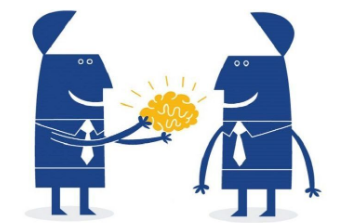
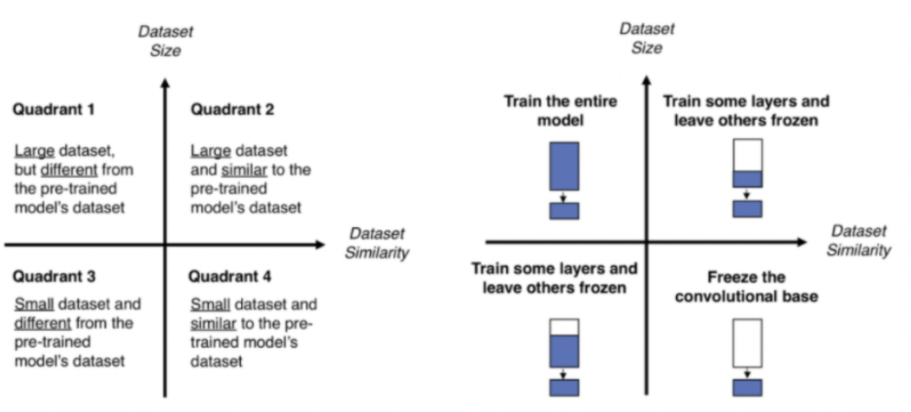
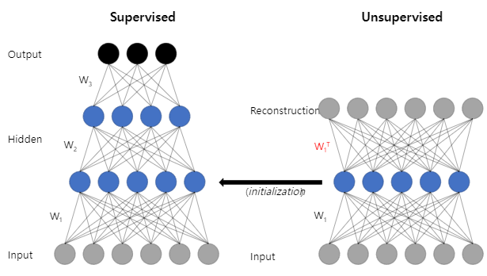
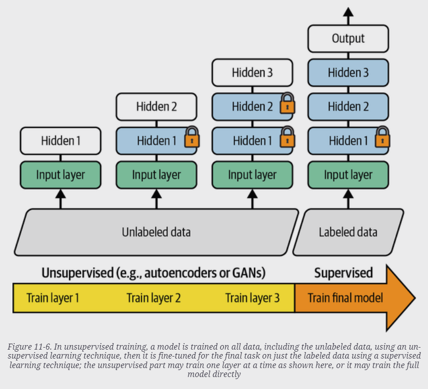

# Trasfer Learning

> The application of skills, knowledge, and/or attitudes that were learned in one situation to another learning situation. (Perkins, 1992)  
> 다른 학습 상황에 배운 기술, 지식 및/또는 태도를 적용하는 것. (퍼킨스, 1992)

## 정의

`Transfer learning` is 

* a ^^technique^^ in machine learning 
* where a `pre-trained model` is used 
* as a ^^starting point^^ 
* to solve a ***similar problem***. 

<figure markdown>
{width="400" align="center"}
</figure>

> 엄밀하게 애기할 경우, pre-trained model을 Freeze시킨 채로 맨 위 Layer만 학습을 시키는 것을 transfer learning이라고 부르고, 이후 pre-trained model의 일부 혹은 전체 layers를 학습시키는 것을 fine-tunning이라고 지칭하기도 한다. 하지만 대부분의 경우 이 두과정이 같이 이루어지기 때문에 transfer-learning으로 크게 지칭하는 경우도 많다.

---

## Transfer Learning의 장점.

It is a popular approach because it saves 

* time and 
* computational resources. 

> DL의 경우, 훈련에 요구되는 시간 뿐 아니라, ***적은 수*** 의 학습데이터로도 우수한 성능의 모델을 학습할 수 있음.  
> 
> * DNN의 경우, 적은 수의 학습데이터를 사용할 경우 over-fitting의 위험성이 매우 크기 때문에 적절한 hyper-parameter 선택과 효과적인 regularization 없이 generalization performance를 획득하기 어렵다 .
> * 문제는 적절한 regularization이나 hyper-parameter 선택이 매우 어렵다는 점이고, 이를 위해 많은 수의 cross validation 등이 필요하다.

특히, Transfer learning은 similar problem에서 학습된 pre-trained network를 이용할 때 높은 성능을 보임.  

* 이는 Hierarchical Feature Extraction이 가능한 DNN의 특징 때문임. 

특히 `CNN`의 경우, image들이 low-level의 features를 공유하고 있어서 ImageNet으로 학습한 pre-trained network를 이용한 transfer learning이 매우 빈번하게 활용된다.

Keras의 경우, [Keras Applications](https://keras.io/api/applications/)를 통해, ImageNet으로 사전훈련이 된 다양한 Deep Learning Model을 제공한다.

## Fine Tunning의 필요성.

However, ^^the pre-trained model may not be optimal for the specific problem^^ at hand. This is where `fine-tuning` becomes necessary.

즉, pre-trained network를 그대로 사용하기 보다는 현재의 학습데이터에 맞추어 fine-tunning을 해주어야만 적절한 성능을 얻을 수 있다.

이상적으로는 다음과 같은 4가지 경우로 나누어지지만, 1번과 4번의 경우로 수행하는 경우는 생각보다 많지 않다.

<figure markdown>
{width="400" align="center"}
</figure>

## Transfer Learning의 일반적인 순서

1. pre-trained network에서 weights를 그대로 사용하되 output layer를 제거한다.
2. 현재 task에 맞는 output layer (or output layers)를 추가한다.
3. pre-trained network의 weights는 freeze시켜서 보존하고, 새로 추가된 output layer (or layers)만 현재 가지고 있는 학습데이터로 훈련한다.
4. evaluation을 통해 새로 추가된 output layer가 어느정도 성능을 낼 때까지 pre-trained layers를 freeze한 상태로 훈련한다.
    * 이 경우, learning rate는 크게 잡을 수 있음.
    * ImageNet으로 사전훈련된 `EfficientNetB0`를 `Adam`으로 훈련하는 경우, `1e-2` 수준으로 learning rate를 사용한다.
    * regularization이 강하게 걸려있는 상태이기 때문에 training 단계보다 validation에서 보다 높은 metric이 나올 수도 있음에 주의.
    * 추가한 downstream layers가 어느정도 훈련이 되도록 해주는 것이 목표임.
    * 극도로 학습데이터가 적은 경우, 4번단계로 끝낼 수도 있음.(이경우, feature map을 추출하는 것은 pre-trained network의 이전 학습 결과에 전적으로 의존하게 됨.)
5. 이후, pre-trained layers 중 down-stream에 가까운 순으로 조금씩 freeze를 해제하고 현재의 학습데이터로 학습을 수행한다 (이 단계부터 fine-tunning이라고 볼 수 있음).
    * 이 단계에서는 learning rate를 매우 낮게 잡아야함.
    * 만약 현재의 task와 학습데이터가 pre-trained network가 훈련되었던 task와 학습데이터와 매우 비슷할 경우, 이 단계에서의 performance gain은 그리 높지 않을 수 있음.
    * ***하지만 현재의 학습데이터가 ImageNet과 차이가 적지 않을 경우, 이 단계는 매우 중요하다.***
6. 학습 데이터가 많을 경우, pre-trained network에서 보다 많은 layers를 freeze 해제하고 훈련시킬 수 있다. 한번에 많은 layers를 freeze해제하기 보다 조금씩 증가시켜나가야 한다.
7. 만약 현재의 input data가 pre-trained network가 훈련한 데이터와 차이가 심하다면, freeze 해제가 거의 모든 pre-trained network의 layers에 이르도록 6번이 수행될 수도 있다. (최종적으로 모든 layers를 unfreeze하고 훈련될 수도 있음.)

> transfer learning에서 fine-tunning은 일반적으로 필수적으로 행해진다.  
> 
> 그리고 batch normalization layer의 경우엔 fine-tunning과정에서 parameters가 바뀌면 안된다. scaling과 shifting parameters가 고정되도록 freeze상태를 유지해야함.

주의할 것은 가급적 input data가 pre-trained network가 사전훈련되던 경우와 비슷해야한다. 또한 현재 데이터의 수가 적다면 지나치게 큰 해상도에서 사전훈련된 복잡한 pre-trained network를 사용하기보다는 현재 데이터 포맷과 같은 해상도의 network를 선택해야한다. 

무엇보다도, transfer learning을 사용할 때 learning rate는 from scratch의 경우보다 작게 선택해야 하는 점을 명심해야 한다 (`RMSProp`등을 사용하는 경우 momentum도 보다 작은 값으로 fine-tunning하는게 좋). 

## 현재 학습데이터에 따른 고려사항.

만약, 훈련 데이터가 매우 적고, 위의 과정으로도 좋은 성능이 나오지 않는다면 pre-trained network의 downstream layers를 제거한 후, 현재 task에 해당하는 output layers를 붙이는 방법도 있음. 

이 경우, 보다 simple한 모델이 되기 때문에 적은 학습데이터에서 보다 나은 성능을 기대할 수 있음.

반대로 현재의 훈련 데이터의 수가 많다면, 하나의 output layer를 추가하는 형태가 아니라 보다 많은 downstream layers를 추가해볼 수 있음.

---

## References

CNN 중 하나인 EfficientNet으로 Transfer Learning을 수행한 다음 Tutorial은 전형적인 transfer learning의 방식을 보여줌.

* [Image classification via fine-tuning with EfficientNet](https://keras.io/examples/vision/image_classification_efficientnet_fine_tuning/)
 

---

## Auxiliary Task based Pre-training

labeled data가 충분하지 않은 경우 사용되는 방법으로 ***labeled data를 쉽게 구할 수 있으면서 비슷한 task*** 로 DNN을 학습시키고 해당 DNN의 upstream layers (=low-level layers)를 pre-trained layers로 사용하는 방법임.

BERT나 GPT의 경우, 문장에서 일부 단어를 지우고 이를 예측하도록 훈련시키거나 일정길이의 문장을 주고 이후 나타날 단어를 예측하도록 훈련시킨 모델을 pre-trained network로 활용하였는데, 이같은 방법들이 바로 Auxiliary Task를 통해 pre-trained network를 얻어낸 실제 사례라고 할 수 있음.

이를 가르켜 self-supervised learning이라고도 함.

---

## Greedy Layer-wise Pre-training and Unsupervided Pre-training

Deep Belief Network (2006)에서 제안된 방식으로 현재의 end-to-end learning이 가능해지기 전에 많이 이용되던 방식임.

> 2006년 제안되었던 당시에는 DNN을 학습시킬 수 있는 유일한 방법이었으나, Gradient vanishing 을 완하시키는 weight initialization과 ReLU 등의 activation의 등장으로, supervised learning에서 end-to-end learning이 일반화되면서 거의 사용되지 않게 되었음. 하지만 labeled data가 매우 적은 경우에는 효용성을 가짐.

Auto-encoder나 Restricted Bolzmann machine을 통해 하나의 layer들을 각각 unsupervised pretraining을 수행하고, 이후 현재의 task의 labeled training dataset을 통해 fine-tunning하는 방식임.

<figure markdown>
{width="400" align="center"}
</figure>

우선 input data를 첫번째 layer를 통과시켜 feature vector를 얻고, 이 feature vector로부터 원래의 input data로 복원시키는 decoding을 수행하는 layer를 붙인 일종의 auto-encoder를 훈련시킨다. 이는 unsupervised learning이며 해당 훈련이 종료되면 ecoding을 수행한 부분이 바로 첫번째 layer가 된다. 이후 훈련된 첫번째 layer의 출력데이터가 두번째 layer의 input data가 되고, 이를 첫번째 layer의 경우와 마찬가지로 feature vector(두번째 layer의)를 얻어내고 이를 다시 input data(두번째 layer의 input data이므로 첫번째 layer의 출력데이터에 해당)로 decode하는 layer를 붙여서 auto-encoder를 만들어 다시 훈련시킨다.

위의 과정을 모든 layer에 대해 수행해주고 난 이후 이들을 모두 결합한 전체 network를 현재 가지고 있는 labeled data로 fine tunning해줌으로서 최종 모델을 얻어낸다.

이같은 greedy layer-wise pretraining은 labeled data가 매우 부족할 때 효과적이다. 

초창기에는 Restricted Boltzmann Machine이 이용되었으나, 이후에는 위의 설명과 같은 auto-encoder가 많이 사용된다.

<figure markdown>
{width="400" align="center"}
</figure>

최근엔 Auto-encoder나 GAN으로 어느정도의 layers가 쌓인 network를 한번에 unsupervised pretraining을 하고 이후 labeled data로 fine-tunning을 하는 방식이 보다 많이 사용되는 추세임.

## References

[Neural networks [7.3] : Deep learning - unsupervised pre-training](https://youtu.be/Oq38pINmddk)