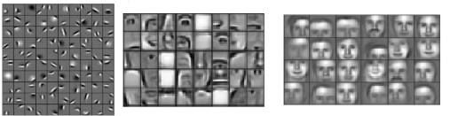

# Convolutional Layer

(Locality of Pixel Dependency 와 Stationarity of Statstics 에 기반한) **CNN의 주요 구성 요소.**

* CNN은 convolutional layer를 통해 feature(특징)을 추출함.
* Convolutional layer의 출력인 feature map은 추출된 feature의 위치와 강도를 가지고 있음.

> Plain CNN은 convolutional layer와 max (or average) pooling 이 기본 구성요소임.

---

다음 그림은 convolution의 과정을 보여줌.  
두 개의 kernel (filter라고 불림. width 와 height, 그리고 depth로 dimension이 결정됨)과 bias를 이용한  
convolution을 수행하여 두 개의 feature map을 얻어냄.  
($7 \times 7 \times 3$ 이 입력으로 하여 $3 \times 3 \times 2$ 출력을 얻음) 

{style="display: block;margin: 0 auto;width=600px" }

* 작은 크기 (3x3 or 5x5) 의 kernel (=filter 라고도 불림)을 사용
	* 이전 layer의 일부 neurons만이 연결됨 (전체가 연결되는 dense와 다름)
	* kernel 크기에 따라 receptive field가 결정됨.
* sliding (`stride`로 지정된 만큼 이동)을 통해 입력 layer의 모든 neurons에 적용함.
	* 입력 layer에서 위치에 상관없이 현재 kernel에 대한 반응강도를 얻어냄.
	* feature map은 이들 반응강도를 각receptive field의 위치에 따라 2D로 배치한 것임  
	    * feature vector는 특징을 1차원으로 나타낸 vector임.  
	    * feature map은 특정 kernel에 대한 response를 feature 값으로 하여 2차원으로 배치한 map임.
* 하나의 입력에 대해 여러 kernels를 적용하여 여러 feature map을 얻게 되며, 이들을 다시 입력으로 삼아 다른 여러 kernels를 적용하도록 계층으로 쌓음.
	* 이같은 구조는 여러 feature maps로 구성된 hierarchy를 얻음.
	* lower layer에서는 low level feature maps 를 얻음 (edge, corner, texture 등)
	* intermediate layer에서는low level feature maps를 조합한 intermediate feature를 추출해 냄.
	* higher layer에서는 task와 밀접하게 관련되며 이들 intermediate features를 조합하여 구성되는 high level feature를 추출해냄.

{style="display: block; margin: 0 auto;width:600px"}

* 만약 input의 depth가 10인 경우, kernel의 depth도 10이 되는 게 일반적임. 
    * depth separated convolution 제외.

---

---

## Correlation과 Convolution.

Signal Processing에서는 Convolution과 Cross Correlation은 용도가 분명히 다른 연산이지만,  
***DL에서는 대부분의 Convolution은 Cross Correlation으로 구현*** 된다.

**다음 URL 참고.**

참고 : [Cross Correlation](https://dsaint31.tistory.com/382) 

---

---

## 주요 hyper-parameters

### kernel size

feature map의 **한 pixel의 값** 을 결정하는데 참여하는 input의 pixels의 수를 결정.

* kernel size가 클수록 receptive field가 커짐.
* kernel size가 클수록 parameters 의 수가 커짐.
* 일반적으로 kernel size는 홀수이며, kernel의 정가운데 pixel의 위치를 anchor라고 부름.

{style="display: block; margin: 0 auto; width:600px"}

> CNN에서 kernel의 weights는 Training을 통해 dataset으로부터 최적의 값들로 설정됨 (ML에서의 특징).  
>
> * Digital Image Processing 에서의 spatial filtering의 경우, 
> * 사람이 kernel의 weight를 설정하는 것과 달리  
> * DL에서는 Task에 적합한 Kernel의 weights를 dataset으로부터 구해냄.

---

### stride

convolution에서 sliding을시킬 때 건너뛰는 pixel의 수.

* stride가 클수록 convolutional layer의 출력으로 나오는 feature map의 width와 height가 작게됨.
* receptive field가 겹치지 않도록 조정하는게 일반적임.

{style="display: block; margin:0 auto; width:600px"}

---

### padding

convolution의 경우, padding하지 않는다면 출력이 입력보다 작은 크기(폭과 높이)가 되게 된다.

이를 방지하기 위해, 입력을 padding하여 좀 더 큰 크기로 만들어서 convolution의 출력이 padding 전의 입력과 같은 크기가 되도록 처리하는 게 일반적임.

TensorFlow의 경우, `padding` 파라메터를 `same`으로 지정하면 zero-padding을 수행하여 입력과 같은 크기의 출력이 나오도록 할 수 있음.

---

### Note

Convolutional Layer는  

* Dense Layer에 비해서는 확실히 적은 메모리 사용량을 보이지만, 
* 여전히 꽤 많은 량의 메모리를 요구함.

때문에 훈련과정에서 out of memory가 발생할 경우, 

* batch size를 줄이거나 
* stride를 크게 하는 등의 처리가 필요함.

---

## 같이 읽어보면 좋은 자료들

* [Convolution 이란?](../../DIP/cv2/etc/dip_convolution.md) 
