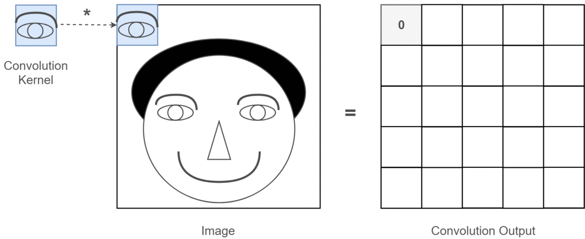

# Convolutional Neural Network, CNN

`Convolutional Layer`와 `Pooling Layer`를 주 구성요소로 사용하여 대뇌의 시각 피질의 구조를 모방하여 만든 ANN의 한 종류.

Image 를 input으로 다루는 경우 가장 일반적으로 사용되는 ANN임.

* `Convolutional Layer` : feature map 추출하는 filter의 역할.
* `Pooling Layer` : `max pooling` or `average pooling`. sub-sampling을 담당.   
    * convolution layer와 함께 사용되어 higher layer의 receptive field를 효과적으로 커지게 해줌.
    * 지나치게 pooling의 mask가 크거나 많이 사용할 경우, spatial information loss가 커짐.
* 위 2개의 layer들을 조합하여 깊게 쌓게 될 경우, 근처에 있는 pixel들만을 중점적으로 보면서 점점 더 넓은 영역으로 확장해서 살펴보는 형태로 receptive field가 커지게 됨. (위치적으로 가까운 neuron들끼리 살펴보다가 higher layer로 갈수록 멀리 있는 정보들도 같이 보게 됨.)
    * 한번에 큰 size의 kernel을 사용하는 것보다 작은 size kernel을 여럿 쌓는 게 효과적임.
    * hierarchical feature map이 가능해지며, 가까운 pixel들을 중요하게 보면서 먼 곳의 pixel들을 고려해나가는 형태의 처리가 가능해짐.
    * CNN에서 lower layer들은 edge나 texture등의 low level feature를 추출하고, higher layer로 갈수록 복잡한 high level feature들이 추출됨. (해당 high level feature들은 low level feature들을 조합하여 구성됨.)

`CNN`은 image data에서 다음의 2개의 가정이 성립한다고 가정함으로서 `MLP`에 비해 매우 적은 parameters를 가지게 됨.  

* [Locality of Pixel Dependencies](#locality-of-pixel-dependencies)
* [Stationarity of Statistics](#stationarity-of-statistics)

때문에 image를 input으로 할 때 `MLP`에 비해 적은 데이터에서도 매우 학습이 잘 이루어짐.

결국 global pattern을 학습하는 MLP와 달리 ***`CNN`은 kernel size에 해당하는 local feature pattern을 학습*** 하게 됨.

**Convolution 에 대한 참고자료**

* DIP's [Convolution](../../dip/cv2/etc/dip_convolution.md)
* [Convolution's Matrix Representation](https://bme808.blogspot.com/2022/10/ml-transposed-convolution.html) : matrix representation 부분만 봐도 된다.

---

## Locality of Pixel Dependencies

Image data가 `locality of pixel dependencies`라는 특성을 가짐에 착안하여  
`CNN`은  
모든 pixel들을 다 고려하는 `MLP`와 달리  
***kernel (or window)에 해당하는 주변 pixel들만을 고려*** 하는 sparse connection(실제로 convolution으로 구현됨)을 사용한다.

* ^^학습되어야 하는 parameters의 수를 대폭 줄이면서 높은 성능^^ 을 얻어냄.

> `locality of pixel dependencies`란 이미지에서 특정 pixel과 연관성을 가지는 것들은 주변에 있는 pixel에 국한된다는 의미임.

때문에 MLP에서처럼 모든 node들에 대한 weighted sum을 구할 필요 없이 image 공간상에서 주변의 pixel에 해당하는 node들만을 고려하면 된다.

즉 다음 그림의 윗부분(CNN의 경우)에서 보이듯이 sparse connectivity를 가진다.

* 아랫부분은 MLP에 해당. (dense layer)

---

## Stationarity of Statistics

> `stationarity of statistics`는 data의 통계적 특성이 time이나 location에 따라 변하지 않는 경우를 가르킨다 (신호처리에서 다루는 LTI system이 대표적인 예!). 

image도 `stationarity of statistics`를 만족하는 데이터의 일종의로 볼 수 있다.

image에서 eye를 찾는다고 가정할 때, eye에 해당하는 patch가 가지는 특징이 위치 공간의 어디에 있던지간에 변하지 않는다. 때문에 eye가 있는 patch에 반응하는 ***kernel 하나*** 를 사용하여 ^^convolution으로 모든 영역을 sliding으로 이동하면서 처리해도 된다^^.

> signal processing에서 time invariant system에 대한 response를 처리하는데 convolution을 사용하는 것과 비슷함.

사실 convolution은 영상처리에서 특정 패턴을 추출하는 spatial filter를 만들 때 사용되는 shift-invariant operation이기 때문에, CNN은 이를 이용하여 수많은 패턴들을 hierarchy하게 추출할 수 있도록 수많은 필터를 계층적으로 배치한 것으로 볼 수 있다. 

즉 영상의 전 영역에 아주 작은 크기의 ***동일한 kernel*** 을 이동시켜가면서 적용하여 해당 kernel이 반응하는 패턴이 어디서 강하게 위치하는지를 feature map으로 얻을 수 있다.

> CNN에서 얻어진 feature map의 pixel 값 자체에는 위치 정보가 없다. pixel의 위치 좌표가 위치정보를 가지고 있다. 때문에 global average pooling이나 global max pooling과 같은 flattening을 수행하면 translation invariant한 feature vector를 얻게 된다.
>  
> 만약, translation variant한 feature vector가 필요하다면, spatial invariant한 kernel을 사용하는 등의 처리가 필요하다. 아니면 Capsule Network를 사용해도 된다.

---

## 참고자료 

* L. LeCun et al. 1989 :[Backpropagation Applied to Handwritten Zip Code Recognition](https://ieeexplore.ieee.org/document/6795724)
* Thushan Ganegedara's [Intuitive Guide to Convolution Neural Networks](https://towardsdatascience.com/light-on-math-machine-learning-intuitive-guide-to-convolution-neural-networks-e3f054dd5daa)