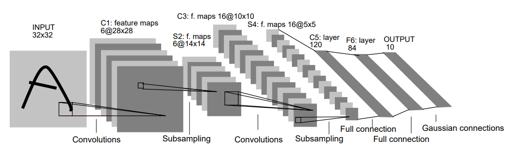
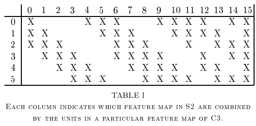

# LeNet-5

ori. [GradientBased Learning Applied to Document Recognition, Yann LeCun et al., 1998.](http://vision.stanford.edu/cs598_spring07/papers/Lecun98.pdf)

---

1998년에 손글씨를 인식하기 위해 제안된 CNN 으로, 가장 유명한 CNN 중 하나임.

구조는 다음과 같음.

| Layer Name | Type | output (=feature map) | kernel | stride | activation |
| :----: | :----: | :----: | :----: | :----: | :----: |
| INPUT | input layer | $32\times 32 \times 1$ |  - | - | - |
| C1 | convolutional layer | $28\times 28 \times 6$ | $5\times 5$  | 1 | tanh |
| S2 | average pooling layer (주의1) | $14\times 14 \times 6$ | $2\times 2$  | 2 | tanh |
| C3 | convolutional layer (주의2) | $10\times 10 \times 16$ | $5\times 5$  | 1 | tanh |
| S4 | average pooling layer (주의1) | $5\times 5 \times 16$ | $2\times 2$  | 2 | tanh |
| C5 | convolutional layer (주의2) | $1\times 1 \times 120$ | $5\times 5$  | 1 | tanh |
| F6 | fully connected layer  | $84$ | -  | - | tanh |
| OUTPUT | fully connected layer  | $10$ | -  | - | Euclidean Radial Basis Function |

* 주의1 : 현재의 average pooling layer와 달리 평균을 구한후 scaling과 shift를 trainable parameter로 수행하고 이 결과값에 activation function을 적용한 결과를 출력 (이 처리가 각 feature map 별로 이루어진다.).
    * 오늘날에는 max pooling layer로 대체해서 구현되는 경우가 많은 편.
* 주의2 : C3와 S2의 neuron 간의 connection이 모두 이루어져있지 않음. 각 feature map간의 연결은 논문의 table 1(아래있음)을 참고할 것.

다음은 C3와 S2간의 neuron 들의 connection을 나타낸 table 1임.

* C3의 처음 6개의 feature map은 원형으로 연속된 s2의 3개의 feature map을 기반으로 생성됨. (위 테이블의 0~5번 column 참고)
* C3의 다음 6개의 feature map은 원형으로 연속된 s2의 4개의 feature map을 기반으로 생성됨. (위 테이블의 6~11번 column 참고)
* C3의 다음 4개의 feature map은 원형으로 연속된 s2의 2개의 feature map의 pair(즉 4개의 feature map임)을 기반으로 생성됨. (위 테이블의 12~15번 column 참고)

> connection을 제한하여 계산량 등을 줄이면서 특징 추출은 효과적으로 하기 위해 고안된 부분. 하지만 현재의 CNN에서는 이같은 방식은 거의 사용되지 않음.

Output도 오늘날 많이 사용되는 soft-max가 아닌, Euclidean Radial Basis Function 임. 

$$ y_i = \sum_j (x_j-w_{ij})^2 $$

* $y_i$ : OUTPUT의 출력. ($i$는 $[0,9]$ 중 한 정수. $i=0$인 경우 $y_i$는 입력 image가 숫자 0일지 여부를 나타냄.)
    * Euclidean distance기반이라 $y_0=0$일 경우 image는 숫자 0임. (작을수록 해당 클래스에 가까움)
* $x_j$ : F6의 output으로 OUTPUT의 입력임. ($j$는 [0,83] 범위의 자연수.)
* $w_{ij}$ : 입력의 $i$-node와 출력의 $j$-node간의 edge의 weight.

---

## References

* [LeNet Architecture: A Complete Guide](https://www.kaggle.com/code/blurredmachine/lenet-architecture-a-complete-guide)
