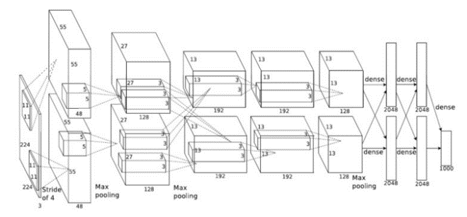

# AlexNet 

ori. [ImageNet Classification with Deep Convolutional Neural Networks](https://proceedings.neurips.cc/paper_files/paper/2012/file/c399862d3b9d6b76c8436e924a68c45b-Paper.pdf)

---

Alex Krizhevsky 의 이름을 따서 AlexNet.  
Hinton et al.이 Deep Learning의 위력을 확실히 알리는데 일조한 유명한 network임.

* ImageNet Large-Scale Visual Recognition Challenge 에서 CNN의 열풍을 가져온 모델 (2012년 우승모델)
* 2012년 이후 우승 모델은 8layer 이상 (pooling layer 제외)의 CNN이 됨.
* 2011년 까지 우승 모델의 성능은 Top-5 error가 25% 수준에 불과했으며 deep learning이 아님.

2012년  ImageNet Large-Scale Visual Recognition Challenge(ILSVRC)에서 압도적 성능으로 1위 (top-5 error = 17%, 참고로 2위는 26%)를 차지하면서 CNN의 대유행을 가져옴.

> ILSVRC 2013의 우승 모델인 ZF Net도 사실상 AlexNet의 variant (kernel size, feature map의 갯수, stride 등이 다름.)에 불과.

* LeNet의 convolutional layer + pooling layer 의 방식을 조금 바꾸어 convolutional layer를 연달아 연결.
* `ReLU` 를 activation으로 도입.
* 다음의 세가지 regularization을 통해 보다 깊게 layer를 쌓음 
    * `dropout layer` 도입 (F9, F10의 출력의 50%를 dropout). *
    * `data argumentation` 수행. *
    * local response normalization. (오늘날 batch normalization으로 대체됨)
* overlapping pooling (kernel_size=3, stride=2)을 사용.

> `Local Response Normalization` (`LRN`)
> 
> 일종의 경쟁적인 normalization으로, 특정 neuron이 강하게 활성화될 경우, 다른 feature map의 해당 위치의 neuron들의 활성화가 억제되는 구조임.  
> 생물학적인 neurons에서의 동작을 모사한 것.  
> 이후 개발된 VGG 모델에서 `LRN`이 그리 큰 성능향상으로 이어지지 않는 것으로 보고되어 이후로 널리 사용되지 못함.  
> 오늘날 해당 역할은 `batch normalization`으로 대체된 상태임.

구조는 다음과 같음.

* input이 잘못 그려졌다 (원래 논문의 오기!) : $227 \times 227 \times 3$ 이 맞음. (후에 정정됨)

| Layer Name | Type | output (=feature map) | kernel | stride | activation | padding |
| :----: | :----: | :----: | :----: | :----: | :----: | :----: |
| INPUT | input layer | $227\times 227 \times 3$ |  - | - | - | - |
| C1 | convolutional layer | $55\times 55 \times (48+48)$ | $11\times 11$  | 4 | ReLU | valid |
| S1 | (over-lapping) max-pooling layer | $27\times 27 \times (48+48)$ | $3\times 3$  | 2 | - | valid |
| C2 | convolutional layer | $27\times 27 \times (128+128)$ | $5\times 5$  | 1 | ReLU | same |
| S2 | (over-lapping) max-pooling layer | $13\times 13 \times (128+128)$ | $3\times 3$  | 2 | - | valid |
| C3 | convolutional layer | $13\times 13 \times (192+192)$ | $3\times 3$  | 1 | ReLU | same |
| C4 | convolutional layer | $13\times 13 \times (192+192)$ | $3\times 3$  | 1 | ReLU | same |
| C5 | convolutional layer | $13\times 13 \times (128+128)$ | $3\times 3$  | 1 | ReLU | same |
| S2 | (over-lapping) max-pooling layer | $6\times 6 \times (128+128)$ | $3\times 3$  | 2 | - | valid |
| F6 | fully connected layer | $4096$ | - | -| - | ReLU | - |
| F7 | fully connected layer | $4096$ | - | -| - | ReLU | - |
| OUTPUT | fully connected layer  | $1000$ | -  | - | softmax | - |

---

## References

* lighthouse97님의 [AlexNet의 이해](https://velog.io/@lighthouse97/AlexNet%EC%9D%98-%EC%9D%B4%ED%95%B4)
