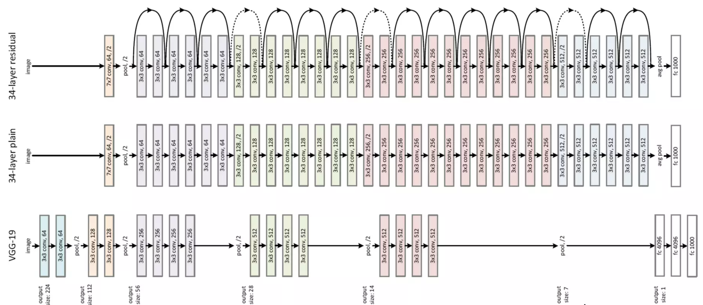
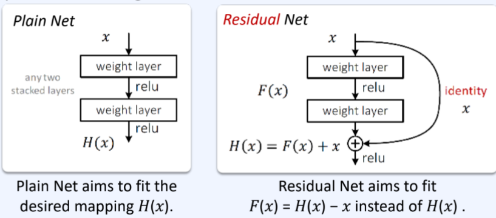

# ResNet (Residual Network)

ref. : ori. [Deep Residual Learning for Image Recognition](https://arxiv.org/abs/1512.03385)

---

ILSVRC 2015년 우승 모델 (deep learning의 deep의 개념을 바꿈.)

* Kaiming He, Xiangyu Zhang, Shaoqing Ren, Jian Sun 
* top-5 error가 3.6% 이하.
* 152 layers라는 당시로는 매우 놀라운 깊이의 deep model임.

ResNet은 `skip connection`을 도입하여 매우 깊은 모델의 학습을 가능하게 함.

* ResNet의 경우 `skip connection`을 `residual learning`에 도입.
* 최근에는 `residual learning` 대신에 `concatenation`을 이용한 `skip connection`도 많이 사용됨.

> `residual learning`의 경우 `skip connection`의 결과를 ***add를 이용하여 더함***.  
> `concatenation`은 그냥 feature map이 추가(문자열의 concatenation과 유사)되는 형태 (channel이 많아짐)가 됨.

## 구조

전반적인 구조는 매우 많은 수의 convolutional layers가 추가되며, 이들 사이에 main path외에 skip connection을 통한 추가적인 path가 존재하는 구조를 취함.

* 각 convolutional layers 의 activation function은 `ReLU` 임.
* 위에서 skip connection (or short-cut)이 있는 부분만을 다시 그린 것이 아래 그림임.

실제로 hypothesis $h(\textbf{x})$를 구하는 기존 모델과 달리 ResNet은 hypothesis와 input $\textbf{x}$간의 차이인 residual $f(\textbf{x})=h(\textbf{x})-\textbf{x}$ 를 구하는 `residual learning`을 채택함.

* skip connection을 통해 $f(\textbf{x})$에 $\textbf{x}$가 더해주는 구조로 $h(\textbf{x})$를 구하게 됨.
* $f(\textbf{x})$가 $h(\textbf{x})$보다 구하기 쉬움.
