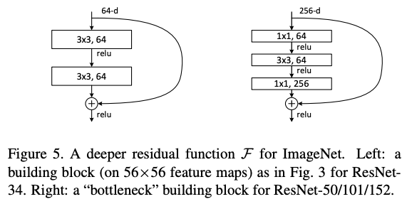
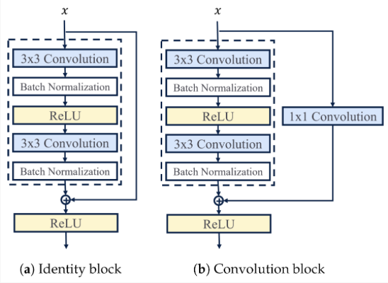

# ResNet: Deep Residual Learning for Image Recognition (2015)

ref. : ori. [Deep Residual Learning for Image Recognition](https://arxiv.org/abs/1512.03385)

---

ILSVRC 2015년 우승 모델 (deep learning의 deep의 개념을 바꿈.)

* Kaiming He, Xiangyu Zhang, Shaoqing Ren, Jian Sun 
* top-5 error가 3.6% 이하.
* 152 layers라는 당시로는 매우 놀라운 깊이의 deep model임.

ResNet은 `skip connection` (= `short connection`)을 도입하여 매우 깊은 모델의 학습을 가능하게 함.

* ResNet의 경우 identity 와 addition을 이용하는 `skip connection`을 사용하여 `residual learning` 을 수행함.
* 최근에는 <u>addition 연산 기반의 `residual learning`</u> 대신에 <u>`concatenation`을 이용한 `skip connection`</u>도 많이 사용됨.

> `residual learning`의 경우 `skip connection`의 결과를 ***add를 이용하여 연결함***.  
> `concatenation`은 그냥 feature map이 추가(문자열의 concatenation과 유사)되는 형태 (channel이 많아짐)가 됨.  
> `concatenation` 기반의 연결은 `DenseNet (2017)`을 통해 유용성을 보임.

---

## 구조

전반적인 구조는 

* 매우 많은 수의 convolutional layers (엄밀하게 애기하면 `residual unit (RU)`)가 반복되어 구성됨. 
    * `RU`는 보통 2개의 convolutional layers로 구성됨.
    * 첫번재 convolutional layer는 이후 BN과 ReLU로 이어짐.
    * 이후 두번째 convolutional layer로 이어지고 이 결과는 BN을 거침. 
    * 이 결과는 skip connection 으로 넘겨지는 input과 addition이 수행되고, 해당 결과는 ReLU를 거침.
* `RU` 사이에 main path 로 연결되고, `RU` 의 input과 output은 skip connection을 통해 연결되어 추가적인 path가 존재하는 구조.


* 각 convolutional layers 의 activation function은 `ReLU` 임.
* 파선으로 그려진 skip connection 의 경우, 논문에서 zero-padding shortcuts와 projection shortcuts 의 두가지로 구현하여 비교함.
* projection shortcuts가 좀더 우수한 결과를 보임.
* channel이 2배 늘어나는 경우에는 feature map의 width와 height가 1/2 로 줄어듬 (pooling을 사용하지 않고, stride=2로 사용)
* 일반적으로 같은 channel 수의 `RU`가 연결된 경우에는 stride=1이지만, 달라지는 경우 stride=2를 사용함. 

ResNet은 convolutional layer 와 fully-connected layer 만을 count(즉, trainable layer만 count)하여,  
18개의 layers를 가지는 ResNet-18부터 152개의 layers를 가지는 ResNet-152까지  
당시로서는 매우 깊은 구조의 CNN을 제안함. 

ResNet-34:
* `Conv (64ch)` - `RU (64ch)` $\times 3$ - `RU (128ch)` $\times 4$ - `RU (256ch)` $\times 6$ - `RU (512ch)` $\times 3$ - `FC (1000ch)`

ResNet-152:
* `Conv (64ch)` - `Bottleneck RU (256ch)` $\times 3$ - `Bottleneck RU (512ch)` $\times 8$ - `Bottleneck RU (1024ch)` $\times 36$ - `Bottleneck RU (2048ch)` $\times 3$ - `FC (1000ch)`

---

## Residual Block

다음은 ResNet 18/34 에서 사용된 기본 `RU`와 그보다 더 깊은 ResNet에서 사용된 `Bottleneck RU`의 구성임.



* 오른쪽의 `Bottleneck BN` 은, ResNet 50/101/152 에서 사용됨.

다음은 `Bottleneck BN` 에서 identity shortcut과 projection shortcut을 보여준다.




---

## Residual Learning

실제로 hypothesis $h(\textbf{x})$를 구하는 기존 모델(아래 그림에서 plain net)과 달리  
ResNet은 hypothesis와 input $\textbf{x}$간의 차이인 residual $f(\textbf{x})=h(\textbf{x})-\textbf{x}$ 를  
구하는 `residual learning`을 채택함.


* skip connection을 통해 $f(\textbf{x})$에 $\textbf{x}$가 더해주는 구조로 $h(\textbf{x})$를 구하게 됨.
* $f(\textbf{x})$가 $h(\textbf{x})$보다 구하기 쉬움.

---

## torchvision

```Python
import torchvision
pretrained = True

# A lot of choices :P
model = torchvision.models.resnet18(pretrained)
model = torchvision.models.resnet34(pretrained)
model = torchvision.models.resnet50(pretrained)
model = torchvision.models.resnet101(pretrained)
model = torchvision.models.resnet152(pretrained)
model = torchvision.models.wide_resnet50_2(pretrained)
model = torchvision.models.wide_resnet101_2(pretrained)
```

---

## 같이 보면 좋은 자료들

* [ResNet Explained!](https://youtu.be/sAzL4XMke80?si=EjwNyuKMUlgAuB97)