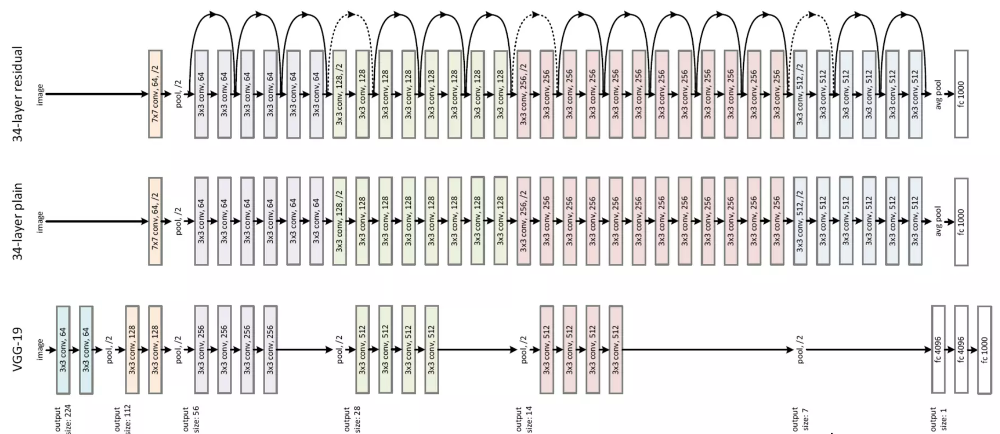
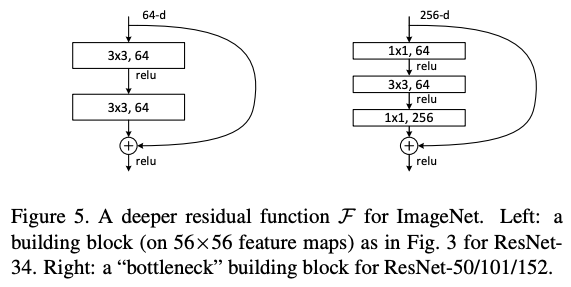
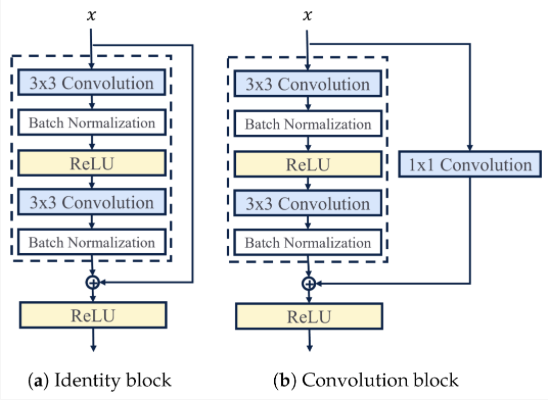

# ResNet: Deep Residual Learning for Image Recognition (2015)

ref.: original paper, [Deep Residual Learning for Image Recognition](https://arxiv.org/abs/1512.03385)

---

ILSVRC 2015 우승 모델이며, deep learning에서 “deep”의 의미를 크게 바꾼 모델임.

* Kaiming He, Xiangyu Zhang, Shaoqing Ren, Jian Sun이 제안함.
* ImageNet classification에서 top-5 error 3.57%를 기록함.
* 152 layers라는, 당시로서는 매우 놀라운 깊이의 deep model을 제안함.

ResNet은 `skip connection` 또는 `shortcut connection`을 도입하여  
**매우 깊은 모델의 학습** 을 가능하게 함.

* ResNet은 identity mapping과 addition을 이용하는  
  **shortcut connection을 통해 `residual learning`을 수행** 함.
* 기존 plain network는 깊이가 증가하면 optimization이 어려워져 training error까지 증가하는 degradation problem이 나타날 수 있음.
* ResNet은 **residual block 내부에 shortcut path를 추가** 하여  
  깊은 network를 더 쉽게 optimize할 수 있도록 만듦.
* 이후에는 addition 기반 residual connection뿐 아니라,  
  `concatenation`을 이용한 skip connection도 널리 사용(DenseNet)됨.

> ResNet의 `residual learning`에서는 residual branch의 출력과 shortcut branch의 출력을 add 연산으로 결합함.  
> `concatenation`은 feature map을 channel 방향으로 이어 붙이는 방식임.  
> `concatenation` 기반 연결은 `DenseNet (2017)`을 통해 유용성을 보임.

참고로, `concatenation`을 사용한 `DenseNet (2017)`의 경우,

* low-level texture, edge, color pattern 같은 초기 feature가 뒤쪽 layer까지 직접 전달됨.
* 병변의 미세한 색 변화, 경계, 표면 질감처럼 low-level feature가 중요한 의료 영상 데이터에서는 ResNet보다 높은 성능을 보일 수 있음.
* 추가적으로 DenseNet-121은 parameter efficiency 측면에서 소량 데이터에 유리할 수 있음.
    * DenseNet-121은 대략 8M parameters 수준임.
    * ResNet-50은 대략 25M parameters 수준임.

---

## 구조

전반적인 구조는 다음과 같음.


위의 그림에선 입력을 처리하는 stem 이 위에 표시됨

Bullet list로 표현하면 다음과 같음:

* `Stem`
* `Residual stages`
    * `RU (64ch, conv2_x)`
    * `RU (128ch, conv3_x)`
    * `RU (256ch, conv4_x)`
    * `RU (512ch, conv5_x)`
* `Global Average Pooling`
* `FC classifier`

ResNet의 앞부분에는 본격적인 residual unit이 시작되기 전에 `stem`이 위치함.

* `stem`은 입력 image를 초기 feature map으로 변환하는 부분임.
* ImageNet용 ResNet에서는 일반적으로 `7x7 convolution (64ch, stride=2)` - `BN` - `ReLU` - `3x3 max pooling (stride=2)`로 구성됨.
* 입력 image가 $224 \times 224$일 경우, `7x7 convolution`을 지나면 spatial size가 $112 \times 112$가 됨.
* 이후 `3x3 max pooling`을 지나면 spatial size가 $56 \times 56$가 됨.
* 이 $56 \times 56$, 64-channel feature map에서 `RU (64ch)` stage, 즉 논문 표기의 `conv2_x`가 시작됨.



Residual stage는 많은 수의 convolutional layer가 `residual unit (RU)` 단위로 반복되어 구성됨.

Residual stage는 많은 수의 convolutional layer가 `residual unit (RU)` 단위로 반복되어 구성됨.

* ResNet-18/34에서 사용하는 기본 `RU`는 보통 2개의 convolutional layers로 구성됨.
    * 첫 번째 convolutional layer는 BN과 ReLU로 이어짐.
    * 이후 두 번째 convolutional layer를 거치고, 그 결과는 BN을 통과함.
    * 이 결과는 shortcut connection으로 전달된 input과 addition을 수행하고, 해당 결과는 다시 ReLU를 거침.
* ResNet-50/101/152에서 사용하는 `Bottleneck RU`는 3개의 convolutional layers로 구성됨.
    * `1x1 convolution`으로 channel 수를 줄임.
    * `3x3 convolution`으로 spatial feature를 추출함.
    * `1x1 convolution`으로 channel 수를 다시 확장함.
* 각 `RU`는 main path와 shortcut path를 함께 가지며, `RU`의 input과 output은 shortcut connection을 통해 연결됨.

ResNet의 기본 activation function은 `ReLU`이며, convolutional layer 뒤에서 BN과 함께 사용됨.

파선(dotted shortcut)으로 그려진 skip connection은 feature map의 spatial size나 channel 수가 바뀌어 $\mathbf{x}$와 $\mathcal{h}(\mathbf{x})$의 차원이 맞지 않는 경우를 의미함.

* 논문에서는 이를 zero-padding shortcut과 projection shortcut의 두 가지 방식으로 구현하여 비교함.
* zero-padding shortcut, 즉 Option A는 shortcut branch에서 identity mapping을 유지하되, channel 수가 늘어나는 부분을 0으로 padding함. 추가 parameter가 없음.
* projection shortcut, 즉 Option B는 1x1 convolution을 사용하여 shortcut branch의 차원을 맞춤.
* projection shortcut이 대체로 더 우수한 결과를 보임.
* 현재 `torchvision` 등에서 backbone으로 제공되는 대부분의 ResNet-18/34 basic block, ResNet-50/101/152 bottleneck block 구현은 차원이 바뀌는 지점에서 projection shortcut을 사용함.

stage가 바뀌는 경우에는 pooling 대신 convolution에서 `stride=2`를 사용하여 spatial size를 줄이는 것이 일반적임.

* 예를 들어 `RU (64ch)` stage, 즉 논문 표기의 `conv2_x`에서 `RU (128ch)` stage, 즉 `conv3_x`로 넘어갈 때,
* spatial size는 $56 \times 56$에서 $28 \times 28$로 줄어듦.
* channel 수는 $64$에서 $128$로 늘어남.
* 이때 width와 height가 각각 1/2로 줄어들기 때문에 spatial area는 1/4이 됨.

ResNet은 주로 convolutional layer와 fully-connected layer만 layer 수로 count함.  
즉, BN, ReLU, pooling layer 등은 layer 수에 포함하지 않음.

ResNet-34:

* `Conv (64ch)` - `RU (64ch, conv2_x)` $\times 3$ - `RU (128ch, conv3_x)` $\times 4$ - `RU (256ch, conv4_x)` $\times 6$ - `RU (512ch, conv5_x)` $\times 3$ - `FC (1000ch)`

ResNet-152:

* `Conv (64ch)` - `Bottleneck RU (256ch, conv2_x)` $\times 3$ - `Bottleneck RU (512ch, conv3_x)` $\times 8$ - `Bottleneck RU (1024ch, conv4_x)` $\times 36$ - `Bottleneck RU (2048ch, conv5_x)` $\times 3$ - `FC (1000ch)`

---

## Residual Block

다음은 ResNet-18/34에서 사용된 기본 `RU`와, 그보다 더 깊은 ResNet에서 사용된 `Bottleneck RU`의 구성임.



* 왼쪽의 기본 `RU`는 ResNet-18/34에서 사용됨.
* 오른쪽의 `Bottleneck RU`는 ResNet-50/101/152에서 사용됨.
* 기본 `RU`는 2개의 3x3 convolution으로 구성됨.
* `Bottleneck RU`는 1x1, 3x3, 1x1 convolution으로 구성됨.
    * 첫 번째 1x1 convolution은 channel 수를 줄이는 역할을 함.
    * 3x3 convolution은 줄어든 channel 수에서 spatial feature를 추출함.
    * 마지막 1x1 convolution은 channel 수를 다시 확장함.

다음은 `Bottleneck RU`에서 identity shortcut과 projection shortcut을 보여줌.



여러 variation 이 있음:


* ResNet-B 는 torchvision 의 resnet 구현물에 도입됨 (timm 의 구현물은 resnet original 임)
    * Path A의 1x1 conv w/ stride=2가 input feature map의 3/4를 무시하게 되기 때문에,
    * 이를 방지하기 위해 downsampling block에서 path A의 첫 두 conv block의 구조를 변경 
* ResNet-C는 ResNet-B의 downsampling block 구조를 포함.
    * 그리고 input stem의 7x7 conv를 3x3 conv 3개로 변경
    * 이를 deep stem 이라고도 함.
* ResNet-D는 ResNet-B의 downsampling block에서 사용한 path A 구조와 ResNet-C의 input stem 구조를 포함.
    * Path B의 1x1 conv를 avgpool + 1x1 conv 구조로 변경
    * 이유는 1x1 conv w/ stride 2 의 information loss 때문임
* ResNet-D 의 경우 `timm.resnet50d` 와 같이 `d` 가 뒤에 붙는 이름을 가짐.

---

## Residual Learning

기존 모델이 hypothesis $\mathcal{H}(\mathbf{x})$를 직접 학습하는 것과 달리, ResNet은 hypothesis와 input $\mathbf{x}$의 차이인 residual function을 학습함.

* 기존 plain network의 어떤 block이 입력 $\mathbf{x}$를 받아 원하는 mapping $\mathcal{H}(\mathbf{x})$를 직접 학습한다고 생각할 수 있음.
* ResNet은 이 mapping을 직접 학습하는 대신, residual function $\mathcal{F}(\mathbf{x})$ 을 학습하도록 문제를 바꿈.

$$
\mathcal{F}(\mathbf{x}) = \mathcal{H}(\mathbf{x}) - \mathbf{x}
$$

따라서 원하는 mapping은 다음과 같이 다시 표현할 수 있음.

$$
\mathcal{H}(\mathbf{x}) = \mathcal{F}(\mathbf{x}) + \mathbf{x}
$$

여기서 중요한 점은 ResNet이 $\mathcal{H}(\mathbf{x})$를 먼저 구한 뒤 $\mathbf{x}$를 빼는 방식으로 동작하는 것이 아니라는 점임.

* main path의 convolutional layers가 직접 $\mathcal{F}(\mathbf{x})$를 학습함.
* shortcut path는 $\mathbf{x}$를 그대로 전달함.
* 두 path의 결과를 addition하여 block의 출력을 만듦.

차원이 같은 경우 residual block의 출력은 다음과 같이 표현됨.

$$
\mathbf{y} = \mathcal{F}(\mathbf{x}, \{W_i\}) + \mathbf{x}
$$

차원이 다른 경우에는 shortcut branch에도 projection을 적용할 수 있음.

$$
\mathbf{y} = \mathcal{F}(\mathbf{x}, \{W_i\}) + W_s \mathbf{x}
$$

* $\{W_i\}$는 residual branch의 convolutional weights
* $W_s$는 shortcut branch의 projection weight임.

Residual learning의 핵심 직관은 다음과 같음.

* 어떤 block에서 이상적인 mapping이 identity mapping에 가깝다면, plain network는 $\mathcal{H}(\mathbf{x}) \approx \mathbf{x}$를 직접 학습해야 함.
* ResNet에서는 residual branch가 $\mathcal{F}(\mathbf{x}) \approx 0$에 가까운 값을 학습하면 됨.
* 즉, identity mapping이 필요한 경우에는 residual branch가 거의 아무 변화도 주지 않도록 학습하면 되므로 optimization이 쉬워질 수 있음.
* 이 때문에 ResNet은 깊이가 크게 증가해도 plain network보다 학습이 안정적으로 이루어질 수 있음.

---

## torchvision

최근 `torchvision`에서는 `pretrained=True` 대신 `weights` argument 사용이 권장됨.

```python
from torchvision.models import resnet50, ResNet50_Weights

model = resnet50(weights=ResNet50_Weights.DEFAULT)
````

다른 ResNet 계열 모델도 같은 방식으로 사용할 수 있음.

```python
from torchvision.models import resnet18, ResNet18_Weights
from torchvision.models import resnet34, ResNet34_Weights
from torchvision.models import resnet101, ResNet101_Weights
from torchvision.models import resnet152, ResNet152_Weights
from torchvision.models import wide_resnet50_2, Wide_ResNet50_2_Weights
from torchvision.models import wide_resnet101_2, Wide_ResNet101_2_Weights

model = resnet18(weights=ResNet18_Weights.DEFAULT)
model = resnet34(weights=ResNet34_Weights.DEFAULT)
model = resnet101(weights=ResNet101_Weights.DEFAULT)
model = resnet152(weights=ResNet152_Weights.DEFAULT)
model = wide_resnet50_2(weights=Wide_ResNet50_2_Weights.DEFAULT)
model = wide_resnet101_2(weights=Wide_ResNet101_2_Weights.DEFAULT)
```

---

## 같이 보면 좋은 자료들

* [ResNet Explained!](https://youtu.be/sAzL4XMke80?si=EjwNyuKMUlgAuB97)

