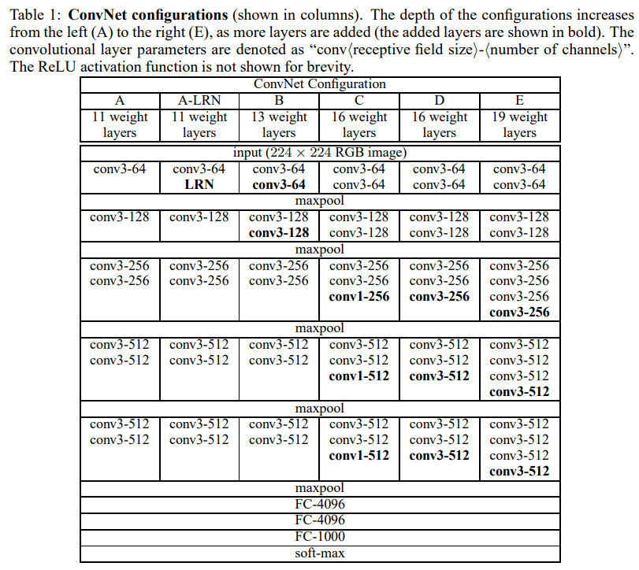
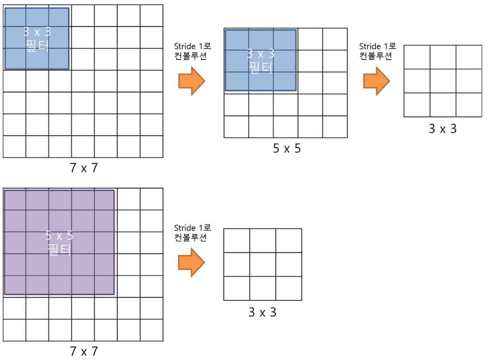

# VGGNet

ref. : ori. [Very Deep Convolutional Networks for Large-Scale Image Recognition](https://arxiv.org/abs/1409.1556)

> Plain CNN의 대표격.  
> 비교군으로 가장 많이 애용됨.

---

ILSVRC 2014년 준우승 모델 (2014년 우승모델은 GoogleNet)

* Karen Simonyan과 Andrew Zisserman

> 옥스퍼드 대학교의 Visual Geometry Group 연구소에서 개발한 모델이라, VGG라는 이름을 얻음

GoogleNet에 비해 매우 단순하면서도 전형적인 CNN 모델이었기 때문에 훨씬 더 많이 연구자들에게 애용된 모델임.

## 구조 

구조는 다음과 같음.
(주로 D와 E가 많이 사용됨.)

* D : VGG16
* E : VGG19

2~4개의 `convolutional layer`가 연속되고 이후 `max-pooling layer`가 연결되는 구조가 반복되는 형태임.

* [AlexNet](./alexnet.md)과 비교할 때, local response normalization 이 성능향상에 별 도움이 안된다고 언급.
* 대신 보다 작은 크기의 kernel에 기반한 layers를 반복하여 깊은 구조로 쌓는 것이 보다 성능향상에 도움이 된다고 강조.
* VGG 제안된 당시는 ***skip connection이 제안되기 전*** 이라 19 layers 이상을 쌓게 되는 경우 오히려 성능감소가 발생함 (`ResNet`에서 이 문제를 해결함).

> DL에서 ***layer의 수는 trainable layer만을 고려하는게 일반적*** 임.  
> 
> * VGG에선 convolutional layer 와 full connected layer (=dense layer)만이 고려됨.

모든 convolutional layer들은 kernel size가 3by3이고, stride가 1을 채택함.

* 당시로서는 매우 적은 수의 weights를 사용하면서 높은 성능을 보임.
* 큰 크기의 kernel을 사용할 경우 (padding 이 없다면), convolutional layer를 거친 후의 가로세로 크기가 더 크게 줄어들기 때문에 깊게 쌓기 어려움.
* 3by3 kernel을 사용함으로서 보다 깊게 쌓는 것이 가능해짐 (non-linear 한 ReLU activation을 보다 많이 적용할 수 있음).

---

## 작은 크기의 kernel의 특징.

아래 그림에서 보이듯이,  
3by3 kernel로 2번의 convolution 수행결과는  
5by5 kernel로 1번의 수행에 대응됨.
(7by7 kernel과 비교하면 3by3의 3번에 대응)

> 즉, 작은 kernel을 통한 convolution은 deep 한 구조의 network를 가능하게 하면서  
> weights의 수 ($3\times3\times2 \le 5\times5\times1$)를 줄일 수 있음.

---

## 그 외.

VGG19가 가장 깊은 모델로서 A형 모델을 학습시킨 후 low level layers를 해당 weight로 설정하고 추가된 layers를 학습시킴.

---

## 참고자료

...