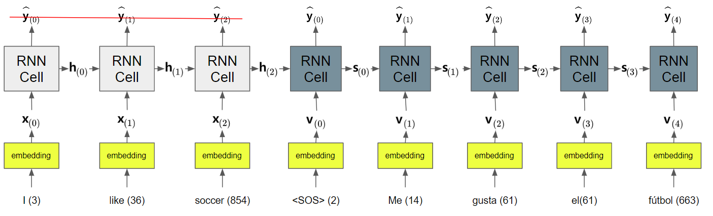

# Bahdanau Attention

RNN의 encoder-decoder (or seq2seq) model에 최초로 도입된 attention mechanism!

> Luong Attention (dot-product attention) 보다 복잡하고 성능 면에서 아쉬운 부분이 있어서 Luong Attention보다 덜 사용됨.

다음 그림은 "I like soccer"를 "Me gusta el fútbol"로 바꾸는 Neural Machine Translation을 수행하는 RNN인 seq2seq model을 나타내고 있다.

* $\textbf{x}_{(i)}$ : encoder의 time-step $i$에서의 input vector (or input embedding).
* $\textbf{h}_{(i)}$ : encoder의 time-step $i$에서의 hidden state vector.
* $\widehat{\textbf{y}}_{t}$ : decoder의 time-step $t$에서의 output vector (or output embedding).
* $\textbf{s}_{(t)}$ : decoder의 time-step $t$에서의 hidden state vector.
* $\textbf{v}_{(t)}$ : decoder의 time-step $t$에서의 input vector로 <sos>로 시작함. training의 경우 teacher forcing에 의해 원래 label값을 1 time-step으로 늦추어서 들어감.

Bahdanau et al.은 
2014년 기존의 seq2seq model의 decoder cell's input으로 이전 decoder cell의 출력에 해당하는 embedding을 사용(위의 그림참고)하는 대신, 
encoder의 모든 hidden state를 반영한 attention value를 구하여 이를 기존 input에 concate하여 decoder cell에 입력하는 방식을 제안했다.

이는 위의 seq2seq model에서 decoder의 $t$-time에서의 input $\textbf{v}_{(t)}$ 대신에, 
$\textbf{v}_{(t)}$에 attention vector $\textbf{a}_{(t)}$를 concatenate 시킨 $\tilde{\textbf{v}}_{(t)}$를 input으로 사용한다.

Bahdanau et al.이 제안한 attention mechanism에서, 
각 time-step의 decoder cell은 
encoder의 ^^모든 time-steps의 hidden state들에 접근하여 구한 attention value^^ 를 입력으로 받으며, 
해당 attention value는 각 time-step의 decoder cell에서 다른 값을 가진다. (하나의 context vector만을 전달하던 기존 seq2seq model과 다른 점임.)

각 time-step의 decoder cell에 대해 가장 관련성이 높은 encoder의 time-step의 hidden state에 높은 가중치를 할당하여 구해진 고유한 attention value를 사용하기 때문에
attention 을 추가한 seq2seq는 훨씬 높은 성능을 보인다. 

* 이는 기존의 seq2seq가 encoder의 마지막 hidden state만을 context vector로 삼아 이를 decoder의 초기 hidden state로 넘겨주던 방식으로 동작하여 가지고 있던 ^^긴 길이의 패턴에 성능이 떨어지는 단점^^ 을 극복할 수 있게 해줌.

다음 그림은 앞서 그림으로 보인 seq2seq 모델에서 time-step 3의 decoder cell의 output을 계산할 때, attention value를 구하는 과정을 도식화 한다. 

* 해당 decoder cell의 output label에 대한 모든 encoder의 hidden state의 관련성을 구하고 이를 weight로 삼아 weighted sum을 구해 attention value를 구함.
    * 이는 바로 이전의 decoder cell에서 구해진 hidden state와 가장 유사한 encoder의 특정 time-step hidden state가 해당 decoder의 output을 구하는데 관련성이 높다는 가정을 바탕으로 함
    * 현대 decoder cell과의 관련성을 기준으로 encoder hidden state를 재정렬한다고 볼 수 있고, 이 때문에 이를 수행하는 모듈을 alignment model이라고 부름.
    * 오늘날에는 alignment model이라는 용어보다는 attention layer라는 용어가 보다 일반적임.
* 각 encoder hidden state와 대상 decoder의 hidden state(Bahdanua의 경우 이전 time-step으로 지정)의 관련성을 attention score라고 부르며 time-step 3의 decoder cell의 이전 hidden state $\textbf{s}_{(2)}$를 기준으로 모든 time-step의 encoder hidden state에 대해 계산되어진다. 
* 두 vector $\textbf{s}_{(2)}$와 $\textbf{h}_{(i)}$의 유사한 정도를 측정하므로 similarity metric이 사용되며, Bahdanau et al.이 제안한 방식은 $\text{tanh}(W_s \textbf{s}_{(2)} + W_h \textbf{h}_{(i)})$이다.
    * inner product나 cosine similarity 등이 대안으로 사용가능하다. 다음 URL을 참고 : [Attention Scores 종류](./RNN_attention_score.md)

* Attention mechanism에서 