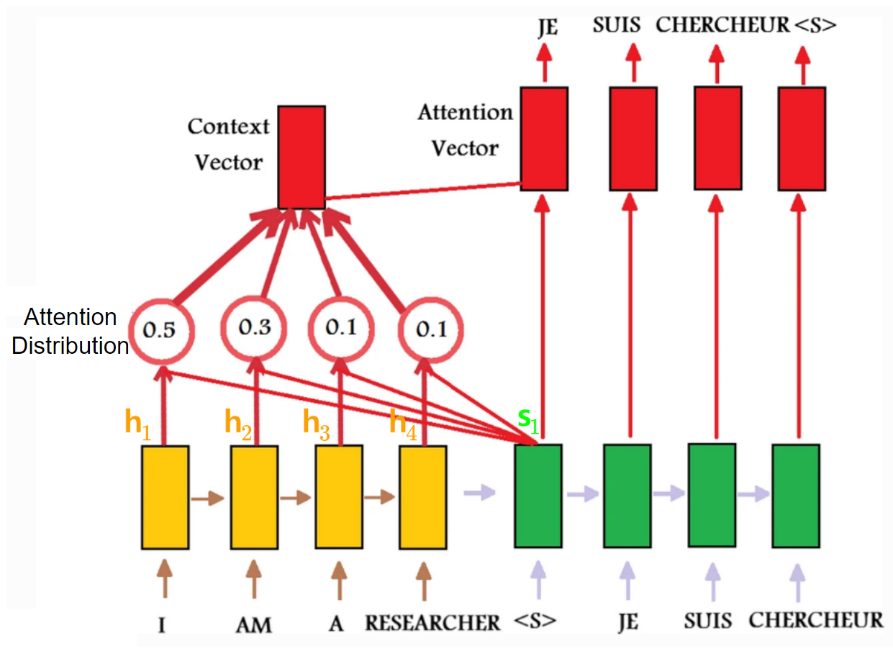

# Attention Score (or Alignment)

> 2014년 RNN의 `encoder-decoder` network에 도입이 되었으나, 2017년 이후 RNN 구조를 버리고 attention에 집중한 **Transformer**의 core로 사용되고 있다. **Transformer** 의 기본 구성요소라고도 할 수 있음.

Attention score는 attention function이라고도 불리며,  
Attention mechanism에서 `query`, `key`, `value` 에서 `query`와 `key`의 ***similarity*** 를 의미.

> 특정 `query`에 대해 모든 `key`들의 Attention score들로 구성된 vector $\textbf{e}$에 `softmax` 함수를 취해서 attention distribution (아래그림 참고)을 구함.  
> 이 attention distribution은 일종의 확률분포(다 더하면 1.0)이며 `value` vector와 함께 weighted sum, ***attention*** 을 구하는데 사용된다.  
>  
> 

Attention score는 input에서 어디에 집중을 해야하는지를 나타내는 지표이다.

## Attention score의 등장.

`seq2seq` 구조에 대해, 2014년 Graves, Wayne, Danihelka 가 attention (=content-based attention)을 도입함.

이 Content-based Attention을 위해서 

Decoder의 time-step $j$에서  

* Decoder state $\textbf{s}_{j-1}$ 과
* Encoder state $\textbf{h}_i$ 의
* similarity 가 계산된다.

해당 계산은 모든 Decoder state들에 대해 이루어짐.

여기서 Decoder state $\textbf{s}$와 Encoder state $\textbf{h}$ 간의 similarity를 구하는 것이 attention score 임.

---

`query`, `key`로 일반화하여 애기한다면, 

* Decoder state $\textbf{s}_{j-1}$이 `query`.
* Encoder state $\textbf{h}_i$가 `key`.

Grave et al. 의 논문에서 Decoder state와 Encoder state는 같은 dimension 크기를 가짐.

> Grave et al. 에서 `value`는 `key`와 동일.

---

## 많이 사용되는 Attention scores.

Grave et al.이 제안한 것을 포함하여 다음과 같은 여러 attention score (or attention functions)가 있음.

| ref. | name | def. | etc.|
|---|---|---|---|
|[Grave et al., 2014](https://arxiv.org/abs/1410.5401)| content-based attention | $f(\textbf{s},\textbf{h})=\frac{\textbf{s}\cdot\textbf{h}}{\|\textbf{s}\| \|\textbf{s}\|}$| |
|[Bahdanau et al., 2014](https://arxiv.org/abs/1409.0473)| Bahdanau (or additive) attention | $f(\textbf{s},\textbf{h})=V^T \text{tanh}(W_s \textbf{s} + W_h \textbf{s})$| Luong et al. 에선 `concat` attention score와 비슷. |
|[Luong et al., 2015](https://arxiv.org/abs/1508.04025)| Luong attention | $f(\textbf{s}, \textbf{h})= \textbf{h} \cdot W \textbf{s}$ | 논문에서 `general dot product approach` 라고 기술된 attention score|
|[Luong et al., 2015](https://arxiv.org/abs/1508.04025)| dot attention | $f(\textbf{s},\textbf{h})= \textbf{h} \cdot \textbf{s}$ | 논문에서 `dot product approach` 라고 기술된 attention score|
|[Vaswani et al., 2017](http://papers.nips.cc/paper/7181-attention-is-all-you-need.pdf)|scaled dot-product attention *|$f(\textbf{s},\textbf{h})= \frac{\textbf{s}\cdot \textbf{h}}{\sqrt{n}}$ | $n$ 은 encoder state $\textbf{h}$의 dimension임.  inner product를 사용하므로, $\textbf{s}$와 $\textbf{h}$의 차원이 같음.| 

* dot product approach가 additive approach보다 좀 더 나은 것으로 알려져있고 (Luong et al., 2015), 때문에 dot product approach가 보다 널리 사용됨.
    * 사실 transformer를 소개한, Vaswani et al. (2017)에서 제안된 scaled dot-product attention이 가장 많이 사용된다 (keras에서 `keras.layers.Attention`으로 구현됨.)
* decoder's hidden state에 접근하기 보다는 decoder의 output을 사용하는 형태로 구현하는 경우가 보다 쉽고 고속화등에서 유리한 점이 있기 때문에 많이 사용됨(성능도 나쁘지 않음).
* decoder의 output을 사용할 경우, Luong et al.이 제안한대로 attention layout의 출력을 softmax를 activation으로 가지며 decoder의 최종 output을 내놓는 `dense`의 입력으로 직접 사용함.

## 읽어보면 좋은 자료.

* [Multi-head attention mechanism: “queries”, “keys”, and “values,” over and over again](https://data-science-blog.com/blog/2021/04/07/multi-head-attention-mechanism/)
* [어텐션 메커니즘 (Attention Mechanism) : Seq2Seq 모델에서 Transformer 모델로 가기까지](https://heekangpark.github.io/nlp/attention)
* [cosine similarity](https://dsaint31.tistory.com/entry/ML-Cosine-Similarity)
* [distance function](https://dsaint31.tistory.com/entry/ML-Cosine-Similarity)