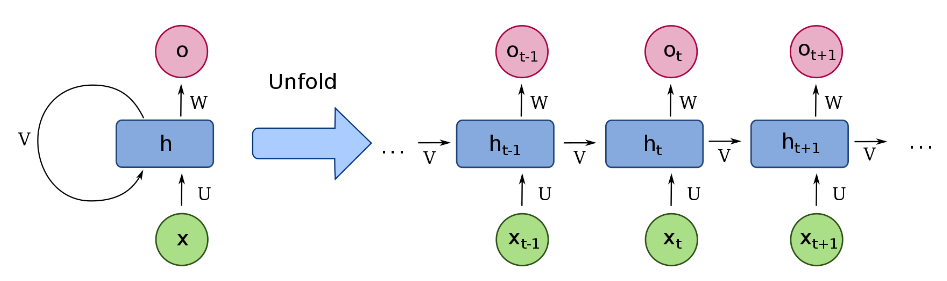

# Recurrent Neural Network (순환신경망, `RNN`)

ANN은 일종의 node들을 edge로 연결한 일종의 system이라고 볼 수 있다. 

> 일반적으로 system은 특정 input에 대해 특정 output을 mapping 시켜주는 transformer 또는 function으로 해석되며, input과 output을 가지는 sub-system의 연결 방식에 따라 구분되기도 한다. 

ANN의 연결방식에서 input에서 output으로 연결이 하나의 방향으로만 이루어진 경우, feed-forward network라고 부른다. 

* feed-forward network는 일종의 memoryless system (or instantaneous system)임.
* 이전 결과에 상관없이 현재의 input에 의해서만 output이 결정됨.
* sequence type의 input을 처리할 때, input의 전체 length가 한번에 feed-forward network에 주어져야함.
    * 이는 input의 크기가 고정됨을 의미.

instantaneous system과 대조되는 것이 바로 dynamic system (memory system)으로 이같은 systems에서는 feedback connection이 존재한다. ANN에서 feedback connection이 있는 구조를 Recurrent Neural Network (RNN)라고 칭함.

* feedback connection은 system이나 subsystem에서의 output이 앞단이나 자신의 input으로 사용되도록 연결된 것을 가르킴.
    * feedback connection이 있는 경우, network는 일종의 loop를 이루게 됨.
* dynamic system은 feedback connection을 통해 과거의 output이 현재의 output에 영향을 주도록 구현됨.
    * dynamic system은 state를 가지고 있으며, state와 input에 의해 output이 결정되고, 해당 state는 과거의 state와 현재의 input에 의해 변화됨.
* 과거의 output을 기억하여 이를 이용한다고 볼 수 있으며 때문에 memory를 가진 system이라고 부름.

참고 : [feedback connection 요약자료](https://dsaint31.tistory.com/600)  
참고 : [Dynamic System and Instantaneous System](https://bme808.blogspot.com/2022/10/dynamic-system.html)

다음의 그림은 RNN의 구조를 보여줌.

* input $\textbf{x}$에 대해서 weight $U$가 곱해짐.
* $\textbf{h}$는 hidden state라고 불려지며 일종의 memory라고 볼 수 있음.
* feedback connection을 통해 과거의 $\textbf{h}$와 현재의 input $\textbf{x}$에 의해 현재의 state가 결정됨.
* hidden state로부터 output이 나오는 부분은 위그림은 단순히 $W$로 표현했으나 이는 `RNN`에서 고정된 것이 아님. 단순한 dense layer를 사용할 수도 있으나 보다 복잡하게 구성될수도 있음.
* hidden state라고 불리는 이유는 output만으로 나오지 않는 경우 i/o 단에서는 보이지 않기 때문임.

> `RNN` 의 구조적 특징은 feedback connection을 가지고 있다는 것임.  
> 이 feedback connection을 통해, 과거의 input들을 기억(?)하고 있는 ***state*** 를 가짐.

`RNN`은 이전 input에 대한 정보를 가지고 있는 state가 있기 때문에 이론상으로는 무한히 긴 input sequence 을 처리할 수 있다 (한번에 입력받을 최대사이즈는 고정).

* sequence에서 특정 time의 data point에 해당하는 vector (이 vector의 최대길이는 고정)가 `RNN`에 입력됨.
* 이후 다음 time의 data point에 해당하는 vector가 `RNN`에 입력됨.
* 이 경우 input들은 각각이 입력된 시간을 가지며, state들도 어느 시점의 state인지가 구분됨.

위의 `RNN` 그림을 풀어서(unfold)로 표시하면 다음과 같음

* feedback connection을 time별로 풀어서 표현함.
* 무한한 길이의 sequence type이 input으로 주어지면 unfold로 그릴 경우 역시 무한한 길이로 표현됨.
* 참고로 이 그림에서 한번에 들어가는 input (특정 시점의 input vector)가 바로 $\textbf{x}_{t-1}$임.

> 이론상이라고 한 이유는 `RNN`의 가장 큰 문제점 중 하나가 현재 output 또는 state를 결정하는데 있어서 오래전에 입력된 input일수록 영향력이 줄어든다는 점임.  
> 이를 해결하기 위해 LSTM, GRU 등이 제안되었지만 완전히 해결이 된 것은 아님.

임의의 길이의 sequence를 처리할 수 있기 때문에 `RNN`은 다음과 같은 데이터를 처리하는데 사용됨.

* 문장 (자연어).
* 문서 (자연어).
* 사람 음성과 같은 audio data
* 주식 데이터 나 특정기간의 기후 데이터.

특히 `RNN`은 번역이나 `speech-to-text` 등에 많이 사용되었던 방식임 

> 현재 번역과 같은 자연어 처리에는 `transformer`를 기반으로 처리하는 게 일반적임. `RNN`은 초기에 사용됨.

`RNN`은 sequential data를 다루는데 가장 기본적으로 적용되는 모델이라고 할 수 있으나, `Transformer`의 등장으로 그 사용범위가 줄어들고 있는 추세이다.

* 아주 짧은 sequential data에는 fully connected layer로 구성된 방식도 가능함(max-length가 고정됨)
* 1D convolution을 통한 sequential data처리도 가능함.
* 하지만 최근엔 `Transformer` 방식이 가장 널리 사용됨.

`RNN`이 많이 사용되는 방식은 과거의 input들을 통해 pattern을 기억하고 이를 바탕으로 미래의 output을 예측하는 형태이다. 예를 들면, 특정 단어들의 list를 입력으로 받고 다음에 올 단어를 예측하거나, 지난 특정 기간의 날씨정보를 입력받아 내일의 날씨를 예측하는 task에서 `RNN`은 자연스럽게 적용할 수 있음.