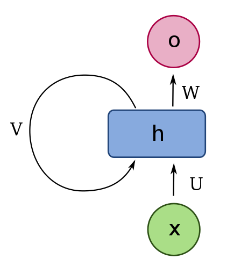
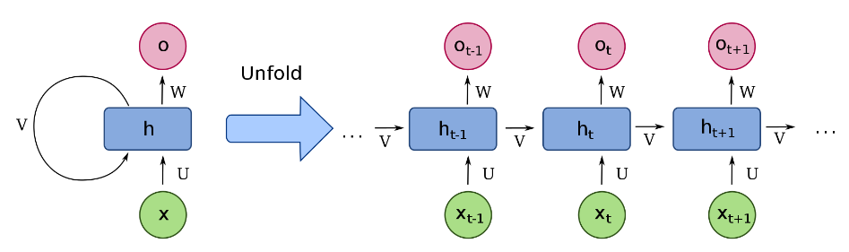

# Recurrent Neural Network (순환신경망, `RNN`)

> time series data와 같은 (임의의 길이를 가지는) sequential data를 다루는데 적합한 ANN.  
> `feedback connection`을 가짐.
>   
> RNN은 1개의 layer라도  
> 기본적으로 feedback connection에 의해  
> time 축 상으로 weight를 공유하는 layer가 쌓이는 효과를 가짐.  
>
> 여기에 다른 weights 를 가지는  
> 여러 layer들을 쌓을 수도 있기 때문에 매우 복잡한 ANN이 됨.  
>
> * [time series data란](https://dsaint31.tistory.com/604)

---

## Feed-forward Network vs. RNN

ANN은 node들을 edge로 연결한 *일종의 system* 이라고 볼 수 있다. 

> 일반적으로 system은  
> 특정 input에 대해 특정 output을 mapping 시켜주는  
> transformer (DL의 transformer architecture아님) 또는 function으로 해석되며,  
> input과 output을 가지는 sub-system의 연결 방식에 따라 구분되기도 한다. 

ANN의 연결방식에서  
input에서 output으로 연결이 하나의 방향으로만 이루어진 경우, `feed-forward network`라고 부른다. 

* feed-forward network는 일종의 memoryless system (or ***instantaneous system*** )임.
* 이전 결과에 상관없이 현재의 input에 의해서만 output이 결정됨.
* sequence type의 input을 처리할 때, input의 전체 length가 한번에 feed-forward network에 주어져야함.
    * 이는 input의 크기가 고정됨을 의미.

Feed-forward network에 해당하는 instantaneous system과 대조되는 것이  
바로 ***dynamic system (memory system, state machine)*** 임.  
dynamic systems에서는 ***feedback connection이 존재*** 한다.  

ANN 의 경우, feedback connection이 있는 구조를 `Recurrent Neural Network` (`RNN`) 라고 칭함.

* feedback connection은 system이나 subsystem에서의 ***output을 앞단이나 자신의 input으로 사용되도록 연결*** 된 것을 가리킴.
    * feedback connection이 있는 경우, network는 일종의 loop를 이루게 됨.
* dynamic system은 feedback connection을 통해 과거의 output이 현재의 output에 영향을 주도록 구현됨.
    * dynamic system은 과거의 `input`과 `output`에 대한 기억에 해당하는 `state`를 가지고 있으며,
    * ***`state`와 `input`에 의해 `output`이 결정*** 된다.
    * 현재의 `state`는 과거의 `state`와 현재의 `input`에 의해 결정됨.
* 과거의 output을 기억하여 이를 이용한다고 볼 수 있으며 때문에 ***memory를 가진 system*** 이라고 부름.

참고 : [feedback connection 요약자료](https://dsaint31.tistory.com/600)  
참고 : [Dynamic System and Instantaneous System](https://bme808.blogspot.com/2022/10/dynamic-system.html)

---

## RNN의 구조

다음의 그림은 `RNN`의 구조를 보여줌.

{style="display: block; margin: 0 auto; width: 300px"}

* input $\textbf{x}$에 대해서 weight $U$가 곱해짐.
* $\textbf{h}$는 hidden state라고 불려지며 **일종의 memory** 라고 볼 수 있음.
* feedback connection을 통해 과거의 $\textbf{h}$와 현재의 input $\textbf{x}$에 의해 현재의 state가 결정됨.
* hidden state로부터 output이 나오는 부분이 위 그림에선 단순히 $W$로 표현했으나 이는 `RNN`에서 고정된 것이 아님.
    * 단순한 dense layer를 사용할 수도 있으나
    * 그보다 복잡하게 구성될 수도 있음.
* hidden state라고 불리는 이유는 output으로 그대로 나오지 않는 경우(위 그림에선 `W` 와 곱해짐)가 대부분이라, I/O 만으로는 확인할 수 없기 때문임.
    * 간단하게 그릴 때는 output과 hidden state를 같게 표시하기도 함. 

이를 수식적으로 표현하면 다음과 같음.

$$ 
\textbf{h}_t = f(U \textbf{x}_t + W \textbf{h}_{t-1} + \textbf{b})\\ 
\textbf{y}_t = g(V \textbf{h}_t + \textbf{c})
$$

* 위 그림에서는 bias 에 해당하는 $\textbf{b}, \textbf{c}$는 빠져 있음.
* $f(...)$ : non-linear activation function, (`tanh`, `ReLU` 등)
* $g(...)$ : non-linear output function, (`softmax`, `sigmoid` 등)
* $W, V, U$: parameters (=weight matrix)
* $\textbf{c}, \textbf{b}$: bias vector
  

> `RNN` 의 구조적 특징은 feedback connection을 가지고 있다는 것임.  
> 이 feedback connection을 통해, 과거의 input들을 기억(?)하고 있는 ***state*** 를 가짐.
> 동시에 임의의 길이의 input data를 다룰 수 있음.

`RNN`은 이전 input에 대한 정보를 가지고 있는 state가 있기 때문에  
이론상으로는 무한히 긴 input sequence 을 처리할 수 있다 (매 time에 입력받는 데이터 사이즈는 고정됨).

* sequence에서 특정 time의 data point에 해당하는 vector (이 vector의 최대길이는 고정)가 `RNN`에 입력됨.
* 이후 다음 time의 data point에 해당하는 vector가 `RNN`에 입력됨.
* 이 경우 input들은 각각이 입력된 시간을 가지며, state들도 어느 시점의 state인지가 구분됨.

> 때문에 `RNN`은 input과 output으로 sequential data를 사용할 수 있음.  
> 자세한 건 `RNN`의 topologies를 참조 : [url](./RNN_topologies.md)  
> 
> * 여기서 sequence는 vector을 한 timestep의 item으로 가지는 sequence임.

### unrolling RNN 

위의 `RNN` 그림을 풀어서(unrolling)로 표시하면 다음과 같음

* feedback connection을 time별로 풀어서 표현함.
* 무한한 길이의 sequence type이 input으로 주어지면 unrolling로 그릴 경우 역시 무한한 길이로 표현됨.
* 참고로 이 그림에서 한번에 들어가는 input (특정 시점의 input vector)가 바로 $\textbf{x}_{t-1}$임.

> 이론상이라고 한 이유는 `RNN`에서 현재 output 또는 state를 결정할 때 오래전에 입력된 input일수록 영향력이 줄어든다는 문제점을 가지고 있기 때문임.  
> 오래전 input이라도 현재의 output을 결정하는데 매우 중요한 정보일 수 있는데, `RNN`에서는 input이 들어온 시점이 오래될수록 현재 output에 대한 영향력이 줄어듬 (오래된 일에 대한 기억력이 좋지 못하다고 볼 수 있음)
> 달라 말하면, RNN은 "멀리 떨어진 time step들 사이의 의존 관계(=long-term dependency)" 를 제대로 모델링하기 어려움.
> 이를 해결하기 위해 `LSTM`, `GRU` 등이 제안되었지만 완전히 해결이 된 것은 아님.

---

## Input Data Type.

임의의 길이의 sequence를 처리할 수 있기 때문에 `RNN`은 다음과 같은 데이터를 처리하는데 사용됨.

* 문장 (자연어).
* 문서 (자연어).
* 사람 음성과 같은 audio data
* 주식 데이터 나 특정기간의 기후 데이터.

특히 `RNN`은 번역이나 `speech-to-text` 등에 많이 사용되었던 방식임 

> 현재 번역과 같은 자연어 처리에는 `transformer`를 기반으로 처리하는 게 일반적임.
> `RNN`은 초기 기계번역에 사용됨.

---

## RNN 계열 모델의 장단점

### 장점

* 동일한 recurrent cell을 모든 time step에 반복 적용하고, 이전 state를 현재 계산에 사용하는 구조로 인해 다음의 장점을 가짐:
    * Sequential data modeling에 자연스럽게 적합함 : 이전 state를 현재 계산에 반영하므로 sequence의 순서 정보를 직접적으로 다룰 수 있음.
    * ***Variable-length sequence 처리에 적합함*** (구조적으로 fixed maximum length 불필요): 동일한 recurrent cell을 반복 적용하므로 길이가 다른 sequence에도 같은 구조를 사용할 수 있음.
    * Parameter sharing : 모든 time step에서 동일한 weight를 공유하므로 sequence 길이가 증가해도 parameter 수는 증가하지 않음.
    * ***Temporal dependency를 modeling*** 가능 : 이전 state를 통해 과거 정보가 현재 prediction에 반영됨.
    * Streaming / online processing에 유리함 : 전체 sequence를 한 번에 입력하지 않아도, input이 들어오는 순서대로 state를 갱신하면서 처리할 수 있음.
* LSTM과 GRU 같은 memory cell variants를 사용하면 recurrent structure의 장점을 유지하면서 다음을 추가로 얻을 수 있음:
    * gating mechanism을 통해 중요한 정보를 선택적으로 유지하거나 제거할 수 있음.
    * Simple RNN보다 long-term dependency 학습에 유리함.
    * Vanishing Gradient 문제를 완화할 수 있음.

### 단점

- 이전 **state**와 현재 **input**에 의해 현재의 state와 output이 결정되는 순차적 구조로 인해 다음의 한계를 가짐:
    - 서로 다른 time step의 input 사이에 **direct interaction이 불가**하며, 이전 state를 매개로 간접적으로만 정보가 전달됨.
    - 멀리 떨어진 time step 사이의 정보가 여러 recurrent state를 거쳐 전달되어야 하므로 **long-term dependency 학습에 한계**를 가짐.
    - 현재 time step의 계산이 이전 time step의 state에 의존하므로 **sequence 방향의 computation 병렬화가 어려움**.
        - 반면 Transformer는 일반적으로 fixed maximum sequence length를 설정하지만, 해당 범위 내의 모든 time step input을 동시에 처리할 수 있어 sequence 방향의 병렬화에 훨씬 유리함.
- **Vanishing/Exploding Gradient** 문제가 발생할 수 있음:
    - time 축으로 펼치면 매우 깊은 network와 같은 형태가 되어, **BPTT** 과정에서 gradient가 여러 time step에 걸쳐 반복적으로 곱해짐.        
    - RNN layer를 여러 층으로 쌓으면 time 방향뿐 아니라 **layer 방향으로도 gradient path가 길어져** Vanishing/Exploding Gradient 문제가 더 심해질 수 있음.
        - Vanishing Gradient가 발생하면 매우 이른 time step의 input이 현재의 loss와 weight update에 미치는 영향이 sequence가 길어질수록 매우 작아져 long-term dependency 학습이 어려워짐.
    - `tanh` activation은 hidden state의 값을 제한하여 activation의 폭주를 억제하는 데 도움을 주지만, **Vanishing/Exploding Gradient 문제 자체를 해결하지는 못함**.
        - 특히 `tanh`가 saturation 영역에 들어가면 derivative가 0에 가까워져 **Vanishing Gradient를 악화시킬 수 있음 (다만 logistic sigmoid보다 zero-centered이고 최대 derivative도 더 커서 일반적으로 gradient propagation에는 더 유리함.)**.
    - **LSTM**과 **GRU** 같은 memory cell variants는 gating mechanism과 memory path를 통해 gradient와 정보를 더 오래 전달할 수 있도록 하여, 특히 **Vanishing Gradient와 long-term dependency 문제를 완화**함. 다만 이를 완전히 제거하지는 못함.

---

## RNN의 응용분야.

`RNN`은 sequential data를 다루는데 가장 기본적으로 적용되는 모델이라고 할 수 있으나,  
`Transformer`의 등장으로 그 사용 범위가 줄어들고 있는 추세이다.

* 아주 짧은 sequential data에는 fully connected layer로 구성된 방식도 가능함(max-length가 고정됨)
* 1D convolution을 통한 sequential data처리도 가능함.
* 하지만 최근엔 `Transformer` 방식이 가장 널리 사용됨.

`RNN`이 많이 사용되는 방식은 과거의 input들을 통해 pattern을 기억하고 이를 바탕으로 미래의 output을 예측하는 형태이다.  
예를 들면, 특정 단어들의 list를 입력으로 받고 다음에 올 단어를 예측하거나, 지난 특정 기간의 날씨정보를 입력받아 내일의 날씨를 예측하는 task에서 `RNN`은 자연스럽게 적용할 수 있음.
