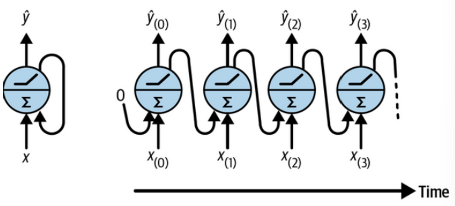
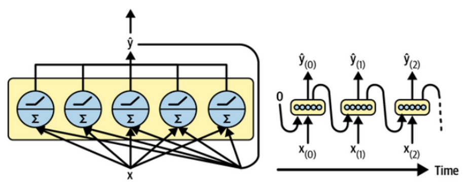
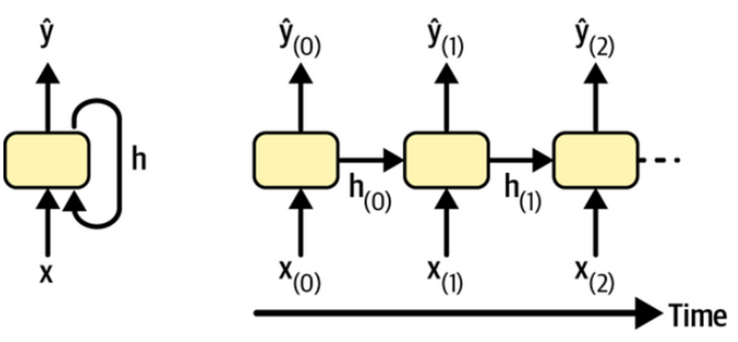

# Memory Cell (or Cell)

## Recurrent Neuron

가장 간단한 `RNN`은 single neuron에 feedback feedback connection을 가진 경우임.

이를 그림으로 표현하면 다음과 같음.

* feedback connection으로 나타낸 `recurrent neuron`이 왼쪽이고, unfold (or unrolling) form은 오른쪽임.

## Recurrent Layer

output을 vector로 확장 (single recurrent neuron을 여러 개 사용)한 것이 `recurrent layer` (= a layer of recurrent neurons)임.

## Memory Cell 

Artificial Neuron이 생물학적 신경세포에서 이름을 따온 것처럼 memory(기억)과 관련된 cell이라는 의미로, `recurrent neuron`을 `memory cell`이라고 부름.

* 실제로 `recurrent neuron`의 output은 이전의 모든 input에 의해 결정됨.
* 이전 input들에 의한 state 와 현재 input에 의해 output이 결정되므로 일종의 기억을 한다고 볼 수 있음.

보다 단순하게 `cell`이라고도 부름. 

> 일반적으로는 `recurrent layer`를 하나의 `cell`로 칭하며 아래처럼 입출력과 feedback connection을 가진 box로 그린다.

다음은 memory cell의 그림이며, sequential data의 한 time step에 해당하는 input vector를 받아 output vector를 내보내는 가장 간단한 형태를 보여줌.

* 위 그림의 `h`는 hidden state를 의미함.

timestep $t$에서의 output $\hat{\textbf{y}}_{(t)}$와 hidden state $\textbf{h}_{(t)}$를 function으로 표현하면 다음과 같음.

$$\begin{aligned}\textbf{h}_{(t)} &= f_h\left(\textbf{x}_{(t)}, \textbf{h}_{(t-1)}\right) \\ \hat{\textbf{y}}_{(t)} &= f_o \left(\textbf{h}_{(t)}\right)\end{aligned}$$

