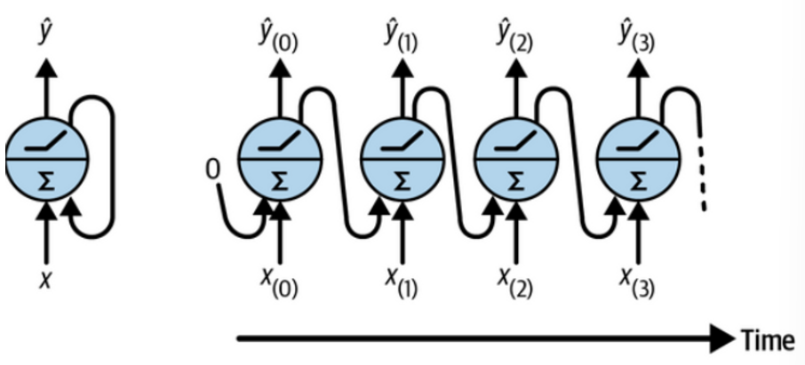
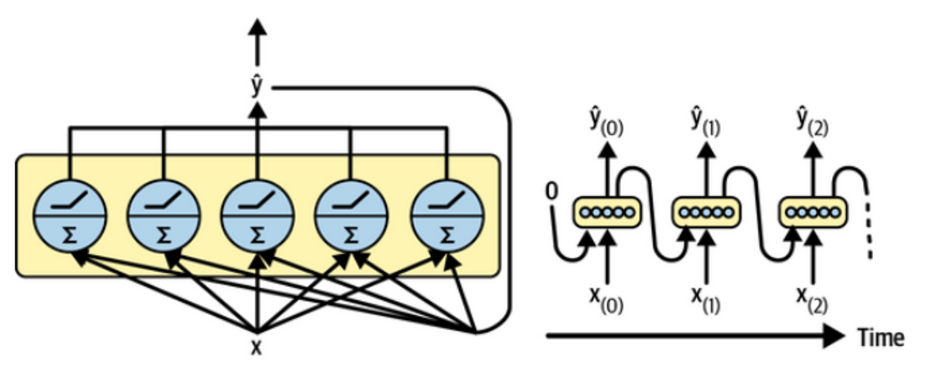
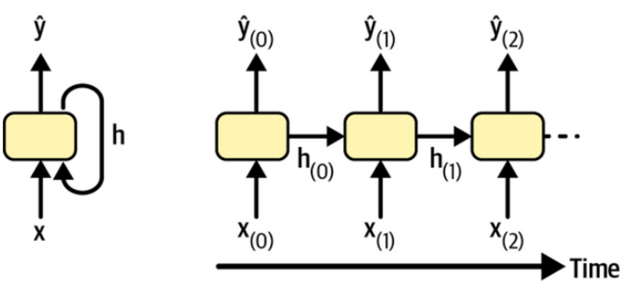

# Memory Cell (or Cell)

> 가변 길이의 sequence 입력을 처리할 수 있으나
> Simple RNN cell은 vanishing gradient 등의 문제로
> long-term dependency를 학습하기 어려움 (대략 수십 step 이하로 제한)  
> 때문에 Simple RNN 보다는 LSTM, GRU 등의 Memory Cell 이  
> 주로 사용됨.  
>
> Transformer의 등장 이후에는
> NLP 를 포함한 거의 대부분의 sequence modeling 영역에서
> Transformer 계열이 RNN 계열을 대부분 대체함.

## Recurrent Neuron

가장 간단한 `RNN`은  
single neuron에 recurrent connection (or feedback connection)을 가진 경우임.

즉, 

* 이전 time step의 output이
* 다시 입력으로 들어오는 feedback connection 을 가진 형태 임.

이를 그림으로 표현하면 다음과 같음:

{style="display:block; margin:0 auto; width: 500px"}

* feedback connection으로 나타낸 `recurrent neuron`이 왼쪽이고,
* unfold (or unrolling) form은 오른쪽임.

각 time step 에서 neuron 은

* 현재 input 과
* 이전 time step 의 state 를 이용하여
* 새로운 state 를 계산함.

## Recurrent Layer

input/output을 vector로 확장 (single recurrent neuron을 여러 개 사용)한 것이  
`recurrent layer` (= a layer of recurrent neurons)임.
(이를 memory cell 이라고도 부름)

실제 RNN에서는 하나의 scalar neuron보다는  

* 여러 hidden units를 사용하여
* hidden state를 vector 형태로 표현하는 것이 일반적임.

이러한 recurrent computation을 수행하는 여러 hidden units의 집합을
recurrent layer라고 함.

{style="display:block; margin:0 auto; width: 500px"}

recurrent layer는 각 time step에서

* input vector를 받고,
* 이전 hidden state vector와 함께 계산하여
* 새로운 hidden state vector를 생성함.

즉, recurrent layer의 hidden state는 다음과 같이 표현할 수 있음:

$$
\textbf{h}_{(t)} = f_h \left( \textbf{x}_{(t)}, \textbf{h}_{(t-1)} \right )
$$

## Memory Cell 

RNN cell 또는 간단히 cell은
한 time step에서 수행되는 recurrent computation을 정의하는 unit을 의미함.

Artificial Neuron이 생물학적 신경세포에서 이름을 따온 것처럼  
memory(기억)과 관련된 cell이라는 의미로,  
`recurrent neuron` 또는 `recurrent layer` 를 `memory cell`이라고 부름.

* 실제로 `recurrent neuron`의 output은 이전의 모든 input에 의해 결정됨.
* 이전 input들에 의한 state 와 현재 input에 의해 output이 결정되므로 일종의 기억을 한다고 볼 수 있음.

보다 단순하게 `cell`이라고도 부름. 

> 일반적으로는 `recurrent layer`를 하나의 `cell`로 칭하며
> 아래처럼 입출력과 feedback connection을 가진 box로 그린다.

다음은 memory cell의 그림이며, sequential data의 한 time step에 해당하는 input vector를 받아 output vector를 내보내는 가장 간단한 형태를 보여줌.

{style="display:block; margin:0 auto; width: 500px"}

* 위 그림의 `h`는 hidden state를 의미함.

timestep $t$에서의 

* output $\hat{\textbf{y}}_{(t)}$와
* hidden state $\textbf{h}_{(t)}$를
* ***function으로 표현*** 하면 다음과 같음:

$$\begin{aligned}\textbf{h}_{(t)} &= f_h\left(\textbf{x}_{(t)}, \textbf{h}_{(t-1)}\right) \\ \hat{\textbf{y}}_{(t)} &= f_o \left(\textbf{h}_{(t)}\right)\end{aligned}$$

## PyTorch : RNNCell 과 RNN

> PyTorch에서  
> `nn.RNNCell`은 recurrent layer의 한 timestep 계산을 수행하고,  
> `nn.RNN`은 그 계산을 sequence의 모든 timestep에 자동으로 반복하며  
> 필요하면 여러 recurrent layers까지 stack하는 module임.

`nn.RNNCell`은 

* 한 time step의 recurrent computation만 수행
* 입력은 현재 input과 이전 hidden state이고,
* 출력은 새로운 hidden state 임.
 
즉, 다음과 같이 사용자가 직접 time loop를 돌려줘야 함:

```python
cell = nn.RNNCell(input_size=10, hidden_size=20)

h = torch.zeros(batch_size, 20)

for t in range(seq_len):
    h = cell(x[:, t, :], h)
```

반면 `nn.RNN`은 

* sequence 전체를 입력받아 위 recurrence를 모든 time step에 대해 내부적으로 반복.
* 또한 `num_layers > 1` 이면 여러 recurrent layers까지 stack해서 처리.

PyTorch 공식 문서도 `nn.RNN`을 “multi-layer Elman RNN을 input sequence에 적용”하는 module로 정의하고 있음: 내부 동작을 time loop와 layer loop를 중첩한 pseudocode로 보여줌.

```python
rnn = nn.RNN(
    input_size=10,
    hidden_size=20,
    num_layers=1,
    batch_first=True
)

output, h_n = rnn(x)
```


