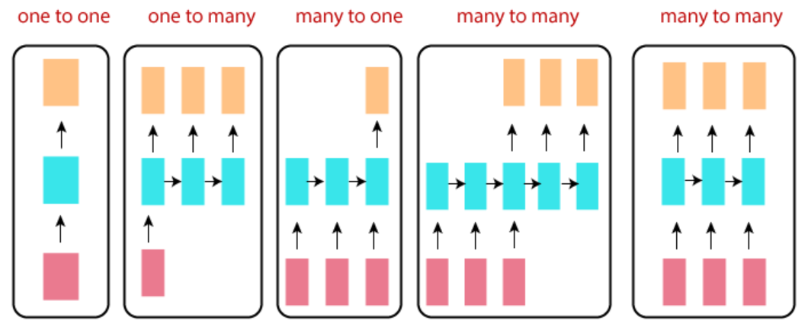
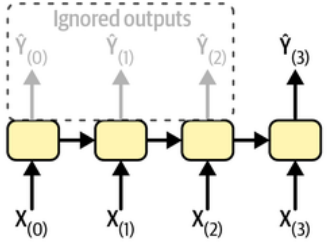
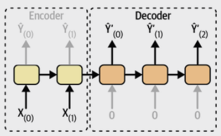

# Recurrent Neural Network Topologies (or The Types of RNN)

* red box : input layer
* blue box : hidden layer
* orange box : output layer

참고 : [topology란?](https://dsaint31.me/mkdocs_site/ML/ch07/topological_space/#topology)

## one-to-one

> `vector-to-vector` 라고도 불림.  
> 여기서 `one`이란 ^^time-step의 관점에서 하나의 element^^ 임을 의미.

입력과 출력이 각각 `single time-step에 해당하는 vector` (or scalar)임.

사실 RNN에서 가장 단순한 구조이지만, 더 단순한 `Fully connected network` (or `Dense`)등으로 구현되는 경우와 차이가 거의 없다. 

sequence 를 다루기 위해 RNN을 사용하는데, 해당 sequence가 하나의 element만 있는 경우로 의미가 없음.

## one-to-many

> `vector-to-sequence` 라고도 불림.

하나의 image가 들어가서 해당 image에 대한 caption이 생성되는 image captioning task에서 사용되는 network를 생각하면 이해가 쉽다.

single time-step의 input에 대해 sequence output이 나오는 network임.

> feature vector를 입력받는 text generation model이라고 봐도 됨.

## many to one

> `sequence-to-vector` 라고도 불림.

앞서 다룬 one to many의 반대에 해당한다. RNN을 소개할 때 많이 사용되는 ***sentiment analysis network*** 가 대표적인 예이다. 

> 5만개의 ***IMDb*** reviews (영화리뷰)에 대해 negative review인지 positive review인지를 판별하는 sentiment analysis network는 RNN분야에서의 hello world에 해당하는 예제임.  
> 
> * IMDb : Internet Movie Database : [goto site](https://imdb.com/)

실제 구현할 때는 아래 그림처럼 각 RNN cell에서 마지막 출력 외에는 무시하는 형태로 구현됨.

## many to many (encoder-decoder)

> `sequence-to-sequence` 의 일종이지만, `encoder-decoder`로 더 많이 불림 (`seq2seq`로 불림).

왼쪽의 input sequence (3 time-steps)들이 존재하는 부분은 encoder라고 볼 수 있고, 이후 오른쪽의 output sequence가 있는 부분을 decoder라고 볼 수 있음.

input sequence를 전체를 입력받아서 encoding을 수행하여 represent를 얻고 이를 기반으로 decoding을 하여 output sequence를 얻는 형태로 2017년 transformer가 등장하기 전까지 machine translation 분야 등에서 인기있던 topology였음.

> 위의 그림과 같이 encoder와 decoder가 연결된 가운데에서 input과 output이 같이 존재하는 형태로 그려지기도 하지만, 아래 그림처럼 input seq.가 있는 곳에선 output이 없고, output이 있는 곳에선 input이 없는 형태로 그려지기도 함.  
>
> 
>  
> 이경우 `many-to-one`과 `one-to-many`가 연결된 것으로도 볼 수 있다.

## many-to-many 

오른쪽에서 끝에 놓인 many-to-many는 
***time sequence를 forecast하는 경우*** 등에 애용된다.  

앞서본 `encoder-decoder`와 달리 input sequence의 모든 time step을 끝까지 기다릴 필요없다는 장점을 가진다 (최근 N개의 time step 데이터를 바탕으로 forecast를 수행). 

> 이는 causal system이라는 가정이 깔려있다고도 볼 수 있음.
