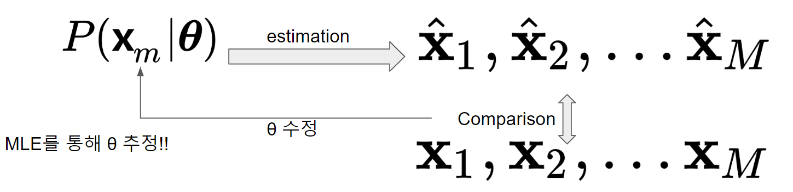
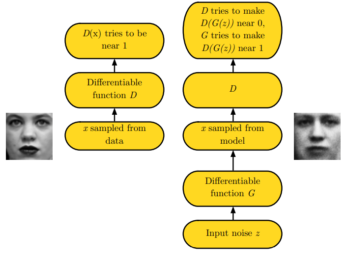

# Generative Adversarial Network (GAN)

## Generative Model

Generative model은 train dataset의 probability distribution을 학습하고, 이를 통해 해당 dataset의 data들과 유사한 data를 생성하는 model을 의미함.

일반적인 supervised learning에서의 model이 $P(\text{label} | \text{data})$를 구하는 것과 달리, Generative model은 $P(\text{data})$를 구하는 것을 목표로 함.

대부분의 경우, train dataset에 대한 $P(\text{data})$는 알 수 없기 때문에 이를 모델링하는 $P(\text{data}|\boldsymbol{\theta})$를 만들고 parameters $\boldsymbol{\theta}$를 조절하여 실제 분포 $P(\text{data})$를 근사(approximation)하도록 한다.

### Maximum Likelihood Maximization (MLE)

앞서 그림에서 parameters $\boldsymbol{\theta}$를 구하는데에 MLE가 사용된다.

train dataset의 data를 $\textbf{x}_m$라고 하면 likelihood $\mathcal{L}(\boldsymbol{\theta})$를 다음과 같다.

$$
\mathcal{L}(\boldsymbol{\theta})=\prod^M_{m=1} P(\textbf{x}_m | \boldsymbol{\theta})
$$

* 일반적으로 각 data sample vector $\textbf{x}_m$이 동일한 probability distribution (or 모델분포)에서 ***독립적으로 생성된다고 가정*** (실제 독립이 아닐 수도 있으나, 이 경우 계산이 쉽지 않음.) 함.

이 likelihood function을 다음과 같이 maximization하는 parameter가 최적의 $\boldsymbol{\theta}_{\text{optimum}}$임.

$$
\begin{aligned}\boldsymbol{\theta}_{\text{optimum}} &= \underset{\boldsymbol{\theta}}{\text{arg max}} \mathcal{L}(\boldsymbol{\theta}) \\ &= \underset{\boldsymbol{\theta}}{\text{arg max}} \sum^M_{m=1} \log \mathcal{L}(\boldsymbol{\theta})\end{aligned}
$$

* 일반적으로 곱인 $\prod$보다는 $\sum$을 사용하기가 편하기 때문에 log likelihood로 변경해서 사용함.

위의 MLE로 구한 parameter는 아래와 같이 KL Divergence를 minimization하는 것과 동일함.

$$
\boldsymbol{\theta}_{\text{optimum}}=\underset{\boldsymbol{\theta}}{\text{arg max }} \text{KL}(P(\textbf{x}_m)||P(\textbf{x}_m|\boldsymbol{\theta}))
$$

## Generative Adversarial Network (GAN)

2014년 Ian J. Goodfellow et al.이 제안한 Generative model을 estimation하기 위한 framework. 현재 Generative model을 학습시키기 위한 가장 인기있는 방법 중의 하나임.

* 실제처럼 보이는 data를 생성하는 generative model인 Generator와 
* input data의 실제 여부를 구별하는 classifier인 discriminator로 구성됨.
* 이 둘은 목표가 adversarial (적대적)이며, 서로의 목표를 달성하기 위해 경쟁하면서 학습 (=`Adversarial Training`, 적대적 학습)을 하게 됨.
    * GAN 학습에서 discriminator가 먼저 학습되고,
    * 이후 generative model이 학습되는 순으로 진행됨.
* 최종적으로 discriminator가 input data의 실제 여부를 구분하지 못하는 (50:50의 확률) 상태가 되면 이 적대적 학습이 종료되고 최적의 generative model을 얻게 됨.

> 참고로 GAN은 implicit density model로서 명시적으로 probability distribution을 정의하지 않는다 . 이에 반해 Variational AutoEncoder (VAE, 2019)는 explicit density model (정확히 계산가능한 건 아니라서 intractable)임 (때문에 model 평가 기준이 명확하고 훈련이 보다 용이하다는 장점을 가지나 해당 model로부터 생성된 $\textbf{X}$의 품질은 GAN보다 떨어지기 쉬움.).

사실 GAN은 data probability distribution을 estimation하는 것을 목표로 한다기 보다 train dataset의 data sample과 비슷한 data를 생성하는 것을 목표로함.

> GAN은 Generator를 잘 만드는게 목표이지 유사한 probability distribution을 만드는 것엔 관심 없음. 

때문에 GAN의 Generator는 매우 실제같은 data를 생성할 수 있다는 장점을 가지지만, 학습을 시키기가 매우 어렵다.

> 반면 VAE는 학습이 GAN보다 쉽고 적은 양의 dataset에서도 적용할 수 있다는 장점을 가지나, 생성물의 품질이 떨어진다 (e.g. 생성된 이미지가 blurring이 심함.)

**읽어보면 좋은 자료** : Quora's [What are the pros and cons of Generative Adversarial Networks vs Variational Autoencoders?](https://www.quora.com/What-are-the-pros-and-cons-of-Generative-Adversarial-Networks-vs-Variational-Autoencoders)