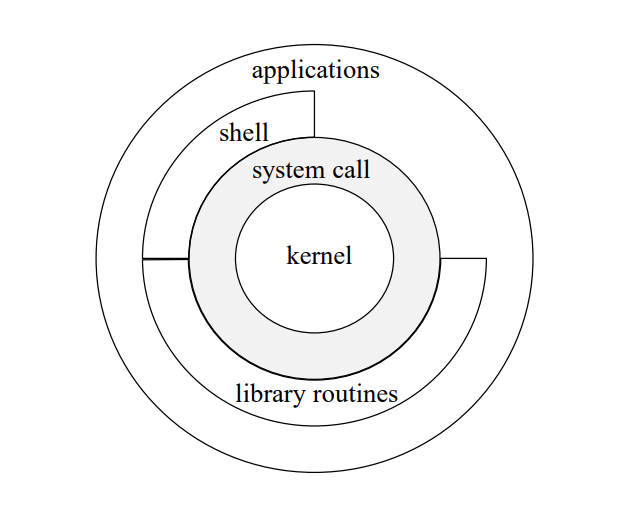

# Console, Terminal, and Shell

## Console: 

> 컴퓨터(주로 서버)에 command를 작성하여 입력하고 그 결과를 확인할 수 있는 ***(물리적) 입출력 장치*** .  
> Terminal과 비슷한 의미를 가지고 있으나 보다 ^^***물리적인 측면이 강조*** 된 경우 사용^^ 된다.

A ^^physical device^^ that typically comprises 

* a monitor, 
* keyboard, and 
* mouse. 

It is used to ^^interact with a computer system^^ and can be found in server rooms or data centers where computers are managed remotely. 

The ***console*** allows system administrators to 

* monitor and 
* manage the computer system 

---

## Terminal

> 컴퓨터에 local 또는 remote로 접속할 수 있는 ***console을 S/W로 구현한 것***.  
> (보통 `shell`이 수행되도록 해주는 wrapper라고 볼 수 있다.)
>
> 과거 terminal이나 console 모두 teletype(`tty`, 독립된 HW system)로 구성되었으나, 기술의 발전으로 
> 
> * 다른 컴퓨터의 OS에 접속하거나 
> * 한 컴퓨터에 다중 사용자가 접속하는 게 일반화 되면서 
> * `tty`가 컴퓨터의 SW로 바뀌게 됨.  
>
> 때문에 terminal은 virtual terminal, terminal emulator, soft terminal 라고도 불림  
>
> 현재는 console이나 teletype(tty) writer보다는 terminal이라는 용어가 보다 많이 사용된다  
> (`tty`라는 용어는 linux등에서 많이 보임).  

오늘날 Terminal은 Command Line Interface(`CLI`)를 제공하는 S/W로 `shell`이 구동되는 wrapper S/W라고 보면 된다.

**참고** : [CLI, GUI와 Terminal](../CE/ch10/ce10_2_01_cli_terminal.md)

A ***software application*** that allows users to ^^interact with a computer system^^ through a `command-line interface`. 

It provides users with a way to 

* enter ***text commands*** and 
* receive ***text-based output*** from the computer system. 

Some ^^popular terminal applications^^ include 

* Command Prompt (`cmd`) on Windows, 
* Terminal on macOS, and the many 
* terminal emulators available on Linux.

---

---

## Shell

> `사용자`와 ***`OS`의 `kernel`*** 사이에 위치하고, 
> 
> * 사용자의 입력을 해석(parse) 하여
> * external commands인 경우 프로세스를 생성하도록 요청하여 해당 프로그램을 실행하며
> * 그 과정에서 시스템 콜(system call: fork, exec) 을 통해 `kernel`의 서비스를 사용하고
> * builtin (내부 명령어)인 경우 자신의 프로세스에서 직접 처리하여 
> * 프로그램의 실행한 결과를 표준 출력으로 받아 terminal을 통해 사용자에게 표시
>  
> ^^`Terminal` 내부에서 동작^^ 하며, `CLI` 를 사용하는 게 일반적임.
> 
> OS의 구성요소 (`OS`를 아주 간단하게 `kernel`과 `shell`로 구성된다고 그리는 경우도 많음.)로서  
> `shell`은 `kernel`과 사용자 사이에 위치한다.  
>

{width="600"}

* 위 그림에서 `system call`은 OS가 제공하는 서비스들에 User application이 접근하게 해주는 interface임.

> `Shell`은 `CLI`를 주로 사용하기 때문에, 다음 두 가지의 동작방식을 가짐.
>
> * `Interactive mode` (REPL)
> * `Scripting mode` (batch processing)
>
> **참고** : [`CLI`에 대해서.](../CE/ch10/ce10_2_01_cli_terminal.md#command-line-interface-란)

A software program that provides users with access to the operating system's services and resources. 
 
It can be a `command-line interface` (CLI) or a `graphical user interface` (GUI). 
 
The `shell` allows users to ***interact with the computer system*** by 
 
* running commands, 
* launching applications, and 
* managing files and directories. 
 
많이 사용되는 Shell은 다음과 같음.

* `Bourne Shell` (`sh`)
* `Bash` (`bash`, Bourne Again Shell), 
* `Zsh` (주로 mac) 
* `PowerShell` (for Window).

Korn Shell (`ksh`) 과 C Shell (`csh`)도 있으나 `bash`나 `zsh`에 비해 인기가 떨어짐. 

---

## 더 읽어보면 좋은 자료들.

* tty의 용어 유래 등의 역사를 살펴보려면 다음 URL을 참고하라: [Keyboard와 Terminal의 역사](https://dsaint31.me/mkdocs_site/CE/ch06/ce06_4_04_keyboard/#keyboard)

* [bash에 대한 간략한 소개](https://ds31x.tistory.com/48)