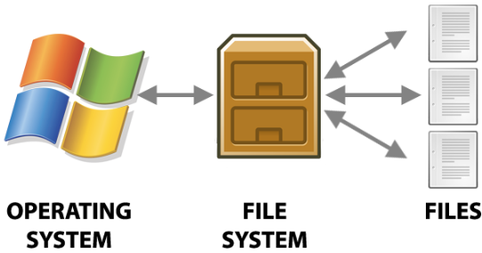

# File

- 컴퓨터를 사용하기 위해 필요한 정보들이 담김.
- 컴퓨터에서 사용되는 ***data 저장의 기본단위***

{style="display: block; margin: 0 auto; width: 400px"}

---

## 파일 이름의 extension(확장명 or 확장자)

- 파일에 포함된 ^^정보의 종류^^ 및 해당 파일을 열기 위한 ^^연결 프로그램을 파악^^ 하는데 도움을 줌.
- *파일명* 과 *확장자* 는 `.`로 구분됨

---

## 파일 이름의 길이 및 사용불가 문자

- windows 11 기준으로 한 경로의 길이는 260자(=`MAX_PATH`)로 제한됨.
- `\`, `/`, `?`, `:`, `*`, `”`, `<`, `>`, `|`

> Windows 10 1607 버전부터는 NTFS 들어오면서 길이 제한을 늘릴 수 있으나 그룹정책 편집 (`Enable Long Paths`) 등이 필요함: 이 경우 32767자 까지 확장 가능.

---

## 관련 Commands (WINDOWS)

### File 목록 표시

```python
dir c:
```

- 디스크 드라이브 c에 있는 파일 목록을 보고 싶은 경우 사용.
- 해당 디스크 드라이브에 들어있는 모든 파일 이름, 크기, 생성일자 및 일시 등을 나타내는 리스트 출력

```python
dir *.txt
```

- 현재 경로(cwd)에서 `.txt` 확장명을 가진 파일 리스트를 보여줌

### 파일 내용의 출력

```python
type 파일명
```

- 텍스트 파일의 내용을 보고 싶을 때 사용됨.
- 파일이 매우 클 경우, `more`를 이용하여 나누어 출력할 수 있음.

### 파일의 복사

```basic
copy [옵션] source destination 
copy [옵션] source[+...] destination
```

- 파일 단위로 복사를 수행.
- **파일의 결합** 에도 사용 가능함
- 옵션
    - `/a`
        - 아스키 파일(텍스트 파일)을 의미
    - `/b`
        - binary 파일 의미
        

### 파일 지우기

```basic
del [옵션] 파일_이름
erase [옵션] 파일_이름
```

- 하나 이상의 파일 또는 디렉토리를 지움.
- `*` 문자 등을 이용하면 복수의 파일 삭제.
- 옵션
    - `/p`
        - 각 파일을 삭제하기 전에 물어봄.

### 파일 이름 바꾸기

```basic
ren filename1 filename2
```

- filename1 파일의 이름을 filename2로 바꾼다.
- 예
    - 모든 텍스트파일이 doc파일로 변경
    `ren *.txt *.doc`
    - `1.txt`를 `4.txt`로 변경.
    `ren 1.txt 4.txt`

## 관련 Commands (Linux)

파일 및 디렉토리 관련 기초적인 명령어는 다음 url참고.
[Linux : 명령어](./linux_cmds.md)
